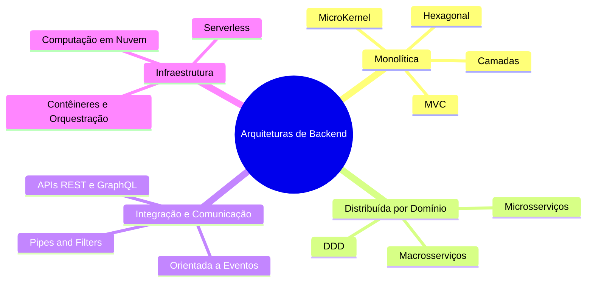
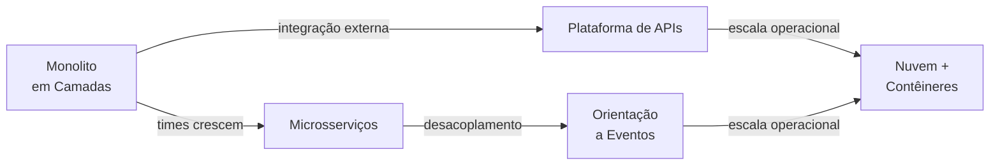

> **Acervo legado preservado.** Para o percurso atual da disciplina, consulte [Módulo 1 — Conceitos](docs/modulo-1-visao-geral/conceitos.md).

# Mapa e Estilos de Backend

## A pergunta central do arquiteto de backend

Imagine um time recebendo a missão de construir um novo sistema de e-commerce. O tech lead abre a reunião de arquitetura e coloca três opções na lousa:

- "Fazemos um monolito em camadas — simples, rápido de começar"
- "Já entramos com microsserviços — escalável desde o dia 1"
- "Arquitetura orientada a eventos — desacoplado para o futuro"

Três desenvolvedores, três opiniões. Nenhum critério claro para decidir. A reunião termina sem consenso.

Esse cenário é o mais comum em projetos reais — não porque as pessoas são incompetentes, mas porque **escolher um estilo arquitetural sem um mapa é como navegar sem bússola**. Este guia é esse mapa.

---

## O mapa — quatro famílias arquiteturais

Todo estilo de backend pertence a uma das quatro famílias abaixo. Cada família resolve um problema fundamental diferente.

| Família | O problema que ela resolve |
|---------|---------------------------|
| **Monolítica** | Como organizar internamente um sistema implantado como unidade única |
| **Distribuída por Domínio** | Como decompor um sistema grande em serviços autônomos por área de negócio |
| **Integração e Comunicação** | Como os componentes trocam dados — de forma síncrona ou assíncrona |
| **Infraestrutura** | Onde e como o sistema roda — nuvem, contêineres, funções serverless |

---

## Família 1 — Monolítica

**O problema que resolve:** Como organizar o código de um sistema implantado como unidade única de forma que seja fácil de entender, manter e evoluir.

Um monolito bem estruturado não é um problema — é a escolha certa para a maioria dos sistemas em estágios iniciais ou com equipes pequenas. A complexidade está em manter a organização interna à medida que o sistema cresce.

---

### Camadas (Layered Architecture)

**Ideia central:** Dividir o sistema em horizontais de responsabilidade — Apresentação, Negócio, Dados — onde cada camada só se comunica com a adjacente.

**Resolve bem:** Sistemas com regras de negócio claras e estáveis; equipes organizadas por especialidade técnica (frontend, backend, DBA).

**Piora:** Desempenho em operações que atravessam muitas camadas; flexibilidade quando as regras de negócio mudam com frequência.

**Deep-dive:** [1.2 — Estilo em Camadas](1.2%20Estilo%20em%20Camadas.md) — exemplos de código com OCP, MVC, DDD e variações físicas de implantação.

---

### MVC (Model-View-Controller)

**Ideia central:** Especialização de Camadas para o ciclo HTTP — Model (dados e regras), View (resposta formatada), Controller (orquestra a requisição).

**Resolve bem:** Aplicações web com frameworks como Rails, Laravel, Django, ASP.NET MVC. Estrutura bem conhecida, fácil de contratar e onboar.

**Piora:** Sistemas com lógica de negócio complexa — o Controller tende a inchar com responsabilidades que pertencem ao Model.

**Deep-dive:** [1.2 — Estilo em Camadas](1.2%20Estilo%20em%20Camadas.md) (seção de variações do MVC).

---

### Hexagonal (Ports and Adapters)

**Ideia central:** Isolar o núcleo de negócio de qualquer infraestrutura externa. O núcleo define Ports (interfaces); os Adapters implementam a conexão com banco, API, fila etc.

**Resolve bem:** Sistemas onde a lógica de negócio é complexa e precisa ser testada isolada da infraestrutura. Facilita a troca de banco ou protocolo sem tocar no núcleo.

**Piora:** Custo inicial de design — exige disciplina para não vazar detalhes de infraestrutura para o núcleo.

**Deep-dive:** [1.2 — Estilo em Camadas](1.2%20Estilo%20em%20Camadas.md) (seção DDD e variações arquiteturais).

---

### MicroKernel (Plugin Architecture)

**Ideia central:** Um núcleo mínimo e estável que fornece serviços básicos; funcionalidades adicionais chegam como plugins independentes.

**Resolve bem:** Sistemas que precisam ser extensíveis por diferentes clientes ou mercados sem alterar o produto base — IDEs, ERPs, plataformas de workflow.

**Piora:** Gerenciar compatibilidade entre versões de núcleo e plugins; definir e manter o contrato da interface de plugin.

**Deep-dive:** [1.4 — Estilo MicroKernel](1.4%20Micro-kernel.md)

---

## Família 2 — Distribuída por Domínio

**O problema que resolve:** Quando um sistema cresce além da capacidade de um único time ou de um único processo, é preciso decompô-lo. Essa família define como fazer essa decomposição de forma intencional, guiada pelo domínio de negócio.

---

### DDD (Domain-Driven Design)

**Ideia central:** Modelar o software refletindo fielmente os conceitos e regras do negócio. A linguagem ubíqua une especialistas de domínio e desenvolvedores. Bounded Contexts definem fronteiras explícitas dentro das quais um modelo é válido.

**Resolve bem:** Sistemas com domínio complexo onde mal-entendidos entre negócio e tecnologia são a principal fonte de bugs.

**Piora:** Custo de aprendizado alto; pode ser overkill para sistemas CRUD simples.

**Deep-dive:** [1.2 — Estilo em Camadas](1.2%20Estilo%20em%20Camadas.md) (seção DDD com exemplo de Agregados e Repositórios).

---

### Microsserviços

**Ideia central:** Cada Bounded Context do DDD vira um serviço independente — processo próprio, banco de dados próprio, implantação própria.

**Resolve bem:** Sistemas grandes com múltiplos times, onde a independência de implantação e escala é crítica.

**Piora:** Complexidade distribuída — consistência eventual, rastreabilidade de transações, observabilidade, service discovery. O custo operacional é alto para sistemas pequenos.

**Deep-dive:** Capítulo 3 do curso.

---

## Família 3 — Integração e Comunicação

**O problema que resolve:** Independente de como o sistema está organizado internamente, seus componentes precisam trocar dados. A escolha entre síncrono e assíncrono define o comportamento temporal do sistema e seus trade-offs de acoplamento.

---

### Pipes and Filters

**Ideia central:** Processar dados como sequência de transformações independentes. Cada Filtro recebe dados, transforma e passa adiante via Pipe. Os filtros não se conhecem.

**Resolve bem:** Pipelines de ETL, processamento de logs, validação em múltiplas etapas, sistemas de streaming.

**Piora:** Latência acumulada em pipelines longos; gerenciamento de estado entre filtros.

**Deep-dive:** [1.3 — Estilo Pipes and Filters](1.3%20Pipes-filters.md)

---

### APIs (API-Driven Architecture)

**Ideia central:** Componentes se comunicam via contratos formais — APIs — que definem o que é exposto sem revelar a implementação interna. API Gateways centralizam autenticação, rate limiting e observabilidade.

**Resolve bem:** Integração entre sistemas distintos, exposição de serviços para parceiros externos, ecossistemas móvel+web.

**Piora:** Gerenciamento do ciclo de vida das APIs — versionamento e deprecação sem quebrar consumidores.

**Deep-dive:** Capítulo 2 do curso.

---

### Orientada a Eventos (Event-Driven Architecture)

**Ideia central:** Componentes comunicam-se publicando eventos imutáveis em um broker (Kafka, RabbitMQ). Produtores não conhecem consumidores. Cada consumidor reage no seu próprio ritmo.

**Resolve bem:** Desacoplamento temporal entre serviços, processamento assíncrono em escala, extensibilidade sem modificar produtores.

**Piora:** Consistência eventual — o sistema converge ao longo do tempo, não instantaneamente. Rastrear falhas em fluxos assíncronos exige observabilidade robusta.

**Deep-dive:** Capítulo 4 do curso.

---

## Família 4 — Infraestrutura

**O problema que resolve:** A infraestrutura deixou de ser detalhe operacional e virou decisão arquitetural de primeira classe. Onde e como o sistema roda afeta diretamente disponibilidade, custo e velocidade de entrega.

---

### Computação em Nuvem

**Ideia central:** Consumir recursos computacionais como serviço — IaaS (infraestrutura), PaaS (plataforma), SaaS (software). O provedor gerencia hardware, rede e, parcialmente, o software de base.

**Resolve bem:** Elasticidade sob demanda, redução de CapEx, acesso a serviços gerenciados (banco, fila, ML).

**Piora:** Vendor lock-in; custo operacional pode ser imprevisível sem disciplina de FinOps.

**Deep-dive:** Capítulo 5 do curso.

---

### Contêineres e Orquestração

**Ideia central:** Empacotar a aplicação com todas as suas dependências em uma imagem portável (Docker). Orquestradores como Kubernetes gerenciam implantação, escala e recuperação de falhas de forma declarativa.

**Resolve bem:** Portabilidade entre ambientes (dev, staging, prod); deploys consistentes e reversíveis.

**Piora:** Curva de aprendizado do Kubernetes; complexidade operacional para equipes sem experiência em infra.

**Deep-dive:** Capítulo 5, seções 5.3 e 5.4.

---

## Como os estilos evoluem e se combinam

A trajetória mais comum em sistemas reais não é uma escolha única — é uma evolução contínua guiada por pressões reais de crescimento.

> **Atenção à decomposição prematura.** O erro mais caro em arquitetura não é escolher o estilo errado — é escolher um estilo complexo antes de precisar. Microsserviços para um sistema com um time de três pessoas vai custar meses de trabalho operacional sem entregar valor proporcional.

---

## O que vem a seguir nesta seção

Esta seção está organizada em três blocos:

> **BLOCO 2 — OS ESTILOS EM PROFUNDIDADE** (`1.2` a `1.4.1`)
>
> Mergulho nos três estilos cobertos nesta unidade com código funcional e exercícios práticos: Camadas ([1.2](1.2%20Estilo%20em%20Camadas.md)), Pipes and Filters ([1.3](1.3%20Pipes-filters.md)) e MicroKernel ([1.4](1.4%20Micro-kernel.md)). Leia-os na ordem para construir progressivamente o vocabulário de implementação.

> **BLOCO 3 — DECIDINDO E DOCUMENTANDO** (`1.5` e `1.5.1`)
>
> Depois de conhecer os estilos, você aprende a estruturar e registrar a decisão entre eles. O ADR (Architecture Decision Record) é o mecanismo que transforma uma escolha arquitetural em um artefato rastreável e revisável — veja [1.5 — Decisões Arquiteturais (ADR)](1.5%20O%20Racional%20arquitetural%20e%20o%20conceito%20de%20ADRs.md).

---

## Para saber mais

- [Fundamentals of Software Architecture, 2ª ed.](https://learning.oreilly.com/library/view/fundamentals-of-software/9781098175504/) — Richards & Ford (2020)
- *Software Architecture: The Hard Parts* — Richards & Ford (2022)
- *Building Evolutionary Architectures* — Ford, Parsons & Kua (2017)
