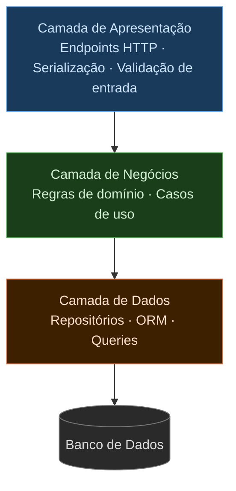
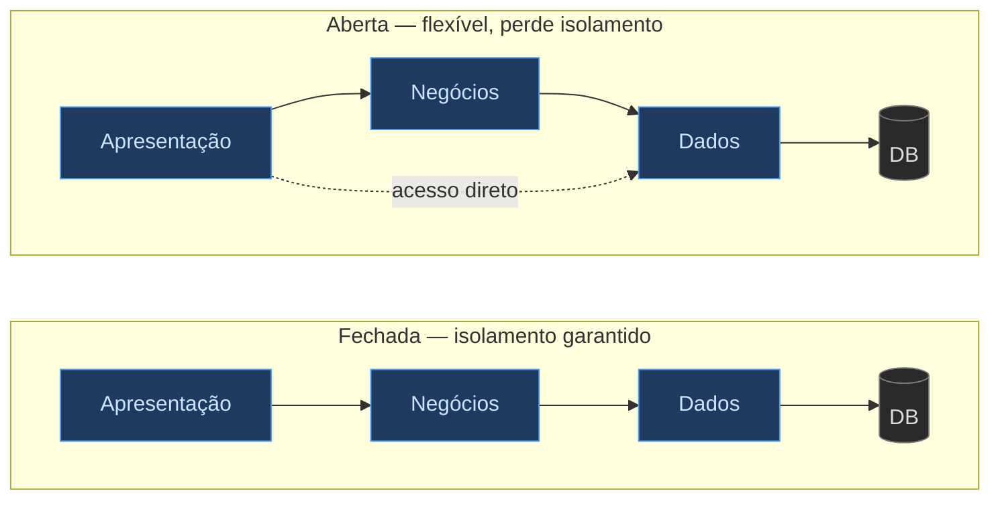
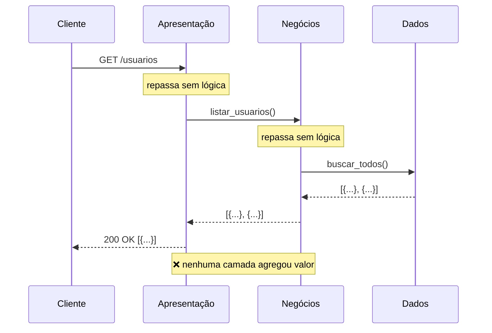
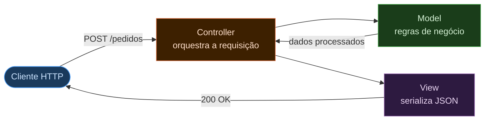
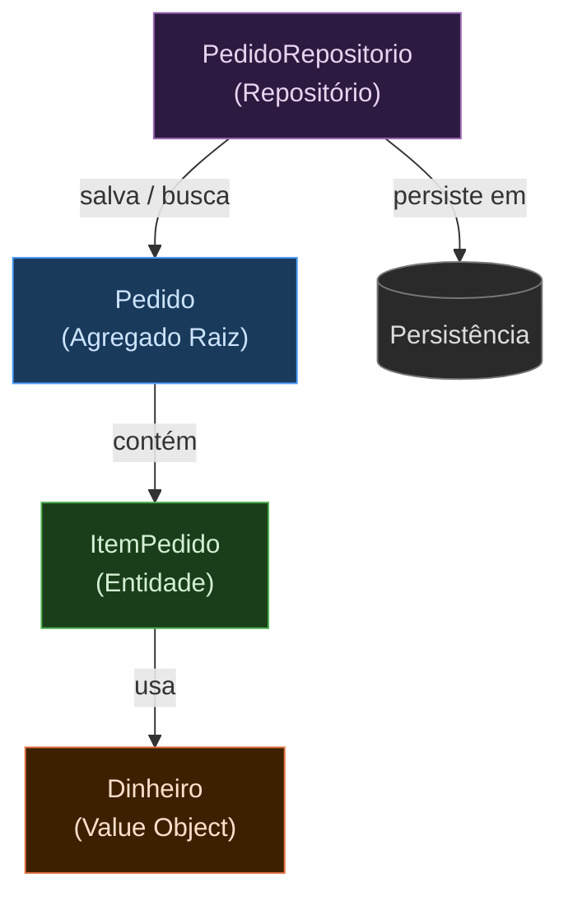
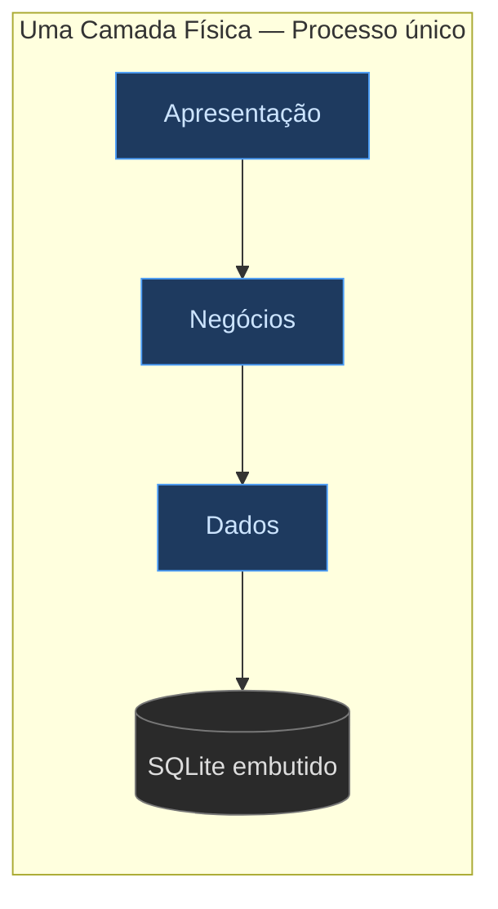
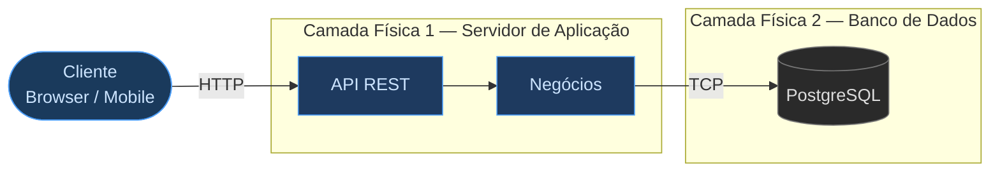
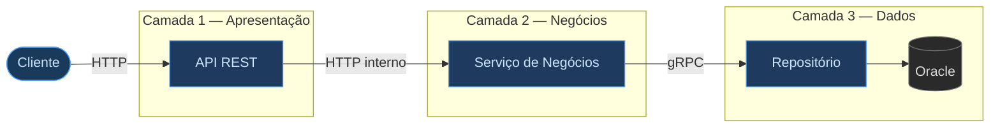

> **BLOCO 2 — OS ESTILOS EM PROFUNDIDADE**
> Você está no segundo bloco da Seção 1. Certifique-se de ter lido *[1.1 — Mapa e Estilos de Backend](1.1%20Mapa%20e%20Estilos%20de%20Backend.md)* antes de continuar.

# Estilo em Camadas (Layered Architecture)

> **Localização no mapa arquitetural:** Camadas pertence à **Família 1 — Monolítica** apresentada em *[1.1 — Mapa e Estilos de Backend](1.1%20Mapa%20e%20Estilos%20de%20Backend.md)*. Compare com [1.3 — Pipes and Filters](1.3%20Pipes-filters.md) quando o problema central for processamento sequencial de dados, e com [1.4 — MicroKernel](1.4%20Micro-kernel.md) quando extensibilidade do produto for o requisito dominante.

## O que é o estilo arquitetural em camadas?

O estilo arquitetural em camadas organiza o sistema em blocos horizontais de responsabilidade, com comunicação controlada entre camadas adjacentes. É o estilo mais difundido da engenharia de software por um motivo simples: ele emerge naturalmente da estrutura da maioria das equipes.

Mark Richards e Neal Ford descrevem esse fenômeno em *Fundamentals of Software Architecture* como *"architecture by implication"* — o estilo surge por inércia, não por decisão deliberada. A **Lei de Conway** explica o porquê: organizações produzem arquiteturas que espelham sua estrutura de comunicação. Uma equipe dividida em frontend, backend e banco de dados tende a produzir um sistema em três camadas, independente de o arquiteto ter planejado isso.



---

## Características Arquiteturais

Richards e Ford avaliam cada estilo com um conjunto padronizado de características (*Fundamentals of Software Architecture*, Cap. 10):

| Característica | Avaliação | Observação |
|---|---|---|
| Custo geral | ⭐⭐⭐⭐⭐ | Baixo custo de entrada; tecnologia amplamente conhecida |
| Simplicidade | ⭐⭐⭐⭐⭐ | Fácil de compreender e implementar |
| Escalabilidade | ⭐⭐☆☆☆ | Escala como unidade única; difícil escalar camadas individualmente |
| Elasticidade | ⭐☆☆☆☆ | Pouca capacidade de expansão/retração rápida sob carga variável |
| Implantabilidade | ⭐⭐☆☆☆ | Uma unidade de implantação; qualquer mudança implanta tudo |
| Testabilidade | ⭐⭐⭐☆☆ | Camadas podem ser testadas em isolamento via mocks |
| Desempenho | ⭐⭐⭐☆☆ | Adequado na maioria dos casos; sobrecarga em requisições que atravessam muitas camadas |
| Modularidade | ⭐⭐☆☆☆ | Modular logicamente, mas fisicamente acoplado |
| Confiabilidade | ⭐⭐⭐☆☆ | Falha num componente pode afetar todo o sistema |

---

## Camadas Abertas e Fechadas

Richards e Ford introduzem uma distinção crítica entre **camadas fechadas** e **camadas abertas**.

Uma **camada fechada** exige que toda requisição passe por ela, mesmo que não haja lógica útil a executar. Uma **camada aberta** permite que uma requisição salte diretamente para a camada seguinte.



**Camadas fechadas** garantem isolamento — mudanças numa camada não vazam para as outras. O custo é rigidez: toda requisição percorre todas as camadas, mesmo as simples.

**Camadas abertas** oferecem flexibilidade — componentes acessam qualquer camada abaixo diretamente. O custo é acoplamento difuso: o isolamento se perde com o tempo.

A decisão de abrir ou fechar cada camada deve ser documentada — é exatamente o tipo de decisão que um ADR deve registrar (ver [1.5 — Decisões Arquiteturais](1.5%20O%20Racional%20arquitetural%20e%20o%20conceito%20de%20ADRs.md)).

---

## O Anti-padrão do Sumidouro

Richards e Ford identificam o **Architecture Sinkhole** como o anti-padrão mais comum do estilo em camadas: uma requisição passa por todas as camadas sem que nenhuma lógica relevante seja executada.



O problema não é que essa requisição exista — consultas simples são legítimas. O problema é quando **a maioria** das requisições segue esse padrão.

> **Regra de Richards e Ford:** se mais de 80% das requisições do sistema são sumidouros, o estilo em camadas provavelmente não é o certo para esse sistema.

---

## O Princípio Aberto-Fechado na Camada de Dados

O **OCP (Open-Closed Principle)** aplicado à fronteira entre camadas significa abstrair o acesso ao banco de dados por uma interface — a camada de negócios depende da abstração, não da implementação concreta.

```python
from abc import ABC, abstractmethod

class RepositorioProduto(ABC):
    @abstractmethod
    def salvar(self, nome: str, preco: float) -> None: ...

    @abstractmethod
    def listar(self) -> list[dict]: ...


class MySQLRepositorioProduto(RepositorioProduto):
    def __init__(self):
        self._produtos: list[dict] = []

    def salvar(self, nome: str, preco: float) -> None:
        self._produtos.append({"nome": nome, "preco": preco})
        print("Produto salvo no MySQL.")

    def listar(self) -> list[dict]:
        print("Listando produtos do MySQL.")
        return self._produtos


class PostgreSQLRepositorioProduto(RepositorioProduto):
    def __init__(self):
        self._produtos: list[dict] = []

    def salvar(self, nome: str, preco: float) -> None:
        self._produtos.append({"nome": nome, "preco": preco})
        print("Produto salvo no PostgreSQL.")

    def listar(self) -> list[dict]:
        print("Listando produtos do PostgreSQL.")
        return self._produtos


# Camada de negócios: depende da abstração, não da implementação
class ProdutoServico:
    def __init__(self, repositorio: RepositorioProduto):
        self._repositorio = repositorio

    def adicionar_produto(self, nome: str, preco: float) -> None:
        self._repositorio.salvar(nome, preco)

    def exibir_produtos(self) -> None:
        for p in self._repositorio.listar():
            print(f"Produto: {p['nome']}, Preço: R${p['preco']:.2f}")


# Trocar o banco não muda ProdutoServico
servico = ProdutoServico(MySQLRepositorioProduto())
servico.adicionar_produto("Notebook", 5000.0)
servico.exibir_produtos()
# Produto salvo no MySQL.
# Produto: Notebook, Preço: R$5000.00
```

---

## Variações do Estilo em Camadas no Backend

### MVC (Model-View-Controller)

O MVC é a especialização do estilo em camadas para o ciclo requisição-resposta HTTP. Consolidado em frameworks como **Rails**, **Django**, **Laravel** e **ASP.NET MVC**, estrutura o sistema em três papéis bem definidos.



**Frameworks de backend que implementam MVC:**

| Camada | Tecnologias |
|--------|-------------|
| Controller | ASP.NET MVC, Spring MVC, Ruby on Rails, Laravel, Django |
| Model / Negócios | .NET Core, Spring Boot, Node.js (Express), FastAPI |
| Dados | Entity Framework, Hibernate, ActiveRecord, SQLAlchemy |

```python
import json
from dataclasses import dataclass

@dataclass
class Produto:
    id: int
    nome: str
    preco: float

    def aplicar_desconto(self, percentual: float) -> None:
        self.preco -= self.preco * (percentual / 100)


class ProdutoView:
    def serializar(self, produto: Produto) -> str:
        return json.dumps({"id": produto.id, "nome": produto.nome, "preco": round(produto.preco, 2)})


class ProdutoController:
    def __init__(self, produto: Produto, view: ProdutoView):
        self._produto = produto
        self._view = view

    def aplicar_desconto(self, percentual: float) -> str:
        self._produto.aplicar_desconto(percentual)
        return self._view.serializar(self._produto)


produto = Produto(id=1, nome="Notebook", preco=5000.0)
controller = ProdutoController(produto, ProdutoView())
print(controller.aplicar_desconto(10))
# {"id": 1, "nome": "Notebook", "preco": 4500.0}
```

---

### DDD (Domain-Driven Design)

O DDD organiza a camada de negócios por **conceitos do domínio** em vez de tipo técnico. Enquanto o MVC separa Model, View e Controller, o DDD separa Pedido, Pagamento e Cliente — e protege as regras de negócio de cada conceito dentro de seu próprio agregado.



```python
from dataclasses import dataclass
from typing import Optional

@dataclass(frozen=True)
class Dinheiro:
    valor: float
    moeda: str = "BRL"

    def __post_init__(self):
        if self.valor < 0:
            raise ValueError("Valor monetário não pode ser negativo.")

    def somar(self, outro: "Dinheiro") -> "Dinheiro":
        if self.moeda != outro.moeda:
            raise ValueError("Moedas diferentes.")
        return Dinheiro(self.valor + outro.valor, self.moeda)


@dataclass
class Produto:
    id: int
    nome: str
    preco: Dinheiro

    def alterar_preco(self, novo_preco: Dinheiro) -> None:
        if novo_preco.valor < 1:
            raise ValueError("Preço mínimo é R$1,00.")
        self.preco = novo_preco


@dataclass
class ItemPedido:
    produto: Produto
    quantidade: int

    def __post_init__(self):
        if self.quantidade <= 0:
            raise ValueError("Quantidade deve ser positiva.")

    @property
    def total(self) -> Dinheiro:
        return Dinheiro(self.produto.preco.valor * self.quantidade, self.produto.preco.moeda)


class Pedido:
    MAX_ITENS = 10

    def __init__(self, id: int, cliente_id: int):
        self.id = id
        self.cliente_id = cliente_id
        self._itens: list[ItemPedido] = []
        self._valor_total = Dinheiro(0.0)

    def adicionar_item(self, produto: Produto, quantidade: int) -> None:
        if len(self._itens) >= self.MAX_ITENS:
            raise ValueError("Pedido não pode ter mais de 10 itens.")
        item = ItemPedido(produto, quantidade)
        self._itens.append(item)
        self._valor_total = self._valor_total.somar(item.total)

    @property
    def valor_total(self) -> Dinheiro:
        return self._valor_total

    def listar_itens(self) -> list[ItemPedido]:
        return list(self._itens)


class PedidoRepositorio:
    def __init__(self):
        self._pedidos: list[Pedido] = []

    def salvar(self, pedido: Pedido) -> None:
        self._pedidos.append(pedido)

    def buscar_por_id(self, id: int) -> Optional[Pedido]:
        return next((p for p in self._pedidos if p.id == id), None)


# Uso
produto1 = Produto(1, "Notebook", Dinheiro(5000.0))
produto2 = Produto(2, "Mouse", Dinheiro(150.0))
pedido = Pedido(id=1, cliente_id=101)
pedido.adicionar_item(produto1, 1)
pedido.adicionar_item(produto2, 2)

repo = PedidoRepositorio()
repo.salvar(pedido)
print(f"Total: R${pedido.valor_total.valor:.2f}")  # Total: R$5300.00
```

**Quando preferir DDD a Camadas simples:** quando as regras de negócio são complexas, mudam com frequência e o risco dominante é o mal-entendido entre o time técnico e os especialistas de negócio.

---

## Camadas Lógicas e Camadas Físicas

A arquitetura em camadas define uma estrutura **lógica** — as camadas físicas de implantação são uma decisão separada.

### 1. Uma camada física (monolito)



| | |
|---|---|
| **Vantagens** | Simplicidade, menor custo, fácil de depurar e empacotar |
| **Desvantagens** | Difícil escalar componentes individualmente; risco alto em deploys |

### 2. Duas camadas físicas



| | |
|---|---|
| **Vantagens** | Backend e banco evoluem e escalam de forma independente |
| **Desvantagens** | Latência de rede entre camadas; gestão de dois serviços |

### 3. Três ou mais camadas físicas



| | |
|---|---|
| **Vantagens** | Escalabilidade fina por camada; isolamento de falhas; times independentes |
| **Desvantagens** | Complexidade operacional; latência acumulada; exige observabilidade |

> **Atenção:** distribuir camadas fisicamente não resolve acoplamento lógico mal definido. Um sistema com responsabilidades misturadas entre camadas continua acoplado mesmo rodando em servidores separados.

---

## Quando usar — e quando não usar

**Use Camadas quando:**
- O sistema tem escopo e regras de negócio bem definidos
- A equipe é pequena e o orçamento é limitado
- Velocidade de desenvolvimento inicial é mais importante que escalabilidade
- O sistema é predominantemente CRUD com lógica de negócio moderada

**Não use Camadas quando:**
- Alta escalabilidade ou elasticidade são requisitos não negociáveis
- Mais de 80% das requisições são sumidouros — o estilo acrescenta latência sem valor
- Times independentes precisam implantar partes do sistema autonomamente
- O problema central é processamento de dados em etapas → [Pipes and Filters — 1.3](1.3%20Pipes-filters.md)
- Extensibilidade do produto para diferentes mercados é o driver central → [MicroKernel — 1.4](1.4%20Micro-kernel.md)

---

## Referências

- Richards, M.; Ford, N. *Fundamentals of Software Architecture*, 2ª ed. O'Reilly, 2022. Cap. 10.
- Fowler, M. *Patterns of Enterprise Application Architecture*. Addison-Wesley, 2002.
- Evans, E. *Domain-Driven Design: Tackling Complexity in the Heart of Software*. Addison-Wesley, 2003.
