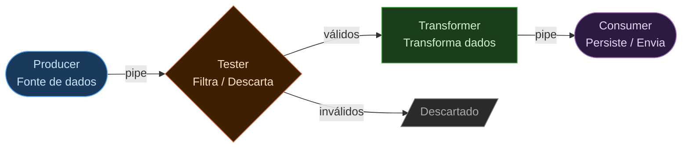
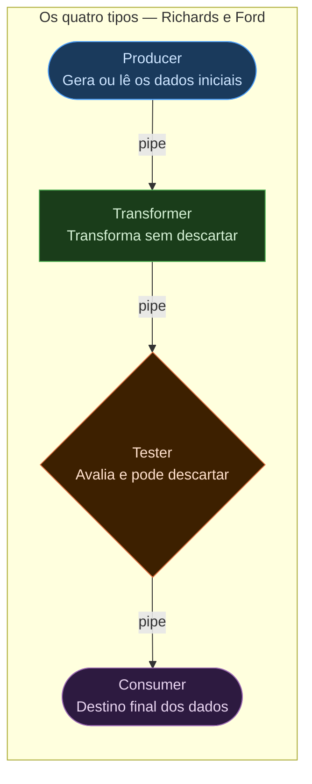
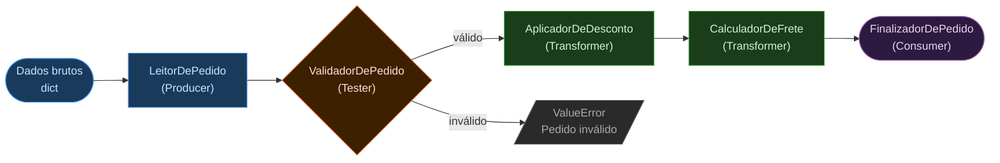
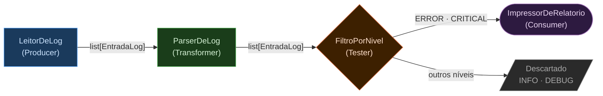

> **Acervo legado preservado.** Para o percurso atual da disciplina, consulte [Módulo 1 — Padrões e decisões](docs/modulo-1-visao-geral/padroes-e-decisoes.md).

# Estilo Pipes and Filters (Pipeline Architecture)

> **Localização no mapa arquitetural:** Pipes and Filters pertence à **Família 3 — Integração e Comunicação** apresentada em *[1.1 — Mapa e Estilos de Backend](1.1%20Mapa%20e%20Estilos%20de%20Backend.md)*. Compare com [1.2 — Camadas](1.2%20Estilo%20em%20Camadas.md) quando o sistema precisar de separação por responsabilidade técnica em vez de fluxo de dados, e com [1.4 — MicroKernel](1.4%20Micro-kernel.md) quando extensibilidade via plugins for o requisito central.

## O que é o estilo Pipes and Filters?

O estilo **Pipes and Filters** — chamado de *Pipeline Architecture* por Richards e Ford — organiza o sistema como uma sequência de etapas de transformação de dados. Cada etapa é um componente independente chamado **filtro**; os canais que transportam dados entre filtros são os **pipes**.



A premissa fundamental é a **ausência de estado compartilhado**: cada filtro recebe dados, os transforma e os emite — sem saber de onde vieram nem para onde vão. Filtros não se comunicam diretamente entre si, apenas através dos pipes. Isso torna o sistema altamente modular: filtros podem ser adicionados, removidos ou reordenados sem impactar os demais.

---

## Características Arquiteturais

Richards e Ford avaliam o estilo Pipeline em *Fundamentals of Software Architecture* (Cap. 11):

| Característica | Avaliação | Observação |
|---|---|---|
| Custo geral | ⭐⭐⭐⭐⭐ | Baixo custo de entrada; conceito simples e direto |
| Simplicidade | ⭐⭐⭐⭐⭐ | Estrutura linear fácil de entender e de explicar |
| Escalabilidade | ⭐⭐☆☆☆ | Filtros individuais podem escalar; o pipeline como um todo é limitado |
| Elasticidade | ⭐⭐☆☆☆ | Difícil expansão/retração rápida sob carga variável |
| Implantabilidade | ⭐⭐⭐☆☆ | Filtros podem ser implantados separadamente em versões modernas |
| Testabilidade | ⭐⭐⭐⭐⭐ | **Ponto forte:** cada filtro é independente e testável em isolamento total |
| Desempenho | ⭐⭐☆☆☆ | Processamento sequencial introduz latência acumulada |
| Modularidade | ⭐⭐⭐⭐⭐ | **Ponto forte:** máxima modularidade por design |
| Confiabilidade | ⭐⭐⭐☆☆ | Falha num filtro para o pipeline; exige estratégias de reprocessamento |

---

## Os Quatro Tipos de Filtro

Richards e Ford identificam quatro tipos canônicos de filtro:



| Tipo | Papel | Exemplos |
|------|-------|---------|
| **Producer** | Ponto de entrada; gera ou lê os dados iniciais | Leitura de arquivo, chamada a API, leitura de fila |
| **Transformer** | Recebe dados, aplica transformação e os emite sem descartar | Normalizar campos, enriquecer com dados externos, calcular métricas |
| **Tester** | Avalia os dados contra um critério; descarta os que não passam | Validar schema, filtrar por nível, separar por categoria |
| **Consumer** | Ponto de término; persiste ou envia os dados processados | Gravar no banco, enviar e-mail, publicar em fila |

---

## O Anti-padrão do Filtro com Estado

O princípio fundamental dos filtros é a **ausência de estado compartilhado**. Filtros com estado introduzem acoplamento implícito e tornam o pipeline não-determinístico.

```python
# ERRADO: filtro com estado acumulado compartilhado
class FiltroComEstado:
    total = 0  # estado de classe — partilhado entre invocações

    def processar(self, valor: float) -> float:
        self.total += valor
        return self.total  # resultado depende da ordem de execução

# CORRETO: filtro stateless — cada invocação é independente
class FiltroTransformador:
    def processar(self, dado: dict) -> dict:
        return {**dado, "valor_normalizado": dado["valor"] / 100}
```

Quando o pipeline requer acumulação (ex: janelas de tempo em streaming), utilize mecanismos externos como Redis ou um state store dedicado — nunca estado interno do filtro.

---

## Framework de Pipeline em Python

Antes dos exemplos de negócio, o framework base que implementa o padrão:

```python
from abc import ABC, abstractmethod
from typing import Any


class Filtro(ABC):
    """Contrato base — todo filtro recebe e devolve dados."""
    @abstractmethod
    def processar(self, dados: Any) -> Any: ...


class Pipeline:
    """Encadeia filtros e executa a transformação em sequência."""

    def __init__(self):
        self._filtros: list[Filtro] = []

    def adicionar(self, filtro: Filtro) -> "Pipeline":
        self._filtros.append(filtro)
        return self

    def executar(self, dados: Any) -> Any:
        resultado = dados
        for filtro in self._filtros:
            resultado = filtro.processar(resultado)
        return resultado
```

---

## Exemplo 1 — Pipeline de Processamento de Pedidos

Demonstra os quatro tipos de filtro num cenário de e-commerce:



```python
from dataclasses import dataclass
from typing import Optional


@dataclass
class Pedido:
    id: int
    cliente_id: int
    valor: float
    cupom: Optional[str] = None
    desconto: float = 0.0
    status: str = "pendente"


# Producer — constrói o objeto de domínio a partir dos dados brutos
class LeitorDePedido(Filtro):
    def __init__(self, dados: dict):
        self._dados = dados

    def processar(self, _: Any) -> Pedido:
        return Pedido(**self._dados)


# Tester — descarta pedidos que violam regras básicas
class ValidadorDePedido(Filtro):
    def processar(self, pedido: Pedido) -> Pedido:
        if pedido.valor <= 0:
            raise ValueError(f"Pedido {pedido.id}: valor inválido")
        if pedido.cliente_id <= 0:
            raise ValueError(f"Pedido {pedido.id}: cliente inválido")
        return pedido


# Transformer — aplica regras de desconto sem descartar
class AplicadorDeDesconto(Filtro):
    CUPONS = {"PROMO10": 0.10, "FIDELIDADE20": 0.20}

    def processar(self, pedido: Pedido) -> Pedido:
        if pedido.cupom in self.CUPONS:
            pedido.desconto = pedido.valor * self.CUPONS[pedido.cupom]
        return pedido


# Transformer — calcula frete com base no valor líquido
class CalculadorDeFrete(Filtro):
    FRETE = 15.0
    LIMITE_FRETE_GRATIS = 100.0

    def processar(self, pedido: Pedido) -> Pedido:
        if (pedido.valor - pedido.desconto) < self.LIMITE_FRETE_GRATIS:
            pedido.valor += self.FRETE
        return pedido


# Consumer — finaliza o pedido e reporta
class FinalizadorDePedido(Filtro):
    def processar(self, pedido: Pedido) -> Pedido:
        pedido.status = "aprovado"
        total = pedido.valor - pedido.desconto
        print(f"Pedido {pedido.id} aprovado | Total: R${total:.2f}")
        return pedido


# Composição do pipeline
pipeline = (
    Pipeline()
    .adicionar(LeitorDePedido({"id": 42, "cliente_id": 7, "valor": 120.0, "cupom": "PROMO10"}))
    .adicionar(ValidadorDePedido())
    .adicionar(AplicadorDeDesconto())
    .adicionar(CalculadorDeFrete())
    .adicionar(FinalizadorDePedido())
)

pipeline.executar(None)
# Pedido 42 aprovado | Total: R$108.00
# (120 - 12 de desconto = 108; 108 >= 100 → frete grátis)
```

---

## Exemplo 2 — Pipeline de Processamento de Logs

Demonstra como o pipeline lida com listas de registros e filtragem por critério:



```python
import re
from dataclasses import dataclass


@dataclass
class EntradaLog:
    linha: str
    nivel: str = ""
    timestamp: str = ""
    mensagem: str = ""


# Producer — lê linhas brutas e cria as entradas
class LeitorDeLog(Filtro):
    def __init__(self, linhas: list[str]):
        self._linhas = linhas

    def processar(self, _: Any) -> list[EntradaLog]:
        return [EntradaLog(linha=l) for l in self._linhas]


# Transformer — faz parse de cada linha no formato [NIVEL] timestamp mensagem
class ParserDeLog(Filtro):
    PADRAO = re.compile(r"\[(\w+)\] (\S+T\S+) (.+)")

    def processar(self, entradas: list[EntradaLog]) -> list[EntradaLog]:
        for e in entradas:
            m = self.PADRAO.match(e.linha)
            if m:
                e.nivel, e.timestamp, e.mensagem = m.groups()
        return entradas


# Tester — mantém apenas os níveis de interesse
class FiltroPorNivel(Filtro):
    def __init__(self, niveis: list[str]):
        self._niveis = niveis

    def processar(self, entradas: list[EntradaLog]) -> list[EntradaLog]:
        return [e for e in entradas if e.nivel in self._niveis]


# Consumer — exibe o relatório final
class ImpressorDeRelatorio(Filtro):
    def processar(self, entradas: list[EntradaLog]) -> list[EntradaLog]:
        print(f"{'Nível':<10} {'Timestamp':<25} Mensagem")
        print("-" * 70)
        for e in entradas:
            print(f"{e.nivel:<10} {e.timestamp:<25} {e.mensagem}")
        return entradas


linhas = [
    "[INFO] 2024-01-15T10:00:00 Servidor iniciado",
    "[ERROR] 2024-01-15T10:01:23 Falha ao conectar ao banco",
    "[DEBUG] 2024-01-15T10:01:25 Tentando reconexão",
    "[ERROR] 2024-01-15T10:02:10 Timeout na conexão",
    "[INFO] 2024-01-15T10:03:00 Reconexão bem-sucedida",
]

pipeline = (
    Pipeline()
    .adicionar(LeitorDeLog(linhas))
    .adicionar(ParserDeLog())
    .adicionar(FiltroPorNivel(["ERROR", "CRITICAL"]))
    .adicionar(ImpressorDeRelatorio())
)

pipeline.executar(None)
# Nível      Timestamp                 Mensagem
# ----------------------------------------------------------------------
# ERROR      2024-01-15T10:01:23       Falha ao conectar ao banco
# ERROR      2024-01-15T10:02:10       Timeout na conexão
```

---

## Quando usar — e quando não usar

**Use Pipes and Filters quando:**
- O problema é um fluxo de transformações de dados (ETL, validação em múltiplas etapas, processamento de logs)
- A testabilidade isolada de cada etapa é crítica
- Diferentes equipes desenvolvem etapas independentemente
- O pipeline pode ser composto e recomposto dinamicamente

**Não use Pipes and Filters quando:**
- O sistema tem forte lógica de negócio hierárquica → [Camadas com DDD — 1.2](1.2%20Estilo%20em%20Camadas.md)
- As etapas precisam compartilhar estado mútuo — isso destrói a independência dos filtros
- A latência acumulada de cada etapa é inaceitável para o caso de uso
- O fluxo de dados é não-linear e requer orquestração complexa → Arquitetura Orientada a Eventos (Capítulo 4)

---

## Referências

- Richards, M.; Ford, N. *Fundamentals of Software Architecture*, 2ª ed. O'Reilly, 2022. Cap. 11.
- Hohpe, G.; Woolf, B. *Enterprise Integration Patterns*. Addison-Wesley, 2003.
- Shaw, M.; Garlan, D. *Software Architecture: Perspectives on an Emerging Discipline*. Prentice Hall, 1996.
