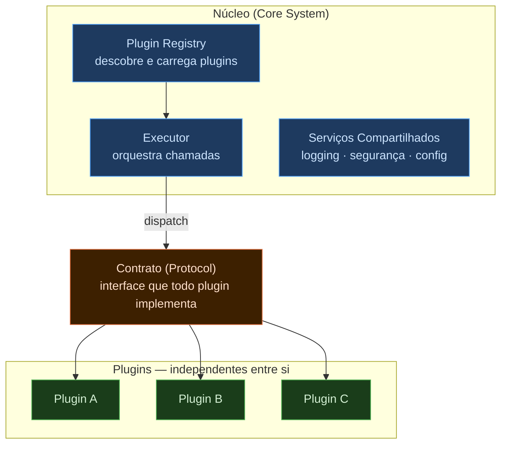
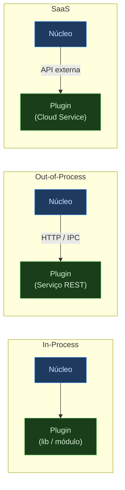
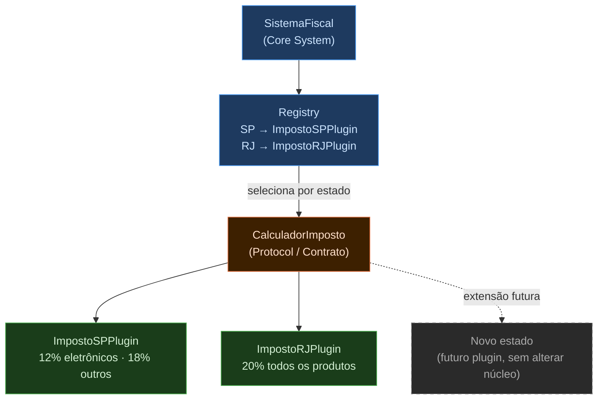

# Estilo MicroKernel (Microkernel Architecture)

> **Localização no mapa arquitetural:** MicroKernel pertence à **Família 1 — Monolítica** apresentada em *[1.1 — Mapa e Estilos de Backend](1.1%20Mapa%20e%20Estilos%20de%20Backend.md)*. Compare com [1.2 — Camadas](1.2%20Estilo%20em%20Camadas.md) quando a organização por responsabilidade técnica for suficiente, e com [1.3 — Pipes and Filters](1.3%20Pipes-filters.md) quando o problema central for transformação sequencial de dados.

## O que é o estilo MicroKernel?

O estilo **MicroKernel** — chamado de *Plug-in Architecture* por Richards e Ford — separa o sistema em dois tipos de componentes: um **núcleo** estável com funcionalidade mínima e **plugins** independentes que estendem essa funcionalidade sem modificar o núcleo.



A premissa fundamental: o **núcleo evolui lentamente** enquanto os **plugins evoluem rapidamente** — de forma independente, sem coordenação entre equipes. O núcleo não sabe o que os plugins fazem; os plugins não sabem uns dos outros. A única relação é o **contrato** que o núcleo define e que cada plugin implementa.

---

## Características Arquiteturais

Richards e Ford avaliam o estilo MicroKernel em *Fundamentals of Software Architecture* (Cap. 12):

| Característica | Avaliação | Observação |
|---|---|---|
| Custo geral | ⭐⭐⭐☆☆ | Custo médio; exige design cuidadoso do contrato do núcleo |
| Simplicidade | ⭐⭐⭐☆☆ | Conceito simples; implementação do contrato requer disciplina |
| Escalabilidade | ⭐⭐⭐☆☆ | Escala como unidade; plugins podem ser carregados/descarregados |
| Elasticidade | ⭐⭐⭐☆☆ | Similar à escalabilidade |
| Implantabilidade | ⭐⭐⭐☆☆ | Plugins podem ser implantados independentemente do núcleo |
| Testabilidade | ⭐⭐⭐☆☆ | Núcleo é fácil de testar; plugins requerem integração com o núcleo |
| Desempenho | ⭐⭐⭐☆☆ | Overhead de dispatch para plugins; geralmente aceitável |
| Modularidade | ⭐⭐⭐⭐☆ | **Ponto forte:** plugins completamente independentes entre si |
| Confiabilidade | ⭐⭐⭐☆☆ | Plugin com falha pode ser isolado sem derrubar o núcleo |

---

## Os Três Componentes Principais

### 1. Core System (Núcleo)

O núcleo contém apenas a funcionalidade mínima para o sistema operar. Ele é responsável por gerenciar o ciclo de vida dos plugins, definir e impor o contrato, orquestrar a execução e prover serviços compartilhados.

**O núcleo não deve conter lógica de negócio específica.** Quando começa a acumular lógica que deveria estar em plugins, o estilo degenera num monolito disfarçado — o anti-padrão do **Core Creep**.

### 2. Plugin Registry (Registro)

O registro é o mecanismo pelo qual o núcleo descobre e carrega plugins. Pode ser implementado como:

- **Arquivo de configuração** (YAML, JSON) — simples, requer reinicialização para alterar plugins
- **Descoberta por convenção** — o núcleo varre pacotes em busca de classes que implementam a interface
- **Registro explícito em código** — o plugin se registra no núcleo em tempo de inicialização
- **Registry dinâmico** — banco de dados ou serviço que permite adicionar/remover plugins em tempo de execução

### 3. Plugin Contract (Contrato)

O contrato é a interface que o núcleo define e que todo plugin deve implementar. Um bom contrato:

- É **estável** — raramente muda, pois uma mudança quebra todos os plugins existentes
- É **minimalista** — define apenas o que o núcleo precisa saber do plugin
- É **versionado** — permite que versões diferentes de plugins coexistam

---

## Formas de Implantação



| Forma | Descrição | Custo |
|-------|-----------|-------|
| **In-process** | Plugin carregado no mesmo processo do núcleo | Simples, performático; implanta junto com o núcleo |
| **Out-of-process** | Plugin como processo ou serviço separado | Implantação e escala independentes; latência de rede |
| **SaaS** | Plugin como serviço externo na nuvem | Máxima independência; dependência de disponibilidade externa |

---

## Exemplo 1 — Núcleo e Plugins (Framework Base)

```python
from abc import ABC, abstractmethod


# Contrato: interface que todo plugin deve respeitar
class Plugin(ABC):
    @abstractmethod
    def processar(self, dados: str) -> str: ...


# Núcleo: gerencia o ciclo de vida e orquestra a execução
class CoreSystem:
    def __init__(self):
        self._registry: dict[str, Plugin] = {}

    def registrar(self, nome: str, plugin: Plugin) -> None:
        self._registry[nome] = plugin

    def executar(self, dados: str) -> str:
        resultado = dados
        for nome, plugin in self._registry.items():
            print(f"Executando: {nome}")
            resultado = plugin.processar(resultado)
        return resultado


# Plugins: implementam o contrato sem conhecer o núcleo ou outros plugins
class PluginNormalizacao(Plugin):
    def processar(self, dados: str) -> str:
        return dados.strip().lower()


class PluginValidacao(Plugin):
    def processar(self, dados: str) -> str:
        if not dados:
            raise ValueError("Dados vazios não são permitidos.")
        return dados


class PluginAuditoria(Plugin):
    def processar(self, dados: str) -> str:
        print(f"[AUDITORIA] Processando: {dados!r}")
        return dados


# Configuração: different clients can use different plugin sets
core = CoreSystem()
core.registrar("validacao", PluginValidacao())
core.registrar("normalizacao", PluginNormalizacao())
core.registrar("auditoria", PluginAuditoria())

resultado = core.executar("  Pedido #1234  ")
print(f"Resultado: {resultado!r}")
# Executando: validacao
# Executando: normalizacao
# [AUDITORIA] Processando: 'pedido #1234'
# Resultado: 'pedido #1234'
```

---

## Exemplo 2 — Sistema de Cálculo de Impostos

Sistemas tributários são o caso canônico de MicroKernel em Richards e Ford. As regras fiscais variam por estado, mas o fluxo de cálculo é o mesmo.



```python
from dataclasses import dataclass
from typing import Protocol


@dataclass
class Pedido:
    valor_base: float
    estado: str
    categoria_produto: str


@dataclass
class ResultadoCalculo:
    valor_base: float
    imposto: float
    valor_total: float
    descricao: str


# Contrato: todos os calculadores implementam esta interface
class CalculadorImposto(Protocol):
    def calcular(self, pedido: Pedido) -> ResultadoCalculo: ...


# Plugin para São Paulo
class ImpostoSPPlugin:
    def calcular(self, pedido: Pedido) -> ResultadoCalculo:
        aliquota = 0.12 if pedido.categoria_produto == "eletronico" else 0.18
        imposto = pedido.valor_base * aliquota
        return ResultadoCalculo(
            valor_base=pedido.valor_base,
            imposto=imposto,
            valor_total=pedido.valor_base + imposto,
            descricao=f"ICMS SP ({aliquota * 100:.0f}%)",
        )


# Plugin para Rio de Janeiro
class ImpostoRJPlugin:
    def calcular(self, pedido: Pedido) -> ResultadoCalculo:
        aliquota = 0.20
        imposto = pedido.valor_base * aliquota
        return ResultadoCalculo(
            valor_base=pedido.valor_base,
            imposto=imposto,
            valor_total=pedido.valor_base + imposto,
            descricao=f"ICMS RJ ({aliquota * 100:.0f}%)",
        )


# Núcleo: seleciona o plugin correto pelo estado
class SistemaFiscal:
    def __init__(self):
        self._calculadores: dict[str, CalculadorImposto] = {}

    def registrar(self, estado: str, calculador: CalculadorImposto) -> None:
        self._calculadores[estado] = calculador

    def calcular(self, pedido: Pedido) -> ResultadoCalculo:
        calculador = self._calculadores.get(pedido.estado)
        if not calculador:
            raise ValueError(f"Nenhum calculador registrado para: {pedido.estado}")
        return calculador.calcular(pedido)


# Adicionar suporte a um novo estado = novo plugin, sem alterar SistemaFiscal
sistema = SistemaFiscal()
sistema.registrar("SP", ImpostoSPPlugin())
sistema.registrar("RJ", ImpostoRJPlugin())

pedido = Pedido(valor_base=1000.0, estado="SP", categoria_produto="eletronico")
resultado = sistema.calcular(pedido)
print(f"Total: R${resultado.valor_total:.2f} ({resultado.descricao})")
# Total: R$1120.00 (ICMS SP 12%)
```

---

## O Anti-padrão do Core Creep

O principal risco do MicroKernel é o **Core Creep** — o núcleo cresce gradualmente com lógica que deveria estar em plugins.

```python
# ERRADO: lógica específica de cliente dentro do núcleo
class SistemaFiscalComCreep:
    def calcular(self, pedido: Pedido) -> float:
        if pedido.estado == "SP":
            return pedido.valor_base * 0.12   # ← lógica de plugin no núcleo
        elif pedido.estado == "RJ":
            return pedido.valor_base * 0.20   # ← idem
        # cada novo estado exige modificar o núcleo
```

Quando o núcleo acumula condicionais por tipo de cliente ou região, a extensibilidade se perde. Qualquer lógica que varia entre clientes pertence a um plugin.

---

## Exemplos Modernos

| Sistema | Núcleo | Plugins |
|---------|--------|---------|
| **Eclipse IDE** | Plataforma OSGi + runtime | Suporte a linguagens, debug, integração SCM |
| **Jenkins** | Motor de pipeline + scheduler | Build steps, notificações, cloud providers |
| **VS Code** | Editor base + LSP | Extensões de linguagem, temas, debug |
| **WordPress** | CMS base + sistema de hooks | Temas, SEO, e-commerce, analytics |
| **Sistemas ERP** | Módulo financeiro base | RH, manufatura, CRM por segmento |

---

## Quando usar — e quando não usar

**Use MicroKernel quando:**
- O produto precisa ser customizável para diferentes clientes ou mercados sem alterar o código central
- Diferentes equipes desenvolvem extensões de forma independente e paralela
- Regras de negócio variam por segmento (fiscal, regulatório, regional)
- O produto é uma plataforma que terceiros estendem

**Não use MicroKernel quando:**
- O sistema tem um único cliente e regras estáveis — o overhead não se justifica
- As extensões precisam compartilhar estado entre si — isso quebra o isolamento do padrão
- A lógica é hierárquica por responsabilidade técnica → [Camadas — 1.2](1.2%20Estilo%20em%20Camadas.md)
- O processamento é orientado a fluxo de dados sequencial → [Pipes and Filters — 1.3](1.3%20Pipes-filters.md)

---

## Referências

- Richards, M.; Ford, N. *Fundamentals of Software Architecture*, 2ª ed. O'Reilly, 2022. Cap. 12.
- Shaw, M.; Garlan, D. *Software Architecture: Perspectives on an Emerging Discipline*. Prentice Hall, 1996.
- Bass, L.; Clements, P.; Kazman, R. *Software Architecture in Practice*, 3ª ed. Addison-Wesley, 2012.
