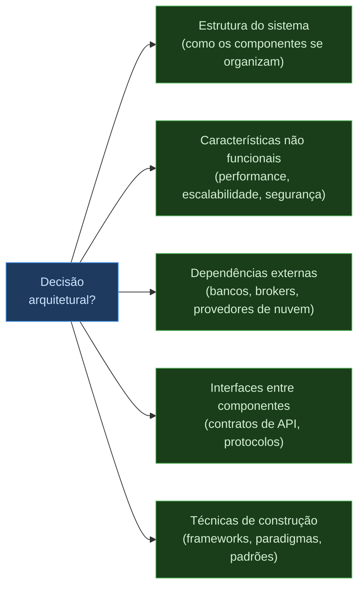
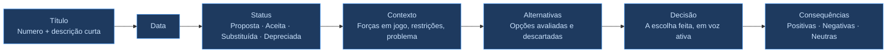

> **Acervo legado preservado.** Para o percurso atual da disciplina, consulte o [Template de ADR](docs/referencia/template-adr.md).

> **BLOCO 3 — DECIDINDO E DOCUMENTANDO**
> Você está no terceiro e último bloco da Seção 1. Este bloco pressupõe que você já leu *[1.1 — Mapa e Estilos de Backend](1.1%20Mapa%20e%20Estilos%20de%20Backend.md)* e explorou os estilos em [1.2](1.2%20Estilo%20em%20Camadas.md), [1.3](1.3%20Pipes-filters.md) e [1.4](1.4%20Micro-kernel.md).

# Decisões Arquiteturais e ADRs

> **Conexão com o Bloco 2:** Nos documentos anteriores você conheceu os estilos em Camadas, Pipes and Filters e MicroKernel — cada um com trade-offs distintos de custo, testabilidade, escalabilidade e modularidade. A pergunta natural é: **como o time documenta e justifica a escolha entre eles?** É exatamente isso que um ADR faz.

## O que é uma decisão arquitetural?

Não toda decisão técnica é uma decisão arquitetural. A distinção importa porque ADRs consomem tempo e atenção da equipe — não devem ser escritos para cada escolha de biblioteca ou padrão de nomenclatura.

Segundo Richards e Ford, uma decisão é **arquitetural** quando afeta pelo menos um destes aspectos:

**Exemplos que são decisões arquiteturais:**
- Escolher Camadas em vez de Microsserviços para o sistema de gestão de clínicas
- Adotar Kubernetes como plataforma de orquestração
- Usar PostgreSQL como banco primário e Redis para cache
- Definir que toda comunicação entre serviços usa REST, não gRPC

**Exemplos que não são decisões arquiteturais:**
- Escolher entre `black` e `isort` como formatadores Python
- Nomear variáveis em camelCase ou snake_case
- Usar `pytest` em vez de `unittest`

---

## O problema de decidir sem racional

O maior risco no processo decisório arquitetural não é tomar a decisão errada — é tomar a decisão certa **sem documentar o porquê**. Seis meses depois, ninguém lembra das alternativas avaliadas, dos critérios usados ou das restrições que existiam na época. Novas pessoas no time repetem discussões já resolvidas. Decisões são revertidas sem saber o que estão desfazendo.

Richards e Ford descrevem esse fenômeno como **"architecture by implication"** — a arquitetura que emerge por inércia, sem decisão explícita. A Lei de Conway amplifica o problema: equipes tendem a produzir arquiteturas que espelham sua estrutura de comunicação, não as necessidades do sistema.

O ADR (*Architecture Decision Record*) é a resposta para esse problema: um registro curto, vivo e rastreável da decisão, suas alternativas e suas consequências.

---

## O formato ADR

Michael Nygard propôs o formato original em 2011. Cada ADR é um arquivo Markdown no repositório do código — próximo ao que documenta, fácil de atualizar, visível no histórico do Git.

### Ciclo de vida de um ADR

Um ADR **nunca é deletado** — apenas substituído ou depreciado. O histórico de decisões é parte da documentação arquitetural do sistema.

---

## Exemplo 1 — ADR de Estilo Arquitetural

Este é o tipo de ADR mais diretamente conectado ao Bloco 2: a escolha do estilo que vai organizar o sistema.

---

**ADR-001: Estilo Arquitetural para o Sistema de Gestão de Clínicas**

**Data:** 15 de março de 2025

**Status:** Aceita

**Contexto**

A clínica Saúde Total precisa de um sistema para gerenciar agendamentos, prontuários e faturamento. A equipe de desenvolvimento tem 4 pessoas, todas com experiência em desenvolvimento web tradicional mas sem experiência prévia com microsserviços ou sistemas distribuídos. O prazo inicial para uma versão funcional é de 4 meses.

Os requisitos iniciais incluem:
- Agendamento de consultas com verificação de conflito de agenda
- Cadastro e atualização de prontuários médicos
- Faturamento com integração a convênios
- Geração de relatórios administrativos mensais

O sistema atenderá aproximadamente 500 consultas por dia num único estabelecimento.

**Alternativas avaliadas**

| Estilo | Custo | Escalabilidade | Adequação ao contexto |
|--------|-------|----------------|----------------------|
| Camadas (MVC + DDD) | ⭐⭐⭐⭐⭐ | ⭐⭐ | Alta — escopo bem definido, equipe pequena |
| Microsserviços | ⭐⭐⭐ | ⭐⭐⭐⭐⭐ | Baixa — overhead operacional incompatível com o prazo e o time |
| MicroKernel | ⭐⭐⭐ | ⭐⭐⭐ | Média — extensibilidade útil, mas regras de negócio não variam por cliente |

*Escalabilidade baseada nas características arquiteturais de Richards e Ford, Fundamentals of Software Architecture, 2ª ed.*

**Decisão**

Decidimos adotar o **Estilo em Camadas com DDD** na camada de negócios para o módulo de agendamentos e prontuários.

Os critérios que determinaram essa escolha:
1. **Custo e prazo:** o estilo em Camadas é o de menor custo de entrada e o que melhor se alinha ao prazo de 4 meses. Microsserviços adicionariam meses de trabalho operacional sem benefício proporcional na escala atual.
2. **Tamanho da equipe:** 4 desenvolvedores é insuficiente para operar múltiplos serviços independentes com observabilidade adequada.
3. **Complexidade do domínio:** as regras de agendamento (conflito de agenda, regras de elegibilidade por convênio) justificam o uso de DDD na camada de negócios, sem exigir distribuição física.
4. **Evolução futura:** a arquitetura em camadas bem organizada pode ser decomposta em microsserviços se e quando o volume crescer — o DDD facilita esse corte ao manter bounded contexts explícitos.

**Consequências**

*Positivas:*
- Entrega no prazo com a equipe atual
- Menor complexidade operacional
- Bounded contexts do DDD criam fronteiras que facilitam uma decomposição futura

*Negativas:*
- Escalabilidade limitada como unidade única — se o volume crescer para múltiplas clínicas, será necessário revisar este ADR
- Todos os módulos são implantados juntos — uma mudança no módulo de faturamento exige reimplantar o sistema inteiro

*Neutras:*
- A escolha de DDD na camada de negócios é independente do estilo em Camadas — pode ser mantida numa eventual migração para microsserviços

---

## Exemplo 2 — ADR de Infraestrutura

Este ADR documenta uma decisão de plataforma, não de estilo arquitetural — mas serve como referência do nível de detalhe esperado.

---

**ADR-007: Adoção de Kubernetes para Orquestração de Contêineres**

**Data:** 1 de dezembro de 2024

**Status:** Aceita

**Contexto**

A empresa opera aplicações críticas em VMs com escalonamento manual. Problemas recorrentes incluem:
- Indisponibilidade em incidentes por ausência de failover automático
- Escalabilidade manual com tempo de resposta de minutos a horas
- Deploys que causam janelas de indisponibilidade por falta de *rolling updates*
- Monitoramento inconsistente entre aplicações e infraestrutura

**Requisitos identificados:**
- Alta disponibilidade sem ponto único de falha (SPOF)
- Autoscaling baseado em métricas de CPU e memória
- Portabilidade entre provedores de nuvem (sem vendor lock-in)
- Observabilidade unificada para infraestrutura e aplicações

**Alternativas avaliadas**

| Alternativa | Prós | Contras |
|-------------|------|---------|
| **Docker Swarm** | Simples, rápido de adotar | Suporte limitado de HA e escalabilidade avançada; comunidade em declínio |
| **EKS / AKS / GKE gerenciados** | Reduz carga operacional | Dependência parcial de provedor único |
| **Bare Metal com Rancher** | Controle total | Custos e complexidade operacional elevados |
| **Kubernetes puro** | Portabilidade máxima, comunidade ativa, suporte CNCF | Curva de aprendizado; complexidade operacional |

**Decisão**

Decidimos adotar **Kubernetes** como plataforma principal de orquestração, com suporte a execução em nuvens públicas (AWS, Azure, GCP) e on-premises.

Fatores determinantes:
1. Autoscaling horizontal e vertical nativos (HPA e VPA)
2. Failover automático com *pod replication* e *health checks*
3. Portabilidade entre provedores elimina vendor lock-in
4. Integração com Prometheus e Grafana para observabilidade unificada
5. Ecossistema CNCF com suporte de longo prazo garantido

**Consequências**

*Positivas:*
- Redução do tempo de indisponibilidade com failover automático
- Escalonamento dinâmico reduz custo operacional em períodos de baixa carga

*Negativas:*
- Curva de aprendizado — a equipe precisará de capacitação (CKAD, CKA)
- Custo inicial de setup, ingress controllers e pipelines CI/CD

*Neutras:*
- Migração de aplicações legadas varia entre simples (já conteinerizadas) e complexa (monolitos)

**Próximos passos**
1. Configurar cluster de teste com minikube para provas de conceito
2. Capacitar a equipe com treinamentos CKAD/CKA
3. Integrar Prometheus e Grafana para monitoramento centralizado

---

## Práticas Recomendadas

**ADRs pertencem ao repositório, não a wikis externas.**
Armazenar ADRs em `docs/adr/` dentro do repositório garante que decisões e código evoluam juntos. O histórico do Git torna rastreável quem tomou cada decisão e quando.

**Escreva um ADR quando a decisão for difícil de reverter.**
Adotar um banco de dados, escolher um estilo arquitetural, definir um protocolo de comunicação — essas são decisões com alto custo de reversão. Escolher um linter não é.

**Registre as alternativas descartadas — não apenas a escolha.**
O valor de um ADR está nas alternativas avaliadas e nos critérios de seleção. "Decidimos usar X" sem contexto é inútil. "Avaliamos X, Y e Z; escolhemos X pelos critérios A e B, cientes de que perdemos C e D" — isso é documentação arquitetural.

**ADRs têm ciclo de vida — não são eternos.**
Quando o contexto muda e a decisão é revisada, o ADR original recebe status `Substituída` e um novo ADR documenta a nova decisão com referência ao anterior. Nunca edite um ADR aceito para mudar sua decisão — crie um novo.

**Escreva durante ou logo após a decisão, não meses depois.**
O valor do ADR é capturar o contexto no momento em que ele existia. Documentar retrospectivamente perde precisão e as alternativas descartadas são esquecidas.

---

## Referências

- Nygard, M. *Documenting Architecture Decisions* (2011). Artigo original propondo o formato ADR.
- Richards, M.; Ford, N. *Fundamentals of Software Architecture*, 2ª ed. O'Reilly, 2022. Cap. 19 — Making Architectural Decisions.
- [github.com/joelparkerhenderson/architecture-decision-record](https://github.com/joelparkerhenderson/architecture-decision-record) — coleção de templates de ADR
- [adr.github.io/madr](https://adr.github.io/madr/) — MADR: Markdown Architectural Decision Records
- Kruchten, P. *The Rational Unified Process: An Introduction*. Addison-Wesley, 2004.
