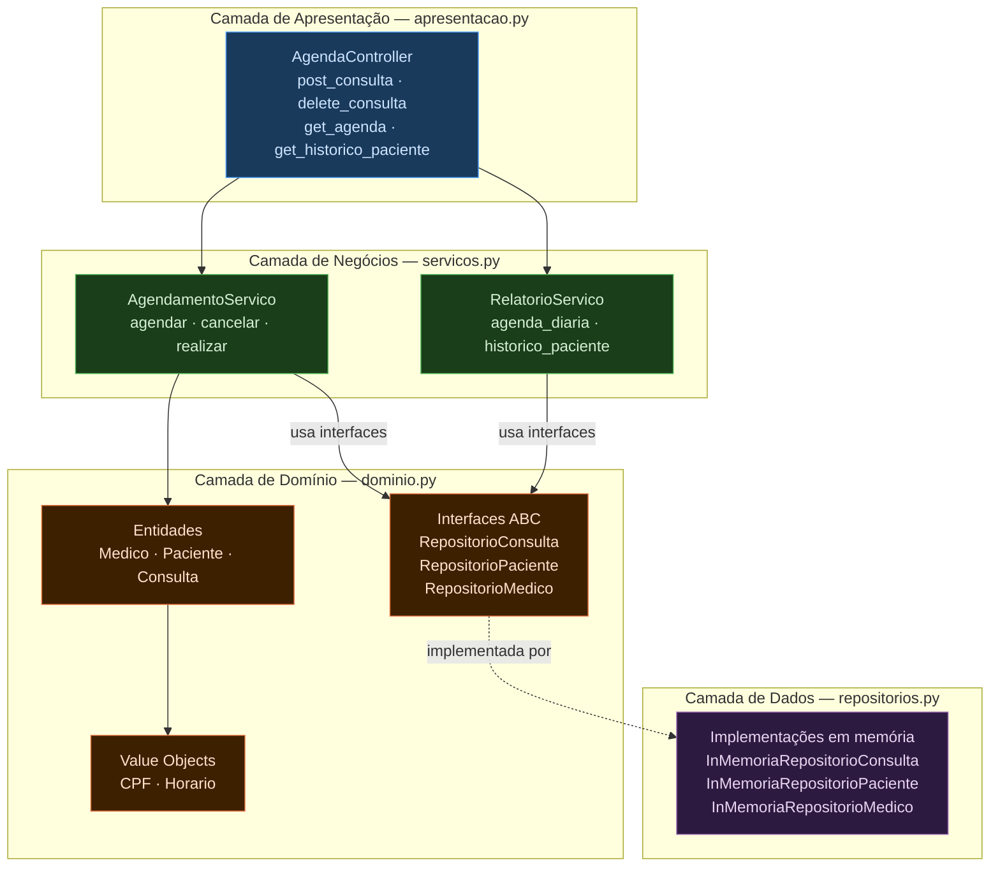
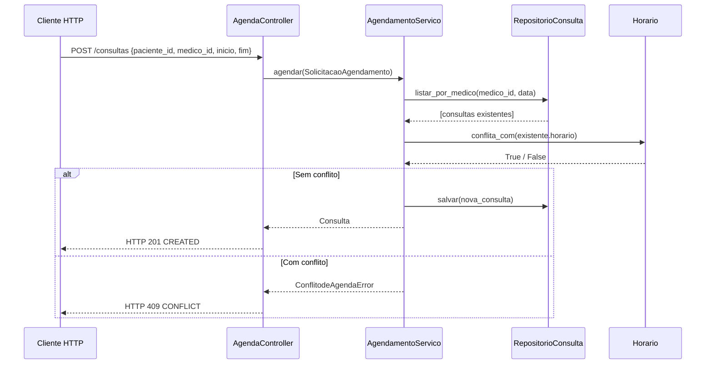
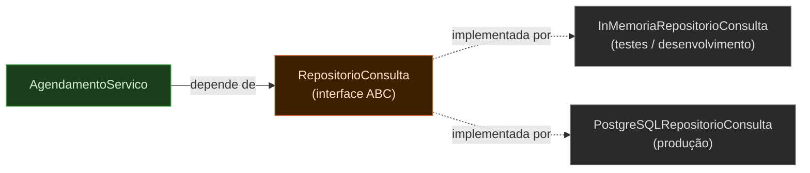

# 1.2 — Estilo em Camadas: Sistema de Agendamento de Clínica

Demonstração completa do estilo arquitetural em Camadas com DDD, aplicado a um
sistema de agendamento de consultas médicas. Cada camada tem responsabilidade única
e depende apenas das interfaces da camada abaixo — nunca das implementações concretas.

## Execução

```bash
python main.py
```

Sem dependências externas — apenas Python 3.10+.

---

## Arquitetura



### Fluxo: POST /consultas



---

## Camada de Domínio — `dominio.py`

Núcleo do sistema. Contém Value Objects, Entidades e as interfaces ABC dos repositórios.
Não tem dependências externas — todas as outras camadas dependem dela.

### Value Objects — imutáveis e auto-validados

```python
@dataclass(frozen=True)
class CPF:
    valor: str

    def __post_init__(self):
        digitos = "".join(c for c in self.valor if c.isdigit())
        if len(digitos) != 11:
            raise ValueError(f"CPF inválido: {self.valor!r}")


@dataclass(frozen=True)
class Horario:
    inicio: datetime
    fim: datetime

    def __post_init__(self):
        if self.fim <= self.inicio:
            raise ValueError("Horário de fim deve ser posterior ao de início.")

    def conflita_com(self, outro: Horario) -> bool:
        """Dois horários conflitam se se sobrepõem em qualquer ponto."""
        return self.inicio < outro.fim and self.fim > outro.inicio
```

### Entidade com regra de negócio encapsulada

```python
@dataclass
class Consulta:
    id: int
    medico: Medico
    paciente: Paciente
    horario: Horario
    status: str = "agendada"   # agendada | realizada | cancelada

    def cancelar(self) -> None:
        if self.status != "agendada":
            raise ValueError(
                f"Impossível cancelar consulta com status '{self.status}'."
            )
        self.status = "cancelada"
```

### Interface ABC — contrato da camada de dados

```python
class RepositorioConsulta(ABC):
    @abstractmethod
    def salvar(self, consulta: Consulta) -> None: ...

    @abstractmethod
    def buscar_por_id(self, id: int) -> Optional[Consulta]: ...

    @abstractmethod
    def listar_por_medico(self, medico_id: int, data: datetime) -> list[Consulta]: ...
```

---

## Camada de Dados — `repositorios.py`

Implementa as interfaces ABC com dicionários em memória.
Para trocar por PostgreSQL em produção, basta criar `PostgreSQLRepositorioConsulta(RepositorioConsulta)`
**sem alterar uma linha da camada de negócios** — isso é o Princípio Aberto-Fechado em ação.

```python
class InMemoriaRepositorioConsulta(RepositorioConsulta):
    def __init__(self):
        self._consultas: dict[int, Consulta] = {}

    def salvar(self, consulta: Consulta) -> None:
        self._consultas[consulta.id] = consulta

    def listar_por_medico(self, medico_id: int, data: datetime) -> list[Consulta]:
        return [
            c for c in self._consultas.values()
            if c.medico.id == medico_id
            and c.horario.inicio.date() == data.date()
            and c.status == "agendada"
        ]
```

O OCP garante que `AgendamentoServico` permanece intacto ao trocar o banco:



---

## Camada de Negócios — `servicos.py`

Regras que governam o comportamento do sistema.
Depende apenas das **interfaces** ABC — nunca das implementações concretas.

```python
class AgendamentoServico:
    """Invariante: um médico não pode ter dois horários sobrepostos."""

    def agendar(self, solicitacao: SolicitacaoAgendamento) -> Consulta:
        horario = Horario(inicio=solicitacao.inicio, fim=solicitacao.fim)

        # Verifica conflito — regra de negócio da camada de negócios
        for existente in self._repo_consulta.listar_por_medico(
            solicitacao.medico_id, solicitacao.inicio
        ):
            if horario.conflita_com(existente.horario):
                raise ConflitodeAgendaError(
                    f"Dr(a). {medico.nome} já tem consulta das "
                    f"{existente.horario.inicio.strftime('%H:%M')} às "
                    f"{existente.horario.fim.strftime('%H:%M')}."
                )

        consulta = Consulta(id=self._proximo_id, medico=medico,
                            paciente=paciente, horario=horario)
        self._proximo_id += 1
        self._repo_consulta.salvar(consulta)
        return consulta
```

---

## Camada de Apresentação — `apresentacao.py`

Traduz requisições HTTP em chamadas à camada de negócios e formata as respostas.
**Não contém regras de negócio** — apenas coordenação e serialização de erros.

```python
class AgendaController:
    def post_consulta(self, corpo: dict) -> Resposta:
        """POST /consultas"""
        try:
            solicitacao = SolicitacaoAgendamento(
                paciente_id=corpo["paciente_id"],
                medico_id=corpo["medico_id"],
                inicio=datetime.fromisoformat(corpo["inicio"]),
                fim=datetime.fromisoformat(corpo["fim"]),
            )
            c = self._agendamento.agendar(solicitacao)
            return Resposta(201, {"id": c.id, "medico": c.medico.nome,
                                  "horario": str(c.horario), "status": c.status})
        except ConflitodeAgendaError as e:
            return Resposta(409, {"erro": str(e)})
        except (EntidadeNaoEncontradaError, KeyError, ValueError) as e:
            return Resposta(400, {"erro": str(e)})
```

---

## Saída esperada

```
────────────────────────────────────────────────────────────
  1. Agendando consultas válidas
────────────────────────────────────────────────────────────
HTTP 201 CREATED → {'id': 1, 'medico': 'Dra. Ana Silva', 'horario': '09:00–09:30', 'status': 'agendada'}
HTTP 201 CREATED → {'id': 2, 'medico': 'Dra. Ana Silva', 'horario': '10:00–10:30', 'status': 'agendada'}
HTTP 201 CREATED → {'id': 3, 'medico': 'Dr. João Costa', 'horario': '14:00–14:20', 'status': 'agendada'}

────────────────────────────────────────────────────────────
  2. Tentando agendar com CONFLITO de horário (esperado: HTTP 409)
────────────────────────────────────────────────────────────
HTTP 409 CONFLICT → {'erro': 'Dr(a). Dra. Ana Silva já tem consulta das 09:00 às 09:30.'}

────────────────────────────────────────────────────────────
  4. Realizando a consulta #1
────────────────────────────────────────────────────────────
HTTP 200 OK → {'id': 1, 'status': 'realizada', 'observacoes': 'Paciente sem alterações. Retorno em 6 meses.'}

────────────────────────────────────────────────────────────
  6. Tentando cancelar consulta já cancelada (esperado: HTTP 400)
────────────────────────────────────────────────────────────
HTTP 400 BAD REQUEST → {'erro': "Impossível cancelar consulta com status 'cancelada'."}
```
