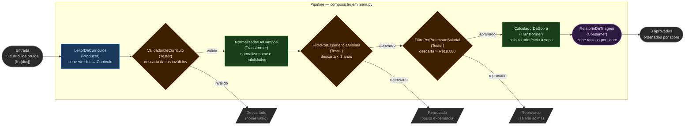

# 1.3 — Pipes and Filters: Pipeline de Triagem de Currículos

Demonstração completa do estilo Pipes and Filters aplicado a um pipeline de
triagem de candidatos para vaga de Engenheiro Backend. Cada etapa é um filtro
independente — sem estado compartilhado, sem conhecimento dos outros filtros.

## Execução

```bash
python main.py
```

Sem dependências externas — apenas Python 3.10+.

---

## Arquitetura



---

## Os quatro tipos de filtro

| Tipo | Papel | Exemplo neste projeto |
|------|-------|-----------------------|
| **Producer** | Ponto de entrada — gera os dados iniciais | `LeitorDeCurriculos` |
| **Tester** | Avalia e descarta registros que não passam | `ValidadorDeCurriculo`, `FiltroPorExperienciaMinima`, `FiltroPorPretensaoSalarial` |
| **Transformer** | Transforma dados sem descartar | `NormalizadorDeCampos`, `CalculadorDeScore` |
| **Consumer** | Ponto de saída — persiste ou exibe o resultado | `RelatorioDeTriagem` |

---

## Framework — `framework.py`

Base reutilizável que define o contrato e o mecanismo de encadeamento.
Completamente independente do domínio de negócio — funciona para qualquer pipeline.

```python
class Filtro(ABC):
    """Contrato: recebe dados, transforma e devolve. Sem estado compartilhado."""

    @abstractmethod
    def processar(self, dados: Any) -> Any: ...

    @property
    def nome(self) -> str:
        return self.__class__.__name__


class Pipeline:
    """Encadeia filtros e executa em sequência. Output de um é input do próximo."""

    def __init__(self):
        self._filtros: list[Filtro] = []

    def adicionar(self, filtro: Filtro) -> "Pipeline":
        self._filtros.append(filtro)
        return self          # retorna self para encadeamento fluente

    def executar(self, dados: Any) -> Any:
        resultado = dados
        for filtro in self._filtros:
            resultado = filtro.processar(resultado)
        return resultado

    def __repr__(self) -> str:
        nomes = " → ".join(f.nome for f in self._filtros)
        return f"Pipeline({nomes})"
```

---

## Producer — `filtros/producer.py`

Ponto de entrada do pipeline. Converte dados brutos em objetos de domínio.
Recebe qualquer dado como entrada e ignora — os dados reais vêm do construtor.

```python
class LeitorDeCurriculos(Filtro):
    def __init__(self, dados_brutos: list[dict]):
        self._dados = dados_brutos

    def processar(self, _: Any) -> list[Curriculo]:
        return [Curriculo(**d) for d in self._dados]
```

---

## Testers — `filtros/testers.py`

Avaliam os dados contra um critério e **descartam** os registros que não passam.
Não transformam — apenas aprovam ou rejeitam.

```python
class ValidadorDeCurriculo(Filtro):
    """Descarta currículos com dados obrigatórios ausentes ou inválidos."""

    def processar(self, curriculos: list[Curriculo]) -> list[Curriculo]:
        validos = []
        for c in curriculos:
            if not c.candidato_nome.strip():
                print(f"  [DESCARTADO] Currículo id={c.id}: nome ausente")
                continue
            if "@" not in c.email:
                print(f"  [DESCARTADO] {c.candidato_nome}: e-mail inválido")
                continue
            validos.append(c)
        return validos


class FiltroPorExperienciaMinima(Filtro):
    """Descarta candidatos abaixo do mínimo de experiência da vaga."""

    def __init__(self, vaga: Vaga):
        self._minimo = vaga.experiencia_minima

    def processar(self, curriculos: list[Curriculo]) -> list[Curriculo]:
        aprovados = []
        for c in curriculos:
            if c.anos_experiencia < self._minimo:
                print(f"  [REPROVADO] {c.candidato_nome}: "
                      f"{c.anos_experiencia} ano(s) < mínimo {self._minimo}")
                continue
            aprovados.append(c)
        return aprovados
```

---

## Transformers — `filtros/transformers.py`

Transformam os dados **sem descartar** nenhum registro.
Cada transformer é stateless — não guarda estado entre invocações.

```python
class NormalizadorDeCampos(Filtro):
    """Normaliza habilidades (lowercase) e nome (title case)."""

    def processar(self, curriculos: list[Curriculo]) -> list[Curriculo]:
        for c in curriculos:
            c.candidato_nome = c.candidato_nome.strip().title()
            c.habilidades = [h.lower().strip() for h in c.habilidades]
        return curriculos


class CalculadorDeScore(Filtro):
    """Calcula score de aderência e converte Curriculo → ResultadoTriagem."""

    def __init__(self, vaga: Vaga):
        self._requeridas = {h.lower() for h in vaga.habilidades_requeridas}

    def processar(self, curriculos: list[Curriculo]) -> list[ResultadoTriagem]:
        resultados = []
        for c in curriculos:
            compativeis = list(set(c.habilidades) & self._requeridas)
            score = len(compativeis) / len(self._requeridas) if self._requeridas else 0.0
            resultados.append(ResultadoTriagem(
                curriculo=c, aprovado=True,
                score=round(score, 2), habilidades_compativeis=compativeis,
            ))
        return resultados
```

---

## Consumer — `filtros/consumer.py`

Destino final do pipeline. Exibe o relatório ordenado por score e retorna os aprovados.

```python
class RelatorioDeTriagem(Filtro):
    def processar(self, resultados: list[ResultadoTriagem]) -> list[ResultadoTriagem]:
        aprovados = sorted(
            [r for r in resultados if r.aprovado],
            key=lambda r: r.score,
            reverse=True,
        )
        print(f"\n{'═' * 60}")
        print(f"  TRIAGEM CONCLUÍDA — {len(aprovados)} candidato(s) aprovado(s)")
        print(f"{'═' * 60}")
        for i, r in enumerate(aprovados, 1):
            bar = "█" * int(r.score * 10) + "░" * (10 - int(r.score * 10))
            print(f"\n  {i}. {r.curriculo.candidato_nome}")
            print(f"     Score: {bar} {r.score * 100:.0f}%")
        return aprovados
```

---

## Composição do pipeline — `main.py`

O pipeline é montado em `main.py`. Os filtros não sabem uns dos outros.
Reordenar, adicionar ou remover um filtro **não exige alterar os demais**.

```python
pipeline = (
    Pipeline()
    .adicionar(LeitorDeCurriculos(CURRICULOS_BRUTOS))   # Producer
    .adicionar(ValidadorDeCurriculo())                   # Tester
    .adicionar(NormalizadorDeCampos())                   # Transformer (normaliza antes de filtrar)
    .adicionar(FiltroPorExperienciaMinima(vaga))         # Tester
    .adicionar(FiltroPorPretensaoSalarial(vaga))         # Tester
    .adicionar(CalculadorDeScore(vaga))                  # Transformer
    .adicionar(RelatorioDeTriagem())                     # Consumer
)

aprovados = pipeline.executar(None)
```

---

## Saída esperada

```
Pipeline: LeitorDeCurriculos → ValidadorDeCurriculo → NormalizadorDeCampos
          → FiltroPorExperienciaMinima → FiltroPorPretensaoSalarial
          → CalculadorDeScore → RelatorioDeTriagem

  [DESCARTADO] Currículo id=3: nome ausente
  [REPROVADO] Bruno Rocha: 1 ano(s) < mínimo 3
  [REPROVADO] Clara Mendes: pretensão R$22.000 > máximo R$18.000

════════════════════════════════════════════════════════════
  TRIAGEM CONCLUÍDA — 3 candidato(s) aprovado(s)
════════════════════════════════════════════════════════════

  1. Ana Lima
     Score: ██████████ 100%
     Habilidades compatíveis: python, postgresql, docker, rest

  2. Elena Souza
     Score: ██████████ 100%
     Habilidades compatíveis: python, docker, rest, postgresql

  3. Diego Faria
     Score: ███████░░░ 75%
     Habilidades compatíveis: python, postgresql, rest

  → 3 candidato(s) encaminhado(s) para entrevista.
```
