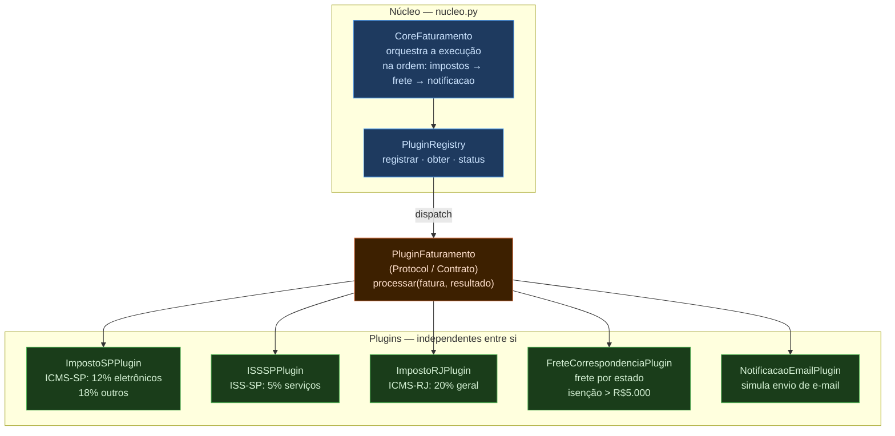
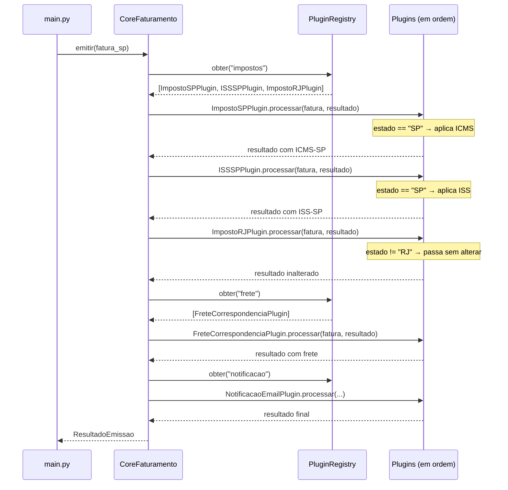
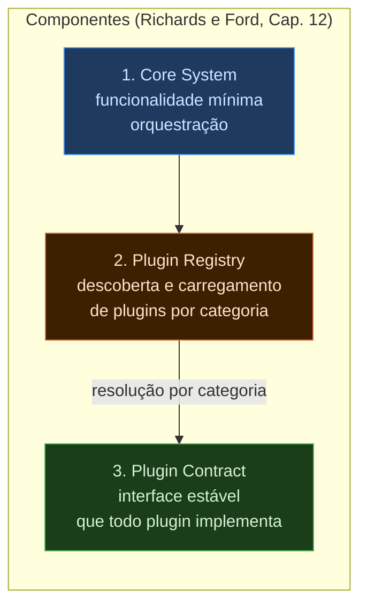

# 1.4 — MicroKernel: Sistema de Faturamento Multi-Estado

Demonstração completa do estilo MicroKernel aplicado a um sistema de faturamento
com regras fiscais que variam por estado. O núcleo não conhece as regras — apenas
orquestra plugins independentes que as implementam.

## Execução

```bash
python main.py
```

Sem dependências externas — apenas Python 3.10+.

---

## Arquitetura



### Fluxo de emissão de uma fatura



---

## Os três componentes do MicroKernel



---

## Contrato — `nucleo.py`

Define a interface que todo plugin deve respeitar. Usa `Protocol` do Python 3.10+
para verificação estrutural em tempo de execução — o núcleo não precisa que os
plugins herdem de uma classe base, apenas que implementem os métodos corretos.

```python
@runtime_checkable
class PluginFaturamento(Protocol):
    """
    Contrato que todo plugin deve respeitar.
    Estável por design: mudanças aqui quebram todos os plugins existentes.
    """

    @property
    def nome(self) -> str: ...

    def processar(self, fatura: Fatura, resultado: ResultadoEmissao) -> ResultadoEmissao: ...
```

---

## Plugin Registry — `nucleo.py`

Gerencia o ciclo de vida dos plugins por categoria. Valida o contrato no registro
e permite adicionar novos plugins sem alterar o núcleo.

```python
class PluginRegistry:
    def __init__(self):
        self._plugins: dict[str, list] = {}

    def registrar(self, categoria: str, plugin: PluginFaturamento) -> None:
        if not isinstance(plugin, PluginFaturamento):
            raise TypeError(
                f"'{type(plugin).__name__}' não implementa o contrato PluginFaturamento."
            )
        self._plugins.setdefault(categoria, []).append(plugin)

    def obter(self, categoria: str) -> list:
        return self._plugins.get(categoria, [])
```

---

## Core System — `nucleo.py`

Não contém nenhuma regra de negócio. Apenas orquestra a execução dos plugins
na ordem definida pela constante `ORDEM_CATEGORIAS`.

```python
class CoreFaturamento:
    """O núcleo não sabe o que os plugins fazem — apenas os orquestra."""

    ORDEM_CATEGORIAS = ["impostos", "frete", "notificacao"]

    def emitir(self, fatura: Fatura) -> ResultadoEmissao:
        resultado = ResultadoEmissao(fatura_id=fatura.id, valor_bruto=fatura.valor_bruto)

        for categoria in self.ORDEM_CATEGORIAS:
            for plugin in self._registry.obter(categoria):
                resultado = plugin.processar(fatura, resultado)   # cada plugin enriquece o resultado

        return resultado
```

---

## Exemplo de Plugin — `plugins/impostos_sp.py`

Cada plugin implementa o contrato e aplica sua lógica apenas quando relevante
(verificação pelo estado do cliente). Plugins de outros estados são ignorados
sem afetar o resultado.

```python
class ImpostoSPPlugin:
    nome = "ICMS-SP"

    ALIQUOTAS = {
        "eletronico": 0.12,
        "servico":    0.05,
        "alimentacao": 0.07,
    }
    ALIQUOTA_PADRAO = 0.18

    def processar(self, fatura: Fatura, resultado: ResultadoEmissao) -> ResultadoEmissao:
        if fatura.cliente.estado != "SP":
            return resultado       # plugin não se aplica — passa sem alterar

        icms = sum(
            item.subtotal * self.ALIQUOTAS.get(item.categoria, self.ALIQUOTA_PADRAO)
            for item in fatura.itens
        )
        resultado.impostos[self.nome] = round(icms, 2)
        return resultado
```

---

## Extensão sem tocar no núcleo — `main.py`

Para adicionar suporte a um novo estado, basta criar um plugin e registrá-lo.
`CoreFaturamento` e os plugins existentes **não são modificados**.

```python
# Novo plugin criado em main.py (ou em plugins/impostos_mg.py)
class ImpostoMGPlugin:
    nome = "ICMS-MG"
    ALIQUOTA = 0.18

    def processar(self, fatura: Fatura, resultado) -> object:
        if fatura.cliente.estado != "MG":
            return resultado
        resultado.impostos[self.nome] = round(resultado.valor_bruto * self.ALIQUOTA, 2)
        return resultado

# Registro do novo plugin — sem alterar CoreFaturamento
core.registrar_plugin("impostos", ImpostoMGPlugin())
```

---

## Saída esperada

```
Registrando plugins...
  [Registry] Plugin 'ICMS-SP' registrado em 'impostos'
  [Registry] Plugin 'ISS-SP' registrado em 'impostos'
  [Registry] Plugin 'ICMS-RJ' registrado em 'impostos'
  [Registry] Plugin 'Frete-Padrão' registrado em 'frete'
  [Registry] Plugin 'Notificação-Email' registrado em 'notificacao'

────────────────────────────────────────────────────────────
  FATURA #1001 — São Paulo
────────────────────────────────────────────────────────────
  Cliente: TechCorp Ltda (SP)
  Itens:
    • Notebook Dell: 2× R$5.000,00 = R$10.000,00 [eletronico]
    • Suporte Técnico: 10× R$200,00 = R$2.000,00 [servico]
  Valor bruto: R$12.000,00

  Resultado da emissão:
    ICMS-SP: R$1.300,00   (10k × 12% + 2k × 5%)
    ISS-SP: R$100,00      (2k × 5%)
    Frete: R$15,00        (SP, valor < R$5.000)
    ─────────────────────────────
    TOTAL: R$13.415,00
  [Email → financeiro@techcorp.com] Fatura #1001 emitida. Total: R$13.415,00

────────────────────────────────────────────────────────────
  FATURA #1003 — SP (frete grátis acima de R$5k)
────────────────────────────────────────────────────────────
    Frete: R$0,00         (valor bruto R$75.000 ≥ limite R$5.000)

────────────────────────────────────────────────────────────
  EXTENSÃO: adicionando suporte a MG sem alterar o núcleo
────────────────────────────────────────────────────────────
  [Registry] Plugin 'ICMS-MG' registrado em 'impostos'

  FATURA #1004 — Minas Gerais (novo plugin)
    ICMS-MG: R$8.100,00   (45.000 × 18%)
    TOTAL: R$53.100,00
```
