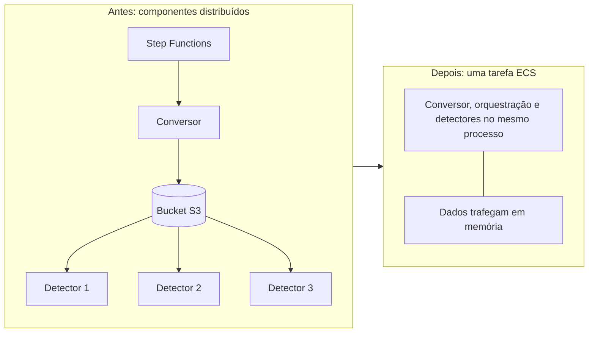

# Prime Video: o serviço que voltou a ser um processo só

Em março de 2023, um engenheiro sênior da Amazon publicou no blog técnico do Prime Video um artigo com um título que parecia erro de digitação: **"Scaling up the Prime Video audio/video monitoring service and reducing costs by 90%"**. O subtítulo tirava a dúvida. *"The move from a distributed microservices architecture to a monolith application helped achieve higher scale, resilience, and reduce costs."*

Uma equipe da Amazon havia desmontado uma arquitetura de microsserviços *serverless* (sem servidor sob gestão da equipe), empacotado tudo num processo único, e cortado mais de 90% do custo de infraestrutura. A internet técnica pegou fogo por semanas.

O artigo é curto e vale ser lido inteiro. O que ele diz é mais interessante do que a briga que provocou.

## O problema: assistir a tudo que os clientes assistem

O Prime Video transmite milhares de canais ao vivo. Para garantir que o cliente recebe o conteúdo em ordem, a empresa montou uma ferramenta que monitora **cada transmissão vista por cada cliente**, procurando defeitos que um algoritmo consegue reconhecer: bloco corrompido, imagem congelada, áudio dessincronizado do vídeo.

A ferramenta existia antes, e o artigo é honesto sobre a origem do problema: *"we never intended nor designed it to run at high scale"*. Ela foi construída para outra escala e a equipe passou a plugar cada vez mais transmissões nela.

O serviço tem três partes. Um conversor de mídia transforma o fluxo de entrada em quadros de imagem e trechos de áudio. Os detectores rodam os algoritmos que procuram os defeitos nesses quadros. E uma camada de orquestração controla o fluxo entre os dois.

## A primeira arquitetura: cada parte no seu quadrado

O desenho inicial fez o que qualquer equipe treinada nos últimos dez anos faria. Componentes distribuídos e *serverless*, orquestrados por AWS Step Functions, detectores rodando em AWS Lambda, quadros de imagem trafegando por um bucket S3 entre uma etapa e outra.

O artigo defende essa escolha, e a defesa importa: *"which was a good choice for building the service quickly"*. Em teoria, cada componente escalaria de forma independente.

Na prática, o teto apareceu cedo. A frase que mais dói do artigo inteiro: *"the way we used some components caused us to hit a hard scaling limit at around 5% of the expected load"*.

Cinco por cento. A arquitetura escolhida para escalar parou a um vinte avos da carga esperada.

## Onde o dinheiro estava indo

A equipe encontrou dois sorvedouros, e nenhum dos dois está no processamento de imagem.

**A orquestração.** O serviço fazia várias transições de estado **por segundo de transmissão**. Isso esbarrou nos limites da conta e, pior, o Step Functions cobra por transição de estado. O custo crescia com a duração do vídeo multiplicada pelo número de fluxos, e não com o trabalho útil de detectar defeito.

**O transporte dos quadros.** Para evitar reconverter o vídeo em cada detector, a equipe fatiava o vídeo em imagens e as depositava temporariamente num *bucket* S3, o repositório de objetos da AWS. Cada detector, rodando como microsserviço separado, baixava as imagens de lá. O artigo aponta o resultado: o volume de chamadas da classe Tier-1, a mais cara na tabela de preços do S3, ficou caro.

Vale reter a natureza dos dois custos. Nenhum deles é custo de computar. São custos de **coordenar** e de **mover dados entre fronteiras** — exatamente o que a distribuição introduz e o que o desenho monolítico não tem.

**Texto alternativo:** à esquerda, a arquitetura anterior, com Step Functions orquestrando um conversor que grava quadros num bucket S3, de onde três detectores separados os baixam. À direita, a arquitetura nova, com conversor, orquestração e detectores no mesmo processo, trocando dados em memória dentro de uma tarefa ECS.

*Figura 1 — As duas arquiteturas do serviço de monitoração do Prime Video. Fonte: curso, a partir do artigo de Marcin Kolny.*

**Leitura textual da figura:** os componentes lógicos são os mesmos nas duas versões. O que muda é a fronteira entre eles. Na primeira, cada fronteira é uma chamada de rede e uma gravação em armazenamento externo, cobrada por transição de estado e por requisição. Na segunda, a mesma fronteira é uma chamada de função dentro do mesmo processo, e o dado nunca sai da memória.

## A decisão

O artigo registra que a equipe primeiro considerou consertar cada problema separadamente, e então mudou de ideia: *"We experimented and took a bold decision: we decided to rearchitect our infrastructure."*

Empacotaram todos os componentes num processo único. Isso eliminou o bucket S3 como armazenamento intermediário, porque a transferência passou a acontecer na memória, e substituiu o Step Functions por uma orquestração interna à instância. A implantação foi para Amazon EC2 e Amazon ECS.

O detalhe que a maior parte dos resumos omite: *"Conceptually, the high-level architecture remained the same."* Os mesmos três componentes continuaram existindo, e muito código foi reaproveitado. A arquitetura **lógica** não mudou. Mudou a arquitetura **física**, isto é, onde ficam as fronteiras de processo.

## O que a equipe pagou por isso

O artigo não esconde a conta. Antes, cada detector era um microsserviço e podia escalar horizontalmente por conta própria. Depois, todos rodam na mesma instância, e o número de detectores passou a escalar **verticalmente**.

A equipe adiciona detectores com frequência, e já estourou a capacidade de uma instância. A solução foi clonar o serviço várias vezes, cada cópia parametrizada com um subconjunto diferente de detectores, e escrever uma camada leve de orquestração para distribuir as requisições entre as cópias.

Ou seja: voltaram a distribuir, numa granularidade muito maior e sob controle próprio. Não é um retorno ao monólito de 1998. É uma correção do **tamanho da unidade de distribuição**.

Há ainda uma decisão contraintuitiva que o artigo faz questão de registrar. A equipe **replicou** o processo caro de conversão de mídia, colocando uma cópia perto de cada detector. Rodar a conversão uma vez e guardar o resultado parecia mais barato, e medindo não era.

## O resultado, e a frase que ninguém citou

Mais de 90% de redução no custo de infraestrutura. Capacidade de processar milhares de transmissões, com folga para crescer. E a possibilidade de usar planos de economia de EC2, que derrubam o custo mais um pouco.

A conclusão dos autores é bem menos dramática do que a repercussão: *"Microservices and serverless components are tools that do work at high scale, but whether to use them over monolith has to be made on a case-by-case basis."* Em português: microsserviços e componentes sem servidor funcionam em grande escala, e a escolha entre eles e o monólito precisa ser feita caso a caso.

O escopo do artigo é **um** serviço de **uma** equipe dentro do Prime Video. A conclusão nunca é estendida ao Prime Video inteiro, e o texto se recusa a eleger um vencedor entre os estilos. Metade da polêmica de 2023 foi discussão sobre um artigo que os participantes não tinham lido.

## Questões para discussão

Releia o caso com a lente do arquiteto. As questões abaixo pedem recuperar os fatos, explicar os mecanismos e comparar as escolhas descritas no próprio caso.

**1.** O serviço de monitoração tem três componentes. Nomeie os três e descreva a função de cada um.

**2.** O artigo identifica dois sorvedouros de custo, e nenhum deles é o processamento de imagem. Diga quais são e explique, em cada caso, com o que o custo crescia.

**3.** A arquitetura travou em torno de 5% da carga esperada. Explique o mecanismo pelo qual a orquestração por transição de estado impôs esse teto.

**4.** Compare o caminho de um quadro de imagem, da conversão até o detector, nas duas arquiteturas. Diga o que deixa de existir na segunda.

**5.** O artigo afirma que a arquitetura conceitual permaneceu a mesma. Compare o que mudou com o que ficou igual, e explique o que essa distinção revela sobre decomposição lógica e fronteira de processo.

## Fontes

- Marcin Kolny, **Scaling up the Prime Video audio/video monitoring service and reducing costs by 90%** — Prime Video Tech, 22 de março de 2023. Fonte primária de todas as citações e números. A Amazon retirou a página original do ar; use a [cópia arquivada](https://web.archive.org/web/20240805183535/https://www.primevideotech.com/video-streaming/scaling-up-the-prime-video-audio-video-monitoring-service-and-reducing-costs-by-90).
- AWS, [Step Functions — preços](https://aws.amazon.com/step-functions/pricing/) e [Amazon S3 — preços](https://aws.amazon.com/s3/pricing/) — o modelo de cobrança por transição de estado e por requisição, que explica os dois sorvedouros descritos no caso.
- Amazon ECS, [documentação oficial](https://docs.aws.amazon.com/AmazonECS/latest/developerguide/Welcome.html) — a unidade de implantação para onde o serviço foi movido.
- Adrian Cockcroft, [So Many Bad Takes — What Is There To Learn From The Prime Video Microservices To Monolith Story](https://adrianco.medium.com/so-many-bad-takes-what-is-there-to-learn-from-the-prime-video-microservices-to-monolith-story-4bd0970423d4) — leitura de quem dirigiu a arquitetura de nuvem da Netflix e depois trabalhou na AWS, útil para separar o que o artigo diz do que a repercussão inventou.
