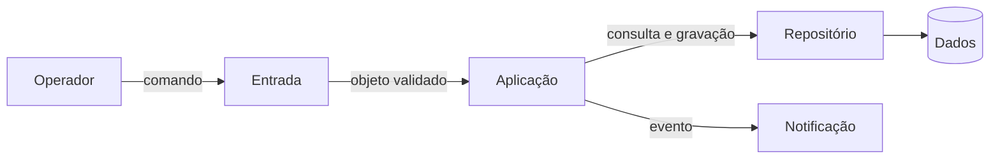
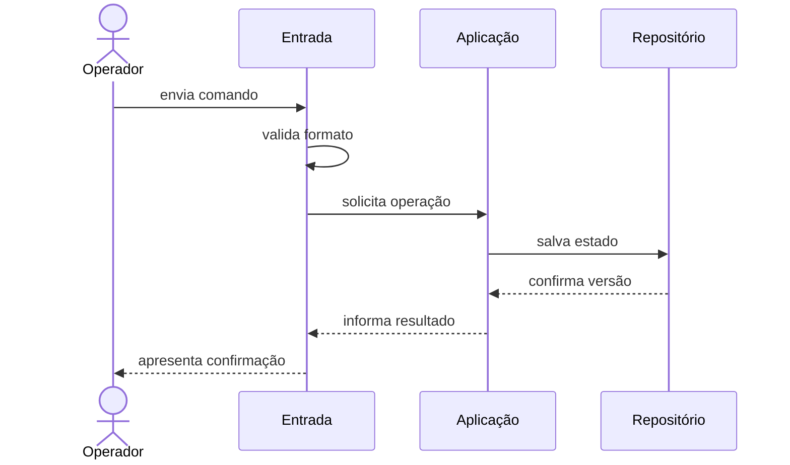
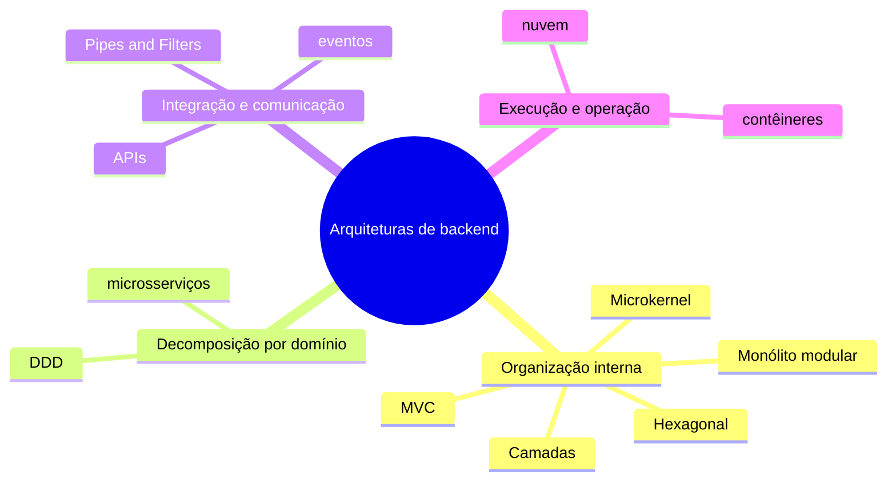

# Conceitos: estrutura, decisões e atributos

## O que torna uma decisão arquitetural

Arquitetura de software reúne estruturas, decisões e racional para compreender e evoluir um sistema. Uma decisão é arquitetural quando afeta interesses importantes, restringe escolhas posteriores ou custa caro reverter. A fronteira entre módulos costuma ser arquitetural; o nome de uma variável, não.

Arquitetura não é só um diagrama inicial: está no código, na implantação, nos dados e nas relações de trabalho. Também não é toda decisão técnica. O [glossário](../referencia/glossario.md) mantém definições comuns.

Uma descrição arquitetural responde ao menos a quatro perguntas:

- quais elementos relevantes existem;
- quais responsabilidades e fronteiras cada elemento possui;
- por quais mecanismos os elementos colaboram;
- por que essa organização atende melhor às forças priorizadas do que as alternativas consideradas.

## Componente, conector e configuração

Um **componente** é uma unidade com responsabilidade identificável: módulo, serviço, processo, banco ou fila. Um **conector** representa uma interação, como chamada, HTTP, mensagem ou acesso a dados. A **configuração** reúne componentes, conectores e restrições de dependência.

Observe um exemplo genérico de processamento de pedidos, ainda sem escolher tecnologia:

**Texto alternativo:** fluxo de processamento em que o Operador envia um comando à Entrada, que o encaminha à Aplicação; a Aplicação usa o Repositório e Notificação, e o Repositório mantém os Dados.

*Figura 1 — Componentes e conectores de um processamento de pedidos. Fonte: curso.*

**Leitura textual da figura:** o Operador envia um comando à Entrada. A Entrada encaminha o objeto validado à Aplicação, que consulta ou grava pelo Repositório, emite um evento para Notificação e mantém os Dados atrás desse conector. A figura separa os componentes e nomeia o tipo de interação entre eles.

O desenho ainda exige restrições: quem pode acessar `Dados`, onde está a regra e como erros atravessam fronteiras. Sem essa semântica, permite interpretações incompatíveis.

Também nomeie a visão: módulos mostram dependências de código; execução, comunicação entre processos; implantação, ambientes computacionais. Misturá-las esconde decisões.

## Estrutura e comportamento se complementam

A estrutura mostra o que pode se relacionar; um cenário de comportamento mostra o que acontece durante uma interação. Uma sequência revela ordem, dados trocados, decisões e falhas que uma visão estática não evidencia.

**Texto alternativo:** sequência em que o Operador envia um comando, a Entrada valida e chama a Aplicação, que persiste pelo Repositório e devolve a confirmação pelo caminho inverso.

*Figura 2 — Sequência de uma operação com validação e persistência. Fonte: curso.*

**Leitura textual da figura:** o Operador envia um comando à Entrada, que valida o formato e solicita a operação à Aplicação. A Aplicação salva o estado no Repositório, recebe a confirmação de versão e devolve o resultado no caminho inverso até o Operador. A ordem explícita mostra onde uma indisponibilidade de persistência pode alterar o cenário.

Se a persistência falhar, a sequência deve declarar falha, espera ou repetição. Essa escolha afeta confiabilidade, latência e consistência; comportamento testa se a estrutura sustenta o cenário.

## Decisões, restrições e premissas

Uma decisão escolhe uma alternativa e aceita consequências. **Restrição** limita opções, como executar localmente; **premissa** é condição a revisar, como esperar cinquenta operações por segundo. Confundi-las fragiliza a arquitetura.

Decisões úteis registram contexto, forças, alternativas, escolha, consequências e evidências. “Usar Python” não basta; um monólito modular pode justificar implantação simples e revisão quando houver escala independente demonstrada.

O código não explica alternativas rejeitadas; por isso o ADR o complementa. Structurizr Lite versiona modelos; pytest verifica comportamento; ArchUnit e NetArchTest verificam dependências. Ferramentas produzem evidência, não decidem pelo grupo.

## Atributos de qualidade como cenários

Um **atributo de qualidade** descreve comportamento além da função principal. Modificabilidade, desempenho, disponibilidade, segurança, testabilidade e observabilidade são exemplos. “Ter desempenho” sem carga, ambiente e medida é ambíguo.

Use [fonte, estímulo, ambiente, artefato, resposta e medida](../referencia/atributos-de-qualidade.md). Um cenário de modificabilidade pode limitar a alteração ao módulo de regras e a suíte a cinco minutos; throughput define lote, volume e itens por segundo.

Atributos entram em tensão. Mais isolamento pode acrescentar comunicação e operação. Uma otimização de throughput pode reduzir a clareza. Consistência imediata pode diminuir disponibilidade durante uma partição. Arquitetar é explicitar esses compromissos, não prometer maximizar tudo.

## Estilo arquitetural

Um **estilo arquitetural** nomeia organizações com elementos, conectores e restrições comuns. Oferece vocabulário, não receita: duas soluções em camadas podem ter tecnologias distintas e ainda restringir dependências por responsabilidade.

## Um mapa antes da escolha

Antes de comparar implementações, localize o problema. O mapa não é sequência de evolução nem lista de tecnologias; evita usar microsserviços para uma regra local ou Kubernetes para uma fronteira ainda desconhecida.

**Texto alternativo:** mapa mental que agrupa arquiteturas de backend em organização interna, decomposição por domínio, integração e comunicação, e execução e operação.

*Figura 3 — Quatro famílias de decisões para arquiteturas de backend. Fonte: curso.*

**Leitura textual da figura:** o mapa organiza onze termos em quatro perguntas. Organização interna reúne Camadas, MVC, Hexagonal, Microkernel e Monólito modular; decomposição por domínio reúne DDD e microsserviços; integração e comunicação reúne Pipes and Filters, APIs e eventos; execução e operação reúne nuvem e contêineres. Um termo pode influenciar outro, mas cada família responde primeiro a uma pergunta distinta.

| Família | Pergunta que vem antes da tecnologia | Termos do mapa | Quando aprofundaremos |
| --- | --- | --- | --- |
| Organização interna | Como responsabilidades colaboram dentro de uma aplicação? | Camadas, MVC, Hexagonal, Microkernel, Monólito modular | Nesta unidade |
| Decomposição por domínio | Onde termina um modelo de negócio e começa outro? | DDD, microsserviços | Unidade 3 |
| Integração e comunicação | Qual contrato transporta uma intenção ou um fato entre fronteiras? | Pipes and Filters, APIs, eventos | Unidades 2 e 5 |
| Execução e operação | Onde a solução roda e como é recuperada ou escalada? | nuvem, contêineres | Unidade 6 |

**Camadas** distribui responsabilidades; **MVC** organiza controller, model e view no ciclo HTTP. **Hexagonal** protege regras por portas e adaptadores. **Microkernel** combina núcleo estável e extensões. **Monólito modular** mantém uma implantação com fronteiras explícitas.

**DDD** (*Domain-Driven Design*) modela regras na linguagem do negócio e delimita contextos; não é microsserviços. **Microsserviços** têm implantação independente e custos distribuídos. **APIs** são contratos de chamada; **eventos**, fatos para reações independentes. **Nuvem** oferece capacidade sob demanda; **contêineres** empacotam processos portáveis.

O mapa não é escada de maturidade: um monólito modular pode usar APIs, faturamento pode usar Pipes and Filters e nuvem pode ter um processo. Decida por forças e evidências, não pelo nome.

*Figura 4 — Mapa comparativo de estilos arquiteturais. Fonte: curso.*

**Leitura textual da figura:** o mapa coloca quatro organizações lado a lado. Camadas separam responsabilidades por nível; pipes e filtros encadeiam transformações; microkernel mantém um núcleo e extensões; e monólito modular isola capacidades dentro de uma implantação. As forças na base lembram que a escolha compara modificabilidade, vazão e extensibilidade, em vez de eleger um estilo universalmente superior.

## Comparar, não eleger um vencedor universal

Camadas organizam níveis; Pipes and Filters, transformações; Microkernel, extensões; Monólito modular, capacidades numa implantação. Eles podem ser combinados. Compare forças, limites, premissas e evidências antes de escolher.
