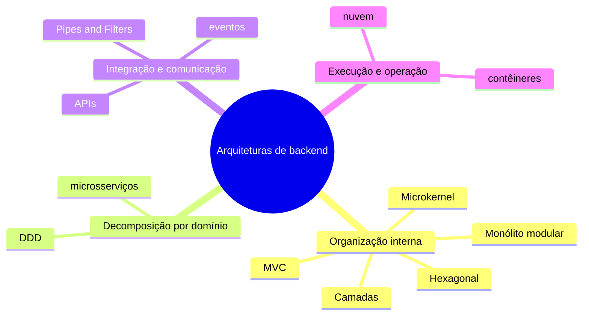

# Conceitos: estilos arquiteturais

Para o vocabulário de leitura de diagramas, decisões, restrições e cenários, consulte [Como ler uma arquitetura](../referencia/como-ler-uma-arquitetura.md). Esta unidade começa pela comparação de estilos.

## Estilos arquiteturais

Um **estilo arquitetural** nomeia organizações com elementos, conectores e restrições comuns. Oferece vocabulário, não receita: duas soluções em camadas podem ter tecnologias distintas e ainda restringir dependências por responsabilidade.

## Um mapa antes da escolha

Antes de comparar implementações, localize o problema. O mapa não é sequência de evolução nem lista de tecnologias; evita usar microsserviços para uma regra local ou Kubernetes para uma fronteira ainda desconhecida.

**Texto alternativo:** mapa mental que agrupa arquiteturas de backend em organização interna, decomposição por domínio, integração e comunicação, e execução e operação.

*Figura 1 — Quatro famílias de decisões para arquiteturas de backend. Fonte: curso.*

**Leitura textual da figura:** o mapa organiza onze termos em quatro perguntas. Organização interna reúne Camadas, MVC, Hexagonal, Microkernel e Monólito modular; decomposição por domínio reúne DDD e microsserviços; integração e comunicação reúne Pipes and Filters, APIs e eventos; execução e operação reúne nuvem e contêineres. Um termo pode influenciar outro, mas cada família responde primeiro a uma pergunta distinta.

| Família | Pergunta que vem antes da tecnologia | Termos do mapa | Quando aprofundaremos |
| --- | --- | --- | --- |
| Organização interna | Como responsabilidades colaboram dentro de uma aplicação? | Camadas, MVC, Hexagonal, Microkernel, Monólito modular | Nesta unidade |
| Decomposição por domínio | Onde termina um modelo de negócio e começa outro? | DDD, microsserviços | Unidade 3 |
| Integração e comunicação | Qual contrato transporta uma intenção ou um fato entre fronteiras? | Pipes and Filters, APIs, eventos | Unidades 2 e 5 |
| Execução e operação | Onde a solução roda e como é recuperada ou escalada? | nuvem, contêineres | Unidade 6 |

**Camadas** distribui responsabilidades; **MVC** organiza controller, model e view no ciclo HTTP. **Hexagonal** protege regras por portas e adaptadores. **Microkernel** combina núcleo estável e extensões. **Monólito modular** mantém uma implantação com fronteiras explícitas.

**DDD** (*Domain-Driven Design*) modela regras na linguagem do negócio e delimita contextos; não é microsserviços. **Microsserviços** têm implantação independente e custos distribuídos. **APIs** são contratos de chamada; **eventos**, fatos para reações independentes. **Nuvem** oferece capacidade sob demanda; **contêineres** empacotam processos portáveis.

O mapa não é escada de maturidade: um monólito modular pode usar APIs, faturamento pode usar Pipes and Filters e nuvem pode ter um processo. Decida por forças e evidências, não pelo nome.

*Figura 2 — Mapa comparativo de estilos arquiteturais. Fonte: curso.*

**Leitura textual da figura:** o mapa coloca quatro organizações lado a lado. Camadas separam responsabilidades por nível; pipes e filtros encadeiam transformações; microkernel mantém um núcleo e extensões; e monólito modular isola capacidades dentro de uma implantação. As forças na base lembram que a escolha compara modificabilidade, vazão e extensibilidade, em vez de eleger um estilo universalmente superior.

## Comparar, não eleger um vencedor universal

Camadas organizam níveis; Pipes and Filters, transformações; Microkernel, extensões; Monólito modular, capacidades numa implantação. Eles podem ser combinados. Compare forças, limites, premissas e evidências antes de escolher.
