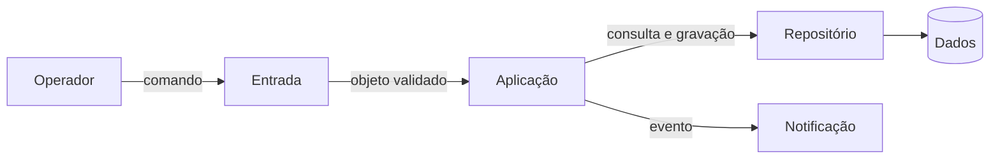
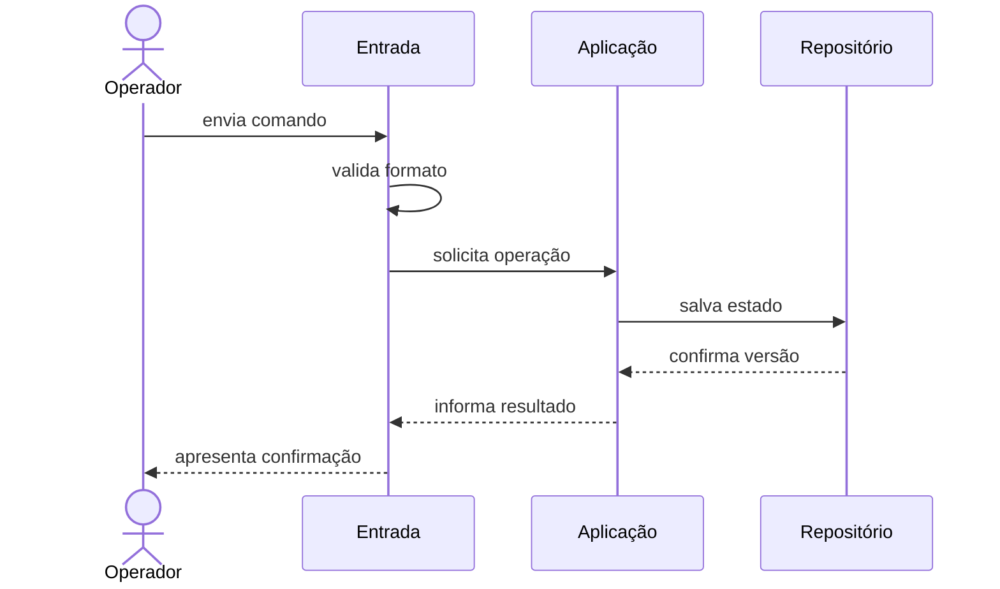

# Conceitos: estrutura, decisões e atributos

## O que torna uma decisão arquitetural

Arquitetura de software é o conjunto de estruturas necessárias para compreender e evoluir um sistema, acompanhado das decisões e do racional que explicam essas estruturas. Uma decisão é arquitetural quando afeta interesses importantes, restringe muitas decisões posteriores ou tem alto custo de reversão. A escolha da fronteira entre módulos costuma ser arquitetural; o nome de uma variável, em geral, não é.

Essa definição evita dois extremos. Arquitetura não é somente um diagrama feito no início, pois estruturas existem no código, na implantação, nos dados e nas relações de trabalho. Também não é toda decisão técnica: se tudo for arquitetura, deixa de existir foco sobre escolhas significativas. O [glossário](../referencia/glossario.md) mantém as definições comuns usadas ao longo da disciplina.

Uma descrição arquitetural responde ao menos a quatro perguntas:

- quais elementos relevantes existem;
- quais responsabilidades e fronteiras cada elemento possui;
- por quais mecanismos os elementos colaboram;
- por que essa organização atende melhor às forças priorizadas do que as alternativas consideradas.

## Componente, conector e configuração

Um **componente** é uma unidade relevante de computação ou armazenamento com responsabilidade identificável: módulo, serviço, processo, banco ou fila podem exercer esse papel conforme a visão adotada. Um **conector** representa a interação: chamada de função, requisição HTTP, mensagem, acesso a dados ou fluxo por arquivo. A **configuração** é o arranjo formado pelos componentes e conectores, inclusive restrições sobre quem pode depender de quem.

Observe um exemplo genérico de processamento de pedidos, ainda sem escolher tecnologia:

O desenho apresenta componentes e conectores, mas ainda não basta. É necessário declarar se `Entrada` pode acessar `Dados` diretamente, qual elemento possui a regra e como erros atravessam as fronteiras. Arquitetura inclui essas restrições. Um desenho sem semântica permite interpretações incompatíveis.

Também é preciso nomear a visão. Na visão de módulos, uma caixa pode ser um pacote de código e uma seta pode significar dependência. Na visão de execução, uma caixa pode ser um processo e uma seta, comunicação em tempo de execução. Na visão de implantação, nós representam ambientes computacionais. Misturar tudo em um único desenho costuma esconder decisões.

## Estrutura e comportamento se complementam

A estrutura mostra o que pode se relacionar; um cenário de comportamento mostra o que acontece durante uma interação. Uma sequência revela ordem, dados trocados, decisões e falhas que uma visão estática não evidencia.

Se a persistência ficar indisponível, a sequência deve explicitar se a operação falha, espera ou tenta novamente. Essa escolha influencia confiabilidade, latência e consistência. Portanto, comportamento não é detalhe posterior: ajuda a testar se a estrutura sustenta os cenários relevantes.

## Decisões, restrições e premissas

Uma decisão escolhe uma alternativa e aceita consequências. Uma **restrição** limita o espaço de opções, como executar localmente ou integrar um sistema que só oferece arquivo. Uma **premissa** é uma condição considerada verdadeira, mas que precisa ser revista, como esperar até cinquenta operações por segundo. Confundir premissa com fato torna a arquitetura frágil.

Decisões arquiteturais úteis registram contexto, forças, alternativas, escolha, consequências e evidências. “Usar Python” não contém racional suficiente. “Adotar um monólito modular para preservar uma implantação simples, mantendo módulos verificáveis por testes de dependência; revisar se a necessidade de escala independente for demonstrada” é uma decisão discutível e revisável.

O código materializa parte da decisão, mas não explica todas as alternativas rejeitadas. Por isso o ADR complementa o repositório. Ferramentas como Structurizr Lite tornam modelos versionáveis; pytest verifica comportamento; ArchUnit em Java e NetArchTest em .NET verificam regras de dependência. Nenhuma ferramenta decide pelo grupo: elas produzem evidência sobre hipóteses explícitas.

## Atributos de qualidade como cenários

Um **atributo de qualidade** descreve como o sistema deve se comportar diante de uma condição, para além da função principal. Modificabilidade, desempenho, disponibilidade, segurança, testabilidade e observabilidade são exemplos. O nome isolado é ambíguo. “O sistema deve ter desempenho” não informa carga, operação, ambiente nem medida.

Use a forma apresentada em [atributos de qualidade](../referencia/atributos-de-qualidade.md): fonte do estímulo, estímulo, ambiente, artefato afetado, resposta e medida. Um cenário de modificabilidade pode dizer: “quando uma equipe inclui uma nova regra em horário de desenvolvimento, somente o módulo de regras deve ser alterado, com a suíte concluída em até cinco minutos”. Um cenário de throughput pode definir lote, volume e itens processados por segundo.

Atributos entram em tensão. Mais isolamento pode acrescentar comunicação e operação. Uma otimização de throughput pode reduzir a clareza. Consistência imediata pode diminuir disponibilidade durante uma partição. Arquitetar é explicitar esses compromissos, não prometer maximizar tudo.

## Estilo arquitetural

Um **estilo arquitetural** nomeia uma família de organizações que compartilham tipos de elementos, conectores e restrições. Ele oferece vocabulário e propriedades esperadas, não uma receita completa. Duas soluções em camadas podem ter tecnologias e fronteiras distintas; ainda assim, ambas restringem dependências por níveis de responsabilidade.

### Camadas

O estilo em camadas agrupa responsabilidades por nível de abstração. Uma divisão frequente contém apresentação, aplicação, domínio e infraestrutura. A regra essencial é a direção de dependência declarada. Se a apresentação acessa o banco por atalhos, o desenho mantém caixas, mas a propriedade arquitetural desaparece.

Forças favorecidas incluem separação de responsabilidades, testabilidade e modificabilidade localizada. Limites incluem travessias desnecessárias, objetos que atravessam todos os níveis sem significado e dependências indiretas difíceis de perceber. Evidências possíveis são testes do domínio sem infraestrutura e verificações automatizadas entre pacotes.

### Pipes and filters

Em **pipes and filters**, filtros transformam entradas em saídas e pipes transportam os resultados entre etapas. Compiladores, processamento de mídia, importação de dados e pipelines analíticos são exemplos. Filtros independentes permitem composição, paralelismo e processamento incremental.

O estilo exige contratos claros para o dado que flui. Estado compartilhado e dependências entre etapas reduzem a capacidade de recompor o pipeline. As falhas precisam carregar identidade e contexto para diagnóstico. Throughput pode ser observado por itens processados por unidade de tempo; correção, por exemplos conhecidos que atravessam cada filtro.

### Microkernel

O **microkernel**, também chamado arquitetura de plugins, mantém capacidades essenciais em um núcleo e adiciona variações por extensões conectadas a contratos estáveis. Editores, plataformas de desenvolvimento e mecanismos de regras extensíveis usam essa organização.

Ele favorece modificabilidade e extensibilidade quando muitas variações podem ser isoladas. Seu custo aparece no desenho do contrato, no ciclo de vida dos plugins, na compatibilidade e na depuração. Um núcleo que conhece detalhes de toda extensão não é realmente mínimo. Uma evidência forte é incluir um plugin sem alterar o núcleo e executar a solução com outra extensão desabilitada.

### Monólito modular

Um **monólito modular** é implantado como uma unidade, mas dividido internamente por capacidades com interfaces explícitas. Monólito descreve a unidade de implantação; modular descreve a organização interna. O estilo pode combinar simplicidade operacional, transações locais e limites compreensíveis.

O principal risco é a erosão: consultas diretas às tabelas de outro módulo, imports indiscriminados e um modelo compartilhado crescente. Fronteiras precisam ser observadas por revisão e testes de arquitetura. Escala independente e isolamento de falhas são mais limitados porque os módulos vivem no mesmo processo.

## Comparar, não eleger um vencedor universal

Camadas organizam níveis de responsabilidade. Pipes and filters organizam transformações. Microkernel organiza um núcleo estável e extensões. Monólito modular organiza capacidades dentro de uma implantação. Eles respondem a problemas diferentes e podem aparecer combinados: um monólito modular pode usar camadas dentro de cada módulo e um pipeline em uma capacidade específica.

A comparação responsável mantém as mesmas forças para todas as alternativas. Pergunte o que o estilo facilita, o que dificulta, qual premissa sustenta a avaliação e que evidência reduziria a incerteza. A próxima página separa esses estilos de padrões menores e das tecnologias que os implementam.
