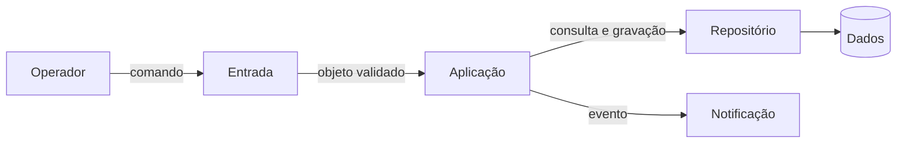
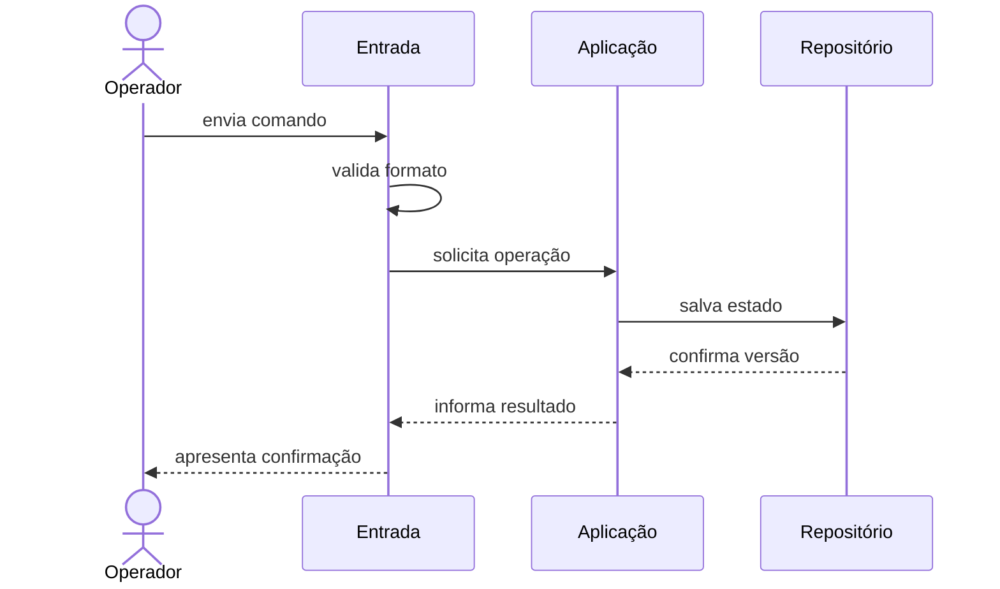
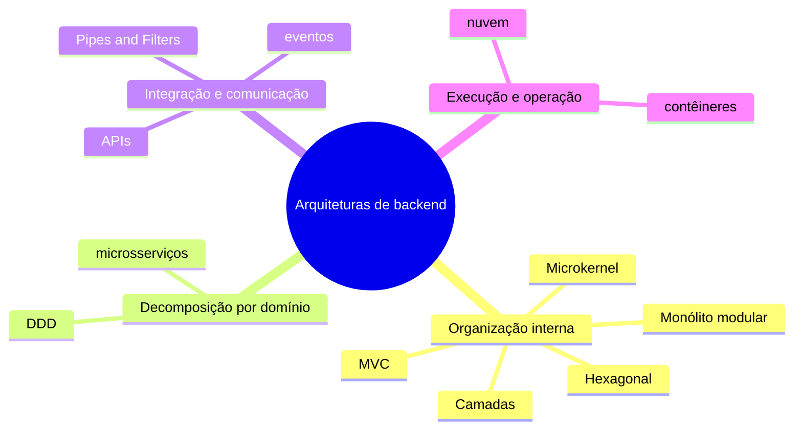
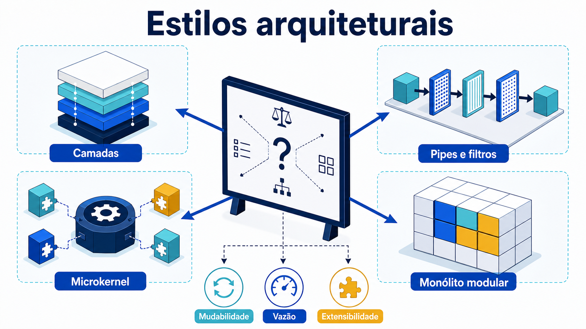

# Conceitos: estrutura, decisões e atributos

## O que torna uma decisão arquitetural

Arquitetura de software é o conjunto de estruturas necessárias para compreender e evoluir um sistema, acompanhado das decisões e do racional que explicam essas estruturas. Uma decisão é arquitetural quando afeta interesses importantes, restringe muitas decisões posteriores ou tem alto custo de reversão. A escolha da fronteira entre módulos costuma ser arquitetural; o nome de uma variável, em geral, não é.

Essa definição evita dois extremos. Arquitetura não é somente um diagrama feito no início, pois estruturas existem no código, na implantação, nos dados e nas relações de trabalho. Também não é toda decisão técnica: se tudo for arquitetura, deixa de existir foco sobre escolhas significativas. O [glossário](../referencia/glossario.md) mantém as definições comuns usadas ao longo da disciplina.

Uma descrição arquitetural responde ao menos a quatro perguntas:

- quais elementos relevantes existem;
- quais responsabilidades e fronteiras cada elemento possui;
- por quais mecanismos os elementos colaboram;
- por que essa organização atende melhor às forças priorizadas do que as alternativas consideradas.

## Componente, conector e configuração

Um **componente** é uma unidade relevante de computação ou armazenamento com responsabilidade identificável: módulo, serviço, processo, banco ou fila podem exercer esse papel conforme a visão adotada. Um **conector** representa a interação: chamada de função, requisição HTTP, mensagem, acesso a dados ou fluxo por arquivo. A **configuração** é o arranjo formado pelos componentes e conectores, inclusive restrições sobre quem pode depender de quem.

Observe um exemplo genérico de processamento de pedidos, ainda sem escolher tecnologia:

**Leitura textual da figura:** o Operador envia um comando à Entrada. A Entrada encaminha o objeto validado à Aplicação, que consulta ou grava pelo Repositório, emite um evento para Notificação e mantém os Dados atrás desse conector. A figura separa os componentes e nomeia o tipo de interação entre eles.

O desenho apresenta componentes e conectores, mas ainda não basta. É necessário declarar se `Entrada` pode acessar `Dados` diretamente, qual elemento possui a regra e como erros atravessam as fronteiras. Arquitetura inclui essas restrições. Um desenho sem semântica permite interpretações incompatíveis.

Também é preciso nomear a visão. Na visão de módulos, uma caixa pode ser um pacote de código e uma seta pode significar dependência. Na visão de execução, uma caixa pode ser um processo e uma seta, comunicação em tempo de execução. Na visão de implantação, nós representam ambientes computacionais. Misturar tudo em um único desenho costuma esconder decisões.

## Estrutura e comportamento se complementam

A estrutura mostra o que pode se relacionar; um cenário de comportamento mostra o que acontece durante uma interação. Uma sequência revela ordem, dados trocados, decisões e falhas que uma visão estática não evidencia.

**Leitura textual da figura:** o Operador envia um comando à Entrada, que valida o formato e solicita a operação à Aplicação. A Aplicação salva o estado no Repositório, recebe a confirmação de versão e devolve o resultado no caminho inverso até o Operador. A ordem explícita mostra onde uma indisponibilidade de persistência pode alterar o cenário.

Se a persistência ficar indisponível, a sequência deve explicitar se a operação falha, espera ou tenta novamente. Essa escolha influencia confiabilidade, latência e consistência. Portanto, comportamento não é detalhe posterior: ajuda a testar se a estrutura sustenta os cenários relevantes.

## Decisões, restrições e premissas

Uma decisão escolhe uma alternativa e aceita consequências. Uma **restrição** limita o espaço de opções, como executar localmente ou integrar um sistema que só oferece arquivo. Uma **premissa** é uma condição considerada verdadeira, mas que precisa ser revista, como esperar até cinquenta operações por segundo. Confundir premissa com fato torna a arquitetura frágil.

Decisões arquiteturais úteis registram contexto, forças, alternativas, escolha, consequências e evidências. “Usar Python” não contém racional suficiente. “Adotar um monólito modular para preservar uma implantação simples, mantendo módulos verificáveis por testes de dependência; revisar se a necessidade de escala independente for demonstrada” é uma decisão discutível e revisável.

O código materializa parte da decisão, mas não explica todas as alternativas rejeitadas. Por isso o ADR complementa o repositório. Ferramentas como Structurizr Lite tornam modelos versionáveis; pytest verifica comportamento; ArchUnit em Java e NetArchTest em .NET verificam regras de dependência. Nenhuma ferramenta decide pelo grupo: elas produzem evidência sobre hipóteses explícitas.

## Atributos de qualidade como cenários

Um **atributo de qualidade** descreve como o sistema deve se comportar diante de uma condição, para além da função principal. Modificabilidade, desempenho, disponibilidade, segurança, testabilidade e observabilidade são exemplos. O nome isolado é ambíguo. “O sistema deve ter desempenho” não informa carga, operação, ambiente nem medida.

Use a forma apresentada em [atributos de qualidade](../referencia/atributos-de-qualidade.md): fonte do estímulo, estímulo, ambiente, artefato afetado, resposta e medida. Um cenário de modificabilidade pode dizer: “quando uma equipe inclui uma nova regra em horário de desenvolvimento, somente o módulo de regras deve ser alterado, com a suíte concluída em até cinco minutos”. Um cenário de throughput pode definir lote, volume e itens processados por segundo.

Atributos entram em tensão. Mais isolamento pode acrescentar comunicação e operação. Uma otimização de throughput pode reduzir a clareza. Consistência imediata pode diminuir disponibilidade durante uma partição. Arquitetar é explicitar esses compromissos, não prometer maximizar tudo.

## Estilo arquitetural

Um **estilo arquitetural** nomeia uma família de organizações que compartilham tipos de elementos, conectores e restrições. Ele oferece vocabulário e propriedades esperadas, não uma receita completa. Duas soluções em camadas podem ter tecnologias e fronteiras distintas; ainda assim, ambas restringem dependências por níveis de responsabilidade.

## Um mapa antes da escolha

Antes de comparar implementações, localize o problema arquitetural. O mapa abaixo não é uma sequência obrigatória de evolução nem uma lista de tecnologias a adotar. Ele evita, por exemplo, usar microsserviços para resolver uma regra que muda por unidade, ou chamar Kubernetes para resolver uma fronteira de domínio ainda desconhecida.

**Leitura textual da figura:** o mapa organiza onze termos em quatro perguntas. Organização interna reúne Camadas, MVC, Hexagonal, Microkernel e Monólito modular; decomposição por domínio reúne DDD e microsserviços; integração e comunicação reúne Pipes and Filters, APIs e eventos; execução e operação reúne nuvem e contêineres. Um termo pode influenciar outro, mas cada família responde primeiro a uma pergunta distinta.

| Família | Pergunta que vem antes da tecnologia | Termos do mapa | Quando aprofundaremos |
| --- | --- | --- | --- |
| Organização interna | Como responsabilidades colaboram dentro de uma aplicação? | Camadas, MVC, Hexagonal, Microkernel, Monólito modular | Nesta unidade |
| Decomposição por domínio | Onde termina um modelo de negócio e começa outro? | DDD, microsserviços | Unidade 3 |
| Integração e comunicação | Qual contrato transporta uma intenção ou um fato entre fronteiras? | Pipes and Filters, APIs, eventos | Unidades 2 e 5 |
| Execução e operação | Onde a solução roda e como é recuperada ou escalada? | nuvem, contêineres | Unidade 6 |

**Camadas** distribui responsabilidades por níveis; **MVC** é uma organização voltada ao ciclo HTTP, em que controller coordena a requisição, model concentra regras e view forma a resposta. **Hexagonal** protege o núcleo de regras por portas (interfaces definidas pelo núcleo) e adaptadores para banco, fila ou interface. **Microkernel** organiza um núcleo estável e extensões. **Monólito modular** conserva uma unidade de implantação, mas exige fronteiras explícitas entre capacidades.

**DDD** (*Domain-Driven Design*) é uma abordagem para modelar regras com a linguagem do negócio e delimitar contextos onde um modelo faz sentido; não é sinônimo de microsserviços. **Microsserviços** são unidades de implantação e operação independentes, com custos de comunicação, observabilidade e consistência distribuída. **APIs** são contratos explícitos para chamadas entre fronteiras. **Eventos** comunicam fatos ocorridos para consumidores que podem reagir em ritmos próprios. **Nuvem** fornece capacidade computacional e serviços sob demanda; **contêineres** empacotam processos e dependências de forma portável. Estes últimos termos serão retomados quando os problemas que resolvem estiverem concretos.

O cuidado central para quem começa é não transformar o mapa em uma escada de maturidade. Um sistema pode continuar como monólito modular e usar APIs externas; uma capacidade de faturamento pode conter Pipes and Filters; e uma arquitetura em nuvem pode ter um único processo. A decisão precisa partir de forças e evidências, não do prestígio do nome.

*Figura 2 — Mapa comparativo de estilos arquiteturais. Fonte: curso.*

**Leitura textual da figura:** o mapa coloca quatro organizações lado a lado. Camadas separam responsabilidades por nível; pipes e filtros encadeiam transformações; microkernel mantém um núcleo e extensões; e monólito modular isola capacidades dentro de uma implantação. As forças na base lembram que a escolha compara modificabilidade, vazão e extensibilidade, em vez de eleger um estilo universalmente superior.

## Comparar, não eleger um vencedor universal

Camadas organizam níveis; Pipes and Filters, transformações; Microkernel, extensões; Monólito modular, capacidades numa implantação. Eles podem ser combinados. Compare forças, limites, premissas e evidências antes de escolher.
