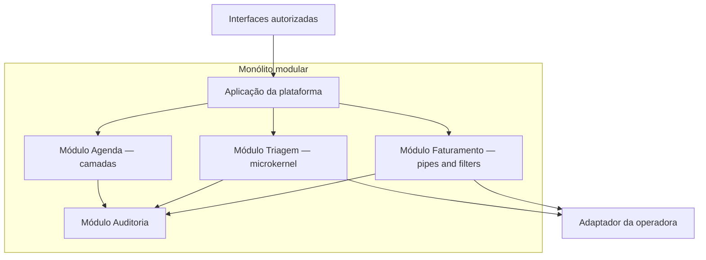
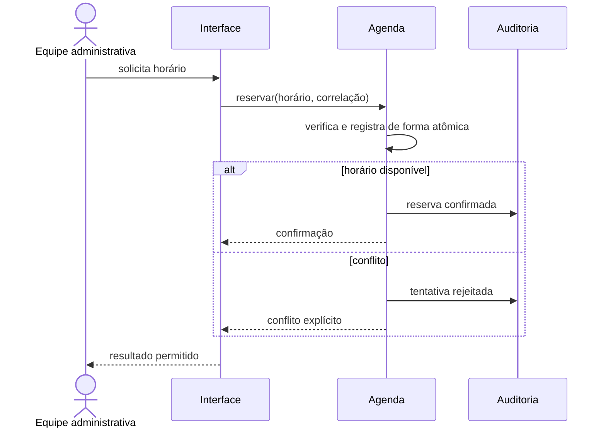

# Estudo de caso: plataforma hospitalar

## Delimitação do caso

O [contexto hospitalar compartilhado](../projeto-integrador/contexto-hospitalar.md) descreve uma operação administrativa simplificada. A plataforma coordena cadastro, agenda, elegibilidade, autorização, exames, faturamento, notificações e auditoria. Não recomenda tratamento nem interpreta resultados. Informações sensíveis devem circular com autorização, significado e rastreabilidade.

Antes de escolher estruturas, separe capacidades e ritmos de mudança. Agenda recebe muitas interações curtas e precisa evitar conflitos. Triagem administrativa reúne dados necessários para encaminhar a jornada e pode variar conforme unidade. Faturamento consolida registros de origens distintas, valida, transforma e encaminha lotes. As três capacidades pertencem à mesma plataforma, mas suas forças não são idênticas.

## Cenários prioritários

Para a **agenda**, formulamos: quando duas solicitações concorrentes tentarem reservar o mesmo horário em operação normal, apenas uma confirmação deve ser registrada e a outra deve receber resposta explícita; regras de remarcação devem mudar em um único módulo.

Para a **triagem administrativa**, formulamos: quando uma unidade adotar uma nova etapa de coleta, em período de evolução, a equipe deve incluí-la sem alterar o núcleo de identificação, autorização e auditoria; os testes das extensões devem continuar isolados.

Para o **faturamento**, formulamos: ao receber um lote de dez mil registros, o fluxo deve validar, normalizar, correlacionar e produzir a saída com identificação de rejeições por etapa; a medição deve informar itens por segundo e quantidade de rejeições.

Esses cenários não são compromissos definitivos de produção. São hipóteses iniciais que tornam as alternativas comparáveis. A turma pode ajustar valores, desde que preserve fonte, estímulo, ambiente, resposta e medida.

## Matriz de estilos por capacidade

| Estilo | Agenda | Triagem administrativa | Faturamento | Limite relevante |
| --- | --- | --- | --- | --- |
| Camadas | separa interface, aplicação, regras e persistência | separa coleta, regra e integração | testa transformações sem infraestrutura | não representa sozinho extensões ou fluxo |
| Pipes and filters | pouco natural para reserva interativa | pode organizar etapas lineares | corresponde a validação e transformação em lote | contratos e correlação entre filtros |
| Microkernel | útil apenas se regras variarem muito | favorece etapas opcionais por unidade | pode isolar layouts de parceiros | compatibilidade entre núcleo e plugins |
| Monólito modular | preserva consistência local e fronteira de agenda | separa capacidade sem nova implantação | mantém módulos próximos com contratos internos | escala e falha permanecem no mesmo processo |

Uma alternativa inicial é usar monólito modular como estrutura geral. Os módulos `agenda`, `triagem`, `faturamento` e `auditoria` possuem interfaces explícitas e uma unidade de implantação. Dentro de triagem, um microkernel organiza extensões administrativas. Dentro de faturamento, pipes and filters organiza o lote. Camadas podem estruturar a agenda para separar entrada, aplicação, regra e persistência.

**Texto alternativo:** uma aplicação de plataforma encaminha interfaces autorizadas aos módulos Agenda, Triagem e Faturamento dentro de um monólito modular; os módulos registram fatos em Auditoria, e Triagem e Faturamento usam um adaptador da operadora.

*Figura 8 — Monólito modular com estilos internos por capacidade hospitalar. Fonte: curso.*

**Leitura textual da figura:** as Interfaces autorizadas chegam à Aplicação da plataforma, que encaminha para Agenda, Triagem ou Faturamento dentro de um monólito modular. Agenda usa camadas, Triagem usa microkernel e Faturamento usa pipes e filtros; Triagem e Faturamento acessam o Adaptador da operadora. Os módulos enviam fatos mínimos para Auditoria, sem entregar a ela o controle das regras de negócio.

O desenho não significa que todos os módulos podem acessar todos os dados. Cada módulo controla seu modelo; interações usam interfaces internas. Auditoria recebe fatos mínimos e correlação, sem se tornar dependência que concentra toda regra. O adaptador traduz o modelo da operadora para a linguagem da plataforma.

## Sequência da agenda

**Texto alternativo:** sequência em que a Equipe administrativa pede um horário pela Interface; Agenda reserva de modo atômico e registra em Auditoria tanto a confirmação quanto o conflito antes de devolver um resultado explícito.

*Figura 9 — Reserva de agenda com confirmação ou conflito explícito. Fonte: curso.*

**Leitura textual da figura:** a Equipe administrativa solicita um horário pela Interface, que chama Agenda com o horário e a correlação. Agenda verifica e registra a reserva de modo atômico. Se houver horário, registra a confirmação em Auditoria; se houver conflito, registra a tentativa rejeitada. Em ambos os casos, a Interface devolve um resultado explícito à equipe.

A sequência revela uma necessidade de consistência local na agenda. Transformá-la em pipeline não ajuda a reserva concorrente. Separá-la imediatamente em vários serviços também introduziria coordenação sem evidência de benefício. A unidade modular mantém uma fronteira clara e permite revisar a implantação quando carga, equipe ou isolamento justificarem.

## Triagem como núcleo e extensões

O núcleo da triagem conhece identidade da jornada, estados permitidos, autorização de ações e emissão de fatos auditáveis. Plugins implementam etapas opcionais, como um questionário administrativo específico de uma unidade ou uma validação de integração. O contrato recebe contexto mínimo e devolve estado, pendências e evidências, sem acesso irrestrito ao banco do núcleo.

O risco é chamar qualquer condicional de plugin. Uma extensão só é útil se puder ser adicionada, testada e desabilitada pelo contrato. Se plugins precisam coordenar transações entre si ou alterar tabelas internas, o limite deve ser revisto. A evidência inicial é criar uma extensão de exemplo sem modificar o núcleo e executar a suíte com ela ausente.

## Faturamento como fluxo

O faturamento recebe registros administrativos, valida campos obrigatórios, normaliza identificadores, correlaciona autorizações e produz uma saída por parceiro. Cada filtro gera resultado explícito. Rejeições não desaparecem: contêm correlação, etapa e motivo apropriado para a equipe autorizada.

Throughput não pode ser inferido do diagrama. Um teste usa massa sintética, ambiente registrado e medição repetível. Se a correlação externa dominar a duração, a turma poderá estudar lote, paralelismo ou processamento assíncrono em encontros posteriores. Neste módulo, basta declarar o limite e a evidência necessária.

## ADR-001 proposto

O primeiro ADR pode escolher um monólito modular como estrutura inicial, com estilos internos onde as forças os justificam. As alternativas seriam um único conjunto sem módulos, microkernel como estrutura global e implantação independente por capacidade. As consequências favoráveis são operação inicial simples, transações locais na agenda e fronteiras por capacidade. As desfavoráveis são processo compartilhado, escala conjunta e necessidade de verificar dependências internas.

As evidências incluem `test_estilos.py`, teste de fronteiras futuro, extensão piloto da triagem, fluxo sintético de faturamento e revisão do diagrama. O gatilho de revisão é uma necessidade comprovada de escala, disponibilidade ou cadência de implantação independente. Use o [template de ADR](../referencia/template-adr.md) e mantenha o registro conectado ao [incremento 1](../projeto-integrador/incrementos.md#incremento-1-estrutura-e-decisoes-iniciais).

Essa proposta não é gabarito. Um grupo pode escolher outra estrutura se comparar as mesmas forças, assumir consequências e oferecer evidências reproduzíveis. O objetivo arquitetural é tornar a diferença examinável.
