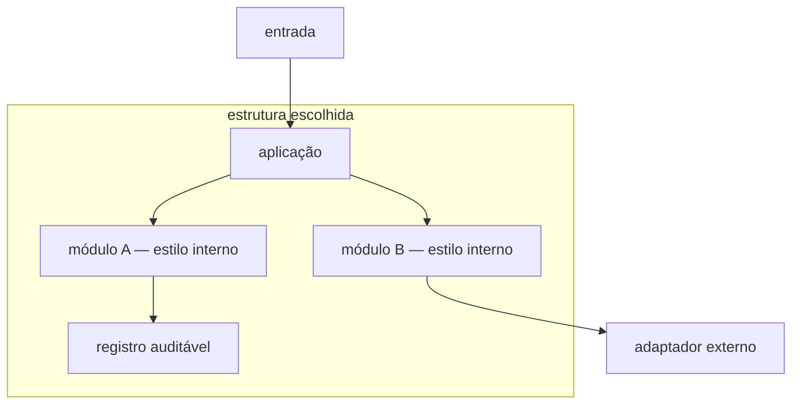
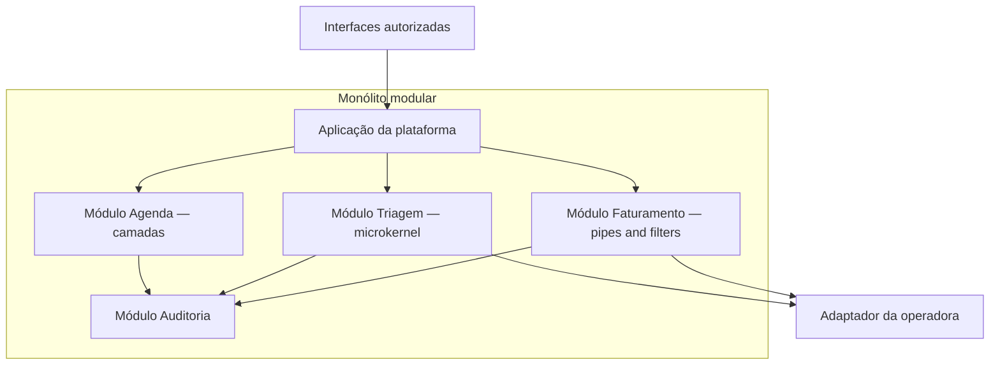
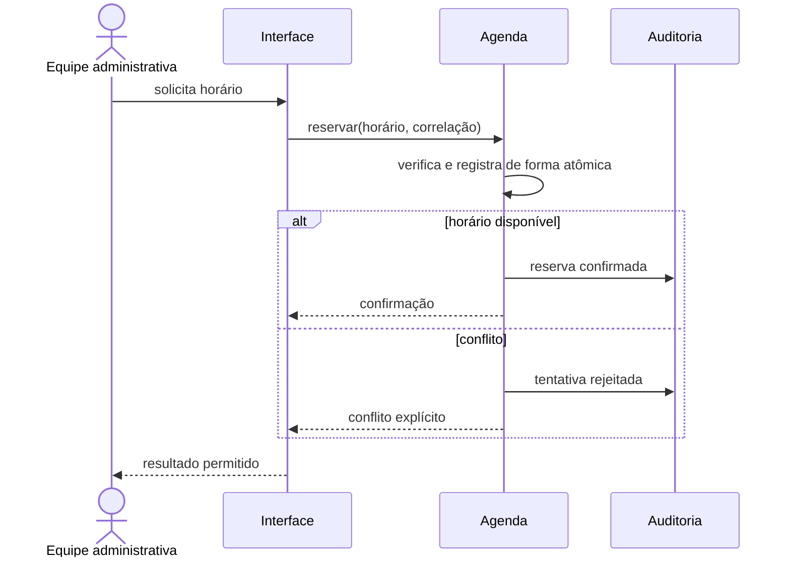

# Estudo de caso: plataforma hospitalar

## Delimitação do caso

O [contexto hospitalar compartilhado](../projeto-integrador/contexto-hospitalar.md) descreve uma operação administrativa simplificada. A plataforma coordena a jornada do paciente sem recomendar tratamento nem interpretar resultados; informação sensível circula com autorização, significado e rastreabilidade.

### O que é uma capacidade

Uma **capacidade** é uma coisa que o negócio precisa que seja feita — um trabalho com valor próprio, como *marcar uma consulta* ou *fechar a conta com a operadora*. Ela diz **o quê** se entrega, não **como** se faz. "Marcar uma consulta" é a mesma capacidade quer seja feita por uma recepcionista com uma agenda de papel, quer por um aplicativo. A tecnologia é o *como* e pode mudar; a capacidade é o *quê* e permanece.

> Pense no balcão de uma clínica. Há um guichê para marcar horário, outro para conferir o convênio, outro para pagar. Cada guichê é uma capacidade: um serviço com começo, fim e responsabilidade claros. Trocar o computador do guichê não muda o que ele faz.

Essa distinção importa porque **a mesma capacidade pode ser construída de várias formas**, e escolher entre essas formas é o trabalho de arquitetura que este caso pratica. Para comparar as opções sem se perder, descreva cada capacidade por quatro traços simples:

- **Resultado** — o que ela entrega quando dá certo.
- **Força dominante** — a exigência que mais pesa sobre ela (por exemplo: não aceitar duas reservas no mesmo horário, ou dar conta de muitos registros de uma vez).
- **Ritmo de mudança** — com que frequência as regras dela mudam.
- **Fronteira** — onde ela termina e a vizinha começa.

### Capacidades em escopo

O caso trabalha oito capacidades, detalhadas no [contexto compartilhado](../projeto-integrador/contexto-hospitalar.md#capacidades-em-escopo). Na coluna de força dominante, a palavra em negrito é o termo técnico (você o reencontra em [atributos de qualidade](../referencia/atributos-de-qualidade.md)) e o resto é o que ele significa aqui. É uma hipótese inicial, não um veredito — os exercícios existem para medi-la.

| Capacidade | Resultado que entrega | Força dominante (hipótese) |
| --- | --- | --- |
| Cadastro | identificar paciente e profissional e manter dados administrativos | **integridade**: cada pessoa tem um registro correto e único |
| Agenda | consultar, solicitar, confirmar, remarcar e cancelar atendimento | **consistência**: nunca confirmar duas reservas para o mesmo horário |
| Elegibilidade | verificar se o vínculo com o plano está apto para a solicitação | **disponibilidade**: responder mesmo quando a operadora demora ou cai |
| Autorização | enviar solicitação à operadora e acompanhar a decisão | **rastreabilidade**: guardar o que foi pedido e o que foi respondido |
| Exames e resultados | encaminhar pedido, acompanhar estado e receber resultado protegido | **privacidade**: proteger o resultado e ligá-lo ao pedido certo |
| Faturamento | consolidar registros administrativos do ciclo financeiro | **vazão** (*throughput*): dar conta de muitos registros de uma vez |
| Notificações | informar mudanças sem expor dado sensível desnecessário | **pertinência**: avisar só o necessário, sem vazar dado sensível |
| Auditoria | registrar ações e correlações suficientes para prestação de contas | **rastreabilidade**: reconstruir quem fez o quê e quando |

### As três capacidades que os exercícios aprofundam

Trabalhar as oito com a mesma profundidade seria demais para começar. Os quatro exercícios escolhem **três** e as usam do início ao fim, porque elas puxam para lados opostos.

- **Agenda** — muitas ações curtas e o risco de marcar o mesmo horário duas vezes. Sua força é a **consistência**: como quando duas pessoas tentam comprar a mesma poltrona do cinema ao mesmo tempo e só uma pode levar.
- **Triagem administrativa** — reúne cadastro, elegibilidade e autorização para encaminhar o paciente, e cada unidade do hospital pode ter uma etapa a mais. Sua força é a **extensibilidade**: acrescentar uma etapa nova sem mexer no que já funciona, como encaixar mais uma peça de Lego.
- **Faturamento** — junta registros de várias origens, confere, ajusta e envia em lotes. Sua força é a **vazão** (*throughput*): dar conta de um grande volume de uma vez, como uma esteira que separa milhares de cartas por hora.

As três vivem na mesma plataforma, mas pedem coisas diferentes — e essa diferença é o que o exercício 2 vai deixar comparável.

Sobre o nome: **triagem administrativa** é como o caso chama o conjunto das etapas de pré-atendimento — cadastro, elegibilidade e autorização — quando olhamos para elas como um bloco só: um núcleo estável no meio e encaixes opcionais por unidade em volta.

## Como trabalhar esta página

São quatro exercícios curtos, e cada um usa o resultado do anterior. Pense numa decisão comum, como escolher onde morar: primeiro você lista o que importa (perto do trabalho, silêncio, preço), depois compara as opções por esses critérios, então desenha a planta do lugar escolhido e, por fim, anota por que decidiu assim — e o que faria você mudar de ideia. Os exercícios seguem essa mesma ordem:

1. Os **cenários** dizem o que importa, de um jeito que dá para medir.
2. A **matriz** compara os estilos usando esses cenários como critério.
3. A **estrutura** desenha a opção escolhida.
4. O **ADR** registra a decisão e a condição que a faria ser revista.

Como a saída de um é a entrada do próximo, vale mais um artefato curto e completo do que um texto longo pela metade. Trabalhe em dupla; o ritmo de cada exercício é combinado em aula.

No terminal aberto na raiz do repositório `arquitetura-software`, crie a pasta `entregas/unidade-1/estudo-de-caso/` antes de começar. Cada exercício grava um arquivo nela.

| Exercício | Foco | Entregável |
| --- | --- | --- |
| 1 | Cenários mensuráveis por capacidade | `cenarios.md` |
| 2 | Matriz de estilos por capacidade | `matriz-estilos.md` |
| 3 | Estrutura inicial e diagrama | `estrutura.md` |
| 4 | Consequências e decisão registrada | `ADR-001-estrutura-inicial.md` |

Cada exercício mostra **onde aprender a fazer** (a página e a seção que ensinam o método) e a **forma do artefato** (um esqueleto pronto para você completar). O esqueleto já vem montado de propósito: assim seu esforço vai para a decisão, não para a formatação.

Cada exercício termina com uma **Referência do curso** recolhida — uma resposta possível, escrita pelo material, para você comparar **depois** de tentar. Não é gabarito: seu grupo pode chegar a outra resposta, desde que compare as mesmas forças, assuma as consequências e mostre uma evidência que outra pessoa consiga repetir. Abra o bloco só depois de fechar a sua versão; ver antes tira o valor do exercício.

## Exercício 1 — Cenários por capacidade

**Enunciado**

Agenda, triagem administrativa e faturamento vivem na mesma plataforma, mas pedem coisas diferentes. Para cada uma, escreva um **cenário mensurável**: uma frase de teste tão clara que duas soluções possam ser comparadas pela mesma régua.

> É a diferença entre uma receita que diz "asse por 20 minutos a 180°C" e outra que diz "asse até ficar bom". Só a primeira pode ser conferida por qualquer pessoa.

Um cenário é mensurável quando diz seis coisas — fonte, estímulo, ambiente, artefato, resposta e medida (o esqueleto abaixo explica cada uma). O teste de qualidade é simples: outra pessoa consegue dizer se o cenário foi atendido **sem precisar te perguntar nada**.

**Onde aprender a fazer**

O método está em [atributos de qualidade](../referencia/atributos-de-qualidade.md#como-usar-na-decisao). A tabela de lá liga cada atributo a uma pergunta de projeto e a um exemplo de medida; tire dali a unidade que você vai usar. Se estiver na dúvida entre restrição, premissa e atributo, a diferença está em [como ler uma arquitetura](../referencia/como-ler-uma-arquitetura.md#restricoes-premissas-e-atributos-de-qualidade). Termos novos estão no [glossário](../referencia/glossario.md). Nenhum código precisa ser executado.

**Forma do artefato**

Escreva cada cenário nas seis linhas abaixo, substituindo o conteúdo entre colchetes angulares:

```text
Fonte do estímulo: <quem ou o que inicia>
Estímulo: <o que chega ao sistema>
Ambiente: <operação normal, evolução, pico ou degradação>
Artefato: <capacidade ou módulo afetado>
Resposta: <o que o sistema faz de observável>
Medida: <número, unidade e janela de observação>
```

Um cenário pronto, na plataforma de remessas do [exemplo arquitetural](exemplo-arquitetural.md):

```text
Fonte do estímulo: dois sistemas parceiros
Estímulo: a mesma remessa enviada duas vezes em menos de um segundo
Ambiente: operação normal
Artefato: módulo de submissão
Resposta: uma remessa aceita e uma recusa com o protocolo da primeira
Medida: nenhuma duplicada em quinhentos envios concorrentes
```

Um cenário fraco costuma falhar na resposta ou na medida. "O sistema fica estável" não é resposta observável. "Responde rápido" não é medida enquanto não disser em quanto tempo e sob qual carga.

**Como conduzir**

1. Nomeie a força dominante de cada capacidade em uma palavra e registre-a: por exemplo consistência, extensibilidade ou vazão.
2. Escreva os três cenários com as seis partes. Use valores plausíveis e marque cada um como suposição.
3. Na revisão, troque cada adjetivo por número, unidade e condição de observação.

**Entregável**

`entregas/unidade-1/estudo-de-caso/cenarios.md` com três cenários de até cinco linhas cada. Depois de cada cenário, escreva uma linha indicando como a medida seria coletada e quem a coletaria.

**Critério de pronto**

- Os três cenários declaram fonte, estímulo, ambiente, artefato, resposta e medida.
- Nenhuma medida usa adjetivo sem número e unidade.
- Cada cenário aponta uma forma de coleta que a turma consegue executar em laboratório.
- As suposições de valor estão marcadas como suposições.

**Se precisar reduzir o escopo**

Entregue dois cenários completos em vez de três incompletos. Registre a capacidade que ficou de fora e a razão; o exercício 2 continuará com o que existir.

<details markdown="1">
<summary>Referência do curso — abra só depois de fechar a sua versão</summary>

Cada capacidade tem uma **força dominante**, mas costuma ter mais de um atributo de qualidade que vale medir. Abaixo, três por capacidade, cada um com uma medida concreta. (Glossário rápido: *p95* é o tempo abaixo do qual ficam 95% das respostas; *escala horizontal* é atender mais carga adicionando instâncias, em vez de trocar por uma máquina maior.)

**Agenda** — força dominante: consistência

| Atributo de qualidade | Cenário e medida concreta |
| --- | --- |
| Consistência sob concorrência | 50 solicitações disputam o mesmo horário em operação normal: exatamente 1 confirmação e 49 conflitos explícitos. Medida: 0 reservas duplicadas em 1.000 tentativas concorrentes. |
| Latência | Confirmar ou recusar uma reserva sob carga de 100 reservas/s. Medida: *p95* ≤ 300 ms. |
| Escalabilidade | No pico das 8h a carga dobra para 200 reservas concorrentes por minuto. Medida: *p95* permanece ≤ 500 ms ao adicionar 1 instância (*escala horizontal*). |

**Triagem administrativa** — força dominante: extensibilidade

| Atributo de qualidade | Cenário e medida concreta |
| --- | --- |
| Extensibilidade | Uma unidade acrescenta uma nova etapa de coleta em período de evolução. Medida: 0 arquivos do núcleo alterados; a extensão liga e desliga por configuração; os testes do núcleo seguem passando. |
| Latência | Encaminhamento completo da triagem (identificação → elegibilidade → autorização) com os serviços externos disponíveis. Medida: *p95* ≤ 800 ms. |
| Disponibilidade (modo degradado) | A operadora não responde em 2 s: a triagem enfileira a autorização e segue o fluxo. Medida: disponibilidade da capacidade ≥ 99,5% no mês, mesmo com a operadora fora do ar. |

**Faturamento** — força dominante: vazão (*throughput*)

| Atributo de qualidade | Cenário e medida concreta |
| --- | --- |
| Vazão (*throughput*) | Lote de 10.000 registros validado, normalizado e correlacionado. Medida: ≥ 500 registros/s, com rejeições identificadas por etapa. |
| Escalabilidade | O volume dobra para 20.000 registros. Medida: *throughput* ≥ 400 registros/s ao adicionar 1 instância de processamento (*escala horizontal*). |
| Latência de janela | Fechamento do lote diário de 50.000 registros. Medida: concluído em ≤ 5 min, reportando registros/s e número de rejeições. |

Esses valores não são compromissos de produção. São hipóteses iniciais que tornam as alternativas comparáveis; a turma pode ajustá-los, desde que a medida preserve número, unidade e condição de observação.

</details>

## Exercício 2 — Matriz de estilos por capacidade

**Enunciado**

Um **estilo arquitetural** é um jeito conhecido de organizar as partes de um sistema — como plantas de casa que já vêm com vantagens e desvantagens conhecidas. Você vai comparar quatro:

- **Camadas** — separa o sistema em níveis, cada um falando só com o vizinho, como os andares de um prédio.
- **Pipes and filters** (canos e filtros) — passa o trabalho por etapas em sequência, como uma esteira de fábrica: cada etapa faz uma coisa e entrega para a próxima.
- **Microkernel** (núcleo e plugins) — um miolo fixo com encaixes opcionais, como um videogame que roda cartuchos diferentes sem trocar o console.
- **Monólito modular** — um único programa dividido em cômodos bem separados, como uma casa com paredes claras: tudo sob o mesmo teto, cada cômodo com sua função.

Monte uma tabela — a **matriz** — com uma linha por estilo e uma coluna por capacidade. É a mesma ideia de comparar celulares numa tabela: os modelos nas linhas, o que importa nas colunas. Use os cenários do exercício 1 como régua. Em cada célula, escreva o que aquele estilo faz por aquela capacidade.

**Onde aprender a fazer**

Em [padrões e decisões](padroes-e-decisoes.md), cada estilo traz uma tabela de características avaliadas de 1 a 5 por Richards e Ford e um bloco "quando usar" e "quando não usar". São essas duas partes que alimentam a matriz: [camadas](padroes-e-decisoes.md#camadas), [pipes and filters](padroes-e-decisoes.md#pipes-and-filters), [microkernel](padroes-e-decisoes.md#microkernel) e [monólito modular](padroes-e-decisoes.md#monolito-modular-uma-implantacao-capacidades-com-autonomia-interna).

**Forma do artefato**

Cada célula é uma frase com verbo, ligando estilo, capacidade e custo:

| Estilo | Agenda | Triagem administrativa | Faturamento |
| --- | --- | --- | --- |
| Camadas |  |  |  |
| Pipes and filters |  |  |  |
| Microkernel |  |  |  |
| Monólito modular |  |  |  |

Uma célula útil se parece com isto: "isola cada etapa de validação, ao custo de manter contrato e correlação entre elas". Alguém pode contestá-la com uma medição. Já "é o mais indicado" só pode ser repetido.

**Como conduzir**

1. Reproduza a tabela vazia: uma linha para cada um dos quatro estilos e uma coluna para cada uma das três capacidades.
2. Complete célula a célula, escrevendo o que o estilo faz por aquela capacidade.
3. Marque as duas células em que a evidência disponível hoje é insuficiente para decidir.

**Entregável**

`entregas/unidade-1/estudo-de-caso/matriz-estilos.md` com a matriz completa, mais um parágrafo de até cinco linhas respondendo: qual capacidade separa mais os estilos e por quê.

**Critério de pronto**

- As doze células de estilo por capacidade estão escritas, inclusive as combinações desfavoráveis.
- Duas células estão marcadas como carentes de evidência, com a medição que resolveria a dúvida.
- Nenhuma célula usa o nome do domínio como argumento: "é hospitalar" não é força.

**Se precisar reduzir o escopo**

Complete a coluna da capacidade mais crítica e deixe as outras vazias. O exercício 3 precisa saber o que não foi examinado.

<details markdown="1">
<summary>Referência do curso — abra só depois de fechar a sua versão</summary>

| Estilo | Agenda | Triagem administrativa | Faturamento |
| --- | --- | --- | --- |
| Camadas | separa interface, aplicação, regras e persistência | separa coleta, regra e integração | testa transformações sem infraestrutura |
| Pipes and filters | pouco natural para reserva interativa | pode organizar etapas lineares | corresponde a validação e transformação em lote |
| Microkernel | útil apenas se regras variarem muito | favorece etapas opcionais por unidade | pode isolar layouts de parceiros |
| Monólito modular | preserva consistência local e fronteira de agenda | separa capacidade sem nova implantação | mantém módulos próximos com contratos internos |

A matriz não elege sozinha um estilo. Ela mostra que a agenda separa mais as alternativas: reserva concorrente favorece consistência local, enquanto faturamento admite tanto camadas quanto fluxo.

</details>

## Exercício 3 — Estrutura inicial e diagrama

**Enunciado**

Agora escolha **uma estrutura** para a plataforma inteira e desenhe-a. Estrutura, aqui, é a planta baixa do sistema: quais são as partes (os **módulos**), como elas se falam (os **conectores**), o que entra e sai por fora (a **fronteira**) e qual estilo organiza cada parte por dentro.

> É como a planta de uma casa: mostra os cômodos, as portas entre eles e a porta da rua. Quem olha entende a casa sem precisar andar por ela.

O desenho precisa **nomear** as partes — nada de caixas genéricas — e vir com duas descrições em texto: o **texto alternativo**, para quem não enxerga a figura, e a **leitura textual**, que percorre o desenho em palavras. Se a descrição em texto não bater com o desenho, o desenho ainda não está pronto.

**Onde aprender a fazer**

O vocabulário do desenho está em [como ler uma arquitetura](../referencia/como-ler-uma-arquitetura.md#componentes-conectores-e-configuracao): componente concentra responsabilidade, conector descreve colaboração e configuração é o arranjo dos dois. O [exemplo arquitetural](exemplo-arquitetural.md#a-mesma-plataforma-tres-estruturas-deliberadas) mostra três estruturas com o nível de detalhe esperado aqui. Os módulos de lá pertencem a outra plataforma; aproveite a forma do desenho e nomeie os seus. A convenção de acessibilidade usada em todas as figuras do curso aparece nas figuras 23 e 24 desta página: bloco Mermaid, texto alternativo, legenda numerada e leitura textual.

**Forma do artefato**

Use o modelo abaixo como base. A figura mostra a forma que o seu desenho deve ter; logo depois vem o código Mermaid para você copiar e adaptar. O que estiver fora do quadro `subgraph` é externo à plataforma.


```mermaid
flowchart TB
    entrada["entrada"] --> app["aplicação"]
    subgraph estrutura["estrutura escolhida"]
        app --> moduloA["módulo A — estilo interno"]
        app --> moduloB["módulo B — estilo interno"]
        moduloA --> registro["registro auditável"]
    end
    moduloB --> externo["adaptador externo"]
```

**Texto alternativo:** modelo genérico em que uma entrada leva à aplicação; dentro do quadro "estrutura escolhida", a aplicação encaminha para os módulos A e B, o módulo A grava num registro auditável, e o módulo B fala com um adaptador externo, fora do quadro.

*Modelo — estrutura genérica para adaptar; troque os nomes pelos seus. Fonte: curso.*

**Leitura textual da figura:** a entrada chega à aplicação. Dentro do quadro "estrutura escolhida", a aplicação encaminha para o módulo A e para o módulo B, e o módulo A grava um registro auditável. Fora do quadro, o módulo B conversa com um adaptador externo. Ao montar a sua, troque cada nome genérico pelo componente real da plataforma hospitalar.

Código Mermaid do modelo, para copiar e adaptar:

```text
flowchart TB
    entrada["entrada"] --> app["aplicação"]
    subgraph estrutura["estrutura escolhida"]
        app --> moduloA["módulo A — estilo interno"]
        app --> moduloB["módulo B — estilo interno"]
        moduloA --> registro["registro auditável"]
    end
    moduloB --> externo["adaptador externo"]
```

Depois do diagrama vêm as três partes textuais:

- **texto alternativo** — descreve a figura para quem não a vê;
- **legenda** — numera e credita;
- **leitura textual** — percorre as relações do desenho com os mesmos nomes.

Se a leitura textual mencionar uma seta que não existe no diagrama, o desenho está incompleto ou a prosa se adiantou.

**Como conduzir**

1. Escreva a frase da estrutura escolhida: "uma implantação com módulos X, Y e Z" ou a alternativa que preferir defender.
2. Desenhe o diagrama com módulos, conectores, adaptadores externos e o registro de auditoria.
3. Escreva a leitura textual da figura.
4. Ligue cada módulo à força que o justifica, citando o cenário correspondente.

**Entregável**

`entregas/unidade-1/estudo-de-caso/estrutura.md` com um diagrama Mermaid, o texto alternativo, a leitura textual e três linhas ligando módulo, estilo interno e cenário atendido.

**Critério de pronto**

- O diagrama nomeia módulos e conectores, não apenas caixas genéricas.
- A leitura textual descreve as mesmas relações do desenho, com os mesmos nomes.
- Cada módulo aparece ligado a um cenário do exercício 1.
- O que é externo à plataforma está marcado como externo.

**Se precisar reduzir o escopo**

Entregue o diagrama sem os estilos internos, mas com a leitura textual completa. Uma figura sem equivalente textual não é entregável, porque deixa de ser legível para parte da turma.

<details markdown="1">
<summary>Referência do curso — abra só depois de fechar a sua versão</summary>

Uma alternativa inicial é usar monólito modular como estrutura geral. Os módulos `agenda`, `triagem`, `faturamento` e `auditoria` possuem interfaces explícitas e uma unidade de implantação. Dentro de triagem, um microkernel organiza extensões administrativas. Dentro de faturamento, pipes and filters organiza o lote. Camadas podem estruturar a agenda para separar entrada, aplicação, regra e persistência.


```mermaid
flowchart TB
    UI["Interfaces autorizadas"] --> AP["Aplicação da plataforma"]
    subgraph M["Monólito modular"]
        AP --> AG["Módulo Agenda — camadas"]
        AP --> TR["Módulo Triagem — microkernel"]
        AP --> FA["Módulo Faturamento — pipes and filters"]
        AG --> AU["Módulo Auditoria"]
        TR --> AU
        FA --> AU
    end
    TR --> OP["Adaptador da operadora"]
    FA --> OP
```

**Texto alternativo:** uma aplicação de plataforma encaminha interfaces autorizadas aos módulos Agenda, Triagem e Faturamento dentro de um monólito modular; os módulos registram fatos em Auditoria, e Triagem e Faturamento usam um adaptador da operadora.

*Figura 23 — Monólito modular com estilos internos por capacidade hospitalar. Fonte: curso.*

**Leitura textual da figura:** as Interfaces autorizadas chegam à Aplicação da plataforma, que encaminha para Agenda, Triagem ou Faturamento dentro de um monólito modular. Agenda usa camadas, Triagem usa microkernel e Faturamento usa pipes e filtros; Triagem e Faturamento acessam o Adaptador da operadora. Os módulos enviam fatos mínimos para Auditoria, sem entregar a ela o controle das regras de negócio.

O desenho não significa que todos os módulos podem acessar todos os dados. Cada módulo controla seu modelo; interações usam interfaces internas. Auditoria recebe fatos mínimos e correlação, sem se tornar dependência que concentra toda regra. O adaptador traduz o modelo da operadora para a linguagem da plataforma.

O núcleo da triagem conhece identidade da jornada, estados permitidos, autorização de ações e emissão de fatos auditáveis. Plugins implementam etapas opcionais, como um questionário administrativo específico de uma unidade ou uma validação de integração. O contrato recebe contexto mínimo e devolve estado, pendências e evidências, sem acesso irrestrito ao banco do núcleo. Uma extensão só é útil se puder ser adicionada, testada e desabilitada pelo contrato; se plugins precisam coordenar transações entre si ou alterar tabelas internas, o limite deve ser revisto.

O faturamento recebe registros administrativos, valida campos obrigatórios, normaliza identificadores, correlaciona autorizações e produz uma saída por parceiro. Cada filtro gera resultado explícito. Rejeições não desaparecem: contêm correlação, etapa e motivo apropriado para a equipe autorizada. A vazão não pode ser inferida do diagrama; um teste usa massa sintética, ambiente registrado e medição repetível.

</details>

## Exercício 4 — Consequências e ADR-001

**Enunciado**

A estrutura do exercício 3 é uma aposta, não uma verdade. Aqui você a transforma num registro que outra pessoa pode questionar: um **ADR** (do inglês *Architecture Decision Record*, "registro de decisão de arquitetura"). Um ADR anota três coisas — o que você decidiu, por que decidiu e o que faria você voltar atrás.

> É como anotar uma decisão importante num caderno: "escolhi o plano X porque Y; se o preço passar de Z, reavalio". Meses depois, qualquer um entende a escolha e sabe quando ela deixou de valer.

O diagrama de sequência abaixo mostra o momento mais delicado da agenda: dois pedidos concorrentes disputando o mesmo horário, dentro da estrutura que você desenhou no exercício 3.


```mermaid
sequenceDiagram
    actor Administrativo as Equipe administrativa
    participant API as Interface
    participant Agenda
    participant Auditoria
    Administrativo->>API: solicita horário
    API->>Agenda: reservar(horário, correlação)
    Agenda->>Agenda: verifica e registra de forma atômica
    alt horário disponível
        Agenda->>Auditoria: reserva confirmada
        Agenda-->>API: confirmação
    else conflito
        Agenda->>Auditoria: tentativa rejeitada
        Agenda-->>API: conflito explícito
    end
    API-->>Administrativo: resultado permitido
```

**Texto alternativo:** sequência em que a Equipe administrativa pede um horário pela Interface; Agenda reserva de modo atômico e registra em Auditoria tanto a confirmação quanto o conflito antes de devolver um resultado explícito.

*Figura 24 — Reserva de agenda com confirmação ou conflito explícito. Fonte: curso.*

**Leitura textual da figura:** a Equipe administrativa solicita um horário pela Interface, que chama Agenda com o horário e a correlação. Agenda verifica e registra a reserva de modo atômico. Se houver horário, registra a confirmação em Auditoria; se houver conflito, registra a tentativa rejeitada. Em ambos os casos, a Interface devolve um resultado explícito à equipe.

**O que o diagrama te diz — e por que o monólito modular ajuda aqui**

Repare no passo em que a Agenda "verifica e registra de forma atômica". Como Agenda, Triagem e Faturamento vivem numa **única implantação, com um só banco de dados**, reservar um horário é uma **transação local**: o próprio banco garante que, entre dois pedidos ao mesmo tempo, só um consegue gravar. É como um caixa único com um só caderno de reservas — duas pessoas não escrevem na mesma linha ao mesmo tempo. Não é preciso coordenar serviços separados nem criar um protocolo entre eles.

Essa é a **consequência favorável** que o ADR vai registrar. Toda escolha cobra um preço, e aqui está a **restrição**: como tudo roda no mesmo processo, um lote pesado de faturamento disputa recursos com a agenda — escala e falha ficam compartilhadas.

Você já tem as duas peças. Use estas frases no ADR (pode copiar ou reescrever com suas palavras):

- **Consequência favorável:** garantir "nunca duas reservas no mesmo horário" é simples, porque a reserva é uma transação local em um único banco — sem coordenar serviços distribuídos.
- **Restrição aceita:** enquanto tudo estiver numa só implantação, agenda e faturamento dividem processo, escala e falha; se o faturamento precisar escalar sozinho, o módulo terá de ser extraído.

**Onde aprender a fazer**

O que é um ADR e por que ele registra hipótese em vez de sentença está em [ADR: o mecanismo para escolher estilos](padroes-e-decisoes.md#adr-o-mecanismo-para-escolher-estilos). A estrutura de seções e o que entra em cada uma está no [template de ADR](../referencia/template-adr.md). Um registro curto já escrito, para comparar tamanho e tom, é a [decisão provisória](exemplo-arquitetural.md#decisao-provisoria) do exemplo arquitetural. O [incremento 1](../projeto-integrador/incrementos.md#incremento-1-estrutura-e-decisoes-iniciais) informa o destino do artefato.

**Forma do artefato**

Os quatro campos que costumam sair fracos têm frase-modelo:

```text
Alternativa descartada: <nome> atenderia <força>, mas traria <risco>;
  foi descartada porque <evidência disponível ou ausência dela>.
Consequência favorável: <efeito> observável em <onde se observa>.
Consequência desfavorável: aceitamos <custo> enquanto
  <condição> permanecer verdadeira.
Gatilho de revisão: se <medida> ultrapassar <valor> em
  <janela>, este registro é reaberto.
```

Alternativa listada só pelo nome não foi comparada. E um gatilho como "revisar no futuro" não obriga ninguém a nada.

**Como conduzir**

1. Copie o template para `ADR-001-estrutura-inicial.md` e registre a decisão: **monólito modular** como estrutura inicial.
2. Cole as duas frases prontas do enunciado — a consequência favorável e a restrição — ou reescreva com suas palavras.
3. Acrescente **uma** alternativa que você descartou, com a força que ela atenderia e o risco que traria (ex.: "separar cada capacidade em um serviço desde já atenderia escala independente, mas traria coordenação distribuída sem evidência de que precisamos dela agora").
4. Escreva o gatilho de revisão: a medida que, se acontecer, reabre a decisão (ex.: "se o faturamento precisar de escala própria comprovada, reabrir o ADR").

**Entregável**

`entregas/unidade-1/estudo-de-caso/ADR-001-estrutura-inicial.md` com estado, data, contexto, forças, alternativas, decisão, consequências, evidências e revisão. Até uma página.

**Critério de pronto**

- Cada alternativa descartada aparece com a força que atenderia e o risco que traria — não apenas com o nome.
- As consequências incluem ao menos um efeito desfavorável assumido.
- Cada evidência informa onde pode ser reproduzida.
- O gatilho de revisão descreve uma observação, não uma data vaga.

**Se precisar reduzir o escopo**

Registre o ADR com estado "proposta" e liste em uma seção final os campos que faltaram. Um registro incompleto e honesto continua utilizável; um registro completo por invenção contamina os encontros seguintes.

<details markdown="1">
<summary>Referência do curso — abra só depois de fechar a sua versão</summary>

O primeiro ADR pode escolher um monólito modular como estrutura inicial, com estilos internos onde as forças os justificam. As alternativas seriam um único conjunto sem módulos, microkernel como estrutura global e implantação independente por capacidade. As consequências favoráveis são operação inicial simples, transações locais na agenda e fronteiras por capacidade. As desfavoráveis são processo compartilhado, escala conjunta e necessidade de verificar dependências internas.

A sequência da agenda revela uma necessidade de consistência local. Transformá-la em pipeline não ajuda a reserva concorrente. Separá-la imediatamente em vários serviços também introduziria coordenação sem evidência de benefício. A unidade modular mantém uma fronteira clara e permite revisar a implantação quando carga, equipe ou isolamento justificarem.

As evidências incluem `test_estilos.py`, teste de fronteiras futuro, extensão piloto da triagem, fluxo sintético de faturamento e revisão do diagrama. O gatilho de revisão é uma necessidade comprovada de escala, disponibilidade ou cadência de implantação independente.

</details>

## Fecho dos quatro exercícios

Ao final, a pasta `entregas/unidade-1/estudo-de-caso/` guarda uma sequência que se lê de ponta a ponta: um cenário que dá para medir, uma comparação justa entre estilos, uma estrutura desenhada e uma decisão que pode ser revista. Essa sequência é a primeira versão do [incremento 1](../projeto-integrador/incrementos.md#incremento-1-estrutura-e-decisoes-iniciais) e vai ser retomada nos próximos módulos, quando APIs, serviços, eventos e nuvem mudarem as forças que você examinou aqui.

Nenhum dos quatro artefatos, sozinho, prova que a arquitetura está certa. Juntos, eles mostram **como** a decisão foi tomada e **onde** ela pode ser contestada. Esse é o objetivo: deixar a diferença entre as opções visível o bastante para ser discutida.
