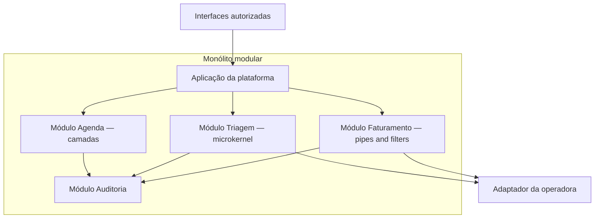
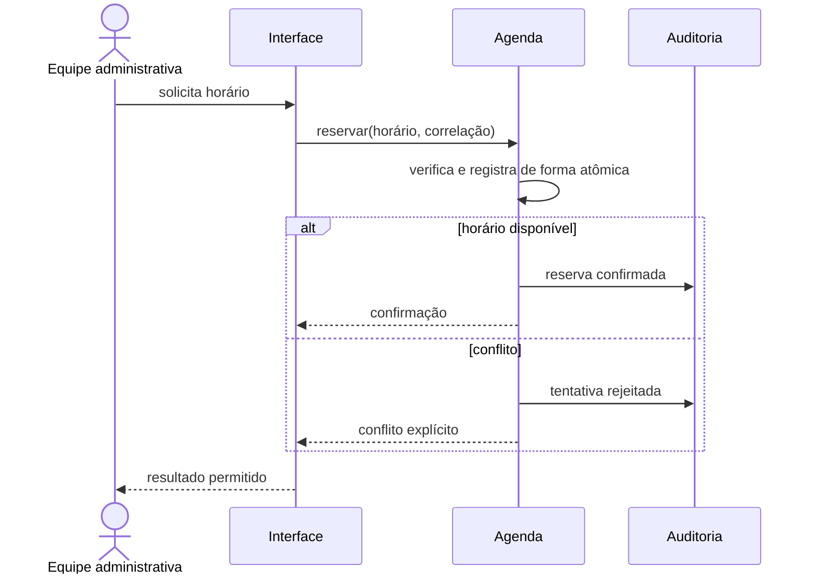

# Estudo de caso: plataforma hospitalar

## Delimitação do caso

O [contexto hospitalar compartilhado](../projeto-integrador/contexto-hospitalar.md) descreve uma operação administrativa simplificada. A plataforma coordena cadastro, agenda, elegibilidade, autorização, exames, faturamento, notificações e auditoria. Não recomenda tratamento nem interpreta resultados. Informações sensíveis devem circular com autorização, significado e rastreabilidade.

Antes de escolher estruturas, separe capacidades e ritmos de mudança. Agenda recebe muitas interações curtas e precisa evitar conflitos. Triagem administrativa reúne dados necessários para encaminhar a jornada e pode variar conforme unidade. Faturamento consolida registros de origens distintas, valida, transforma e encaminha lotes. As três capacidades pertencem à mesma plataforma, mas suas forças não são idênticas.

## Como trabalhar esta página

O caso está organizado em quatro exercícios curtos e encadeados. A saída de um é a entrada do seguinte: cenários alimentam a matriz de estilos, a matriz sustenta a estrutura, e a estrutura sustenta a decisão registrada. Trabalhe em dupla e prefira um artefato curto e completo a um texto longo pela metade. O ritmo de cada exercício é definido em aula.

No terminal aberto na raiz do repositório `arquitetura-software`, crie `entregas/unidade-1/estudo-de-caso/` antes de começar. Cada exercício grava um arquivo nessa pasta.

| Exercício | Foco | Entregável |
| --- | --- | --- |
| 1 | Cenários mensuráveis por capacidade | `cenarios.md` |
| 2 | Matriz de estilos por capacidade | `matriz-estilos.md` |
| 3 | Estrutura inicial e diagrama | `estrutura.md` |
| 4 | Consequências e decisão registrada | `ADR-001-estrutura-inicial.md` |

Cada exercício indica **onde aprender a fazer**, com a página e a seção que ensinam o método, e a **forma do artefato**, com o esqueleto que você completa. O formato vem pronto para que o esforço seja gasto na decisão.

Cada exercício termina com uma **Referência do curso**: uma resposta possível, elaborada pelo material, para comparação depois da sua tentativa. Ela não é gabarito. Um grupo pode divergir sempre que comparar as mesmas forças, assumir as consequências e oferecer evidência reproduzível. Leia a referência só depois de encerrar a sua versão; ler antes elimina o exercício.

## Exercício 1 — Cenários por capacidade

**Enunciado**

Agenda, triagem administrativa e faturamento pertencem à mesma plataforma e têm forças diferentes. Escreva um cenário mensurável para cada capacidade, de modo que duas alternativas estruturais possam ser comparadas pela mesma medida. Um cenário é mensurável quando declara fonte, estímulo, ambiente, artefato, resposta e medida. O teste é simples: outra pessoa consegue julgar se ele foi atendido sem conversar com quem o escreveu.

**Onde aprender a fazer**

O método está em [atributos de qualidade](../referencia/atributos-de-qualidade.md#como-usar-na-decisao). A tabela de lá liga cada atributo a uma pergunta de projeto e a um exemplo de medida; tire dali a unidade que você vai usar. Se estiver na dúvida entre restrição, premissa e atributo, a diferença está em [como ler uma arquitetura](../referencia/como-ler-uma-arquitetura.md#restricoes-premissas-e-atributos-de-qualidade). Termos novos estão no [glossário](../referencia/glossario.md). Nenhum código precisa ser executado.

**Forma do artefato**

Escreva cada cenário nas seis linhas abaixo, substituindo o conteúdo entre colchetes angulares:

```text
Fonte do estímulo: <quem ou o que inicia>
Estímulo: <o que chega ao sistema>
Ambiente: <operação normal, evolução, pico ou degradação>
Artefato: <capacidade ou módulo afetado>
Resposta: <o que o sistema faz de observável>
Medida: <número, unidade e janela de observação>
```

Um cenário pronto, na plataforma de remessas do [exemplo arquitetural](exemplo-arquitetural.md):

```text
Fonte do estímulo: dois sistemas parceiros
Estímulo: a mesma remessa enviada duas vezes em menos de um segundo
Ambiente: operação normal
Artefato: módulo de submissão
Resposta: uma remessa aceita e uma recusa com o protocolo da primeira
Medida: nenhuma duplicada em quinhentos envios concorrentes
```

Um cenário fraco costuma falhar na resposta ou na medida. "O sistema fica estável" não é resposta observável. "Responde rápido" não é medida enquanto não disser em quanto tempo e sob qual carga.

**Como conduzir**

1. Nomeie a força dominante de cada capacidade em uma palavra e registre-a: por exemplo consistência, extensibilidade ou throughput.
2. Escreva os três cenários com as seis partes. Use valores plausíveis e marque cada um como suposição.
3. Na revisão, troque cada adjetivo por número, unidade e condição de observação.

**Entregável**

`entregas/unidade-1/estudo-de-caso/cenarios.md` com três cenários de até cinco linhas cada. Depois de cada cenário, escreva uma linha indicando como a medida seria coletada e quem a coletaria.

**Critério de pronto**

- Os três cenários declaram fonte, estímulo, ambiente, artefato, resposta e medida.
- Nenhuma medida usa adjetivo sem número e unidade.
- Cada cenário aponta uma forma de coleta que a turma consegue executar em laboratório.
- As suposições de valor estão marcadas como suposições.

**Se precisar reduzir o escopo**

Entregue dois cenários completos em vez de três incompletos. Registre a capacidade que ficou de fora e a razão; o exercício 2 continuará com o que existir.

**Referência do curso**

Para a **agenda**: quando duas solicitações concorrentes tentarem reservar o mesmo horário em operação normal, apenas uma confirmação deve ser registrada e a outra deve receber resposta explícita; regras de remarcação devem mudar em um único módulo.

Para a **triagem administrativa**: quando uma unidade adotar uma nova etapa de coleta, em período de evolução, a equipe deve incluí-la sem alterar o núcleo de identificação, autorização e auditoria; os testes das extensões devem continuar isolados.

Para o **faturamento**: ao receber um lote de dez mil registros, o fluxo deve validar, normalizar, correlacionar e produzir a saída com identificação de rejeições por etapa; a medição deve informar itens por segundo e quantidade de rejeições.

Esses cenários não são compromissos definitivos de produção. São hipóteses iniciais que tornam as alternativas comparáveis. A turma pode ajustar valores, desde que preserve fonte, estímulo, ambiente, resposta e medida.

## Exercício 2 — Matriz de estilos por capacidade

**Enunciado**

Compare os quatro estilos contra as três capacidades, usando os cenários do exercício 1 como critério. Uma linha por estilo, uma coluna por capacidade e uma coluna final para o limite mais relevante. Cada estilo precisa sair da matriz com uma força e um limite. Um estilo que aparece sem limite significa que a análise dele ficou incompleta.

**Onde aprender a fazer**

Em [padrões e decisões](padroes-e-decisoes.md), cada estilo traz uma tabela de características avaliadas de 1 a 5 por Richards e Ford e um bloco "quando usar" e "quando não usar". São essas duas partes que alimentam a matriz: [camadas](padroes-e-decisoes.md#camadas), [pipes and filters](padroes-e-decisoes.md#pipes-and-filters), [microkernel](padroes-e-decisoes.md#microkernel) e [monólito modular](padroes-e-decisoes.md#monolito-modular-uma-implantacao-capacidades-com-autonomia-interna).

**Forma do artefato**

Cada célula é uma frase com verbo, ligando estilo, capacidade e custo:

```text
| Estilo | <capacidade> | <capacidade> | <capacidade> | Limite |
| --- | --- | --- | --- | --- |
| camadas | <o que faz por ela> | ... | ... | <o que não resolve> |
```

Uma célula útil se parece com isto: "isola cada etapa de validação, ao custo de manter contrato e correlação entre elas". Alguém pode contestá-la com uma medição. Já "é o mais indicado" só pode ser repetido.

**Como conduzir**

1. Reproduza a tabela vazia com as quatro linhas e as quatro colunas.
2. Complete célula a célula, escrevendo o que o estilo faz por aquela capacidade.
3. Escreva o limite de cada estilo e marque as duas células em que a evidência disponível hoje é insuficiente para decidir.

**Entregável**

`entregas/unidade-1/estudo-de-caso/matriz-estilos.md` com a matriz completa, mais um parágrafo de até cinco linhas respondendo: qual capacidade separa mais os estilos e por quê.

**Critério de pronto**

- As doze células de estilo por capacidade estão escritas, inclusive as combinações desfavoráveis.
- Cada estilo tem um limite nomeado.
- Duas células estão marcadas como carentes de evidência, com a medição que resolveria a dúvida.
- Nenhuma célula usa o nome do domínio como argumento: "é hospitalar" não é força.

**Se precisar reduzir o escopo**

Complete a coluna da capacidade mais crítica e deixe as outras vazias. O exercício 3 precisa saber o que não foi examinado.

**Referência do curso**

| Estilo | Agenda | Triagem administrativa | Faturamento | Limite relevante |
| --- | --- | --- | --- | --- |
| Camadas | separa interface, aplicação, regras e persistência | separa coleta, regra e integração | testa transformações sem infraestrutura | não representa sozinho extensões ou fluxo |
| Pipes and filters | pouco natural para reserva interativa | pode organizar etapas lineares | corresponde a validação e transformação em lote | contratos e correlação entre filtros |
| Microkernel | útil apenas se regras variarem muito | favorece etapas opcionais por unidade | pode isolar layouts de parceiros | compatibilidade entre núcleo e plugins |
| Monólito modular | preserva consistência local e fronteira de agenda | separa capacidade sem nova implantação | mantém módulos próximos com contratos internos | escala e falha permanecem no mesmo processo |

A matriz não elege sozinha um estilo. Ela mostra que a agenda separa mais as alternativas: reserva concorrente favorece consistência local, enquanto faturamento admite tanto camadas quanto fluxo.

## Exercício 3 — Estrutura inicial e diagrama

**Enunciado**

Escolha uma estrutura geral para a plataforma e represente-a em um diagrama. O desenho deve nomear os módulos, os conectores entre eles, o que atravessa a fronteira do sistema e onde cada estilo interno atua. Toda figura precisa de texto alternativo e leitura textual: se a explicação em prosa não coincidir com o desenho, o desenho ainda não está pronto.

**Onde aprender a fazer**

O vocabulário do desenho está em [como ler uma arquitetura](../referencia/como-ler-uma-arquitetura.md#componentes-conectores-e-configuracao): componente concentra responsabilidade, conector descreve colaboração e configuração é o arranjo dos dois. O [exemplo arquitetural](exemplo-arquitetural.md#a-mesma-plataforma-tres-estruturas-deliberadas) mostra três estruturas com o nível de detalhe esperado aqui. Os módulos de lá pertencem a outra plataforma; aproveite a forma do desenho e nomeie os seus. A convenção de acessibilidade usada em todas as figuras do curso aparece nas figuras 23 e 24 desta página: bloco Mermaid, texto alternativo, legenda numerada e leitura textual.

**Forma do artefato**

Comece pelo esqueleto abaixo, trocando os nomes e mantendo a sintaxe Mermaid; o que estiver fora do `subgraph` é externo à plataforma:

```text
flowchart TB
    <entrada> --> <aplicação>
    subgraph <estrutura escolhida>
        <aplicação> --> <módulo A — estilo interno>
        <aplicação> --> <módulo B — estilo interno>
        <módulo A> --> <registro auditável>
    end
    <módulo B> --> <adaptador externo>
```

Depois do diagrama vêm as três partes textuais:

- **texto alternativo** — descreve a figura para quem não a vê;
- **legenda** — numera e credita;
- **leitura textual** — percorre as relações do desenho com os mesmos nomes.

Se a leitura textual mencionar uma seta que não existe no diagrama, o desenho está incompleto ou a prosa se adiantou.

**Como conduzir**

1. Escreva a frase da estrutura escolhida: "uma implantação com módulos X, Y e Z" ou a alternativa que preferir defender.
2. Desenhe o diagrama com módulos, conectores, adaptadores externos e o registro de auditoria.
3. Escreva a leitura textual da figura.
4. Ligue cada módulo à força que o justifica, citando o cenário correspondente.

**Entregável**

`entregas/unidade-1/estudo-de-caso/estrutura.md` com um diagrama Mermaid, o texto alternativo, a leitura textual e três linhas ligando módulo, estilo interno e cenário atendido.

**Critério de pronto**

- O diagrama nomeia módulos e conectores, não apenas caixas genéricas.
- A leitura textual descreve as mesmas relações do desenho, com os mesmos nomes.
- Cada módulo aparece ligado a um cenário do exercício 1.
- O que é externo à plataforma está marcado como externo.

**Se precisar reduzir o escopo**

Entregue o diagrama sem os estilos internos, mas com a leitura textual completa. Uma figura sem equivalente textual não é entregável, porque deixa de ser legível para parte da turma.

**Referência do curso**

Uma alternativa inicial é usar monólito modular como estrutura geral. Os módulos `agenda`, `triagem`, `faturamento` e `auditoria` possuem interfaces explícitas e uma unidade de implantação. Dentro de triagem, um microkernel organiza extensões administrativas. Dentro de faturamento, pipes and filters organiza o lote. Camadas podem estruturar a agenda para separar entrada, aplicação, regra e persistência.


```mermaid
flowchart TB
    UI["Interfaces autorizadas"] --> AP["Aplicação da plataforma"]
    subgraph M["Monólito modular"]
        AP --> AG["Módulo Agenda — camadas"]
        AP --> TR["Módulo Triagem — microkernel"]
        AP --> FA["Módulo Faturamento — pipes and filters"]
        AG --> AU["Módulo Auditoria"]
        TR --> AU
        FA --> AU
    end
    TR --> OP["Adaptador da operadora"]
    FA --> OP
```

**Texto alternativo:** uma aplicação de plataforma encaminha interfaces autorizadas aos módulos Agenda, Triagem e Faturamento dentro de um monólito modular; os módulos registram fatos em Auditoria, e Triagem e Faturamento usam um adaptador da operadora.

*Figura 23 — Monólito modular com estilos internos por capacidade hospitalar. Fonte: curso.*

**Leitura textual da figura:** as Interfaces autorizadas chegam à Aplicação da plataforma, que encaminha para Agenda, Triagem ou Faturamento dentro de um monólito modular. Agenda usa camadas, Triagem usa microkernel e Faturamento usa pipes e filtros; Triagem e Faturamento acessam o Adaptador da operadora. Os módulos enviam fatos mínimos para Auditoria, sem entregar a ela o controle das regras de negócio.

O desenho não significa que todos os módulos podem acessar todos os dados. Cada módulo controla seu modelo; interações usam interfaces internas. Auditoria recebe fatos mínimos e correlação, sem se tornar dependência que concentra toda regra. O adaptador traduz o modelo da operadora para a linguagem da plataforma.

O núcleo da triagem conhece identidade da jornada, estados permitidos, autorização de ações e emissão de fatos auditáveis. Plugins implementam etapas opcionais, como um questionário administrativo específico de uma unidade ou uma validação de integração. O contrato recebe contexto mínimo e devolve estado, pendências e evidências, sem acesso irrestrito ao banco do núcleo. Uma extensão só é útil se puder ser adicionada, testada e desabilitada pelo contrato; se plugins precisam coordenar transações entre si ou alterar tabelas internas, o limite deve ser revisto.

O faturamento recebe registros administrativos, valida campos obrigatórios, normaliza identificadores, correlaciona autorizações e produz uma saída por parceiro. Cada filtro gera resultado explícito. Rejeições não desaparecem: contêm correlação, etapa e motivo apropriado para a equipe autorizada. Throughput não pode ser inferido do diagrama; um teste usa massa sintética, ambiente registrado e medição repetível.

## Exercício 4 — Consequências e ADR-001

**Enunciado**

A estrutura do exercício 3 é uma hipótese. Transforme-a em um registro contestável. A sequência abaixo modela a reserva concorrente da agenda dentro dessa estrutura. Extraia dela uma consequência favorável e uma restrição que a estrutura impõe, e registre o ADR-001 seguindo o template.


```mermaid
sequenceDiagram
    actor Administrativo as Equipe administrativa
    participant API as Interface
    participant Agenda
    participant Auditoria
    Administrativo->>API: solicita horário
    API->>Agenda: reservar(horário, correlação)
    Agenda->>Agenda: verifica e registra de forma atômica
    alt horário disponível
        Agenda->>Auditoria: reserva confirmada
        Agenda-->>API: confirmação
    else conflito
        Agenda->>Auditoria: tentativa rejeitada
        Agenda-->>API: conflito explícito
    end
    API-->>Administrativo: resultado permitido
```

**Texto alternativo:** sequência em que a Equipe administrativa pede um horário pela Interface; Agenda reserva de modo atômico e registra em Auditoria tanto a confirmação quanto o conflito antes de devolver um resultado explícito.

*Figura 24 — Reserva de agenda com confirmação ou conflito explícito. Fonte: curso.*

**Leitura textual da figura:** a Equipe administrativa solicita um horário pela Interface, que chama Agenda com o horário e a correlação. Agenda verifica e registra a reserva de modo atômico. Se houver horário, registra a confirmação em Auditoria; se houver conflito, registra a tentativa rejeitada. Em ambos os casos, a Interface devolve um resultado explícito à equipe.

**Onde aprender a fazer**

O que é um ADR e por que ele registra hipótese em vez de sentença está em [ADR: o mecanismo para escolher estilos](padroes-e-decisoes.md#adr-o-mecanismo-para-escolher-estilos). A estrutura de seções e o que entra em cada uma está no [template de ADR](../referencia/template-adr.md). Um registro curto já escrito, para comparar tamanho e tom, é a [decisão provisória](exemplo-arquitetural.md#decisao-provisoria) do exemplo arquitetural. O [incremento 1](../projeto-integrador/incrementos.md#incremento-1-estrutura-e-decisoes-iniciais) informa o destino do artefato.

**Forma do artefato**

Os quatro campos que costumam sair fracos têm frase-modelo:

```text
Alternativa descartada: <nome> atenderia <força>, mas traria <risco>;
  foi descartada porque <evidência disponível ou ausência dela>.
Consequência favorável: <efeito> observável em <onde se observa>.
Consequência desfavorável: aceitamos <custo> enquanto
  <condição> permanecer verdadeira.
Gatilho de revisão: se <medida> ultrapassar <valor> em
  <janela>, este registro é reaberto.
```

Alternativa listada só pelo nome não foi comparada. E um gatilho como "revisar no futuro" não obriga ninguém a nada.

**Como conduzir**

1. Leia a sequência e escreva uma consequência favorável e uma desfavorável que ela evidencia.
2. Copie o template para `ADR-001-estrutura-inicial.md`.
3. Registre contexto, forças, ao menos duas alternativas descartadas, decisão e consequências dos dois sinais.
4. Escreva evidências e gatilho de revisão: que medida, observada quando, obrigaria a turma a reabrir esta decisão.

**Entregável**

`entregas/unidade-1/estudo-de-caso/ADR-001-estrutura-inicial.md` com estado, data, contexto, forças, alternativas, decisão, consequências, evidências e revisão. Até uma página.

**Critério de pronto**

- Cada alternativa descartada aparece com a força que atenderia e o risco que traria — não apenas com o nome.
- As consequências incluem ao menos um efeito desfavorável assumido.
- Cada evidência informa onde pode ser reproduzida.
- O gatilho de revisão descreve uma observação, não uma data vaga.

**Se precisar reduzir o escopo**

Registre o ADR com estado "proposta" e liste em uma seção final os campos que faltaram. Um registro incompleto e honesto continua utilizável; um registro completo por invenção contamina os encontros seguintes.

**Referência do curso**

O primeiro ADR pode escolher um monólito modular como estrutura inicial, com estilos internos onde as forças os justificam. As alternativas seriam um único conjunto sem módulos, microkernel como estrutura global e implantação independente por capacidade. As consequências favoráveis são operação inicial simples, transações locais na agenda e fronteiras por capacidade. As desfavoráveis são processo compartilhado, escala conjunta e necessidade de verificar dependências internas.

A sequência da agenda revela uma necessidade de consistência local. Transformá-la em pipeline não ajuda a reserva concorrente. Separá-la imediatamente em vários serviços também introduziria coordenação sem evidência de benefício. A unidade modular mantém uma fronteira clara e permite revisar a implantação quando carga, equipe ou isolamento justificarem.

As evidências incluem `test_estilos.py`, teste de fronteiras futuro, extensão piloto da triagem, fluxo sintético de faturamento e revisão do diagrama. O gatilho de revisão é uma necessidade comprovada de escala, disponibilidade ou cadência de implantação independente.

## Fecho dos quatro exercícios

Ao final da sequência, a pasta `entregas/unidade-1/estudo-de-caso/` reúne uma cadeia legível: cenário mensurável, comparação simétrica, estrutura desenhada e decisão revisável. Essa cadeia é a primeira baseline do [incremento 1](../projeto-integrador/incrementos.md#incremento-1-estrutura-e-decisoes-iniciais) e será revisitada nos módulos seguintes, quando APIs, serviços, eventos e nuvem alterarem as forças examinadas aqui.

Nenhum dos quatro artefatos prova sozinho que a arquitetura é adequada. Em conjunto, eles mostram como a decisão foi formulada e onde a turma pode contestá-la. O objetivo arquitetural é tornar a diferença examinável.
