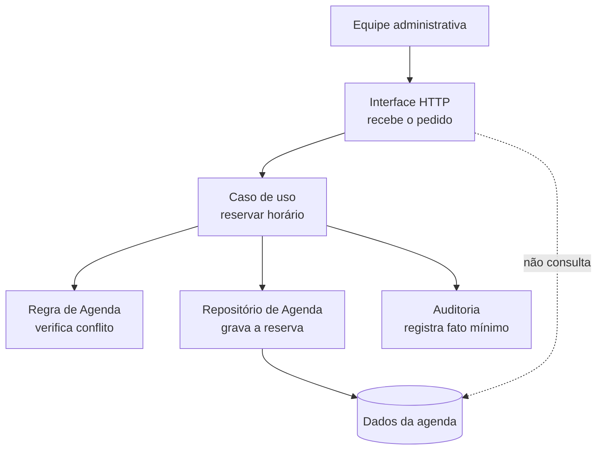
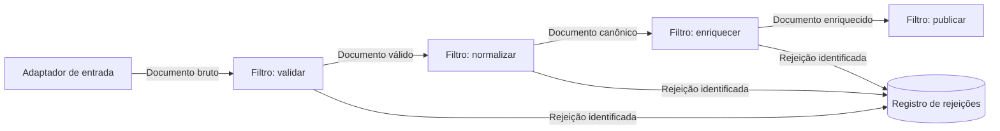
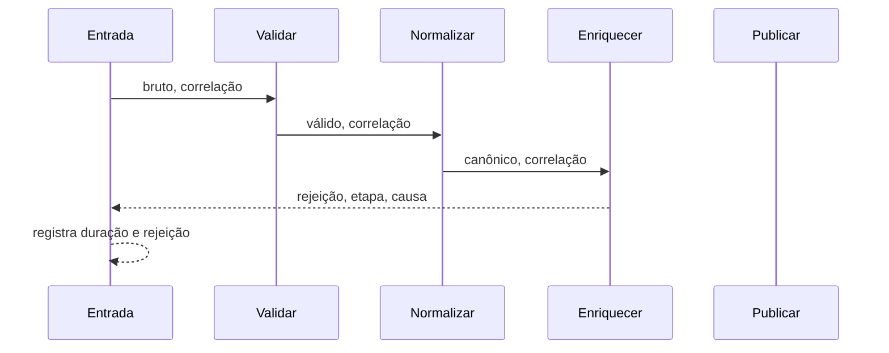
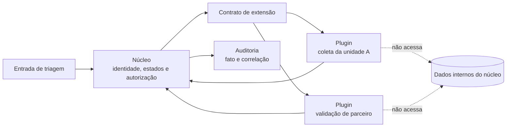

# Exemplo arquitetural: processamento de documentos

## Contexto antes da estrutura

Uma organização recebe documentos em JSON, CSV e XML. Todos precisam passar por validação, normalização, enriquecimento e publicação. O volume esperado é de duzentos mil documentos por hora, mas novos formatos entram apenas algumas vezes ao ano. Uma equipe pequena opera a solução em um único ambiente.

As funções são simples; a dificuldade está nas forças. Throughput e rastreabilidade de falhas têm prioridade alta. Modificabilidade dos formatos tem prioridade média. A operação não deve exigir uma unidade independente por etapa. O cenário de qualidade principal é: durante uma carga de duzentos mil documentos, a solução deve processar pelo menos sessenta itens por segundo e identificar a etapa responsável por cada rejeição.

## Alternativas comparadas

Camadas separariam entrada, aplicação, regra e infraestrutura. Isso ajuda a testar validações, mas não torna a sequência de transformações explícita. Microkernel isolaria leitores por formato, porém não organiza sozinho as etapas comuns. Monólito modular manteria implantação simples e limites por capacidade. Pipes and filters modelaria diretamente o fluxo e permitiria medir cada transformação.

A escolha inicial combina um monólito modular como limite de implantação, pipes and filters na capacidade de processamento e pequenos adapters para os formatos. Combinar estilos é aceitável quando cada um resolve uma escala declarada. O risco seria usar muitos nomes sem restrições verificáveis.

## A mesma plataforma, três estruturas deliberadas

O exemplo a seguir usa quatro capacidades administrativas fictícias. **Agenda** recebe pedidos de horário; **Triagem** aplica etapas administrativas que variam por unidade; **Faturamento** transforma registros para envio a parceiros; **Auditoria** recebe fatos mínimos para rastreabilidade. Não há dado de paciente nem integração real: os nomes permitem enxergar a responsabilidade de cada fronteira.

### Agenda em camadas: uma reserva não pula a regra



*Figura 1 — Uma reserva atravessa fronteiras de camadas antes de ser persistida.*

**Leitura textual da figura:** a Equipe administrativa envia o pedido à Interface HTTP. A interface chama o Caso de uso, que consulta a Regra de Agenda antes de pedir ao Repositório que grave os Dados da agenda. O Caso de uso também registra um fato mínimo em Auditoria. A ligação pontilhada mostra que a interface não consulta os dados diretamente; a regra de conflito não pode ser ignorada por uma tela.

Esse arranjo favorece consistência local e teste da regra de conflito sem banco. Se quase toda leitura apenas atravessar todas as camadas sem validação ou decisão, a equipe mede o custo e registra um caminho de leitura justificado; não cria atalhos silenciosos.

### Faturamento como fluxo: cada transformação deixa uma pista



**Leitura textual da figura:** o Adaptador de entrada entrega um documento bruto ao filtro de validação. Documentos válidos atravessam normalização, enriquecimento e publicação; uma rejeição em validação, normalização ou enriquecimento é registrada com sua etapa. Nenhum filtro consulta o estado interno de outro filtro.

As setas nomeiam o contrato de cada pipe. Cada filtro recebe um valor e devolve sucesso com um novo valor ou rejeição com identificador, etapa e causa. Os filtros não consultam o estado interno uns dos outros. Essa restrição permite testar cada etapa e compor o fluxo.

## Uma execução observável



**Leitura textual da figura:** a Entrada envia um documento com correlação a Validar, que passa um valor válido para Normalizar e depois para Enriquecer. A falha de enriquecimento retorna à Entrada com etapa e causa; a Entrada registra duração e rejeição. A sequência evidencia que a correlação acompanha o fluxo, inclusive na falha.

A sequência mostra uma falha no enriquecimento. A correlação atravessa os pipes, permitindo relacionar o documento à etapa. Uma versão que apenas lança uma mensagem genérica atenderia à transformação, mas não à rastreabilidade.

### Triagem como núcleo e plugins: variar sem reescrever o comum



*Figura 2 — O núcleo oferece o contrato; plugins devolvem resultados sem acessar seus dados internos.*

**Leitura textual da figura:** a Entrada de triagem entrega a solicitação ao Núcleo, que controla identidade, estados e autorização. O Núcleo expõe um Contrato de extensão usado por dois plugins: uma coleta específica da unidade A e uma validação de parceiro. Os plugins devolvem resultados ao Núcleo, que produz fato com correlação para Auditoria. As ligações pontilhadas indicam que plugins não leem os dados internos do núcleo diretamente.

Para essa estrutura ser honesta, o contrato deve especificar entrada, resultado, erros e versão. Se um plugin precisa editar tabelas internas ou se o núcleo conhece regras particulares de todos os plugins, a equipe encontrou core creep e deve revisar a fronteira em vez de chamar o acoplamento de extensibilidade.

## Do cenário à evidência

Um teste funcional usa exemplos pequenos para verificar ordem e transformação. Um teste de desempenho usa lote representativo, mede duração total e calcula throughput. Um teste de falha injeta um documento sem referência de enriquecimento e verifica etapa e correlação. O resultado precisa informar ambiente e massa utilizada; um número sem condições não pode sustentar a decisão.

Também há limites não resolvidos. Se o enriquecimento depender de um serviço remoto lento, o filtro pode dominar toda a vazão. Paralelizar exige decidir ordenação e concorrência. Persistir resultados intermediários melhora recuperação, mas acrescenta estado. Esses aspectos viram forças de um ADR posterior, em vez de serem ocultados pelo desenho inicial.

## Estrutura de código possível

Uma implementação pequena pode manter `Filtro` como protocolo, filtros puros em módulos separados e `Pipeline` como coordenador. O coordenador conhece a ordem, mas não o conteúdo interno das etapas. Adaptadores convertem formatos externos para o documento canônico.

```text
processamento/
├── aplicacao/
│   └── pipeline.py
├── dominio/
│   ├── documento.py
│   └── resultado.py
├── filtros/
│   ├── validar.py
│   ├── normalizar.py
│   └── enriquecer.py
└── adaptadores/
    ├── json.py
    ├── csv.py
    └── xml.py
```

Essa árvore não prova modularidade. Imports e chamadas reais precisam respeitar a direção declarada. Um teste pode impedir `dominio` de importar `adaptadores`. Outro pode construir o pipeline com um filtro substituto, demonstrando composição.

## Equivalências em Java e .NET

O raciocínio não depende da linguagem. Em Python, um `Protocol` representa o contrato de filtro e pytest executa exemplos parametrizados. Em Java, uma `interface Filtro` e JUnit cumprem papéis equivalentes; ArchUnit verifica dependências entre pacotes. Em .NET, uma interface `IFiltro`, xUnit e NetArchTest permitem a mesma estrutura e a mesma verificação.

| Intenção | Python | Java | .NET |
| --- | --- | --- | --- |
| contrato do filtro | `typing.Protocol` | `interface` | `interface` |
| resultado explícito | `dataclass` | `record` | `record` |
| teste parametrizado | pytest | JUnit 5 | xUnit |
| regra de dependência | import-linter | ArchUnit | NetArchTest |
| modelo como código | Structurizr DSL | Structurizr DSL | Structurizr DSL |

Ferramentas equivalentes não significam código idêntico. Preserve responsabilidades, conectores, restrições e evidências. Esse é o conteúdo arquitetural que deve sobreviver à troca do ecossistema.

## Decisão provisória

O ADR deste exemplo aceitaria pipes and filters para explicitar transformações e manteria uma implantação única. Registraria o custo de contratos intermediários, correlação e eventual controle de concorrência. A evidência inicial seria o teste de throughput e rejeição. O gatilho de revisão seria a entrada de uma etapa com escala ou disponibilidade muito diferente das demais.

O exemplo demonstra o método sem depender do domínio hospitalar: começar pelo cenário, comparar alternativas, desenhar restrições, observar comportamento e declarar limites. Agora a mesma sequência pode ser aplicada ao caso integrador.
