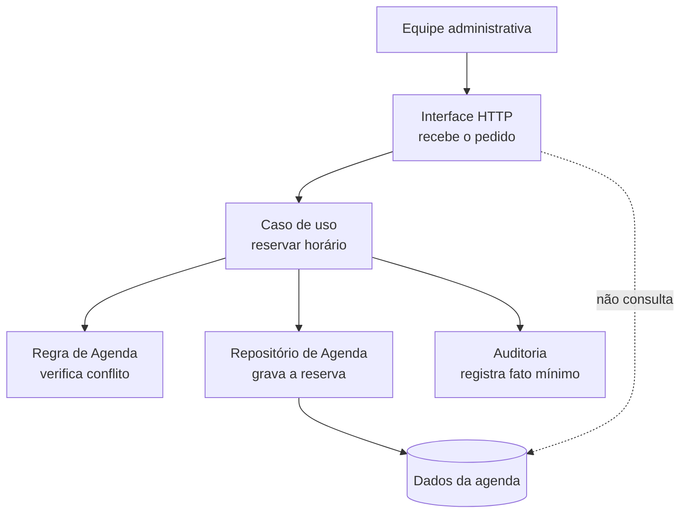
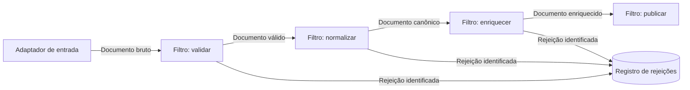
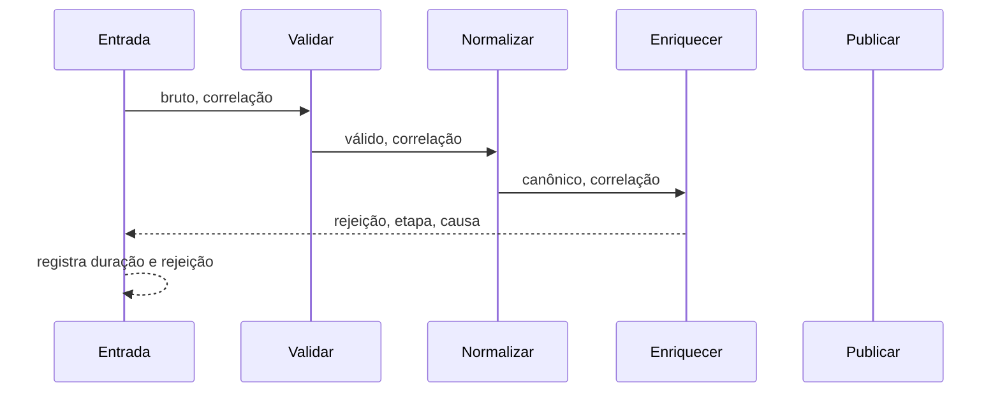
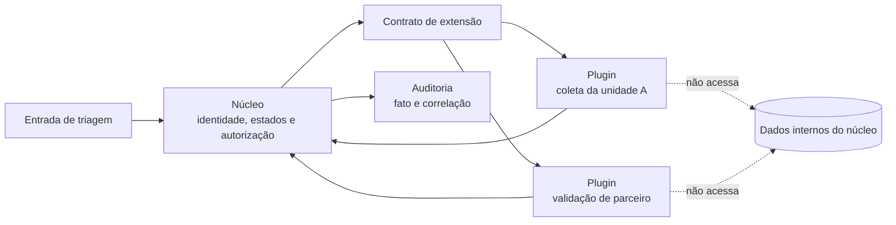

# Exemplo arquitetural: processamento de documentos

## O que este exemplo aplica

Esta página não apresenta conceito novo. Ela mostra em uso o vocabulário das duas páginas anteriores, na ordem em que um arquiteto o usaria. Se algum termo da tabela ainda parecer vago, abra o link antes de continuar: sem o vocabulário, os desenhos viram figuras bonitas sem consequência.

| Conceito | Onde foi definido | Onde ele aparece nesta página |
| --- | --- | --- |
| Estilo como elementos, conectores e restrições | [Estilos arquiteturais](conceitos.md#estilos-arquiteturais) | cada estrutura nomeia seus elementos, o que os liga e o que fica proibido |
| Família "organização interna" | [Organização interna](conceitos.md#organizacao-interna) | camadas na agenda, microkernel na triagem e monólito modular como limite de implantação |
| Família "integração e comunicação" | [Integração e comunicação](conceitos.md#integracao-e-comunicacao) | pipes and filters no faturamento |
| Cenário de atributo de qualidade | [Atributos de qualidade](../referencia/atributos-de-qualidade.md#como-usar-na-decisao) | a seção seguinte, que vem antes de qualquer caixa desenhada |
| Camada fechada e anti-padrão do sumidouro | [Camadas](padroes-e-decisoes.md#camadas) | figura 19 e o parágrafo logo abaixo dela |
| Filtro, pipe e rejeição explícita | [Pipes and Filters](padroes-e-decisoes.md#pipes-and-filters) | figuras 20 e 21 |
| Núcleo, contrato de extensão e core creep | [Microkernel](padroes-e-decisoes.md#microkernel) | figura 22 |
| ADR como decisão revisável | [ADR](padroes-e-decisoes.md#adr-o-mecanismo-para-escolher-estilos) | seção "Decisão provisória" |

A ordem das seções também é conteúdo: ela repete a cadeia de raciocínio da unidade.

1. **Contexto e força priorizada** — "Contexto antes da estrutura" declara volume, ritmo de mudança e equipe antes de desenhar.
2. **Alternativas** — "Alternativas comparadas" examina os quatro estilos com o mesmo critério.
3. **Consequências** — as três estruturas mostram o que cada escolha permite e o que ela proíbe.
4. **Evidência** — "Do cenário à evidência" descreve como medir o que foi prometido.
5. **Decisão revisável** — "Decisão provisória" registra escolha, custo assumido e gatilho de revisão.

Ler os desenhos fora dessa ordem produz o erro mais comum de quem começa em arquitetura: escolher a figura preferida e procurar depois uma justificativa para ela.

## Contexto antes da estrutura

Uma organização recebe JSON, CSV e XML para validação, normalização, enriquecimento e publicação. Espera duzentos mil documentos por hora; novos formatos entram poucas vezes por ano; uma equipe pequena opera um único ambiente.

Prioridades são throughput e rastreabilidade; modificabilidade é média. Durante a carga, a solução deve processar sessenta itens por segundo e identificar a etapa de cada rejeição.

Os dois parágrafos acima são um cenário de atributo de qualidade escrito em prosa. Nas seis partes de [atributos de qualidade](../referencia/atributos-de-qualidade.md#como-usar-na-decisao): a **fonte** são os sistemas parceiros; o **estímulo** é a chegada de documentos em três formatos; o **ambiente** é a carga esperada de duzentos mil documentos por hora; o **artefato** é a capacidade de processamento; a **resposta** é transformar e identificar a etapa de cada rejeição; a **medida** são sessenta itens por segundo com etapa registrada. O exercício começa aqui porque nenhuma das estruturas seguintes pode ser comparada sem uma medida comum.

## Alternativas comparadas

Camadas separariam entrada, aplicação, regra e infraestrutura. Isso ajuda a testar validações, mas não torna a sequência de transformações explícita. Microkernel isolaria leitores por formato, porém não organiza sozinho as etapas comuns. Monólito modular manteria implantação simples e limites por capacidade. Pipes and filters modelaria diretamente o fluxo e permitiria medir cada transformação.

Esse parágrafo não é preferência pessoal: cada estilo foi lido pela mesma grade de [padrões e decisões](padroes-e-decisoes.md) — a tabela de características avaliadas de 1 a 5 e os blocos "quando usar" e "quando não usar" de cada estilo. Camadas não perdem por serem antigas; perdem porque a grade mostra que elas não tornam a sequência de transformações visível, e é isso que a força priorizada exige. Se a força priorizada fosse outra, o resultado mudaria — comparar com a mesma grade é o que torna a divergência discutível.

A escolha inicial combina um monólito modular como limite de implantação, pipes and filters na capacidade de processamento e pequenos adapters para os formatos. Combinar estilos é aceitável quando cada um resolve uma escala declarada. O risco seria usar muitos nomes sem restrições verificáveis.

## A mesma plataforma, três estruturas deliberadas

O exemplo a seguir usa quatro capacidades administrativas fictícias. **Agenda** recebe pedidos de horário; **Triagem** aplica etapas administrativas que variam por unidade; **Faturamento** transforma registros para envio a parceiros; **Auditoria** recebe fatos mínimos para rastreabilidade. Não há dado de paciente nem integração real: os nomes permitem enxergar a responsabilidade de cada fronteira.

### Agenda em camadas: uma reserva não pula a regra


```mermaid
flowchart TB
    C["Equipe administrativa"] --> H["Interface HTTP\nrecebe o pedido"]
    H --> U["Caso de uso\nreservar horário"]
    U --> R["Regra de Agenda\nverifica conflito"]
    U --> P["Repositório de Agenda\ngrava a reserva"]
    P --> D[("Dados da agenda")]
    H -. "não consulta" .-> D
    U --> A["Auditoria\nregistra fato mínimo"]
```

**Texto alternativo:** fluxo de reserva em camadas: a interface chama o caso de uso, que aplica a regra de conflito antes de persistir; a interface não acessa os dados diretamente.

*Figura 19 — Uma reserva atravessa fronteiras de camadas antes de ser persistida. Fonte: curso.*

**Leitura textual da figura:** a Equipe administrativa envia o pedido à Interface HTTP. A interface chama o Caso de uso, que consulta a Regra de Agenda antes de pedir ao Repositório que grave os Dados da agenda. O Caso de uso também registra um fato mínimo em Auditoria. A ligação pontilhada mostra que a interface não consulta os dados diretamente; a regra de conflito não pode ser ignorada por uma tela.

Esse arranjo favorece consistência local e teste da regra de conflito sem banco. Se quase toda leitura apenas atravessar todas as camadas sem validação ou decisão, a equipe mede o custo e registra um caminho de leitura justificado; não cria atalhos silenciosos.

**Conceito aplicado:** a ligação pontilhada é a definição de *camada fechada* em funcionamento — a interface não pula a camada seguinte para consultar dados. O parágrafo acima descreve o anti-padrão do *sumidouro*: quando quase toda requisição apenas atravessa camadas sem decidir nada, o estilo cobra latência sem devolver benefício. Os dois termos foram definidos em [Camadas](padroes-e-decisoes.md#camadas); aqui eles deixam de ser definição e viram restrição desenhada, que o teste de dependências pode verificar.

[Aprofundar Camadas](padroes-e-decisoes.md#camadas)

### Faturamento como fluxo: cada transformação deixa uma pista


```mermaid
flowchart LR
    I["Adaptador de entrada"] -->|"Documento bruto"| V["Filtro: validar"]
    V -->|"Documento válido"| N["Filtro: normalizar"]
    N -->|"Documento canônico"| E["Filtro: enriquecer"]
    E -->|"Documento enriquecido"| P["Filtro: publicar"]
    V -->|"Rejeição identificada"| Q[("Registro de rejeições")]
    N -->|"Rejeição identificada"| Q
    E -->|"Rejeição identificada"| Q
```

**Texto alternativo:** pipeline de faturamento no qual validar, normalizar, enriquecer e publicar recebem documentos em sequência; rejeições seguem para um registro com etapa identificada.

*Figura 20 — Transformações independentes conservam o contexto de uma rejeição. Fonte: curso.*

**Leitura textual da figura:** o Adaptador de entrada entrega um documento bruto ao filtro de validação. Documentos válidos atravessam normalização, enriquecimento e publicação; uma rejeição em validação, normalização ou enriquecimento é registrada com sua etapa. Nenhum filtro consulta o estado interno de outro filtro.

As setas nomeiam o contrato de cada pipe. Cada filtro recebe um valor e devolve sucesso com um novo valor ou rejeição com identificador, etapa e causa. Os filtros não consultam o estado interno uns dos outros. Essa restrição permite testar cada etapa e compor o fluxo.

**Conceito aplicado:** os elementos do desenho são os quatro tipos canônicos de filtro apresentados em [Pipes and Filters](padroes-e-decisoes.md#pipes-and-filters). O adaptador de entrada é o *producer*; validar é um *tester*, porque avalia e pode descartar; normalizar e enriquecer são *transformers*, porque transformam sem descartar; publicar é o *consumer*. A ausência de estado compartilhado, que lá aparece como premissa do estilo, aqui vira a proibição visível de um filtro consultar o estado interno de outro — e é essa proibição que permite reordenar ou substituir uma etapa sem reescrever as demais.

[Aprofundar Pipes and Filters](padroes-e-decisoes.md#pipes-and-filters)

## Uma execução observável


```mermaid
sequenceDiagram
    participant Entrada
    participant Validar
    participant Normalizar
    participant Enriquecer
    participant Publicar
    Entrada->>Validar: bruto, correlação
    Validar->>Normalizar: válido, correlação
    Normalizar->>Enriquecer: canônico, correlação
    Enriquecer-->>Entrada: rejeição, etapa, causa
    Entrada-->>Entrada: registra duração e rejeição
```

**Texto alternativo:** sequência de processamento em que a correlação acompanha o documento e uma falha no enriquecimento retorna com etapa e causa.

*Figura 21 — Uma falha parcial preserva correlação, etapa e causa. Fonte: curso.*

**Leitura textual da figura:** a Entrada envia um documento com correlação a Validar, que passa um valor válido para Normalizar e depois para Enriquecer. A falha de enriquecimento retorna à Entrada com etapa e causa; a Entrada registra duração e rejeição. A sequência evidencia que a correlação acompanha o fluxo, inclusive na falha.

A sequência mostra uma falha no enriquecimento. A correlação atravessa os pipes, permitindo relacionar o documento à etapa. Uma versão que apenas lança uma mensagem genérica atenderia à transformação, mas não à rastreabilidade.

### Triagem como núcleo e plugins: variar sem reescrever o comum


```mermaid
flowchart LR
    I["Entrada de triagem"] --> N["Núcleo\nidentidade, estados e autorização"]
    N --> C["Contrato de extensão"]
    C --> P1["Plugin\ncoleta da unidade A"]
    C --> P2["Plugin\nvalidação de parceiro"]
    P1 --> N
    P2 --> N
    N --> AU["Auditoria\nfato e correlação"]
    P1 -. "não acessa" .-> DB[("Dados internos do núcleo")]
    P2 -. "não acessa" .-> DB
```

**Texto alternativo:** núcleo de triagem mantém estados, autorização e contrato; plugins devolvem resultados pelo contrato sem acessar dados internos.

*Figura 22 — O núcleo oferece o contrato; plugins devolvem resultados sem acessar seus dados internos. Fonte: curso.*

**Leitura textual da figura:** a Entrada de triagem entrega a solicitação ao Núcleo, que controla identidade, estados e autorização. O Núcleo expõe um Contrato de extensão usado por dois plugins: uma coleta específica da unidade A e uma validação de parceiro. Os plugins devolvem resultados ao Núcleo, que produz fato com correlação para Auditoria. As ligações pontilhadas indicam que plugins não leem os dados internos do núcleo diretamente.

Para essa estrutura ser honesta, o contrato deve especificar entrada, resultado, erros e versão. Se um plugin precisa editar tabelas internas ou se o núcleo conhece regras particulares de todos os plugins, a equipe encontrou core creep e deve revisar a fronteira em vez de chamar o acoplamento de extensibilidade.

**Conceito aplicado:** núcleo, contrato de extensão e *core creep* vêm de [Microkernel](padroes-e-decisoes.md#microkernel). O desenho torna verificável o que a definição diz em uma frase: as ligações pontilhadas são a fronteira que separa uma extensão de verdade — adicionável, testável e desabilitável pelo contrato — de um acoplamento com nome bonito. Um plugin que precisa do banco do núcleo continua sendo parte do núcleo, ainda que resida em outra pasta.

[Aprofundar Microkernel](padroes-e-decisoes.md#microkernel)

## Do cenário à evidência

Cada teste desta seção devolve uma parte do cenário declarado no início da página; é assim que a promessa vira evidência em vez de intenção. Um teste funcional usa exemplos pequenos para verificar ordem e transformação. Um teste de desempenho usa lote representativo, mede duração total e calcula throughput. Um teste de falha injeta um documento sem referência de enriquecimento e verifica etapa e correlação. O resultado precisa informar ambiente e massa utilizada; um número sem condições não pode sustentar a decisão.

Também há limites não resolvidos. Se o enriquecimento depender de um serviço remoto lento, o filtro pode dominar toda a vazão. Paralelizar exige decidir ordenação e concorrência. Persistir resultados intermediários melhora recuperação, mas acrescenta estado. Esses aspectos viram forças de um ADR posterior, em vez de serem ocultados pelo desenho inicial.

## Estrutura de Projeto

Uma implementação pode separar o coordenador `Pipeline`, os filtros puros e os adaptadores de formato. A árvore indica **responsabilidades**, não dependências automaticamente garantidas:

```text
processamento/
├── aplicacao/
│   └── pipeline.py       ← ordena filtros; não conhece seus detalhes
├── dominio/
│   ├── documento.py      ← modelo canônico
│   └── resultado.py      ← sucesso ou rejeição explícita
├── filtros/
│   ├── validar.py
│   ├── normalizar.py
│   └── enriquecer.py
└── adaptadores/
    ├── json.py
    ├── csv.py
    └── xml.py
```

## Equivalências em Java e .NET

Em Python, um `Protocol` define o filtro; em Java, uma `interface Filtro`; em .NET, `IFiltro`. A equivalência mantém intenção, não código idêntico:

| Intenção             | Python            | Java            | .NET            |
| -------------------- | ----------------- | --------------- | --------------- |
| contrato do filtro   | `typing.Protocol` | `interface`     | `interface`     |
| resultado explícito  | `dataclass`       | `record`        | `record`        |
| teste parametrizado  | pytest            | JUnit 5         | xUnit           |
| regra de dependência | import-linter     | ArchUnit        | NetArchTest     |
| modelo como código   | Structurizr DSL   | Structurizr DSL | Structurizr DSL |

Uma árvore não prova isolamento: teste imports proibidos e substitua um filtro para verificar composição.

## Decisão provisória

O ADR deste exemplo aceitaria pipes and filters para explicitar transformações e manteria uma implantação única. Registraria o custo de contratos intermediários, correlação e eventual controle de concorrência. A evidência inicial seria o teste de throughput e rejeição. O gatilho de revisão seria a entrada de uma etapa com escala ou disponibilidade muito diferente das demais.

O exemplo demonstra o método sem depender do domínio hospitalar: começar pelo cenário, comparar alternativas, desenhar restrições, observar comportamento e declarar limites. Nenhuma etapa aqui foi inventada nesta página — todas vieram das definições de [conceitos](conceitos.md) e de [padrões e decisões](padroes-e-decisoes.md), aplicadas a um problema concreto.

No [estudo de caso](estudo-de-caso.md) você percorre essa mesma sequência, na mesma ordem, produzindo os artefatos em vez de lê-los prontos.
