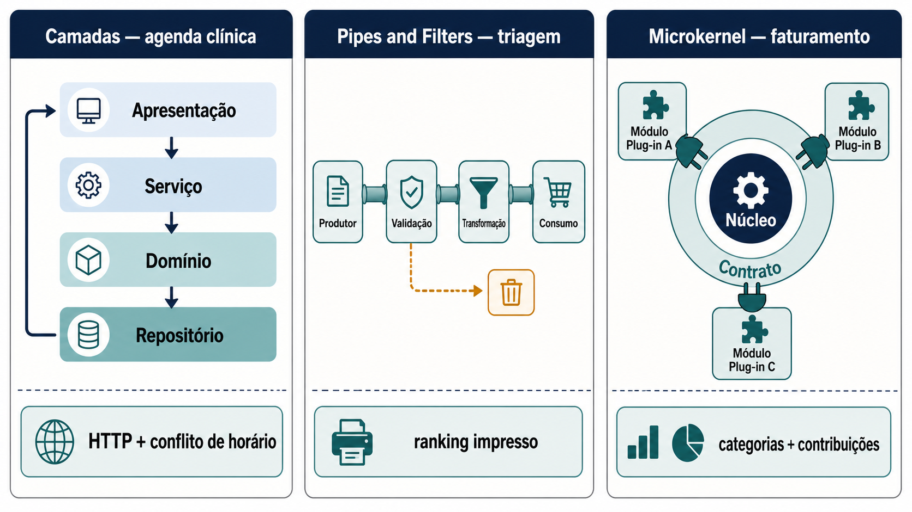
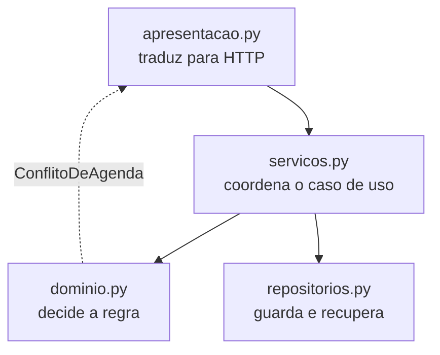
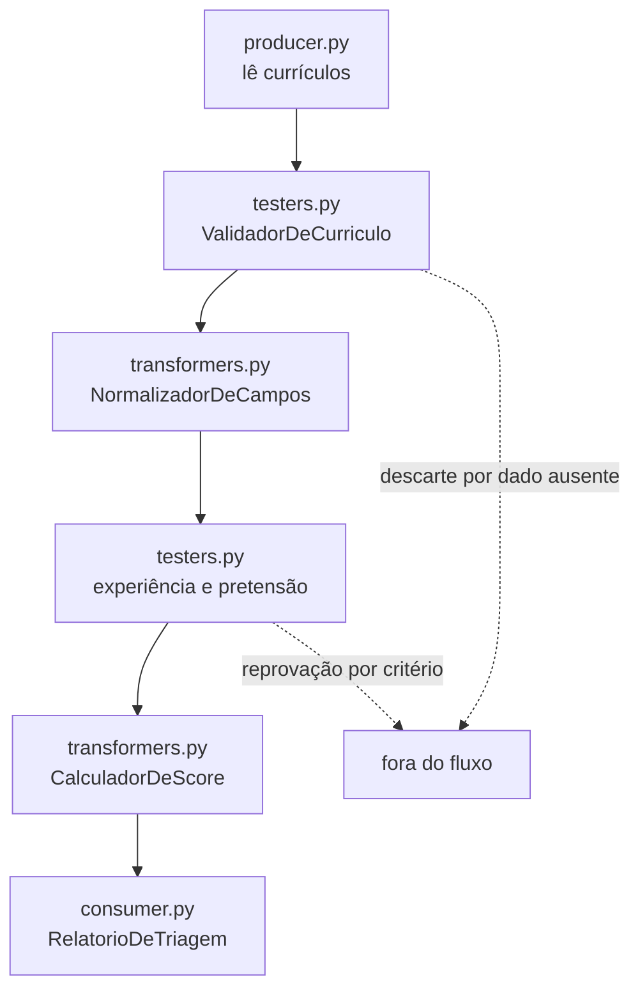
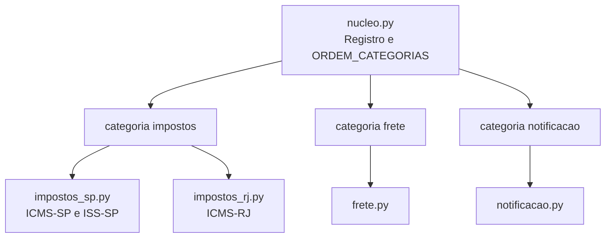

# Oficina de ferramentas: três estilos em código executável

Reserve aproximadamente **120 minutos**. Você vai criar uma pasta vazia, escrever três programas pequenos, um por estilo arquitetural, executá-los e ligar a saída de cada um às responsabilidades que o estilo reparte. Os exemplos usam somente a biblioteca padrão do Python. Não é preciso criar ambiente virtual, instalar pacotes nem clonar repositório.

Cada arquivo aparece na página inteiro, pronto para copiar. O título de cada bloco é um link para o mesmo arquivo no repositório do curso, byte a byte igual ao que está aqui, para quem preferir baixar em vez de copiar.



*Figura 25 — Três estilos, três formas de repartir responsabilidade, três evidências no terminal. Fonte: curso.*

**Leitura textual da figura:** três painéis lado a lado, um por estilo. No primeiro, camadas na agenda clínica, com Apresentação, Serviço, Domínio e Repositório empilhados de cima para baixo e o retorno subindo até a apresentação. A evidência no terminal é uma resposta HTTP com conflito de horário. No segundo, pipes and filters na triagem, com Produtor, Validação, Transformação e Consumo ligados em sequência e um desvio de descarte saindo da Validação. A evidência é o ranking impresso. No terceiro, microkernel no faturamento, com um núcleo cercado por um contrato e três módulos plug-in conectados a ele. A evidência são categorias e contribuições.

## Uso seguro dos arquivos

Todos os arquivos desta oficina são seus, criados por você numa pasta nova. Não há nada compartilhado a proteger, e por isso a regra de segurança é outra: **capture a saída antes de alterar qualquer coisa**. Cada experimento pede uma execução inicial gravada em `saida-antes.txt` e outra, depois da sua alteração, em `saida-depois.txt`. É a comparação entre as duas que vira evidência.

Para voltar ao estado inicial, apague o arquivo que você alterou e copie-o de novo desta página, ou baixe-o pelo link do bloco correspondente. Nenhuma alteração sua afeta o material do curso.

## Ferramenta

Python 3.10 ou mais recente executa os três programas. Um editor de texto qualquer serve para escrever os arquivos. A oficina não requer pacotes, contêineres ou ferramentas adicionais.

## Pré-requisitos

**Objetivo**

Confirmar a versão do Python e preparar a pasta de trabalho.

**Pré-requisito**

Um terminal e um editor de texto. Nada mais.

## Instalação

Não há dependências de projeto a instalar. Confirme o Python e crie a pasta da oficina.

### Windows

No PowerShell:

```powershell
py --version
mkdir oficina-estilos
cd oficina-estilos
```

### macOS

No Terminal:

```bash
python3 --version
mkdir oficina-estilos
cd oficina-estilos
```

### Linux

No Terminal:

```bash
python3 --version
mkdir oficina-estilos
cd oficina-estilos
```

Se `py` no Windows ou `python3` no macOS e no Linux não for reconhecido, instale o Python 3.10 ou superior pelo canal de instalação do seu sistema, feche e reabra o terminal e repita a verificação. Se a versão exibida for anterior à 3.10, atualize pelo mesmo canal.

## Preparação do laboratório (10 minutos)

Dentro de `oficina-estilos`, crie as três pastas de experimento e as duas subpastas que os experimentos 2 e 3 usam.

### Windows

```powershell
mkdir camadas, pipes-and-filters, microkernel
mkdir pipes-and-filters\filtros
mkdir microkernel\plugins
```

### macOS

```bash
mkdir -p camadas pipes-and-filters/filtros microkernel/plugins
```

### Linux

```bash
mkdir -p camadas pipes-and-filters/filtros microkernel/plugins
```

Cada programa é independente e roda a partir da própria pasta, para que os imports locais funcionem.

## Execução
## Experimento 1 — Camadas: agenda clínica (30 minutos)

**Objetivo:**

Observar como apresentação, serviço, domínio e repositório colaboram para criar, conflitar, realizar e cancelar agendamentos.

**Artefato:**

`oficina-estilos/camadas`

**Pré-condição:**

Terminal aberto na pasta da oficina e Python 3.10+ confirmado com `py --version` no Windows ou `python3 --version` no macOS e no Linux.

O estilo reparte o trabalho em quatro camadas, e o sentido do fluxo é sempre o mesmo.



**Texto alternativo:** quatro caixas empilhadas representando as camadas de apresentação, serviço, domínio e repositório, com o fluxo descendo da apresentação para o serviço e dele para domínio e repositório, e uma seta tracejada de exceção voltando do domínio à apresentação.

*Figura 26 — As quatro camadas da agenda clínica e o sentido do fluxo. Fonte: curso.*

**Leitura textual da figura:** a apresentação recebe a chamada e a entrega ao serviço. O serviço coordena o caso de uso e consulta duas camadas abaixo dele, o domínio para decidir a regra e o repositório para guardar e recuperar. Uma seta tracejada sobe do domínio até a apresentação, representando a exceção de conflito de agenda: quem detecta a violação é o domínio, e quem a traduz em código HTTP é a apresentação. Nenhuma seta liga a apresentação diretamente ao repositório.

Crie os cinco arquivos abaixo dentro de `camadas`.

[`dominio.py`](https://github.com/marco-mendes/arquitetura-software/blob/main/oficinas/modulo-1/camadas/dominio.py)

```python
"""Camada de domínio: as regras do negócio, sem saber que HTTP existe."""

from dataclasses import dataclass


@dataclass(frozen=True)
class Horario:
    inicio: str
    fim: str

    def conflita_com(self, outro: "Horario") -> bool:
        return self.inicio < outro.fim and outro.inicio < self.fim

    def __str__(self) -> str:
        return f"{self.inicio}–{self.fim}"


@dataclass
class Consulta:
    id: int
    medico: str
    paciente: str
    horario: Horario
    status: str = "agendada"

    def realizar(self) -> None:
        self.status = "realizada"

    def cancelar(self) -> None:
        self.status = "cancelada"


class ConflitoDeAgenda(Exception):
    """Regra de domínio violada. Quem traduz isto para HTTP é a apresentação."""
```

[`repositorios.py`](https://github.com/marco-mendes/arquitetura-software/blob/main/oficinas/modulo-1/camadas/repositorios.py)

```python
"""Camada de repositório: guarda e recupera consultas.

Trocar a lista em memória por um banco de dados muda somente este arquivo.
"""

from dataclasses import dataclass, field

from dominio import Consulta, Horario


@dataclass
class RepositorioDeConsultas:
    _consultas: list[Consulta] = field(default_factory=list)
    _proximo_id: int = 1

    def salvar(self, medico: str, paciente: str, horario: Horario) -> Consulta:
        consulta = Consulta(self._proximo_id, medico, paciente, horario)
        self._consultas.append(consulta)
        self._proximo_id += 1
        return consulta

    def agendadas_do_medico(self, medico: str) -> list[Consulta]:
        return [
            c for c in self._consultas if c.medico == medico and c.status == "agendada"
        ]

    def por_id(self, consulta_id: int) -> Consulta | None:
        return next((c for c in self._consultas if c.id == consulta_id), None)

    def todas(self) -> list[Consulta]:
        return list(self._consultas)
```

[`servicos.py`](https://github.com/marco-mendes/arquitetura-software/blob/main/oficinas/modulo-1/camadas/servicos.py)

```python
"""Camada de serviço: coordena o caso de uso.

Ela chama o domínio para decidir e o repositório para guardar. Não conhece
HTTP e não sabe se o armazenamento é memória, arquivo ou banco.
"""

from dominio import ConflitoDeAgenda, Consulta, Horario
from repositorios import RepositorioDeConsultas


class ServicoDeAgenda:
    def __init__(self, repositorio: RepositorioDeConsultas) -> None:
        self._repositorio = repositorio

    def agendar(self, medico: str, paciente: str, inicio: str, fim: str) -> Consulta:
        horario = Horario(inicio, fim)
        for ocupada in self._repositorio.agendadas_do_medico(medico):
            if ocupada.horario.conflita_com(horario):
                raise ConflitoDeAgenda(
                    f"Dr(a). {medico} já tem consulta das {ocupada.horario.inicio} "
                    f"às {ocupada.horario.fim}."
                )
        return self._repositorio.salvar(medico, paciente, horario)

    def realizar(self, consulta_id: int) -> Consulta | None:
        consulta = self._repositorio.por_id(consulta_id)
        if consulta:
            consulta.realizar()
        return consulta

    def cancelar(self, consulta_id: int) -> Consulta | None:
        consulta = self._repositorio.por_id(consulta_id)
        if consulta:
            consulta.cancelar()
        return consulta

    def agenda(self) -> list[Consulta]:
        return self._repositorio.todas()
```

[`apresentacao.py`](https://github.com/marco-mendes/arquitetura-software/blob/main/oficinas/modulo-1/camadas/apresentacao.py)

```python
"""Camada de apresentação: traduz chamadas e erros em códigos HTTP.

Ela não decide nenhuma regra. O 409 nasce aqui, mas o motivo dele nasce no
domínio, e é essa separação que o estilo em camadas existe para manter.
"""

from dominio import ConflitoDeAgenda, Consulta
from servicos import ServicoDeAgenda


class ApresentacaoHTTP:
    def __init__(self, servico: ServicoDeAgenda) -> None:
        self._servico = servico

    def post_consultas(self, medico: str, paciente: str, inicio: str, fim: str) -> None:
        try:
            consulta = self._servico.agendar(medico, paciente, inicio, fim)
        except ConflitoDeAgenda as erro:
            print(f"HTTP 409 CONFLICT → {{'erro': '{erro}'}}")
            return
        print(f"HTTP 201 CREATED → {self._como_dicionario(consulta)}")

    def post_realizacao(self, consulta_id: int) -> None:
        self._responder(self._servico.realizar(consulta_id), consulta_id)

    def delete_consulta(self, consulta_id: int) -> None:
        self._responder(self._servico.cancelar(consulta_id), consulta_id)

    def get_agenda(self) -> None:
        for consulta in self._servico.agenda():
            print(f"  {self._como_dicionario(consulta)}")

    def _responder(self, consulta: Consulta | None, consulta_id: int) -> None:
        if consulta is None:
            print(f"HTTP 404 NOT FOUND → {{'erro': 'consulta {consulta_id} inexistente'}}")
            return
        print(f"HTTP 200 OK → {self._como_dicionario(consulta)}")

    @staticmethod
    def _como_dicionario(consulta: Consulta) -> dict:
        return {
            "id": consulta.id,
            "medico": consulta.medico,
            "paciente": consulta.paciente,
            "horario": str(consulta.horario),
            "status": consulta.status,
        }
```

[`main.py`](https://github.com/marco-mendes/arquitetura-software/blob/main/oficinas/modulo-1/camadas/main.py)

```python
"""Cenário que exercita as quatro camadas da agenda clínica."""

from apresentacao import ApresentacaoHTTP
from repositorios import RepositorioDeConsultas
from servicos import ServicoDeAgenda


def main() -> None:
    api = ApresentacaoHTTP(ServicoDeAgenda(RepositorioDeConsultas()))

    print("== Agendamentos válidos ==")
    api.post_consultas("Dra. Ana Silva", "Maria Santos", "09:00", "09:30")
    api.post_consultas("Dra. Ana Silva", "João Lima", "10:00", "10:30")
    api.post_consultas("Dr. Paulo Reis", "Ana Costa", "09:00", "09:30")

    print("\n== Conflito de horário ==")
    api.post_consultas("Dra. Ana Silva", "Carlos Dias", "09:15", "09:45")

    print("\n== Realizar e cancelar ==")
    api.post_realizacao(1)
    api.delete_consulta(2)

    print("\n== Agenda final ==")
    api.get_agenda()


if __name__ == "__main__":
    main()
```

**Execute**

Entre na pasta do experimento e rode o programa. No Windows use `py` no lugar de `python3`.

```bash
cd camadas
python3 main.py
```

**Observe**

O programa imprime quatro blocos. No primeiro, três agendamentos válidos retornam `HTTP 201 CREATED`:

```text
HTTP 201 CREATED → {'id': 1, 'medico': 'Dra. Ana Silva', 'paciente': 'Maria Santos', 'horario': '09:00–09:30', 'status': 'agendada'}
```

No segundo, uma tentativa de marcar consulta em horário já ocupado retorna:

```text
HTTP 409 CONFLICT → {'erro': 'Dr(a). Dra. Ana Silva já tem consulta das 09:00 às 09:30.'}
```

O detalhe que interessa não é o `409` em si, e sim **onde ele nasce**. A regra que detecta a sobreposição está em `dominio.py`, junto do conceito de horário. Quem a traduz para um código HTTP é `apresentacao.py`, na borda. O domínio não sabe o que é HTTP, e a apresentação não sabe o que faz dois horários conflitarem.

**Compare**

Compare a trajetória de uma chamada bem-sucedida com a de um conflito, e verá que ambas atravessam as mesmas quatro camadas na mesma ordem. Essa disciplina de sentido único é o que o módulo chama de [camadas](padroes-e-decisoes.md#camadas). Se a apresentação pudesse consultar o repositório diretamente para "otimizar", a camada de serviço deixaria de ser o lugar único onde o caso de uso está descrito.

Repare também no que o repositório entrega: uma lista em memória. Trocá-la por um banco real exigiria alterar `repositorios.py` e mais nada. É a promessa do estilo sendo verificável em três minutos de leitura.

Questões exploratórias:

1. Onde a entrada é convertida em uma chamada ao serviço e onde a resposta HTTP é formatada?
2. Qual regra impede o conflito de agenda? Que objeto do domínio ajuda a expressá-la?
3. Que dependência precisaria mudar para substituir o armazenamento em memória, e qual camada deveria permanecer estável?

Antes de alterar qualquer condição, grave a execução inicial. No PowerShell:

```powershell
py main.py | Tee-Object -FilePath saida-antes.txt
```

No macOS e no Linux:

```bash
python3 main.py | tee saida-antes.txt
```

Altere uma condição já existente no cenário ou em uma regra. Depois capture a execução posterior. No PowerShell:

```powershell
py main.py | Tee-Object -FilePath saida-depois.txt
```

No macOS e no Linux:

```bash
python3 main.py | tee saida-depois.txt
```

Descreva o que mudou na saída e qual responsabilidade foi afetada. Não há uma alteração canônica: escolha uma hipótese que você consiga explicar. Para reverter, copie de novo o arquivo alterado a partir desta página.

## Experimento 2 — Pipes and Filters: triagem de currículos (35 minutos)

**Objetivo:**

Rastrear como dados percorrem filtros de produção, validação, transformação e consumo até formar o ranking.

**Artefato:**

`oficina-estilos/pipes-and-filters`

**Pré-condição:**

Terminal aberto na pasta da oficina e Python 3.10+ confirmado com `py --version` no Windows ou `python3 --version` no macOS e no Linux.

Aqui o dado atravessa uma sequência e não volta. Cada filtro recebe, decide e passa adiante.



**Texto alternativo:** sequência horizontal de seis estágios, do produtor que lê currículos ao consumidor que imprime o relatório, com duas setas tracejadas saindo do validador e dos filtros de critério em direção a uma caixa que representa a saída do fluxo.

*Figura 27 — O fluxo de triagem e os dois lugares onde um item sai dele. Fonte: curso.*

**Leitura textual da figura:** o produtor entrega os currículos ao validador, que os passa ao normalizador, dele aos filtros de experiência e pretensão, depois ao calculador de score e por fim ao relatório. Duas setas tracejadas apontam para fora do fluxo. A primeira sai do validador e representa o descarte por dado ausente. A segunda sai dos filtros de critério e representa a reprovação por regra de negócio. Cada item deixa o fluxo no estágio que sabe julgá-lo, e nenhum estágio conhece o critério dos outros.

Crie os sete arquivos abaixo. Os quatro últimos ficam dentro de `pipes-and-filters/filtros`.

[`dominio.py`](https://github.com/marco-mendes/arquitetura-software/blob/main/oficinas/modulo-1/pipes-and-filters/dominio.py)

```python
"""O dado que atravessa o fluxo, e nada mais."""

from dataclasses import dataclass, field


@dataclass
class Curriculo:
    id: int
    nome: str | None
    anos_experiencia: int
    pretensao: int
    habilidades: list[str] = field(default_factory=list)
    cidade: str = ""
    score: int = 0
    compativeis: list[str] = field(default_factory=list)


@dataclass(frozen=True)
class Vaga:
    titulo: str
    anos_minimos: int
    teto_salarial: int
    habilidades: tuple[str, ...]
```

[`framework.py`](https://github.com/marco-mendes/arquitetura-software/blob/main/oficinas/modulo-1/pipes-and-filters/framework.py)

```python
"""O orquestrador do fluxo.

Ele não conhece nenhum critério de triagem. Sabe apenas que cada filtro
recebe um item, devolve um item ou devolve None para tirá-lo do fluxo.
"""

from dominio import Curriculo


class Filtro:
    """Contrato único que todos os filtros cumprem."""

    def processar(self, item: Curriculo) -> Curriculo | None:
        raise NotImplementedError


class Pipeline:
    def __init__(self) -> None:
        self._filtros: list[Filtro] = []

    def adicionar(self, filtro: Filtro) -> "Pipeline":
        self._filtros.append(filtro)
        return self

    def executar(self, itens: list[Curriculo]) -> list[Curriculo]:
        """Cada filtro processa a corrente inteira antes de passá-la adiante."""
        corrente = list(itens)
        for filtro in self._filtros:
            corrente = [
                saida
                for saida in (filtro.processar(item) for item in corrente)
                if saida is not None
            ]
        return corrente

    def __str__(self) -> str:
        nomes = " → ".join(type(f).__name__ for f in self._filtros)
        return f"Pipeline({nomes})"
```

[`filtros/__init__.py`](https://github.com/marco-mendes/arquitetura-software/blob/main/oficinas/modulo-1/pipes-and-filters/filtros/__init__.py)

```python

```

[`filtros/producer.py`](https://github.com/marco-mendes/arquitetura-software/blob/main/oficinas/modulo-1/pipes-and-filters/filtros/producer.py)

```python
"""Produtor: entrega os dados brutos ao fluxo."""

from dominio import Curriculo


class LeitorDeCurriculos:
    """Na vida real leria um arquivo ou uma fila. Aqui devolve dados fixos."""

    def ler(self) -> list[Curriculo]:
        return [
            Curriculo(1, "Ana Lima", 5, 14000, ["Python", "PostgreSQL", "REST", "Docker"], "São Paulo"),
            Curriculo(2, "Bruno Rocha", 1, 9000, ["Python", "REST"], "Recife"),
            Curriculo(3, None, 4, 15000, ["Python"], "Curitiba"),
            Curriculo(4, "Clara Mendes", 6, 22000, ["Python", "Docker"], "Belo Horizonte"),
            Curriculo(5, "Elena Souza", 7, 17000, ["python", "postgresql", "rest", "docker"], "Porto Alegre"),
            Curriculo(6, "Felipe Nunes", 3, 16000, ["Python", "REST"], "Salvador"),
        ]
```

[`filtros/testers.py`](https://github.com/marco-mendes/arquitetura-software/blob/main/oficinas/modulo-1/pipes-and-filters/filtros/testers.py)

```python
"""Testadores: decidem se o item continua no fluxo.

Cada um sai do fluxo por um motivo diferente, e nenhum conhece o critério
do vizinho.
"""

from dominio import Curriculo, Vaga
from framework import Filtro


class ValidadorDeCurriculo(Filtro):
    """Descarta por dado ausente, antes de qualquer regra de negócio."""

    def processar(self, item: Curriculo) -> Curriculo | None:
        if not item.nome:
            print(f"  [DESCARTADO] Currículo id={item.id}: nome ausente")
            return None
        return item


class FiltroPorExperienciaMinima(Filtro):
    def __init__(self, vaga: Vaga) -> None:
        self._vaga = vaga

    def processar(self, item: Curriculo) -> Curriculo | None:
        if item.anos_experiencia < self._vaga.anos_minimos:
            print(
                f"  [REPROVADO] {item.nome}: {item.anos_experiencia} ano(s) "
                f"< mínimo {self._vaga.anos_minimos}"
            )
            return None
        return item


class FiltroPorPretensaoSalarial(Filtro):
    def __init__(self, vaga: Vaga) -> None:
        self._vaga = vaga

    def processar(self, item: Curriculo) -> Curriculo | None:
        if item.pretensao > self._vaga.teto_salarial:
            print(
                f"  [REPROVADO] {item.nome}: pretensão R${item.pretensao:,} "
                f"> máximo R${self._vaga.teto_salarial:,}"
            )
            return None
        return item
```

[`filtros/transformers.py`](https://github.com/marco-mendes/arquitetura-software/blob/main/oficinas/modulo-1/pipes-and-filters/filtros/transformers.py)

```python
"""Transformadores: mudam o item e o devolvem ao fluxo, sem descartar."""

from dominio import Curriculo, Vaga
from framework import Filtro


class NormalizadorDeCampos(Filtro):
    def processar(self, item: Curriculo) -> Curriculo | None:
        item.nome = item.nome.strip().title()
        item.habilidades = [h.strip().lower() for h in item.habilidades]
        return item


class CalculadorDeScore(Filtro):
    def __init__(self, vaga: Vaga) -> None:
        self._esperadas = [h.lower() for h in vaga.habilidades]

    def processar(self, item: Curriculo) -> Curriculo | None:
        item.compativeis = [h for h in item.habilidades if h in self._esperadas]
        item.score = round(100 * len(item.compativeis) / len(self._esperadas))
        return item
```

[`filtros/consumer.py`](https://github.com/marco-mendes/arquitetura-software/blob/main/oficinas/modulo-1/pipes-and-filters/filtros/consumer.py)

```python
"""Consumidor: o fim do fluxo, onde o resultado vira relatório."""

from dominio import Curriculo
from framework import Filtro


class RelatorioDeTriagem(Filtro):
    def __init__(self) -> None:
        self.aprovados: list[Curriculo] = []

    def processar(self, item: Curriculo) -> Curriculo | None:
        self.aprovados.append(item)
        return item

    def imprimir(self) -> None:
        linha = "═" * 60
        print(f"\n{linha}")
        print(f"  TRIAGEM CONCLUÍDA — {len(self.aprovados)} candidato(s) aprovado(s)")
        print(linha)
        for posicao, item in enumerate(sorted(self.aprovados, key=lambda c: -c.score), 1):
            barras = "█" * (item.score // 10)
            print(f"\n  {posicao}. {item.nome}")
            print(f"     Score: {barras:<10} {item.score}%")
            print(f"     Habilidades compatíveis: {', '.join(item.compativeis)}")
            print(f"     Experiência: {item.anos_experiencia} ano(s) | Pretensão: R${item.pretensao:,}")
            print(f"     Cidade: {item.cidade}")
```

[`main.py`](https://github.com/marco-mendes/arquitetura-software/blob/main/oficinas/modulo-1/pipes-and-filters/main.py)

```python
"""Monta o fluxo e o executa. A ordem dos filtros é a arquitetura."""

from dominio import Vaga
from framework import Pipeline
from filtros.consumer import RelatorioDeTriagem
from filtros.producer import LeitorDeCurriculos
from filtros.testers import (
    FiltroPorExperienciaMinima,
    FiltroPorPretensaoSalarial,
    ValidadorDeCurriculo,
)
from filtros.transformers import CalculadorDeScore, NormalizadorDeCampos


def main() -> None:
    vaga = Vaga(
        titulo="Engenheiro(a) de Software Backend",
        anos_minimos=3,
        teto_salarial=18000,
        habilidades=("Python", "PostgreSQL", "Docker", "REST"),
    )

    linha = "=" * 60
    print(linha)
    print("  PIPELINE DE TRIAGEM DE CURRÍCULOS")
    print("  Demonstração — Estilo Pipes and Filters")
    print(linha)
    print(f"\nVaga: {vaga.titulo}")
    print(f"Requisitos: ≥{vaga.anos_minimos} anos | Orçamento: R${vaga.teto_salarial:,}")
    print(f"Habilidades: {', '.join(vaga.habilidades)}")

    relatorio = RelatorioDeTriagem()
    pipeline = (
        Pipeline()
        .adicionar(ValidadorDeCurriculo())
        .adicionar(NormalizadorDeCampos())
        .adicionar(FiltroPorExperienciaMinima(vaga))
        .adicionar(FiltroPorPretensaoSalarial(vaga))
        .adicionar(CalculadorDeScore(vaga))
        .adicionar(relatorio)
    )

    curriculos = LeitorDeCurriculos().ler()
    print(f"\nProcessando {len(curriculos)} currículos...\n")
    print(f"Pipeline: LeitorDeCurriculos → {str(pipeline)[9:-1]}\n")

    pipeline.executar(curriculos)
    relatorio.imprimir()


if __name__ == "__main__":
    main()
```

O arquivo `filtros/__init__.py` fica vazio de propósito. A presença dele é o que torna `filtros` um pacote Python importável.

**Execute**

```bash
cd ../pipes-and-filters
python3 main.py
```

**Observe**

Logo no início, o programa imprime a composição do fluxo, e essa linha é o mapa do estilo inteiro:

```text
Pipeline: LeitorDeCurriculos → ValidadorDeCurriculo → NormalizadorDeCampos → FiltroPorExperienciaMinima → FiltroPorPretensaoSalarial → CalculadorDeScore → RelatorioDeTriagem
```

Depois vêm as saídas dos seis currículos processados:

```text
  [DESCARTADO] Currículo id=3: nome ausente
  [REPROVADO] Bruno Rocha: 1 ano(s) < mínimo 3
  [REPROVADO] Clara Mendes: pretensão R$22,000 > máximo R$18,000

════════════════════════════════════════════════════════════
  TRIAGEM CONCLUÍDA — 3 candidato(s) aprovado(s)
════════════════════════════════════════════════════════════
```

Repare na diferença entre `[DESCARTADO]` e `[REPROVADO]`. O primeiro sai por dado ausente, no validador. O segundo sai por critério de negócio, nos filtros seguintes.

**Compare**

Compare esta arquitetura com a de camadas do experimento anterior. Lá, uma chamada atravessava as quatro camadas e voltava, num desenho vertical de ida e volta. Aqui o dado atravessa uma sequência e **não volta**. É a diferença entre organizar por responsabilidade técnica e organizar por etapa de transformação, tratada em [pipes and filters](padroes-e-decisoes.md#pipes-and-filters).

A propriedade que dá nome ao estilo aparece em `main.py`: os filtros são independentes o bastante para serem reordenados, removidos ou acrescentados sem tocar nos vizinhos, porque todos cumprem o mesmo contrato de `framework.py`.

Questões exploratórias:

1. Qual parte recebe dados brutos e qual parte apresenta o resultado final?
2. Em que etapas itens deixam de seguir pelo fluxo? Em que etapa eles são transformados sem descarte?
3. Por que o ranking pertence ao fim do fluxo? Que efeito teria reorganizar filtros?

Grave a execução inicial. No PowerShell:

```powershell
py main.py | Tee-Object -FilePath saida-antes.txt
```

No macOS e no Linux:

```bash
python3 main.py | tee saida-antes.txt
```

Altere uma condição observável: os dados de entrada, um critério ou a ordem dos filtros em `main.py`. Depois capture a execução posterior. No PowerShell:

```powershell
py main.py | Tee-Object -FilePath saida-depois.txt
```

No macOS e no Linux:

```bash
python3 main.py | tee saida-depois.txt
```

Registre o efeito sobre descarte, transformação ou ranking. Evite buscar uma saída "certa": a entrega deve explicar sua hipótese e a evidência.

## Experimento 3 — Microkernel: faturamento por plugins (35 minutos)

**Objetivo:**

Identificar o contrato estável do núcleo, o registro de plugins e a contribuição de cada extensão ao faturamento.

**Artefato:**

`oficina-estilos/microkernel`

**Pré-condição:**

Terminal aberto na pasta da oficina e Python 3.10+ confirmado com `py --version` no Windows ou `python3 --version` no macOS e no Linux.

O núcleo conhece categorias e ordem. Quem sabe calcular imposto é o plugin.



**Texto alternativo:** um núcleo no topo, ligado a três categorias, impostos, frete e notificação, e cada categoria ligada aos arquivos de plugin que a preenchem.

*Figura 28 — O núcleo, as três categorias e os plugins que se registram nelas. Fonte: curso.*

**Leitura textual da figura:** o núcleo, que contém o registro e a ordem das categorias, aponta para três categorias em sequência: impostos, frete e notificação. Da categoria de impostos saem dois arquivos de plugin, um com as regras de São Paulo e outro com a do Rio de Janeiro. Da categoria de frete sai um arquivo, e da de notificação, outro. O núcleo não aponta para nenhum plugin diretamente, apenas para as categorias, e é esse desvio que permite acrescentar um estado novo sem tocar nele.

Crie os oito arquivos abaixo. Os cinco últimos ficam dentro de `microkernel/plugins`.

[`dominio.py`](https://github.com/marco-mendes/arquitetura-software/blob/main/oficinas/modulo-1/microkernel/dominio.py)

```python
"""O vocabulário compartilhado entre núcleo e plugins."""

from dataclasses import dataclass, field


@dataclass
class Item:
    descricao: str
    quantidade: int
    preco_unitario: float
    categoria: str

    @property
    def total(self) -> float:
        return self.quantidade * self.preco_unitario


@dataclass
class Fatura:
    numero: int
    cliente: str
    estado: str
    email: str
    itens: list[Item] = field(default_factory=list)
    ajustes: list[tuple[str, float]] = field(default_factory=list)

    @property
    def valor_bruto(self) -> float:
        return sum(item.total for item in self.itens)

    @property
    def total(self) -> float:
        return self.valor_bruto + sum(valor for _, valor in self.ajustes)
```

[`nucleo.py`](https://github.com/marco-mendes/arquitetura-software/blob/main/oficinas/modulo-1/microkernel/nucleo.py)

```python
"""O núcleo: conhece categorias e ordem, e nada sobre impostos.

Não existe nenhuma menção a ICMS, ISS ou São Paulo neste arquivo. Quem sabe
calcular imposto paulista é o plugin, que se anuncia ao núcleo em tempo de
execução.
"""

from dominio import Fatura

ORDEM_CATEGORIAS = ("impostos", "frete", "notificacao")


class Plugin:
    """O contrato de extensão. Mudá-lo obriga todos os plugins a mudar."""

    nome: str = ""
    categoria: str = ""

    def aplica_se(self, fatura: Fatura) -> bool:
        return True

    def executar(self, fatura: Fatura) -> None:
        raise NotImplementedError


class Registro:
    def __init__(self) -> None:
        self._por_categoria: dict[str, list[Plugin]] = {}

    def registrar(self, plugin: Plugin) -> None:
        self._por_categoria.setdefault(plugin.categoria, []).append(plugin)
        print(f"  [Registry] Plugin '{plugin.nome}' registrado em '{plugin.categoria}'")

    def ativos(self) -> dict[str, list[str]]:
        return {
            categoria: [p.nome for p in plugins]
            for categoria, plugins in self._por_categoria.items()
        }

    def da_categoria(self, categoria: str) -> list[Plugin]:
        return self._por_categoria.get(categoria, [])


class Nucleo:
    def __init__(self, registro: Registro) -> None:
        self._registro = registro

    def processar(self, fatura: Fatura) -> None:
        for categoria in ORDEM_CATEGORIAS:
            for plugin in self._registro.da_categoria(categoria):
                if plugin.aplica_se(fatura):
                    plugin.executar(fatura)
```

[`plugins/__init__.py`](https://github.com/marco-mendes/arquitetura-software/blob/main/oficinas/modulo-1/microkernel/plugins/__init__.py)

```python

```

[`plugins/impostos_sp.py`](https://github.com/marco-mendes/arquitetura-software/blob/main/oficinas/modulo-1/microkernel/plugins/impostos_sp.py)

```python
"""Regras tributárias de São Paulo, isoladas num arquivo só."""

from dominio import Fatura
from nucleo import Plugin

ALIQUOTA_ICMS = 0.18
ALIQUOTA_ISS = 0.05


class IcmsSP(Plugin):
    nome = "ICMS-SP"
    categoria = "impostos"

    def aplica_se(self, fatura: Fatura) -> bool:
        return fatura.estado == "SP"

    def executar(self, fatura: Fatura) -> None:
        base = sum(i.total for i in fatura.itens if i.categoria == "eletronico")
        if base:
            fatura.ajustes.append(("ICMS-SP", base * ALIQUOTA_ICMS))


class IssSP(Plugin):
    nome = "ISS-SP"
    categoria = "impostos"

    def aplica_se(self, fatura: Fatura) -> bool:
        return fatura.estado == "SP"

    def executar(self, fatura: Fatura) -> None:
        base = sum(i.total for i in fatura.itens if i.categoria == "servico")
        if base:
            fatura.ajustes.append(("ISS-SP", base * ALIQUOTA_ISS))
```

[`plugins/impostos_rj.py`](https://github.com/marco-mendes/arquitetura-software/blob/main/oficinas/modulo-1/microkernel/plugins/impostos_rj.py)

```python
"""Regra tributária do Rio de Janeiro. Acrescentar um estado é acrescentar um arquivo."""

from dominio import Fatura
from nucleo import Plugin

ALIQUOTA_ICMS = 0.20


class IcmsRJ(Plugin):
    nome = "ICMS-RJ"
    categoria = "impostos"

    def aplica_se(self, fatura: Fatura) -> bool:
        return fatura.estado == "RJ"

    def executar(self, fatura: Fatura) -> None:
        base = sum(i.total for i in fatura.itens if i.categoria == "eletronico")
        if base:
            fatura.ajustes.append(("ICMS-RJ", base * ALIQUOTA_ICMS))
```

[`plugins/frete.py`](https://github.com/marco-mendes/arquitetura-software/blob/main/oficinas/modulo-1/microkernel/plugins/frete.py)

```python
"""Frete: outra categoria, executada depois dos impostos."""

from dominio import Fatura
from nucleo import Plugin

FAIXA_ISENCAO = 15000.0
TAXA = 120.0


class FretePadrao(Plugin):
    nome = "Frete-Padrão"
    categoria = "frete"

    def aplica_se(self, fatura: Fatura) -> bool:
        return any(i.categoria == "eletronico" for i in fatura.itens)

    def executar(self, fatura: Fatura) -> None:
        if fatura.valor_bruto >= FAIXA_ISENCAO:
            fatura.ajustes.append(("Frete-Isento", 0.0))
            return
        fatura.ajustes.append(("Frete-Padrão", TAXA))
```

[`plugins/notificacao.py`](https://github.com/marco-mendes/arquitetura-software/blob/main/oficinas/modulo-1/microkernel/plugins/notificacao.py)

```python
"""Notificação: a última categoria, por isso enxerga o total já fechado."""

from dominio import Fatura
from nucleo import Plugin


class NotificacaoEmail(Plugin):
    nome = "Notificação-Email"
    categoria = "notificacao"

    def executar(self, fatura: Fatura) -> None:
        print(
            f"  [Email → {fatura.email}] Fatura #{fatura.numero} emitida para "
            f"{fatura.cliente}. Total: R${fatura.total:,.2f}"
        )
```

[`main.py`](https://github.com/marco-mendes/arquitetura-software/blob/main/oficinas/modulo-1/microkernel/main.py)

```python
"""Registra os plugins e processa três faturas de estados diferentes."""

from dominio import Fatura, Item
from nucleo import Nucleo, Registro
from plugins.frete import FretePadrao
from plugins.impostos_rj import IcmsRJ
from plugins.impostos_sp import IcmsSP, IssSP
from plugins.notificacao import NotificacaoEmail


def imprimir_cabecalho(fatura: Fatura, titulo: str) -> None:
    print("\n" + "─" * 60)
    print(f"  FATURA #{fatura.numero} — {titulo}")
    print("─" * 60)
    print(f"  Cliente: {fatura.cliente} ({fatura.estado})")
    print("  Itens:")
    for item in fatura.itens:
        print(
            f"    • {item.descricao}: {item.quantidade}× R${item.preco_unitario:,.2f} "
            f"= R${item.total:,.2f} [{item.categoria}]"
        )
    print(f"  Valor bruto: R${fatura.valor_bruto:,.2f}")


def main() -> None:
    linha = "=" * 60
    print(linha)
    print("  SISTEMA DE FATURAMENTO MULTI-ESTADO")
    print("  Demonstração — Estilo MicroKernel")
    print(linha)

    print("\nRegistrando plugins...")
    registro = Registro()
    for plugin in (IcmsSP(), IssSP(), IcmsRJ(), FretePadrao(), NotificacaoEmail()):
        registro.registrar(plugin)
    print(f"\nPlugins ativos: {registro.ativos()}")

    nucleo = Nucleo(registro)

    faturas = [
        (
            "São Paulo",
            Fatura(1001, "TechCorp Ltda", "SP", "financeiro@techcorp.com", [
                Item("Notebook Dell", 2, 5000.0, "eletronico"),
                Item("Suporte Técnico", 10, 200.0, "servico"),
            ]),
        ),
        (
            "Rio de Janeiro",
            Fatura(1002, "Cariocode SA", "RJ", "contas@cariocode.com", [
                Item("Servidor Rack", 1, 9000.0, "eletronico"),
            ]),
        ),
        (
            "São Paulo, acima da faixa de frete",
            Fatura(1003, "Indústria Paulista", "SP", "fiscal@indpaulista.com", [
                Item("Estação de trabalho", 4, 4000.0, "eletronico"),
            ]),
        ),
    ]

    for titulo, fatura in faturas:
        imprimir_cabecalho(fatura, titulo)
        nucleo.processar(fatura)
        for nome, valor in fatura.ajustes:
            print(f"  {nome}: R${valor:,.2f}")
        print(f"  TOTAL: R${fatura.total:,.2f}")


if __name__ == "__main__":
    main()
```

**Execute**

```bash
cd ../microkernel
python3 main.py
```

**Observe**

A primeira coisa que o programa faz é registrar os plugins, e a saída torna esse momento visível:

```text
Registrando plugins...
  [Registry] Plugin 'ICMS-SP' registrado em 'impostos'
  [Registry] Plugin 'ISS-SP' registrado em 'impostos'
  [Registry] Plugin 'ICMS-RJ' registrado em 'impostos'
  [Registry] Plugin 'Frete-Padrão' registrado em 'frete'
  [Registry] Plugin 'Notificação-Email' registrado em 'notificacao'

Plugins ativos: {'impostos': ['ICMS-SP', 'ISS-SP', 'ICMS-RJ'], 'frete': ['Frete-Padrão'], 'notificacao': ['Notificação-Email']}
```

Esse registro é o mecanismo central do estilo. Abra `nucleo.py` e procure por ICMS, ISS ou São Paulo. Não existe nenhuma menção: o núcleo conhece apenas as categorias e a ordem em que executá-las.

Em seguida, ao processar cada fatura, apenas os plugins cujo contexto se aplica contribuem. A fatura de São Paulo ativa `ICMS-SP` e `ISS-SP`, e a do Rio ativa `ICMS-RJ`. Nenhum `if` sobre estado aparece no núcleo, porque a decisão está no `aplica_se` de cada plugin.

**Compare**

Compare o custo de uma mudança nos três estilos que você acabou de rodar. Para atender um novo estado, o microkernel pede um arquivo novo em `plugins` e uma linha de registro em `main.py`, sem tocar no núcleo. Na versão em camadas, uma regra nova entraria no domínio, que é código compartilhado por todos os casos. E no fluxo de filtros, entraria um estágio novo na sequência.

É essa a propriedade que o módulo atribui ao [microkernel](padroes-e-decisoes.md#microkernel): o sistema cresce por adição, e não por modificação. O preço está no contrato de extensão que `nucleo.py` define. Quando ele precisa mudar, todos os plugins mudam junto.

Os três experimentos, juntos, sustentam a tese central de [comparar sem eleger um vencedor](conceitos.md#comparar-nao-eleger-um-vencedor-universal): o mesmo domínio poderia ser escrito em qualquer um dos três, e o que muda é onde a mudança futura vai doer.

Questões exploratórias:

1. Que contrato o núcleo conhece e quais detalhes ele deixa para os plugins?
2. Como a ordem por categoria afeta o total e a notificação?
3. Quais regras contribuem para a fatura de SP, a de RJ e a de valor alto? Onde a saída mostra isso?

Grave a execução inicial. No PowerShell:

```powershell
py main.py | Tee-Object -FilePath saida-antes.txt
```

No macOS e no Linux:

```bash
python3 main.py | tee saida-antes.txt
```

Modifique uma condição de uma regra, do registro ou de uma fatura. Um exercício bom é escrever um plugin novo para um terceiro estado e registrá-lo. Depois capture a execução posterior. No PowerShell:

```powershell
py main.py | Tee-Object -FilePath saida-depois.txt
```

No macOS e no Linux:

```bash
python3 main.py | tee saida-depois.txt
```

Explique como a ordem de categorias e a contribuição das regras tornaram a mudança visível.

## Resultado esperado

Cada `main.py` termina sem erro e imprime a demonstração descrita em seu experimento: respostas HTTP e conflito em camadas, descarte, transformação e ranking em pipes and filters, categorias e contribuições de plugins em microkernel.

## Interpretação

**Compare**

Uma saída observável mostra o comportamento deste cenário didático, e ela não demonstra que um estilo é universalmente melhor. Use as questões e a sua nota para justificar a relação entre código, responsabilidade e evidência.

## Limpeza e contingência

Se um comando falhar, confira a pasta atual e a versão do Python, e registre a mensagem completa. O erro mais comum é `ModuleNotFoundError`, e ele quase sempre significa que o terminal está na pasta errada ou que um arquivo ficou faltando. Rode `python3 main.py` sempre de dentro da pasta do experimento.

Para descartar a oficina inteira, apague a pasta `oficina-estilos`. Nada fora dela foi tocado.

## Evidência a entregar

Em `oficina-estilos`, entregue as três pastas, cada uma com `saida-antes.txt`, `saida-depois.txt` e uma nota curta, por exemplo `observacoes.md`, contendo a condição que você alterou, o que a saída revelou e qual responsabilidade arquitetural você relacionou à evidência. A saída deve sustentar a explicação, e ela não precisa coincidir com a de outro colega.

Se algum experimento não executar, registre o comando, a mensagem completa e a pasta atual na nota. Isso é evidência suficiente para retomar a investigação.

## Leitura complementar

As versões completas destes três exemplos, mais longas e com mais casos, estão no capítulo 1 do repositório do curso. Elas repartem as mesmas responsabilidades em mais arquivos.

- Camadas: [codigos/cap01-estilos-fundamentais/1.2-estilo-em-camadas](https://github.com/marco-mendes/arquitetura-software/blob/main/codigos/cap01-estilos-fundamentais/1.2-estilo-em-camadas)
- Pipes and filters: [codigos/cap01-estilos-fundamentais/1.3-pipes-and-filters](https://github.com/marco-mendes/arquitetura-software/blob/main/codigos/cap01-estilos-fundamentais/1.3-pipes-and-filters)
- Microkernel: [codigos/cap01-estilos-fundamentais/1.4-microkernel](https://github.com/marco-mendes/arquitetura-software/blob/main/codigos/cap01-estilos-fundamentais/1.4-microkernel)
