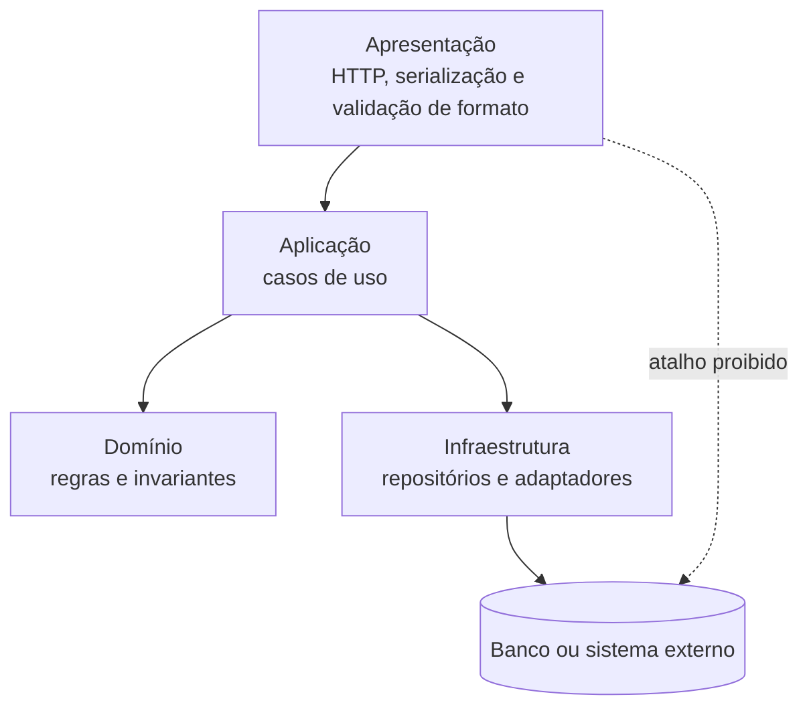

# Padrões, tecnologias e decisões

## Três categorias que não são sinônimas

Estilo organiza elementos, conectores e restrições; padrão resolve um problema recorrente; tecnologia oferece mecanismo; ADR é **prática de documentação de decisões**. Camadas e Microkernel são estilos; Adapter é padrão; Python, Java, .NET e FastAPI são tecnologias. Usar Spring, FastAPI ou ASP.NET não declara automaticamente fronteiras. O [catálogo de padrões](../referencia/catalogo-de-padroes.md) será aprofundado depois.

## Forças orientam alternativas

Uma força é uma pressão que diferencia alternativas: frequência de mudança, throughput, experiência da equipe, simplicidade operacional ou integração legada. Antes de atribuir valor a um estilo, transforme expressões como “fácil de manter” em cenário e medida. Compare cada alternativa pelas mesmas forças, limites e evidências; uma matriz não escolhe por você, mas revela o que ainda não foi medido.

## Quatro organizações, quatro tipos de fronteira

### Camadas: regras de dependência, não somente caixas empilhadas

Apresentação recebe interação, aplicação coordena, domínio concentra regras e infraestrutura integra. O valor é a dependência declarada: regra de domínio deve ser exercitada sem banco ou HTTP.

**Leitura textual da figura:** Apresentação chama Aplicação. Aplicação usa regras do Domínio e solicita mecanismos da Infraestrutura, que acessa o Banco ou sistema externo. A seta pontilhada indica que a apresentação não deve consultar o banco diretamente. A figura mostra uma dependência permitida e uma dependência proibida, em vez de apenas listar camadas.

Camada **fechada** obriga passagem pela adjacente; camada **aberta** permite atalho declarado e testado. **Sumidouro** é travessia repetida sem decisão, validação ou transformação. Na Agenda, fechar aplicação protege a regra de conflito; a escolha depende de cenário, não de slogan.

### Pipes and Filters: o dado que circula é um contrato

Filtro produz saída ou rejeição; pipe a transporta. Filtro **sem estado** é mais simples de repetir; filtro **com estado** exige declarar armazenamento, recuperação e concorrência. Rejeição leva correlação, etapa e motivo ao **sumidouro de falhas**; meça throughput por lote e ambiente.

### Microkernel: extensões obedecem a um contrato estável

Núcleo contém invariantes e contrato; plugins implementam variações sem detalhes privados. **Core creep** ocorre quando o núcleo acumula especificidades. A extensão vale o custo se entra, testa, habilita ou desabilita sem mudar o núcleo. ADR declara versão, plugin ausente, isolamento e teste.

### Monólito modular: uma implantação, capacidades com autonomia interna

Há uma implantação, mas Agenda, Triagem, Faturamento e Auditoria mantêm modelos e interfaces próprias. Pasta não cria fronteira: evite consulta direta, imports internos e contratos sem revisão. Reavalie quando escala, falha ou implantação independente forem medidos.

## ADR: uma decisão por registro

Um **Architecture Decision Record (ADR)** é um documento curto, versionado com a solução, que registra uma decisão significativa sem congelá-la. O [template de ADR](../referencia/template-adr.md) contém contexto, forças, alternativas, decisão, consequências, evidências e gatilho de revisão. “Microkernel é flexível” não é racional; “as variações mensais entram por contrato, aceitamos testar compatibilidade e revisaremos se extensões compartilharem estado” é uma hipótese que pode ser contestada.

## Decisões são hipóteses testáveis

O ADR declara a hipótese; código, testes, modelos e medições oferecem sinais para confirmá-la, enfraquecê-la ou refutá-la. Quando o contexto muda, crie um novo registro ligado ao anterior: decidir, materializar, observar e aprender.
