## Padrões, tecnologias e decisões

Vamos examinar aqui nessa seção alguns estilos arquiteturais que nos ajudam a organizar softwares complexos.

## Quatro organizações, quatro tipos de fronteira

| Estilo            | Responsabilidade e Conectores                                                    | Forças                                        | Anti-padrão                             | Quando usar                                    | Evite quando                                       |
| ----------------- | -------------------------------------------------------------------------------- | --------------------------------------------- | --------------------------------------- | ---------------------------------------------- | -------------------------------------------------- |
| Camadas           | Separar interface, casos de uso, regras e infraestrutura por chamadas permitidas | testabilidade e mudança localizada            | sumidouro ou atalho oculto              | regras precisam ser isoladas da infraestrutura | a passagem obrigatória não agrega trabalho         |
| Pipes and Filters | Transformar dados por pipes com contratos de entrada, saída e rejeição           | composição e throughput                       | estado compartilhado invisível          | etapas de transformação são explícitas         | o fluxo é interativo e exige consistência imediata |
| Microkernel       | Manter invariantes no núcleo e variações por contrato de plugin                  | extensibilidade e modificabilidade            | core creep                              | variações podem entrar e sair isoladamente     | plugins precisam controlar detalhes do núcleo      |
| Monólito modular  | Organizar capacidades por interfaces internas numa implantação                   | simplicidade operacional e consistência local | módulos que leem dados internos alheios | equipe e operação ainda são uma unidade        | escala ou implantação independente já foi medida   |

## Camadas {#camadas}

Camadas é uma regra de dependência, não somente caixas empilhadas. A apresentação traduz interação e formato; a aplicação coordena casos de uso; o domínio preserva regras e invariantes; a infraestrutura oferece banco, mensageria e outros adaptadores. Cada chamada atravessa uma fronteira conhecida, para que a regra de negócio possa ser exercitada sem iniciar HTTP ou banco.

O estilo em camadas (*layered architecture*) é o mais difundido da engenharia de software por um motivo simples: ele emerge naturalmente da estrutura da maioria das equipes. Mark Richards e Neal Ford descrevem esse fenômeno em *Fundamentals of Software Architecture* como *architecture by implication* — o estilo surge por inércia, não por decisão deliberada. A **Lei de Conway** explica o porquê: organizações produzem arquiteturas que espelham sua estrutura de comunicação, e uma equipe dividida em frontend, backend e banco de dados tende a produzir um sistema em três camadas — apresentação, negócios e dados —, independentemente de o arquiteto ter planejado isso. A forma apresentada nesta página refina a camada de negócios em aplicação e domínio.

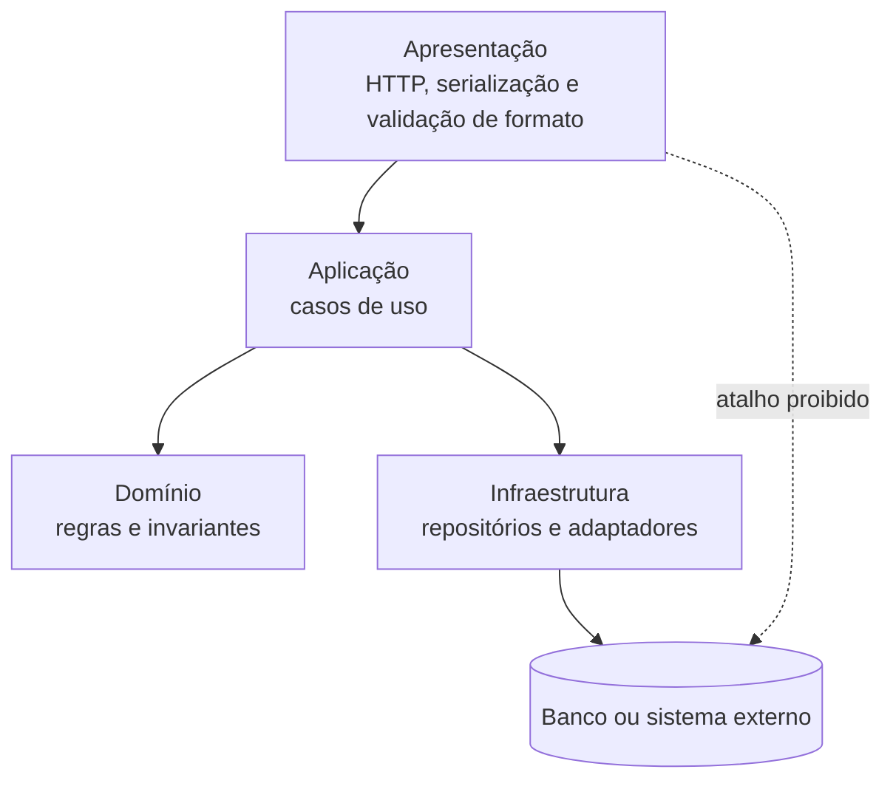

**Texto alternativo:** diagrama de camadas em que Apresentação chama Aplicação, que usa Domínio e Infraestrutura; a Infraestrutura acessa o Banco, e o atalho direto da Apresentação ao Banco é proibido.

*Figura 3 — Dependências permitidas e proibidas em uma arquitetura em camadas. Fonte: curso.*

**Leitura textual da figura:** Apresentação chama Aplicação. Aplicação usa regras do Domínio e solicita mecanismos da Infraestrutura, que acessa o Banco ou sistema externo. A seta pontilhada indica que a apresentação não deve consultar o banco diretamente. A figura mostra uma dependência permitida e uma dependência proibida, em vez de apenas listar camadas.

Uma **camada fechada** obriga a passagem pela adjacente e protege uma regra; uma **camada aberta** permite atalho deliberado, com contrato e teste, para reduzir custo de uma leitura. O anti-padrão do **sumidouro** aparece quando a passagem repetida não toma decisão, valida nem transforma. Uma consulta simples é legítima; o sinal de problema é a predominância de travessias sem propósito.

O fechamento garante isolamento — mudanças numa camada não vazam para as outras — ao custo de rigidez, porque cada requisição percorre camadas mesmo quando é simples.

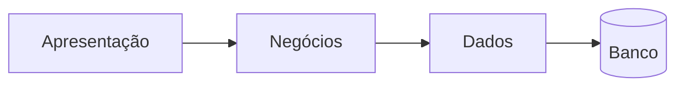

**Texto alternativo:** camadas fechadas: a requisição percorre apresentação, negócios e dados até chegar ao banco, sem atalhos.

*Figura 4 — Camadas fechadas: isolamento garantido, travessia obrigatória. Fonte: curso.*

**Leitura textual da figura:** a requisição sai da apresentação, passa por negócios e por dados e chega ao banco. Não há atalhos: cada fronteira é atravessada em ordem.

A abertura oferece flexibilidade ao custo de acoplamento difuso: o isolamento se perde com o tempo. Por isso, a decisão de abrir ou fechar cada camada deve ser documentada — é exatamente o tipo de decisão que um ADR registra.

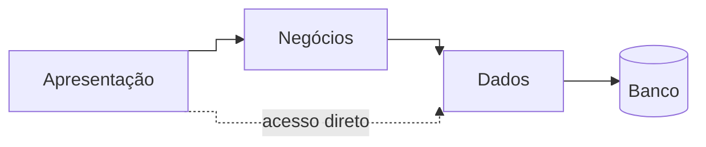

**Texto alternativo:** camada aberta: além do caminho por negócios, a apresentação acessa a camada de dados diretamente.

*Figura 5 — Camada aberta: flexibilidade com perda de isolamento. Fonte: curso.*

**Leitura textual da figura:** além do caminho completo por negócios e dados até o banco, uma seta pontilhada liga a apresentação diretamente à camada de dados: o atalho deliberado que ganha flexibilidade e perde isolamento.

Para o sumidouro, Richards e Ford oferecem uma regra prática: se mais de 80% das requisições do sistema apenas atravessam as camadas, sem decidir, validar ou transformar, o estilo em camadas provavelmente não é o certo para esse sistema.

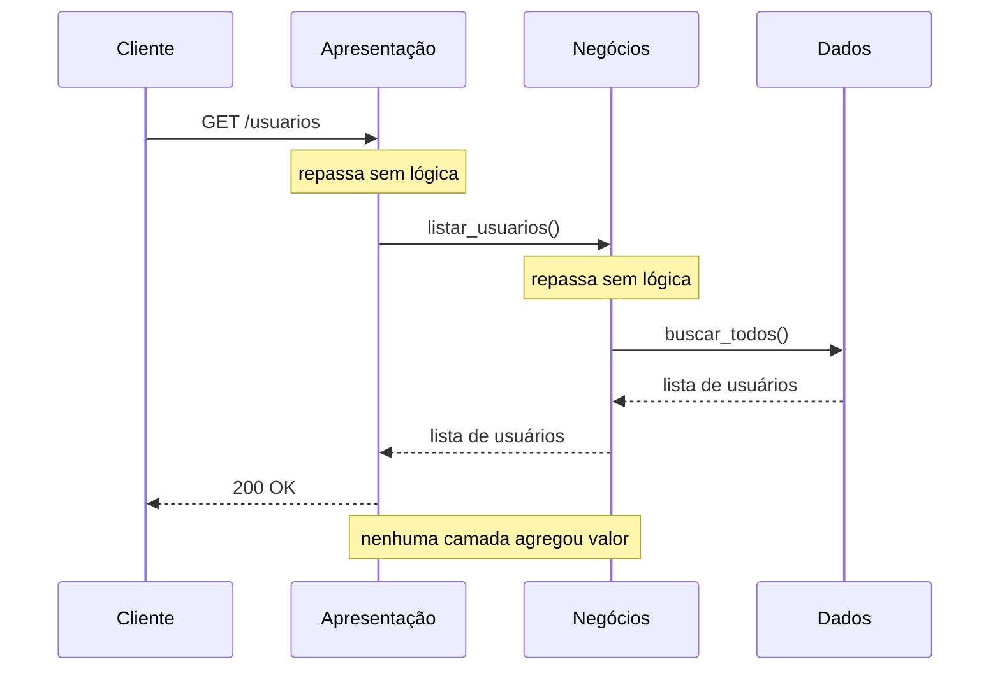

**Texto alternativo:** diagrama de sequência em que uma consulta atravessa apresentação, negócios e dados sem que nenhuma camada tome decisão, valide ou transforme o resultado.

*Figura 6 — O anti-padrão do sumidouro: a requisição atravessa as camadas sem agregar valor. Fonte: curso.*

**Leitura textual da figura:** o cliente envia GET /usuarios à apresentação, que apenas repassa a chamada a negócios; negócios repassa a dados; dados devolve a lista de usuários, que volta pelas mesmas camadas até o cliente receber 200 OK. As anotações registram que nenhuma camada agregou valor no percurso.

O **OCP** (*Open-Closed Principle*) mantém a aplicação dependente de uma abstração de repositório, com implementação na infraestrutura; trocar persistência não reescreve a regra.

As forças são testabilidade, mudança localizada e dependência rastreável; os limites são latência, abstrações desnecessárias e sumidouro. Use camadas quando invariantes precisam sobreviver à troca de interface ou infraestrutura; abra leitura somente com evidência de custo e sem contornar regra.

### Características arquiteturais do estilo

Richards e Ford avaliam cada estilo com um conjunto padronizado de características (*Fundamentals of Software Architecture*, cap. 10), numa escala de 1 (fraco) a 5 (forte):

| Característica   | Avaliação (1 a 5) | Observação                                                                             |
| ---------------- | ----------------- | -------------------------------------------------------------------------------------- |
| Custo geral      | 5                 | baixo custo de entrada; tecnologia amplamente conhecida                                |
| Simplicidade     | 5                 | fácil de compreender e implementar                                                     |
| Escalabilidade   | 2                 | escala como unidade única; difícil escalar camadas individualmente                     |
| Elasticidade     | 1                 | pouca capacidade de expansão e retração rápidas sob carga variável                     |
| Implantabilidade | 2                 | uma unidade de implantação; qualquer mudança implanta o pacote inteiro                 |
| Testabilidade    | 3                 | camadas podem ser testadas em isolamento com dublês de teste                           |
| Desempenho       | 3                 | adequado na maioria dos casos; sobrecarga quando a requisição atravessa muitas camadas |
| Modularidade     | 2                 | modular logicamente, mas fisicamente acoplado                                          |
| Confiabilidade   | 3                 | falha em um componente pode afetar o sistema inteiro                                   |

### O princípio aberto-fechado na fronteira com os dados

O **OCP** (*Open-Closed Principle*) aplicado à fronteira entre camadas significa abstrair o acesso ao banco de dados por uma interface: a camada de negócios depende da abstração, não da implementação concreta. Trocar o banco — de MySQL para PostgreSQL, por exemplo — não altera o serviço de negócio.

```python
from abc import ABC, abstractmethod

class RepositorioProduto(ABC):
    @abstractmethod
    def salvar(self, nome: str, preco: float) -> None: ...

    @abstractmethod
    def listar(self) -> list[dict]: ...

class MySQLRepositorioProduto(RepositorioProduto):
    def __init__(self):
        self._produtos: list[dict] = []

    def salvar(self, nome: str, preco: float) -> None:
        self._produtos.append({"nome": nome, "preco": preco})

    def listar(self) -> list[dict]:
        return self._produtos

class ProdutoServico:
    """Camada de negócios: depende da abstração, não da implementação."""

    def __init__(self, repositorio: RepositorioProduto):
        self._repositorio = repositorio

    def adicionar_produto(self, nome: str, preco: float) -> None:
        self._repositorio.salvar(nome, preco)
```

Um exemplo executável completo do estilo está em `codigos/cap01-estilos-fundamentais/1.2-estilo-em-camadas`, explorado na [oficina de ferramentas](oficina-de-ferramentas.md).

### Variações no backend: MVC e DDD

**MVC** (*Model-View-Controller*) é a especialização do estilo em camadas para o ciclo requisição-resposta HTTP: o controller orquestra a requisição, o model concentra as regras de negócio e a view serializa a resposta — em APIs, tipicamente em JSON.

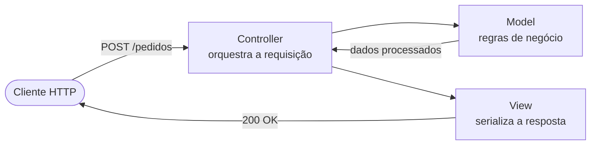

**Texto alternativo:** fluxo MVC em que o cliente HTTP aciona o controller, que consulta o model, recebe os dados processados e aciona a view para devolver a resposta ao cliente.

*Figura 7 — O ciclo requisição-resposta no MVC. Fonte: curso.*

**Leitura textual da figura:** o cliente envia POST /pedidos ao controller. O controller aciona o model, que devolve os dados processados. O controller então aciona a view, que serializa a resposta e devolve 200 OK ao cliente.

O estilo foi consolidado em frameworks amplamente adotados:

| Camada           | Tecnologias                                             |
| ---------------- | ------------------------------------------------------- |
| Controller       | ASP.NET MVC, Spring MVC, Ruby on Rails, Laravel, Django |
| Model e negócios | .NET Core, Spring Boot, Node.js (Express), FastAPI      |
| Dados            | Entity Framework, Hibernate, ActiveRecord, SQLAlchemy   |

**DDD** (*Domain-Driven Design*) organiza a camada de negócios por conceitos do domínio em vez de tipo técnico. Enquanto o MVC separa model, view e controller, o DDD separa Pedido, Pagamento e Cliente — e protege as regras de negócio de cada conceito dentro de seu próprio **agregado**. Num exemplo de vendas, o agregado `Pedido` contém entidades `ItemPedido`, usa o objeto de valor `Dinheiro` para preservar invariantes monetárias e é salvo e recuperado por um repositório `PedidoRepositorio`. Prefira DDD a camadas simples quando as regras de negócio são complexas, mudam com frequência e o risco dominante é o mal-entendido entre o time técnico e os especialistas de negócio — tema retomado na [Unidade 3](../modulo-3-servicos/index.md).

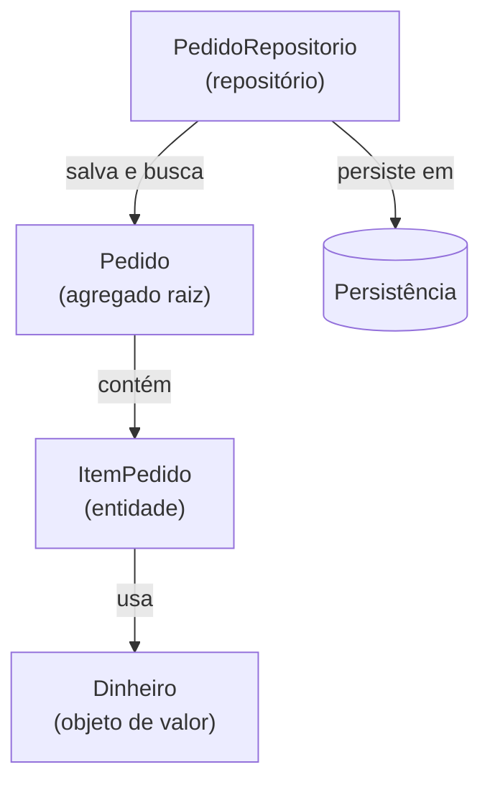

**Texto alternativo:** estrutura DDD em que o agregado raiz Pedido contém entidades ItemPedido, que usam o objeto de valor Dinheiro; o repositório PedidoRepositorio salva e busca o agregado e o grava na persistência.

*Figura 8 — Agregado, entidade, objeto de valor e repositório no DDD. Fonte: curso.*

**Leitura textual da figura:** o agregado raiz Pedido contém a entidade ItemPedido, que usa o objeto de valor Dinheiro. O repositório PedidoRepositorio salva e busca o agregado Pedido e o persiste no mecanismo de persistência.

### Camadas lógicas e camadas físicas

A arquitetura em camadas define uma estrutura **lógica** — as camadas físicas de implantação (*tiers*) são uma decisão separada.

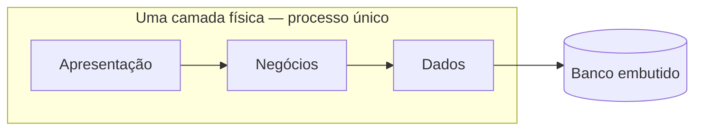

**Texto alternativo:** uma camada física: apresentação, negócios e dados convivem num processo único que usa um banco embutido.

*Figura 9 — Uma camada física: o sistema inteiro num processo único. Fonte: curso.*

**Leitura textual da figura:** dentro de um único processo, a apresentação chama negócios, que chama a camada de dados; os dados ficam num banco embutido no mesmo processo.

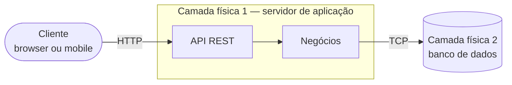

**Texto alternativo:** duas camadas físicas: o cliente acessa por HTTP o servidor de aplicação, que reúne API e negócios e conversa por TCP com o banco de dados em outra camada física.

*Figura 10 — Duas camadas físicas: aplicação e banco separados. Fonte: curso.*

**Leitura textual da figura:** o cliente, browser ou mobile, chama por HTTP a API REST do servidor de aplicação, que abriga também a camada de negócios. A camada de negócios conversa por TCP com o banco de dados, que vive numa segunda camada física.

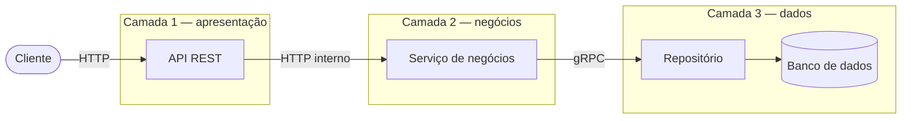

**Texto alternativo:** três camadas físicas encadeadas: o cliente chama a API REST, que chama por HTTP interno o serviço de negócios, que acessa por gRPC o repositório e o banco de dados.

*Figura 11 — Três camadas físicas: apresentação, negócios e dados como serviços distintos. Fonte: curso.*

**Leitura textual da figura:** o cliente chama por HTTP a API REST da camada de apresentação. A API chama por HTTP interno o serviço de negócios, na segunda camada. O serviço acessa por gRPC o repositório da camada de dados, que consulta o banco de dados.

Cada arranjo troca simplicidade por independência:

| Camadas físicas | Exemplo                                                | Vantagens                                                                 | Desvantagens                                                            |
| --------------- | ------------------------------------------------------ | ------------------------------------------------------------------------- | ----------------------------------------------------------------------- |
| Uma (monolito)  | processo único com banco embutido                      | simplicidade, menor custo, fácil de depurar e empacotar                   | difícil escalar componentes individualmente; risco alto em implantações |
| Duas            | servidor de aplicação e banco de dados separados       | backend e banco evoluem e escalam de forma independente                   | latência de rede entre camadas; gestão de dois serviços                 |
| Três ou mais    | apresentação, negócios e dados como serviços distintos | escalabilidade fina por camada; isolamento de falhas; times independentes | complexidade operacional; latência acumulada; exige observabilidade     |

Distribuir camadas fisicamente não resolve acoplamento lógico mal definido: um sistema com responsabilidades misturadas entre camadas continua acoplado mesmo rodando em servidores separados.

### Quando usar — e quando não usar

**Use camadas quando:** o sistema tem escopo e regras de negócio bem definidos; a equipe é pequena e o orçamento é limitado; velocidade de desenvolvimento inicial importa mais que escalabilidade; o sistema é predominantemente CRUD com lógica de negócio moderada.

**Não use camadas quando:** alta escalabilidade ou elasticidade são requisitos não negociáveis; mais de 80% das requisições são sumidouros — o estilo acrescenta latência sem valor; times independentes precisam implantar partes do sistema autonomamente; o problema central é processamento de dados em etapas — compare com [Pipes and Filters](#pipes-and-filters); ou a extensibilidade do produto para diferentes mercados é o driver central — compare com [Microkernel](#microkernel).

A discussão do estilo acompanha Richards e Ford (*Fundamentals of Software Architecture*, 2ª ed., O'Reilly, 2022, cap. 10), Fowler (*Patterns of Enterprise Application Architecture*, Addison-Wesley, 2002) e Evans (*Domain-Driven Design*, Addison-Wesley, 2003).

## Pipes and Filters {#pipes-and-filters}

Pipes and Filters decompõe uma transformação em filtros ligados por pipes. Cada filtro recebe um valor contratual e devolve novo valor ou **rejeição** explícita; o pipe transporta o resultado sem expor detalhes internos. O contrato nomeia formato, correlação, campos preservados, motivo e destino da rejeição, permitindo testar e observar cada etapa.

Richards e Ford chamam o estilo de *Pipeline Architecture* (*Fundamentals of Software Architecture*, cap. 11). A premissa fundamental é a **ausência de estado compartilhado**: cada filtro recebe dados, os transforma e os emite, sem saber de onde vieram nem para onde vão. Filtros não se comunicam diretamente entre si, apenas através dos pipes — o que torna o sistema altamente modular: filtros podem ser adicionados, removidos ou reordenados sem impactar os demais. Os autores identificam quatro tipos canônicos de filtro:

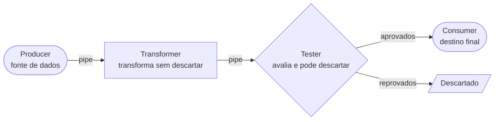

**Texto alternativo:** pipeline com os quatro tipos de filtro: o producer gera os dados, o transformer os transforma, o tester avalia e pode descartar, e o consumer recebe o resultado final; os itens reprovados seguem para descarte.

*Figura 12 — Os quatro tipos canônicos de filtro ligados por pipes. Fonte: curso.*

**Leitura textual da figura:** o producer envia dados por um pipe ao transformer, que os transforma sem descartar e os envia ao tester. O tester avalia cada item: os aprovados seguem pelo pipe até o consumer, destino final do fluxo; os reprovados seguem para o descarte.

| Tipo | Papel | Exemplos |
| --- | --- | --- |
| **Producer** | entrada do fluxo; gera ou lê os dados iniciais | leitura de arquivo, chamada a API, leitura de fila |
| **Transformer** | recebe dados, aplica transformação e os emite sem descartar | normalizar campos, enriquecer com dados externos, calcular métricas |
| **Tester** | avalia os dados contra um critério; descarta os que não passam | validar schema, filtrar por nível, separar por categoria |
| **Consumer** | término do fluxo; persiste ou envia os dados processados | gravar no banco, enviar e-mail, publicar em fila |

Um **filtro sem estado** depende apenas da entrada e é simples de repetir ou paralelizar. Um **filtro com estado** depende de memória, banco ou janela temporal; declara armazenamento, recuperação, concorrência e chave de correlação. A **ordenação** também é contrato: paralelize apenas etapas independentes e preserve a sequência exigida pela chave de negócio.

O anti-padrão correspondente é o **estado compartilhado invisível**: um filtro que acumula estado interno sem declará-lo introduz acoplamento implícito e torna o pipeline não determinístico — o resultado passa a depender da ordem de execução. Quando o fluxo requer acumulação, como janelas de tempo em streaming, use um mecanismo externo declarado, como Redis ou um *state store* dedicado, nunca estado interno do filtro.

```python
# Errado: estado de classe compartilhado entre invocações
class FiltroComEstado:
    total = 0

    def processar(self, valor: float) -> float:
        self.total += valor
        return self.total  # o resultado depende da ordem de execução

# Correto: filtro sem estado — cada invocação é independente
class FiltroTransformador:
    def processar(self, dado: dict) -> dict:
        return {**dado, "valor_normalizado": dado["valor"] / 100}
```

As forças são composição, reuso, diagnóstico e controle de **throughput** por filtro; os limites são contratos intermediários, latência, estado e recuperação parcial. Use quando a sequência de dados e as entradas e saídas são claras; evite interação rica que exige consistência imediata.

No **Faturamento** hospitalar, validar, normalizar códigos, enriquecer dados do convênio e publicar formam um pipeline verificável. A rejeição preserva lote, etapa e causa; a decisão exige medir throughput em ambiente representativo e declarar a ordenação de documentos do mesmo atendimento.

### Características arquiteturais de Pipes and Filters

Na avaliação padronizada de Richards e Ford (*Fundamentals of Software Architecture*, cap. 11), numa escala de 1 (fraco) a 5 (forte):

| Característica | Avaliação (1 a 5) | Observação |
| --- | --- | --- |
| Custo geral | 5 | baixo custo de entrada; conceito simples e direto |
| Simplicidade | 5 | estrutura linear fácil de entender e de explicar |
| Escalabilidade | 2 | filtros individuais podem escalar; o pipeline como unidade é limitado |
| Elasticidade | 2 | difícil expansão e retração rápidas sob carga variável |
| Implantabilidade | 3 | filtros podem ser implantados separadamente em versões modernas |
| Testabilidade | 5 | destaque do estilo: cada filtro é independente e testável em isolamento |
| Desempenho | 2 | o processamento sequencial introduz latência acumulada |
| Modularidade | 5 | destaque do estilo: máxima modularidade por design |
| Confiabilidade | 3 | falha num filtro interrompe o pipeline; exige estratégias de reprocessamento |

### Um framework mínimo e um exemplo de pipeline

O padrão cabe em duas classes: um contrato de filtro e um encadeador que executa a sequência.

```python
from abc import ABC, abstractmethod
from typing import Any

class Filtro(ABC):
    """Contrato base: cada filtro recebe e devolve dados."""

    @abstractmethod
    def processar(self, dados: Any) -> Any: ...

class Pipeline:
    """Encadeia filtros e executa a transformação em sequência."""

    def __init__(self):
        self._filtros: list[Filtro] = []

    def adicionar(self, filtro: Filtro) -> "Pipeline":
        self._filtros.append(filtro)
        return self

    def executar(self, dados: Any) -> Any:
        resultado = dados
        for filtro in self._filtros:
            resultado = filtro.processar(resultado)
        return resultado
```

Num cenário de e-commerce, os quatro tipos aparecem num pipeline de pedidos: o leitor constrói o pedido a partir dos dados brutos, o validador rejeita valores ou clientes inválidos, o aplicador de desconto e o calculador de frete transformam sem descartar, e o finalizador aprova e reporta o resultado.

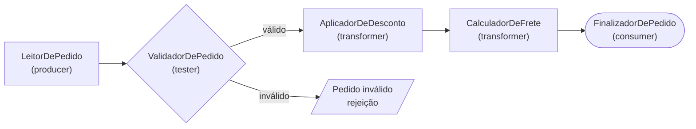

**Texto alternativo:** pipeline de pedidos em que o leitor cria o pedido, o validador rejeita os inválidos e os válidos passam por desconto, frete e finalização.

*Figura 13 — Pipeline de processamento de pedidos com os quatro tipos de filtro. Fonte: curso.*

**Leitura textual da figura:** o LeitorDePedido, um producer, envia o pedido ao ValidadorDePedido, um tester. Pedidos inválidos seguem para a rejeição com a causa; os válidos passam pelo AplicadorDeDesconto e pelo CalculadorDeFrete, dois transformers, até o FinalizadorDePedido, o consumer que aprova e reporta.

O acervo do curso traz ainda um segundo exemplo, que processa linhas de log e mantém apenas os níveis ERROR e CRITICAL. Os dois exemplos executáveis estão em `codigos/cap01-estilos-fundamentais/1.3-pipes-and-filters`, explorados na [oficina de ferramentas](oficina-de-ferramentas.md).

### Quando usar Pipes and Filters — e quando não usar

**Use Pipes and Filters quando:** o problema é um fluxo de transformações de dados, como ETL, validação em múltiplas etapas ou processamento de logs; a testabilidade isolada de cada etapa é crítica; equipes diferentes desenvolvem etapas de forma independente; ou o pipeline precisa ser composto e recomposto dinamicamente.

**Não use Pipes and Filters quando:** o sistema tem forte lógica de negócio hierárquica — compare com [Camadas](#camadas) e DDD; as etapas precisam compartilhar estado mútuo, o que destrói a independência dos filtros; a latência acumulada das etapas é inaceitável para o caso de uso; ou o fluxo é não linear e requer orquestração complexa — tema das arquiteturas de eventos na [Unidade 5](../modulo-5-eventos/index.md).

A discussão do estilo acompanha Richards e Ford (*Fundamentals of Software Architecture*, 2ª ed., O'Reilly, 2022, cap. 11), Hohpe e Woolf (*Enterprise Integration Patterns*, Addison-Wesley, 2003) e Shaw e Garlan (*Software Architecture: Perspectives on an Emerging Discipline*, Prentice Hall, 1996).

## Microkernel {#microkernel}

Microkernel separa um núcleo invariável das extensões. O núcleo preserva identidade, autorização, ciclo de vida e orquestração; o **registro** descobre extensões e seleciona a apropriada. Um **plugin** conhece apenas capacidades públicas, nunca tabelas ou objetos internos.

Richards e Ford chamam o estilo de *Plug-in Architecture* (*Fundamentals of Software Architecture*, cap. 12). A premissa fundamental: o **núcleo evolui lentamente**, enquanto os **plugins evoluem rapidamente** e de forma independente, sem coordenação entre equipes. O núcleo não sabe o que os plugins fazem; os plugins não sabem uns dos outros. A única relação entre eles é o contrato que o núcleo define e que cada plugin implementa.

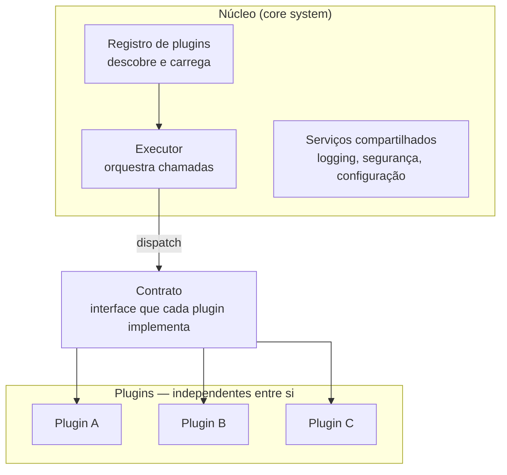

**Texto alternativo:** estrutura do Microkernel: no núcleo, o registro de plugins alimenta o executor, apoiado por serviços compartilhados; o executor despacha chamadas pelo contrato, que liga o núcleo aos plugins A, B e C, independentes entre si.

*Figura 14 — Núcleo, contrato e plugins na arquitetura Microkernel. Fonte: curso.*

**Leitura textual da figura:** dentro do núcleo, o registro de plugins descobre e carrega as extensões e alimenta o executor, que orquestra as chamadas com apoio de serviços compartilhados de logging, segurança e configuração. O executor despacha cada chamada por meio do contrato, a interface que cada plugin implementa. Os plugins A, B e C ficam fora do núcleo e não se conhecem entre si.

O **contrato de extensão** define entrada, resultado, erros, permissões e versão. A **compatibilidade** usa versão e capacidades: antes de carregar um plugin, o núcleo verifica contrato e dados autorizados. Registro por configuração, convenção ou catálogo dinâmico são variações; plugins no processo simplificam, enquanto serviços separados acrescentam isolamento, latência e operação.

O núcleo contém apenas a funcionalidade mínima para o sistema operar: gerencia o ciclo de vida dos plugins, define e impõe o contrato, orquestra a execução e provê serviços compartilhados. Ele não deve conter lógica de negócio específica — quando acumula lógica que pertence a plugins, o estilo degenera num monolito disfarçado. O registro admite quatro implementações:

- **Arquivo de configuração** (YAML ou JSON) — simples, mas exige reinicialização para alterar plugins;
- **Descoberta por convenção** — o núcleo varre pacotes em busca de classes que implementam a interface;
- **Registro explícito em código** — o plugin se registra no núcleo na inicialização;
- **Registry dinâmico** — banco ou serviço que permite adicionar e remover plugins em tempo de execução.

Um bom contrato é **estável**, porque cada mudança quebra os plugins existentes; **minimalista**, definindo apenas o que o núcleo precisa saber do plugin; e **versionado**, permitindo que versões diferentes de plugins coexistam.

As forças são extensibilidade controlada, implantação seletiva e teste de variações; os limites são versionamento, ciclo de vida, segurança e custo de um framework raro. **core creep** ocorre quando o núcleo acumula condicionais particulares e cada mudança volta ao centro. Use quando variações evoluem independentemente, mas compartilham invariantes; evite quando controlam estado interno ou há uma única implementação.

Na **Triagem** hospitalar, o núcleo controla identificação, estados e auditoria; plugins aplicam formulário ou validação por unidade. O registro seleciona a extensão compatível. Se um plugin editar dados internos ou o núcleo contiver regra por unidade, o core creep pede revisão da fronteira.

### Características arquiteturais do Microkernel

Na avaliação padronizada de Richards e Ford (*Fundamentals of Software Architecture*, cap. 12), numa escala de 1 (fraco) a 5 (forte):

| Característica | Avaliação (1 a 5) | Observação |
| --- | --- | --- |
| Custo geral | 3 | custo médio; exige design cuidadoso do contrato do núcleo |
| Simplicidade | 3 | conceito simples; a implementação do contrato requer disciplina |
| Escalabilidade | 3 | escala como unidade; plugins podem ser carregados e descarregados |
| Elasticidade | 3 | similar à escalabilidade |
| Implantabilidade | 3 | plugins podem ser implantados independentemente do núcleo |
| Testabilidade | 3 | o núcleo é fácil de testar; plugins requerem integração com o núcleo |
| Desempenho | 3 | overhead de dispatch para plugins; geralmente aceitável |
| Modularidade | 4 | destaque do estilo: plugins completamente independentes entre si |
| Confiabilidade | 3 | plugin com falha pode ser isolado sem derrubar o núcleo |

### Formas de implantação dos plugins

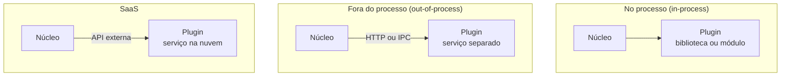

**Texto alternativo:** três formas de implantar plugins: no mesmo processo do núcleo, como biblioteca ou módulo; fora do processo, como serviço acessado por HTTP ou IPC; e como serviço SaaS externo acessado por API.

*Figura 15 — Plugins no processo, fora do processo e como serviço externo. Fonte: curso.*

**Leitura textual da figura:** no arranjo in-process, o núcleo carrega o plugin como biblioteca ou módulo no mesmo processo. No arranjo out-of-process, o núcleo chama por HTTP ou IPC um plugin que roda como serviço separado. No arranjo SaaS, o núcleo consome por API externa um plugin hospedado na nuvem.

| Forma | Descrição | Custo |
| --- | --- | --- |
| **In-process** | plugin carregado no mesmo processo do núcleo | simples e performático; implanta junto com o núcleo |
| **Out-of-process** | plugin como processo ou serviço separado | implantação e escala independentes; latência de rede |
| **SaaS** | plugin como serviço externo na nuvem | máxima independência; dependência de disponibilidade externa |

### O caso canônico: cálculo de impostos

Sistemas tributários são o caso canônico de Microkernel em Richards e Ford: as regras fiscais variam por estado, mas o fluxo de cálculo é o mesmo. O núcleo seleciona pelo registro o plugin do estado do pedido; adicionar suporte a um novo estado significa registrar um novo plugin, sem alterar o núcleo.

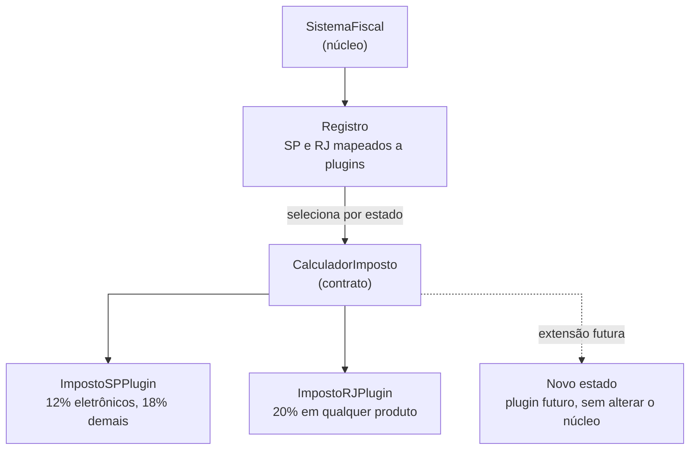

**Texto alternativo:** sistema fiscal em Microkernel: o núcleo consulta o registro, que seleciona pelo estado o plugin de São Paulo ou do Rio de Janeiro por meio do contrato CalculadorImposto; um novo estado entra como plugin futuro sem alterar o núcleo.

*Figura 16 — Cálculo de impostos por estado como plugins de um núcleo fiscal. Fonte: curso.*

**Leitura textual da figura:** o SistemaFiscal, que é o núcleo, consulta o registro em que São Paulo e Rio de Janeiro estão mapeados a plugins. O registro seleciona pelo estado do pedido e despacha pelo contrato CalculadorImposto: o plugin de São Paulo aplica 12% a eletrônicos e 18% aos demais produtos; o do Rio de Janeiro aplica 20% em qualquer produto. Uma seta pontilhada mostra um novo estado como extensão futura, sem alterar o núcleo.

O anti-padrão do core creep aparece quando essa seleção vira condicionais dentro do núcleo:

```python
# Errado: lógica de plugin dentro do núcleo
class SistemaFiscalComCreep:
    def calcular(self, pedido: Pedido) -> float:
        if pedido.estado == "SP":
            return pedido.valor_base * 0.12  # lógica de plugin no núcleo
        elif pedido.estado == "RJ":
            return pedido.valor_base * 0.20
        # cada novo estado exige modificar o núcleo
```

Quando o núcleo acumula condicionais por tipo de cliente ou região, a extensibilidade se perde: qualquer lógica que varia entre clientes pertence a um plugin. Um exemplo executável completo — núcleo, contrato e plugins de impostos e frete — está em `codigos/cap01-estilos-fundamentais/1.4-microkernel`, explorado na [oficina de ferramentas](oficina-de-ferramentas.md).

### Exemplos modernos

| Sistema | Núcleo | Plugins |
| --- | --- | --- |
| **Eclipse IDE** | plataforma OSGi e runtime | suporte a linguagens, debug, integração SCM |
| **Jenkins** | motor de pipeline e scheduler | build steps, notificações, cloud providers |
| **VS Code** | editor base e LSP | extensões de linguagem, temas, debug |
| **WordPress** | CMS base e sistema de hooks | temas, SEO, e-commerce, analytics |
| **Sistemas ERP** | módulo financeiro base | RH, manufatura, CRM por segmento |

### Quando usar Microkernel — e quando não usar

**Use Microkernel quando:** o produto precisa ser customizável para diferentes clientes ou mercados sem alterar o código central; equipes diferentes desenvolvem extensões de forma independente e paralela; regras de negócio variam por segmento fiscal, regulatório ou regional; ou o produto é uma plataforma que terceiros estendem.

**Não use Microkernel quando:** o sistema tem um único cliente e regras estáveis — o overhead não se justifica; as extensões precisam compartilhar estado entre si, o que quebra o isolamento do padrão; a lógica é hierárquica por responsabilidade técnica — compare com [Camadas](#camadas); ou o processamento é orientado a fluxo sequencial de dados — compare com [Pipes and Filters](#pipes-and-filters).

A discussão do estilo acompanha Richards e Ford (*Fundamentals of Software Architecture*, 2ª ed., O'Reilly, 2022, cap. 12), Shaw e Garlan (*Software Architecture: Perspectives on an Emerging Discipline*, Prentice Hall, 1996) e Bass, Clements e Kazman (*Software Architecture in Practice*, 3ª ed., Addison-Wesley, 2012).

### Monólito modular: uma implantação, capacidades com autonomia interna

Há uma implantação, mas Agenda, Triagem, Faturamento e Auditoria mantêm modelos e interfaces próprias. Pasta não cria fronteira: evite consulta direta, imports internos e contratos sem revisão. Reavalie quando escala, falha ou implantação independente forem medidos.

Um monólito é apenas um sistema com exatamente uma unidade de implantação — a definição, de Kamil Grzybek, separa a decisão de implantação da decisão de organização interna. O **monólito modular** explora essa separação: uma única unidade implantável, organizada em módulos alinhados ao domínio, em **fatias verticais** que reúnem API, casos de uso, regras e persistência de uma capacidade de negócio — em vez de camadas técnicas horizontais. Cada módulo é dono do próprio comportamento e dos próprios dados, atrás de um contrato estável; o restante fica encapsulado. Richards e Ford dedicam um capítulo ao estilo na 2ª edição de *Fundamentals of Software Architecture*, e Simon Brown popularizou a provocação que o acompanha: se você não consegue construir um monólito bem estruturado, o que faz pensar que microsserviços são a resposta?

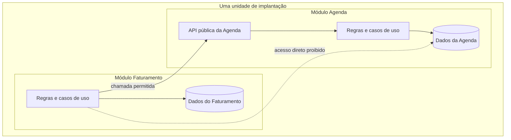

**Texto alternativo:** dois módulos dentro de uma única unidade de implantação: o Faturamento consome a API pública da Agenda, enquanto o acesso direto do Faturamento aos dados internos da Agenda é proibido.

*Figura 17 — Módulos com contrato público e posse de dados dentro de uma implantação. Fonte: curso.*

**Leitura textual da figura:** dentro de uma única unidade de implantação, o módulo Agenda expõe uma API pública que leva às suas regras e aos seus dados; o módulo Faturamento tem regras e dados próprios. A seta cheia mostra a chamada permitida do Faturamento à API pública da Agenda; a seta pontilhada mostra o acesso direto proibido do Faturamento aos dados internos da Agenda.

As regras de comunicação sustentam a autonomia: um módulo consome outro apenas pela API pública — por chamada síncrona ou por assinatura de eventos de domínio — e cada conjunto de dados tem **um único escritor**. Módulos podem compartilhar o mesmo banco físico, mas nunca tabelas ou modelos de escrita; transações são locais ao módulo, e fluxos que atravessam módulos se coordenam por eventos ou orquestração. O encapsulamento é a consequência prática: apenas os tipos exigidos pelo contrato são públicos, e tudo o que se expõe passa a ser API pública do módulo, com o dever de estabilidade que isso implica.

O anti-padrão característico é o módulo que lê dados internos alheios — a tabela ou o modelo de outro módulo — porque a pasta vizinha está a um import de distância. Sem verificação automática, os módulos são apenas mecânicos:

```python
# Errado: Faturamento lê o modelo interno da Agenda
from agenda.infraestrutura.modelos import ReservaModel

class RelatorioFaturamento:
    def gerar(self) -> list[dict]:
        return [r.como_dict() for r in ReservaModel.buscar_do_dia()]

# Correto: Faturamento consome o contrato público da Agenda
from agenda.api import AgendaAPI

class RelatorioFaturamento:
    def __init__(self, agenda: AgendaAPI):
        self._agenda = agenda

    def gerar(self) -> list[dict]:
        return self._agenda.reservas_do_dia()
```

#### Fronteiras verificadas por ferramenta

A fronteira entre módulos precisa ser verificada por ferramenta na integração contínua, não mantida por convenção. Os principais ecossistemas oferecem apoio direto:

| Ecossistema | Ferramentas | Mecanismo |
| --- | --- | --- |
| Java e Spring | Spring Modulith, ArchUnit | módulos declarados e testes de arquitetura (*fitness functions*) |
| Python | import-linter, pytestarch | regras de dependência entre pacotes |
| .NET | NetArchTest | verificação de dependências entre assemblies |
| Ruby | Packwerk | pacotes com API pública e dependências declaradas |
| TypeScript | Nx, dependency-cruiser | regras de workspace em monorepos |

O caso mais citado é o da Shopify, que mantém um dos maiores monólitos Ruby on Rails do mundo — milhares de componentes e centenas de implantações por dia — com fronteiras verificadas pelo Packwerk na integração contínua: cada pacote declara sua API pública e suas dependências permitidas, e violações bloqueiam a integração. O caso mostra que o estilo escala em tamanho de código e de equipe quando a verificação de fronteiras é contínua.

#### Características arquiteturais do Monólito modular

Aplicando a mesma escala de 1 (fraco) a 5 (forte) das seções anteriores: o estilo mantém o custo e a simplicidade do monólito e melhora implantabilidade, testabilidade e modularidade em relação às camadas; escalabilidade, elasticidade e isolamento de falhas continuam sendo os de um processo único:

| Característica | Avaliação (1 a 5) | Observação |
| --- | --- | --- |
| Custo geral | 5 | mantém o baixo custo do monólito; a disciplina de fronteiras é o investimento |
| Simplicidade | 4 | conceito direto; exige disciplina e verificação de fronteiras |
| Escalabilidade | 2 | escala por réplica do processo inteiro, como nas camadas |
| Elasticidade | 1 | expansão e retração continuam por unidade única |
| Implantabilidade | 3 | uma unidade de implantação, mas regressões ficam contidas nos módulos |
| Testabilidade | 4 | módulos testáveis em isolamento pelo contrato |
| Desempenho | 4 | chamadas em processo, sem latência de rede entre capacidades |
| Modularidade | 4 | fatias verticais com contrato; depende de verificação automática |
| Confiabilidade | 3 | uma falha ainda derruba o processo; o raio de dano é o sistema inteiro |

#### Da modularidade à extração de serviços

A extração de um módulo para um serviço é uma opção conquistada pela boa modularidade, não o plano inicial. Os gatilhos que a justificam são medidos, não presumidos: mudanças que exigem coordenação entre módulos com frequência sustentada, raio de incidentes que atravessa fronteiras, um módulo quente dominando os recursos do processo ou cadências de mudança muito diferentes entre módulos. Quando a evidência aparece, o contrato do módulo vira a fronteira do serviço — tema retomado na [Unidade 3](../modulo-3-servicos/index.md).

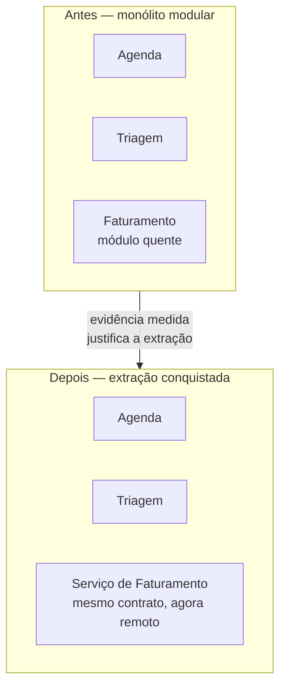

**Texto alternativo:** evolução em duas etapas: no monólito modular, Agenda, Triagem e Faturamento convivem numa implantação, com o Faturamento como módulo quente; após a extração, o Faturamento vira serviço separado com o mesmo contrato, e os demais módulos permanecem.

*Figura 18 — A extração de um módulo quente como opção conquistada pela modularidade. Fonte: curso.*

**Leitura textual da figura:** no estado inicial, os módulos Agenda, Triagem e Faturamento convivem numa única implantação, e o Faturamento é identificado como módulo quente. Depois da extração, justificada por evidência medida, o Faturamento passa a ser um serviço separado que preserva o mesmo contrato, agora remoto, enquanto Agenda e Triagem permanecem no monólito.

#### Quando usar Monólito modular — e quando não usar

**Use Monólito modular quando:** a equipe e a operação ainda são uma unidade e implantar um artefato basta; as fronteiras de domínio ainda estão sendo descobertas e mudá-las precisa ser barato; consistência forte e transações locais importam; ou a velocidade de desenvolvimento e o baixo custo operacional pesam mais que escala independente.

**Não use Monólito modular quando:** módulos precisam escalar de forma independente ou requerem isolamento rígido de falhas; times autônomos precisam implantar em cadências próprias; ou o raio de dano de um incidente precisa ficar contido numa única capacidade — nesses casos, a decomposição em serviços da [Unidade 3](../modulo-3-servicos/index.md) é o caminho natural.

A discussão do estilo acompanha Richards e Ford (*Fundamentals of Software Architecture*, 2ª ed., O'Reilly), Grzybek (*Modular Monolith: A Primer*, 2019), Brown (*Modular Monoliths*, palestras a partir de 2015) e o relato de engenharia da Shopify (*Deconstructing the Monolith*, 2019).

## ADR: O mecanismo para escolher estilos

Um ADR é um registro de decisão arquitetural — uma prática de documentação de decisões. É a principal ferramenta para o arquiteto registrar o racional da sua escolha da aplicação de um ou mais estilos no desenho ou evolução de arquiteturas de software.

Na prática, um **ADR** é documento Markdown versionado com contexto, forças, alternativas, decisão, consequências, evidências e revisão. O [template](../referencia/template-adr.md) facilita aqui o seu trabalho de usá-lo no curso e no seu trabalho.

##
