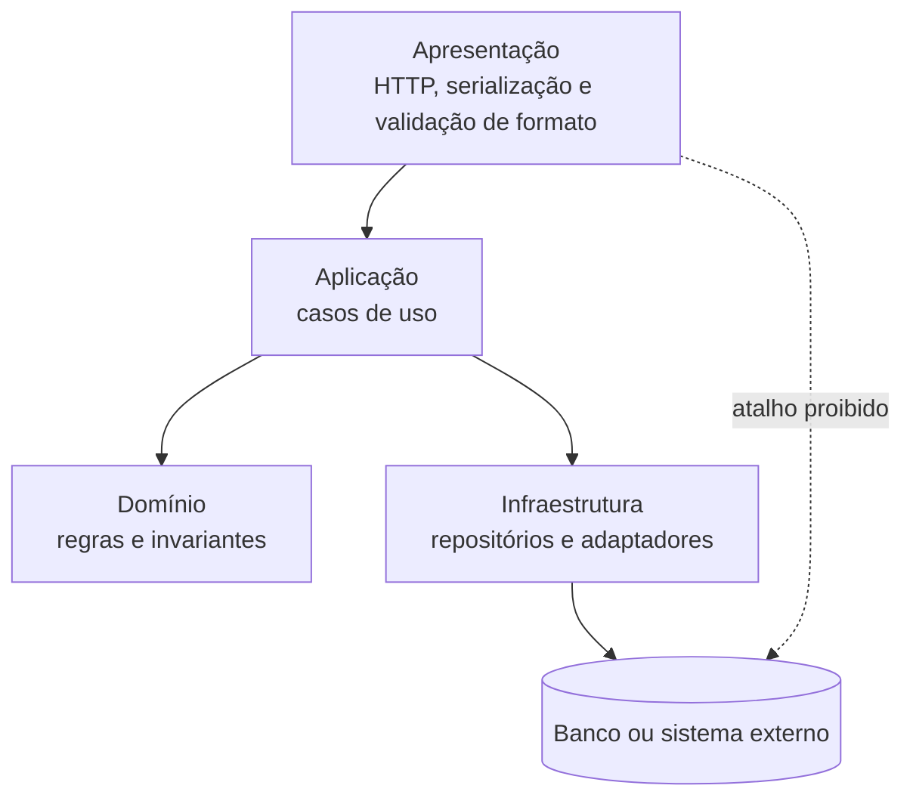

# Padrões, tecnologias e decisões

## Três categorias que não são sinônimas

Estilo organiza elementos; padrão resolve problema recorrente; tecnologia oferece mecanismo; ADR é **prática de documentação de decisões**. Framework não declara fronteira. O [catálogo](../referencia/catalogo-de-padroes.md) será aprofundado depois.

## Forças orientam alternativas

Força diferencia alternativas. Transforme “fácil de manter” em cenário e medida; compare forças, limites e evidências iguais.

## Quatro organizações, quatro tipos de fronteira

| Estilo | Responsabilidade e Conectores | Forças | Anti-padrão | Quando usar | Evite quando |
| --- | --- | --- | --- | --- | --- |
| Camadas | Separar interface, casos de uso, regras e infraestrutura por chamadas permitidas | testabilidade e mudança localizada | sumidouro ou atalho oculto | regras precisam ser isoladas da infraestrutura | a passagem obrigatória não agrega trabalho |
| Pipes and Filters | Transformar dados por pipes com contratos de entrada, saída e rejeição | composição e throughput | estado compartilhado invisível | etapas de transformação são explícitas | o fluxo é interativo e exige consistência imediata |
| Microkernel | Manter invariantes no núcleo e variações por contrato de plugin | extensibilidade e modificabilidade | core creep | variações podem entrar e sair isoladamente | plugins precisam controlar detalhes do núcleo |
| Monólito modular | Organizar capacidades por interfaces internas numa implantação | simplicidade operacional e consistência local | módulos que leem dados internos alheios | equipe e operação ainda são uma unidade | escala ou implantação independente já foi medida |

### Camadas: regras de dependência, não somente caixas empilhadas

Apresentação recebe interação, aplicação coordena, domínio concentra regras e infraestrutura integra. O valor é a dependência declarada: regra de domínio deve ser exercitada sem banco ou HTTP.

**Texto alternativo:** diagrama de camadas em que Apresentação chama Aplicação, que usa Domínio e Infraestrutura; a Infraestrutura acessa o Banco, e o atalho direto da Apresentação ao Banco é proibido.

*Figura 5 — Dependências permitidas e proibidas em uma arquitetura em camadas. Fonte: curso.*

**Leitura textual da figura:** Apresentação chama Aplicação. Aplicação usa regras do Domínio e solicita mecanismos da Infraestrutura, que acessa o Banco ou sistema externo. A seta pontilhada indica que a apresentação não deve consultar o banco diretamente. A figura mostra uma dependência permitida e uma dependência proibida, em vez de apenas listar camadas.

Camada **fechada** obriga passagem pela adjacente; camada **aberta** permite atalho declarado e testado. **Sumidouro** é travessia repetida sem decisão, validação ou transformação. Na Agenda, fechar aplicação protege a regra de conflito; a escolha depende de cenário, não de slogan.

### Pipes and Filters: o dado que circula é um contrato

Filtro produz saída ou rejeição; pipe a transporta. Filtro **sem estado** é mais simples de repetir; filtro **com estado** exige declarar armazenamento, recuperação e concorrência. Rejeição leva correlação, etapa e motivo ao **sumidouro de falhas**; meça throughput por lote e ambiente.

### Microkernel: extensões obedecem a um contrato estável

Núcleo contém invariantes e contrato; plugins implementam variações sem detalhes privados. **Core creep** ocorre quando o núcleo acumula especificidades. A extensão vale o custo se entra, testa, habilita ou desabilita sem mudar o núcleo. ADR declara versão, plugin ausente, isolamento e teste.

### Monólito modular: uma implantação, capacidades com autonomia interna

Há uma implantação, mas Agenda, Triagem, Faturamento e Auditoria mantêm modelos e interfaces próprias. Pasta não cria fronteira: evite consulta direta, imports internos e contratos sem revisão. Reavalie quando escala, falha ou implantação independente forem medidos.

## ADR: uma decisão por registro

Um **ADR** é documento versionado com contexto, forças, alternativas, decisão, consequências, evidências e revisão. O [template](../referencia/template-adr.md) torna a hipótese contestável.

## Decisões são hipóteses testáveis

Código, testes, modelos e medições confirmam ou refutam a hipótese; novo contexto pede novo ADR ligado ao anterior.
