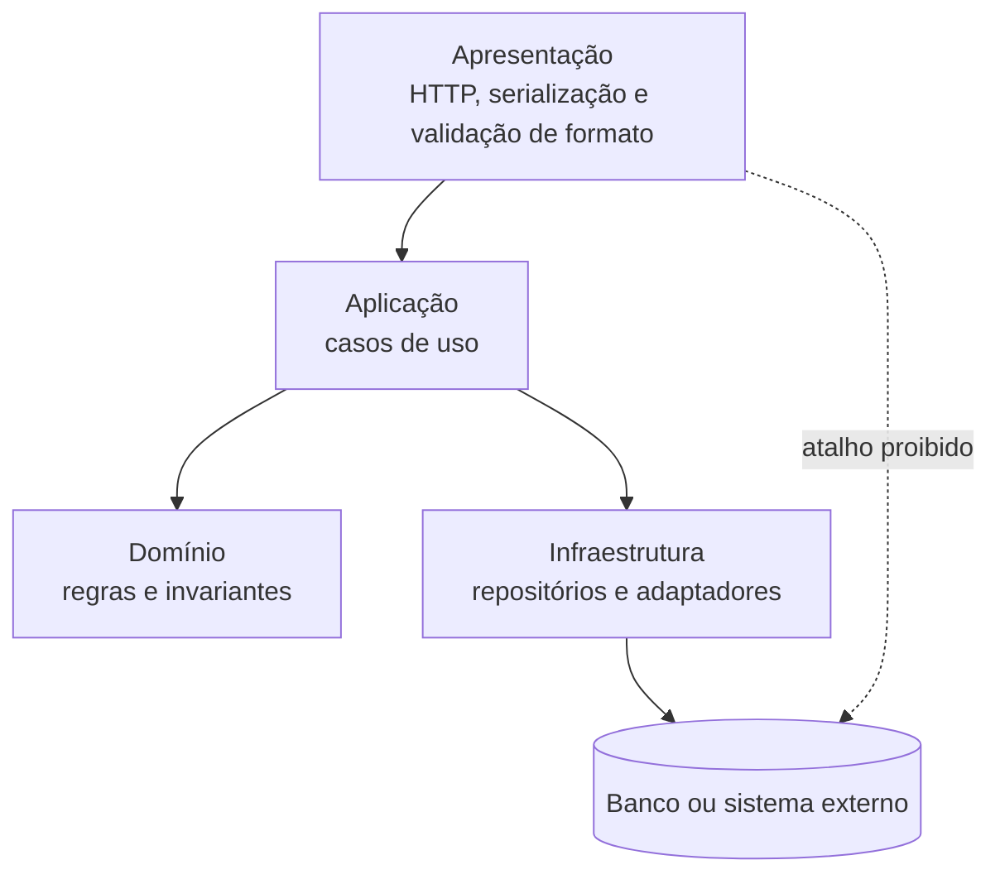

# Padrões, tecnologias e decisões

## Três categorias que não são sinônimas

Estilo organiza elementos; padrão resolve problema recorrente; tecnologia oferece mecanismo; ADR é **prática de documentação de decisões**. Framework não declara fronteira. O [catálogo](../referencia/catalogo-de-padroes.md) será aprofundado depois.

## Forças orientam alternativas

Força diferencia alternativas. Transforme “fácil de manter” em cenário e medida; compare forças, limites e evidências iguais.

## Quatro organizações, quatro tipos de fronteira

| Estilo | Responsabilidade e Conectores | Forças | Anti-padrão | Quando usar | Evite quando |
| --- | --- | --- | --- | --- | --- |
| Camadas | Separar interface, casos de uso, regras e infraestrutura por chamadas permitidas | testabilidade e mudança localizada | sumidouro ou atalho oculto | regras precisam ser isoladas da infraestrutura | a passagem obrigatória não agrega trabalho |
| Pipes and Filters | Transformar dados por pipes com contratos de entrada, saída e rejeição | composição e throughput | estado compartilhado invisível | etapas de transformação são explícitas | o fluxo é interativo e exige consistência imediata |
| Microkernel | Manter invariantes no núcleo e variações por contrato de plugin | extensibilidade e modificabilidade | core creep | variações podem entrar e sair isoladamente | plugins precisam controlar detalhes do núcleo |
| Monólito modular | Organizar capacidades por interfaces internas numa implantação | simplicidade operacional e consistência local | módulos que leem dados internos alheios | equipe e operação ainda são uma unidade | escala ou implantação independente já foi medida |

## Camadas {#camadas}

Camadas é uma regra de dependência, não somente caixas empilhadas. A apresentação traduz interação e formato; a aplicação coordena casos de uso; o domínio preserva regras e invariantes; a infraestrutura oferece banco, mensageria e outros adaptadores. Cada chamada atravessa uma fronteira conhecida, para que a regra de negócio possa ser exercitada sem iniciar HTTP ou banco.

O estilo em camadas (*layered architecture*) é o mais difundido da engenharia de software por um motivo simples: ele emerge naturalmente da estrutura da maioria das equipes. Mark Richards e Neal Ford descrevem esse fenômeno em *Fundamentals of Software Architecture* como *architecture by implication* — o estilo surge por inércia, não por decisão deliberada. A **Lei de Conway** explica o porquê: organizações produzem arquiteturas que espelham sua estrutura de comunicação, e uma equipe dividida em frontend, backend e banco de dados tende a produzir um sistema em três camadas — apresentação, negócios e dados —, independentemente de o arquiteto ter planejado isso. A forma apresentada nesta página refina a camada de negócios em aplicação e domínio.



**Texto alternativo:** diagrama de camadas em que Apresentação chama Aplicação, que usa Domínio e Infraestrutura; a Infraestrutura acessa o Banco, e o atalho direto da Apresentação ao Banco é proibido.

*Figura 3 — Dependências permitidas e proibidas em uma arquitetura em camadas. Fonte: curso.*

**Leitura textual da figura:** Apresentação chama Aplicação. Aplicação usa regras do Domínio e solicita mecanismos da Infraestrutura, que acessa o Banco ou sistema externo. A seta pontilhada indica que a apresentação não deve consultar o banco diretamente. A figura mostra uma dependência permitida e uma dependência proibida, em vez de apenas listar camadas.

Uma **camada fechada** obriga a passagem pela adjacente e protege uma regra; uma **camada aberta** permite atalho deliberado, com contrato e teste, para reduzir custo de uma leitura. O anti-padrão do **sumidouro** aparece quando a passagem repetida não toma decisão, valida nem transforma. Uma consulta simples é legítima; o sinal de problema é a predominância de travessias sem propósito.

O fechamento garante isolamento — mudanças numa camada não vazam para as outras — ao custo de rigidez, porque cada requisição percorre camadas mesmo quando é simples. A abertura oferece flexibilidade ao custo de acoplamento difuso: o isolamento se perde com o tempo. Por isso, a decisão de abrir ou fechar cada camada deve ser documentada — é exatamente o tipo de decisão que um ADR registra. Para o sumidouro, Richards e Ford oferecem uma regra prática: se mais de 80% das requisições do sistema apenas atravessam as camadas, sem decidir, validar ou transformar, o estilo em camadas provavelmente não é o certo para esse sistema.

O **OCP** (*Open-Closed Principle*) mantém a aplicação dependente de uma abstração de repositório, com implementação na infraestrutura; trocar persistência não reescreve a regra. **MVC** é uma variação da borda HTTP: controller traduz requisição, o caso de uso coordena e a view ou serializador responde. MVC não elimina a separação entre coordenação e domínio.

As forças são testabilidade, mudança localizada e dependência rastreável; os limites são latência, abstrações desnecessárias e sumidouro. Use camadas quando invariantes precisam sobreviver à troca de interface ou infraestrutura; abra leitura somente com evidência de custo e sem contornar regra.

Na **Agenda** hospitalar, a reserva passa pela aplicação antes da persistência para que nenhuma tela ignore o conflito de horário. Uma leitura administrativa só pode ser aberta se não alterar reserva, disponibilidade ou auditoria.

### Características arquiteturais do estilo

Richards e Ford avaliam cada estilo com um conjunto padronizado de características (*Fundamentals of Software Architecture*, cap. 10), numa escala de 1 (fraco) a 5 (forte):

| Característica | Avaliação (1 a 5) | Observação |
| --- | --- | --- |
| Custo geral | 5 | baixo custo de entrada; tecnologia amplamente conhecida |
| Simplicidade | 5 | fácil de compreender e implementar |
| Escalabilidade | 2 | escala como unidade única; difícil escalar camadas individualmente |
| Elasticidade | 1 | pouca capacidade de expansão e retração rápidas sob carga variável |
| Implantabilidade | 2 | uma unidade de implantação; qualquer mudança implanta o pacote inteiro |
| Testabilidade | 3 | camadas podem ser testadas em isolamento com dublês de teste |
| Desempenho | 3 | adequado na maioria dos casos; sobrecarga quando a requisição atravessa muitas camadas |
| Modularidade | 2 | modular logicamente, mas fisicamente acoplado |
| Confiabilidade | 3 | falha em um componente pode afetar o sistema inteiro |

### O princípio aberto-fechado na fronteira com os dados

O **OCP** (*Open-Closed Principle*) aplicado à fronteira entre camadas significa abstrair o acesso ao banco de dados por uma interface: a camada de negócios depende da abstração, não da implementação concreta. Trocar o banco — de MySQL para PostgreSQL, por exemplo — não altera o serviço de negócio.

```python
from abc import ABC, abstractmethod

class RepositorioProduto(ABC):
    @abstractmethod
    def salvar(self, nome: str, preco: float) -> None: ...

    @abstractmethod
    def listar(self) -> list[dict]: ...

class MySQLRepositorioProduto(RepositorioProduto):
    def __init__(self):
        self._produtos: list[dict] = []

    def salvar(self, nome: str, preco: float) -> None:
        self._produtos.append({"nome": nome, "preco": preco})

    def listar(self) -> list[dict]:
        return self._produtos

class ProdutoServico:
    """Camada de negócios: depende da abstração, não da implementação."""

    def __init__(self, repositorio: RepositorioProduto):
        self._repositorio = repositorio

    def adicionar_produto(self, nome: str, preco: float) -> None:
        self._repositorio.salvar(nome, preco)
```

Um exemplo executável completo do estilo está em `codigos/cap01-estilos-fundamentais/1.2-estilo-em-camadas`, explorado na [oficina de ferramentas](oficina-de-ferramentas.md).

### Variações no backend: MVC e DDD

**MVC** (*Model-View-Controller*) é a especialização do estilo em camadas para o ciclo requisição-resposta HTTP: o controller orquestra a requisição, o model concentra as regras de negócio e a view serializa a resposta — em APIs, tipicamente em JSON. O estilo foi consolidado em frameworks amplamente adotados:

| Camada | Tecnologias |
| --- | --- |
| Controller | ASP.NET MVC, Spring MVC, Ruby on Rails, Laravel, Django |
| Model e negócios | .NET Core, Spring Boot, Node.js (Express), FastAPI |
| Dados | Entity Framework, Hibernate, ActiveRecord, SQLAlchemy |

**DDD** (*Domain-Driven Design*) organiza a camada de negócios por conceitos do domínio em vez de tipo técnico. Enquanto o MVC separa model, view e controller, o DDD separa Pedido, Pagamento e Cliente — e protege as regras de negócio de cada conceito dentro de seu próprio **agregado**. Num exemplo de vendas, o agregado `Pedido` contém entidades `ItemPedido`, usa o objeto de valor `Dinheiro` para preservar invariantes monetárias e é salvo e recuperado por um repositório `PedidoRepositorio`. Prefira DDD a camadas simples quando as regras de negócio são complexas, mudam com frequência e o risco dominante é o mal-entendido entre o time técnico e os especialistas de negócio — tema retomado na [Unidade 3](../modulo-3-servicos/index.md).

### Camadas lógicas e camadas físicas

A arquitetura em camadas define uma estrutura **lógica** — as camadas físicas de implantação (*tiers*) são uma decisão separada:

| Camadas físicas | Exemplo | Vantagens | Desvantagens |
| --- | --- | --- | --- |
| Uma (monolito) | processo único com banco embutido | simplicidade, menor custo, fácil de depurar e empacotar | difícil escalar componentes individualmente; risco alto em implantações |
| Duas | servidor de aplicação e banco de dados separados | backend e banco evoluem e escalam de forma independente | latência de rede entre camadas; gestão de dois serviços |
| Três ou mais | apresentação, negócios e dados como serviços distintos | escalabilidade fina por camada; isolamento de falhas; times independentes | complexidade operacional; latência acumulada; exige observabilidade |

Distribuir camadas fisicamente não resolve acoplamento lógico mal definido: um sistema com responsabilidades misturadas entre camadas continua acoplado mesmo rodando em servidores separados.

### Quando usar — e quando não usar

**Use camadas quando:** o sistema tem escopo e regras de negócio bem definidos; a equipe é pequena e o orçamento é limitado; velocidade de desenvolvimento inicial importa mais que escalabilidade; o sistema é predominantemente CRUD com lógica de negócio moderada.

**Não use camadas quando:** alta escalabilidade ou elasticidade são requisitos não negociáveis; mais de 80% das requisições são sumidouros — o estilo acrescenta latência sem valor; times independentes precisam implantar partes do sistema autonomamente; o problema central é processamento de dados em etapas — compare com [Pipes and Filters](#pipes-and-filters); ou a extensibilidade do produto para diferentes mercados é o driver central — compare com [Microkernel](#microkernel).

A discussão do estilo acompanha Richards e Ford (*Fundamentals of Software Architecture*, 2ª ed., O'Reilly, 2022, cap. 10), Fowler (*Patterns of Enterprise Application Architecture*, Addison-Wesley, 2002) e Evans (*Domain-Driven Design*, Addison-Wesley, 2003).

## Pipes and Filters {#pipes-and-filters}

Pipes and Filters decompõe uma transformação em filtros ligados por pipes. Cada filtro recebe um valor contratual e devolve novo valor ou **rejeição** explícita; o pipe transporta o resultado sem expor detalhes internos. O contrato nomeia formato, correlação, campos preservados, motivo e destino da rejeição, permitindo testar e observar cada etapa.

Um **filtro sem estado** depende apenas da entrada e é simples de repetir ou paralelizar. Um **filtro com estado** depende de memória, banco ou janela temporal; declara armazenamento, recuperação, concorrência e chave de correlação. A **ordenação** também é contrato: paralelize apenas etapas independentes e preserve a sequência exigida pela chave de negócio.

As forças são composição, reuso, diagnóstico e controle de **throughput** por filtro; os limites são contratos intermediários, latência, estado e recuperação parcial. Use quando a sequência de dados e as entradas e saídas são claras; evite interação rica que exige consistência imediata.

No **Faturamento** hospitalar, validar, normalizar códigos, enriquecer dados do convênio e publicar formam um pipeline verificável. A rejeição preserva lote, etapa e causa; a decisão exige medir throughput em ambiente representativo e declarar a ordenação de documentos do mesmo atendimento.

## Microkernel {#microkernel}

Microkernel separa um núcleo invariável das extensões. O núcleo preserva identidade, autorização, ciclo de vida e orquestração; o **registro** descobre extensões e seleciona a apropriada. Um **plugin** conhece apenas capacidades públicas, nunca tabelas ou objetos internos.

O **contrato de extensão** define entrada, resultado, erros, permissões e versão. A **compatibilidade** usa versão e capacidades: antes de carregar um plugin, o núcleo verifica contrato e dados autorizados. Registro por configuração, convenção ou catálogo dinâmico são variações; plugins no processo simplificam, enquanto serviços separados acrescentam isolamento, latência e operação.

As forças são extensibilidade controlada, implantação seletiva e teste de variações; os limites são versionamento, ciclo de vida, segurança e custo de um framework raro. **core creep** ocorre quando o núcleo acumula condicionais particulares e cada mudança volta ao centro. Use quando variações evoluem independentemente, mas compartilham invariantes; evite quando controlam estado interno ou há uma única implementação.

Na **Triagem** hospitalar, o núcleo controla identificação, estados e auditoria; plugins aplicam formulário ou validação por unidade. O registro seleciona a extensão compatível. Se um plugin editar dados internos ou o núcleo contiver regra por unidade, o core creep pede revisão da fronteira.

### Monólito modular: uma implantação, capacidades com autonomia interna

Há uma implantação, mas Agenda, Triagem, Faturamento e Auditoria mantêm modelos e interfaces próprias. Pasta não cria fronteira: evite consulta direta, imports internos e contratos sem revisão. Reavalie quando escala, falha ou implantação independente forem medidos.

## ADR: uma decisão por registro

Um **ADR** é documento versionado com contexto, forças, alternativas, decisão, consequências, evidências e revisão. O [template](../referencia/template-adr.md) torna a hipótese contestável.

## Decisões são hipóteses testáveis

Código, testes, modelos e medições confirmam ou refutam a hipótese; novo contexto pede novo ADR ligado ao anterior.
