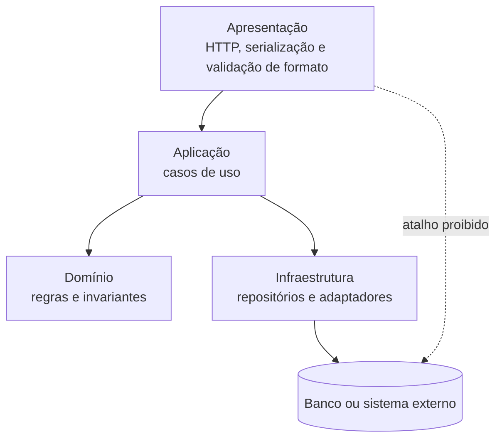

# Padrões, tecnologias e decisões

## Três categorias que não são sinônimas

Estilo organiza elementos; padrão resolve problema recorrente; tecnologia oferece mecanismo; ADR é **prática de documentação de decisões**. Framework não declara fronteira. O [catálogo](../referencia/catalogo-de-padroes.md) será aprofundado depois.

## Forças orientam alternativas

Força diferencia alternativas. Transforme “fácil de manter” em cenário e medida; compare forças, limites e evidências iguais.

## Quatro organizações, quatro tipos de fronteira

| Estilo | Responsabilidade e Conectores | Forças | Anti-padrão | Quando usar | Evite quando |
| --- | --- | --- | --- | --- | --- |
| Camadas | Separar interface, casos de uso, regras e infraestrutura por chamadas permitidas | testabilidade e mudança localizada | sumidouro ou atalho oculto | regras precisam ser isoladas da infraestrutura | a passagem obrigatória não agrega trabalho |
| Pipes and Filters | Transformar dados por pipes com contratos de entrada, saída e rejeição | composição e throughput | estado compartilhado invisível | etapas de transformação são explícitas | o fluxo é interativo e exige consistência imediata |
| Microkernel | Manter invariantes no núcleo e variações por contrato de plugin | extensibilidade e modificabilidade | core creep | variações podem entrar e sair isoladamente | plugins precisam controlar detalhes do núcleo |
| Monólito modular | Organizar capacidades por interfaces internas numa implantação | simplicidade operacional e consistência local | módulos que leem dados internos alheios | equipe e operação ainda são uma unidade | escala ou implantação independente já foi medida |

## Camadas {#camadas}

Camadas é uma regra de dependência, não somente caixas empilhadas. A apresentação traduz interação e formato; a aplicação coordena casos de uso; o domínio preserva regras e invariantes; a infraestrutura oferece banco, mensageria e outros adaptadores. Cada chamada atravessa uma fronteira conhecida, para que a regra de negócio possa ser exercitada sem iniciar HTTP ou banco.

**Texto alternativo:** diagrama de camadas em que Apresentação chama Aplicação, que usa Domínio e Infraestrutura; a Infraestrutura acessa o Banco, e o atalho direto da Apresentação ao Banco é proibido.

*Figura 3 — Dependências permitidas e proibidas em uma arquitetura em camadas. Fonte: curso.*

**Leitura textual da figura:** Apresentação chama Aplicação. Aplicação usa regras do Domínio e solicita mecanismos da Infraestrutura, que acessa o Banco ou sistema externo. A seta pontilhada indica que a apresentação não deve consultar o banco diretamente. A figura mostra uma dependência permitida e uma dependência proibida, em vez de apenas listar camadas.

Uma **camada fechada** obriga a passagem pela adjacente e protege uma regra; uma **camada aberta** permite atalho deliberado, com contrato e teste, para reduzir custo de uma leitura. O anti-padrão do **sumidouro** aparece quando a passagem repetida não toma decisão, valida nem transforma. Uma consulta simples é legítima; o sinal de problema é a predominância de travessias sem propósito.

O **OCP** (*Open-Closed Principle*) mantém a aplicação dependente de uma abstração de repositório, com implementação na infraestrutura; trocar persistência não reescreve a regra. **MVC** é uma variação da borda HTTP: controller traduz requisição, o caso de uso coordena e a view ou serializador responde. MVC não elimina a separação entre coordenação e domínio.

As forças são testabilidade, mudança localizada e dependência rastreável; os limites são latência, abstrações desnecessárias e sumidouro. Use camadas quando invariantes precisam sobreviver à troca de interface ou infraestrutura; abra leitura somente com evidência de custo e sem contornar regra.

Na **Agenda** hospitalar, a reserva passa pela aplicação antes da persistência para que nenhuma tela ignore o conflito de horário. Uma leitura administrativa só pode ser aberta se não alterar reserva, disponibilidade ou auditoria.

## Pipes and Filters {#pipes-and-filters}

Pipes and Filters decompõe uma transformação em filtros ligados por pipes. Cada filtro recebe um valor contratual e devolve novo valor ou **rejeição** explícita; o pipe transporta o resultado sem expor detalhes internos. O contrato nomeia formato, correlação, campos preservados, motivo e destino da rejeição, permitindo testar e observar cada etapa.

Um **filtro sem estado** depende apenas da entrada e é simples de repetir ou paralelizar. Um **filtro com estado** depende de memória, banco ou janela temporal; declara armazenamento, recuperação, concorrência e chave de correlação. A **ordenação** também é contrato: paralelize apenas etapas independentes e preserve a sequência exigida pela chave de negócio.

As forças são composição, reuso, diagnóstico e controle de **throughput** por filtro; os limites são contratos intermediários, latência, estado e recuperação parcial. Use quando a sequência de dados e as entradas e saídas são claras; evite interação rica que exige consistência imediata.

No **Faturamento** hospitalar, validar, normalizar códigos, enriquecer dados do convênio e publicar formam um pipeline verificável. A rejeição preserva lote, etapa e causa; a decisão exige medir throughput em ambiente representativo e declarar a ordenação de documentos do mesmo atendimento.

## Microkernel {#microkernel}

Microkernel separa um núcleo invariável das extensões. O núcleo preserva identidade, autorização, ciclo de vida e orquestração; o **registro** descobre extensões e seleciona a apropriada. Um **plugin** conhece apenas capacidades públicas, nunca tabelas ou objetos internos.

O **contrato de extensão** define entrada, resultado, erros, permissões e versão. A **compatibilidade** usa versão e capacidades: antes de carregar um plugin, o núcleo verifica contrato e dados autorizados. Registro por configuração, convenção ou catálogo dinâmico são variações; plugins no processo simplificam, enquanto serviços separados acrescentam isolamento, latência e operação.

As forças são extensibilidade controlada, implantação seletiva e teste de variações; os limites são versionamento, ciclo de vida, segurança e custo de um framework raro. **core creep** ocorre quando o núcleo acumula condicionais particulares e cada mudança volta ao centro. Use quando variações evoluem independentemente, mas compartilham invariantes; evite quando controlam estado interno ou há uma única implementação.

Na **Triagem** hospitalar, o núcleo controla identificação, estados e auditoria; plugins aplicam formulário ou validação por unidade. O registro seleciona a extensão compatível. Se um plugin editar dados internos ou o núcleo contiver regra por unidade, o core creep pede revisão da fronteira.

### Monólito modular: uma implantação, capacidades com autonomia interna

Há uma implantação, mas Agenda, Triagem, Faturamento e Auditoria mantêm modelos e interfaces próprias. Pasta não cria fronteira: evite consulta direta, imports internos e contratos sem revisão. Reavalie quando escala, falha ou implantação independente forem medidos.

## ADR: uma decisão por registro

Um **ADR** é documento versionado com contexto, forças, alternativas, decisão, consequências, evidências e revisão. O [template](../referencia/template-adr.md) torna a hipótese contestável.

## Decisões são hipóteses testáveis

Código, testes, modelos e medições confirmam ou refutam a hipótese; novo contexto pede novo ADR ligado ao anterior.
