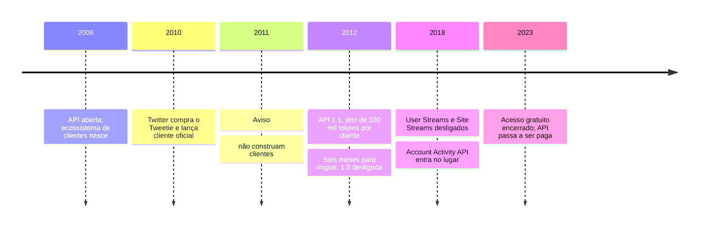

# Twitter: a API que criou um ecossistema e depois o desligou

Boa parte do vocabulário do Twitter não foi inventada pelo Twitter. O termo *tweet* apareceu num cliente de terceiro, o Twitterrific. A resposta com arroba, a repostagem e a marcação com cerquilha nasceram do uso e foram absorvidas depois. Durante alguns anos, a plataforma foi projetada por gente que não trabalhava lá, através de uma API aberta.

Depois a empresa fechou a porta. Três vezes, com onze anos de intervalo entre a primeira e a última, e cada fechamento apagou uma categoria inteira de software.

Este caso não trata de desenho de contrato. Trata do que acontece com quem construiu em cima do contrato de outra pessoa.

## 2006 a 2010: a API como estratégia de produto

O Twitter abriu a API cedo e ela virou o principal motor de adoção. Clientes de terceiros disputavam usuário entre si, e a competição produziu mais inovação de interface do que a empresa conseguiria sozinha. Tweetie, Twitterrific, TweetDeck e Echofon eram, para muita gente, o Twitter.

A consequência arquitetural é a que interessa a este módulo. O Twitter tinha um contrato público e milhares de consumidores independentes, cada um com o próprio ciclo de entrega. Isso é o cenário em que uma API deixa de ser um detalhe de integração e passa a ser a fronteira que define o produto.

Em 2010 a empresa comprou o Tweetie e o transformou no cliente oficial para iPhone. A partir daí, o dono do contrato passou a competir com os consumidores do contrato.

## Março de 2011: o aviso

Ryan Sarver, então responsável pela plataforma, escreveu à lista de desenvolvedores uma mensagem que ficou conhecida. O trecho reproduzido em toda a cobertura da época diz que os desenvolvedores não deveriam construir aplicativos clientes que imitassem ou reproduzissem a experiência de consumo principal do Twitter.

Foi um aviso, e nada mais. O contrato continuava funcionando exatamente como antes. O que mudou foi a declaração pública sobre o que seria tolerado dali em diante.

Quem tinha um cliente em produção nesse momento enfrentou uma decisão difícil de tomar com racionalidade: continuar investindo numa base de código cuja permissão de existir tinha acabado de ser posta em dúvida por um aviso informal.

## Agosto de 2012: a restrição vira código

A versão 1.1 da API tornou a intenção executável. As mudanças anunciadas em 16 de agosto de 2012 incluíam autenticação obrigatória em todos os *endpoints* (os endereços que a API expõe), limites de taxa recalculados por *endpoint* em vez de globais, e uma regra nova que atingia especificamente uma categoria de aplicativo.

Clientes de terceiros passaram a ter teto de **100 mil tokens de usuário**. Um aplicativo que atingisse cem mil usuários precisava negociar diretamente com o Twitter para crescer. Quem já estava acima do teto ganhou espaço até o dobro da base daquele momento, e nada além disso.

Repare no desenho do controle. Não é um limite de requisições, que protegeria a infraestrutura. É um limite de **usuários**, que protege o modelo de negócio. Um limite de taxa e um teto de tokens parecem o mesmo tipo de mecanismo na documentação, e resolvem problemas de natureza completamente diferente.

O prazo de migração da 1.0 para a 1.1 foi de seis meses. Depois disso, a versão antiga foi desligada.

**Texto alternativo:** linha do tempo do Twitter de 2006 a 2023, marcando a abertura da API e o nascimento do ecossistema, a compra do Tweetie, o aviso de 2011, o teto de tokens da versão 1.1 em 2012, o desligamento das APIs de fluxo contínuo em 2018 e o fim do acesso gratuito em 2023.

*Figura 9 — Dezessete anos de decisões sobre a fronteira pública do Twitter. Fonte: curso, a partir dos anúncios oficiais e da cobertura de imprensa da época.*

**Leitura textual da figura:** a sequência mostra três fechamentos sucessivos, cada um atingindo uma classe diferente de consumidor. O de 2012 atingiu clientes de leitura; o de 2018, aplicativos que dependiam de fluxo contínuo de eventos; o de 2023, qualquer consumidor sem orçamento. Entre um e outro passam anos, tempo suficiente para uma nova geração de produtos ser construída sobre a mesma fronteira.

## Agosto de 2018: muda o estilo de interação

O segundo fechamento foi mais técnico e, para quem estava do lado de fora, mais caro.

As APIs de fluxo contínuo conhecidas como User Streams e Site Streams foram desligadas em 16 de agosto de 2018, substituídas pela Account Activity API. A diferença não é de contrato: é de **estilo de interação**. Uma conexão persistente que empurra eventos foi trocada por um modelo em que a plataforma chama um endereço do consumidor.

Isso não se resolve trocando a URL. Um aplicativo que recebia eventos por conexão aberta não precisava de endereço público, nem de certificado, nem de disponibilidade permanente para receber chamadas de entrada. Passou a precisar. Produtos inteiros fecharam por não conseguirem pagar essa mudança, entre eles o Favstar.

## Fevereiro de 2023: o acesso gratuito acaba

O terceiro fechamento veio sem transição. Em 2 de fevereiro de 2023 a empresa anunciou que, a partir do dia 9, o acesso gratuito à API terminaria, nas versões 1.1 e 2. Sete dias.

O que morreu dessa vez foi diferente das outras duas. Bots públicos de utilidade, ferramentas de acessibilidade, projetos de pesquisa acadêmica e serviços gratuitos mantidos por uma pessoa só. Nenhum deles tinha receita para migrar para um plano pago.

## A lição que o caso ensina sobre contratos

Uma API pública tem duas faces, e o módulo trata as duas. Do lado de dentro, é um contrato que precisa ser versionado, documentado e testado. Do lado de fora, é uma **dependência que você não controla**.

Toda decisão de consumir uma API de terceiro é uma aposta sobre o comportamento futuro de uma empresa. O contrato técnico não protege contra mudança de estratégia, e o histórico do Twitter mostra que o aviso costuma vir antes da restrição, às vezes com anos de antecedência.

Isso não é argumento para não integrar. É argumento para tratar a integração como decisão arquitetural registrada, com o custo de saída estimado antes de começar.

## Questões para discussão

Releia o caso com a lente do arquiteto. As questões abaixo pedem recuperar os fatos, explicar os mecanismos e comparar as escolhas descritas no próprio caso.

**1.** A página descreve três fechamentos sucessivos da fronteira pública. Diga o ano de cada um e que classe de consumidor cada um atingiu.

**2.** Limite de taxa por *endpoint* e teto de tokens de usuário aparecem no mesmo anúncio. Explique o que cada um mede e diga qual protege a infraestrutura e qual protege o modelo de negócio.

**3.** Em 2018, as APIs de fluxo contínuo foram trocadas por um modelo em que a plataforma chama o consumidor. Explique o que um consumidor passou a precisar ter e que antes não precisava.

**4.** Compare o aviso de março de 2011 com a mudança de agosto de 2012 quanto ao efeito prático sobre quem já mantinha um cliente em produção.

**5.** No anúncio de 2012, aplicativos já acima do teto podiam crescer até o dobro da base daquele momento. Compare a situação de um aplicativo com 90 mil usuários e a de outro com 300 mil no dia do anúncio.

## Fontes

- Twitter, **Changes coming in Version 1.1 of the Twitter API** — anúncio oficial de 16 de agosto de 2012, origem das mudanças de autenticação, limites por *endpoint* e do teto de tokens. Página instável no domínio atual; use a [cópia arquivada](https://web.archive.org/web/20240416135831/https://blog.twitter.com/developer/en_us/a/2012/changes-coming-to-twitter-api).
- Twitter, [Delivering a consistent Twitter experience](https://blog.x.com/developer/en_us/a/2012/delivering-consistent-twitter-experience) — postagem de junho de 2012 que antecede e justifica as mudanças da versão 1.1.
- X, [Account Activity API — guia de migração a partir de User Streams e Site Streams](https://developer.x.com/en/docs/x-api/enterprise/account-activity-api/migration/us-ss-migration-guide) — documentação oficial da substituição de 2018, incluindo o que o consumidor precisa passar a operar.
- Fontes secundárias, identificadas como tais: a mensagem de Ryan Sarver de março de 2011 à lista de desenvolvedores é conhecida por reprodução na imprensa técnica, entre elas [O'Reilly Radar](http://radar.oreilly.com/2011/03/twitter-developers.html). O encerramento do acesso gratuito em fevereiro de 2023 foi noticiado por [Forbes](https://www.forbes.com/sites/jenaebarnes/2023/02/03/twitter-ends-its-free-api-heres-who-will-be-affected/) e [Engadget](https://www.engadget.com/twitter-shutting-off-free-api-prepare-174340770.html), e o fechamento do Favstar em 2018 por [TechCrunch](https://techcrunch.com/2018/05/14/favstar-twitter/).
