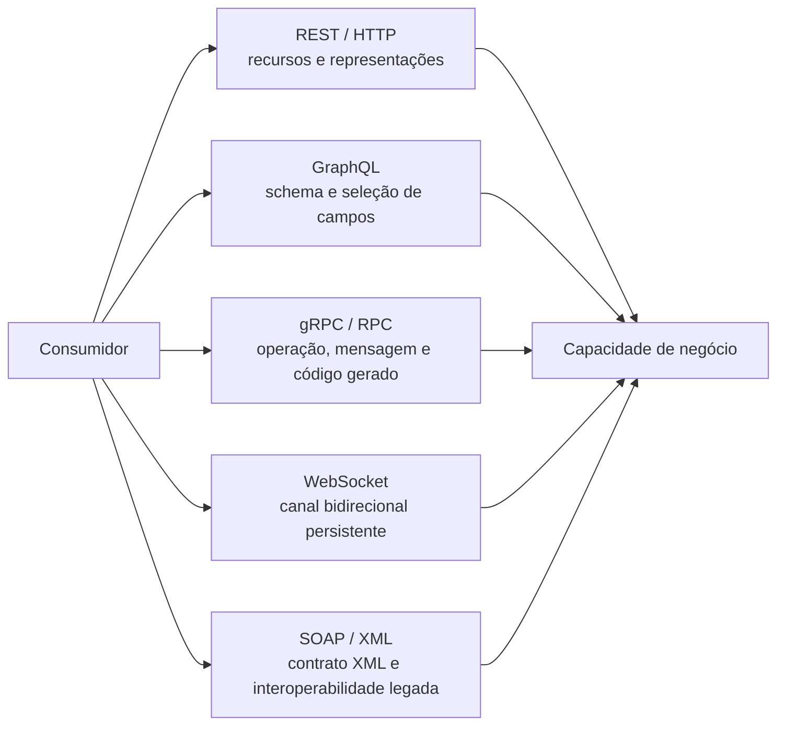

# Conceitos fundamentais de APIs

## API: fronteira de colaboração, não apenas uma URL

Uma **interface de programação de aplicações** (API) permite que aplicação web, móvel, nuvem, parceiro ou dispositivo use uma capacidade sem conhecer tabelas ou algoritmos internos. Separe três camadas:

| Camada | Pergunta que responde | Exemplo na plataforma hospitalar |
| --- | --- | --- |
| Interface | O que está disponível para interação? | `POST /elegibilidades` e `GET /elegibilidades/{protocolo}` |
| Contrato | Que promessa é observável? | campos obrigatórios, `202`, `Location`, `422` e schemas publicados |
| Implementação | Como a promessa é cumprida hoje? | FastAPI, Pydantic e armazenamento em memória |

O **consumidor** depende do contrato, não do código ou banco. Trocar biblioteca ou armazenamento pode ser interno; renomear campo, mudar status ou remover operação pede transição. Contrato, governança e evidência — não apenas a URL — tornam a API reutilizável.

## Consumidores diferentes, necessidades diferentes

Não se escolhe um estilo por popularidade. Aplicação web tende a valorizar semântica HTTP e documentação; móvel, payload e rede; integração entre organizações, contrato durável e tradução de vocabulário; canal em tempo real, reconexão e ritmo. Uma API multicanal não precisa entregar a mesma representação a todos, mas precisa preservar o significado de negócio e declarar diferenças.

## HTTP: protocolo de aplicação com semântica

HTTP não é apenas um túnel para “chamar função remota”. Uma requisição combina método, alvo, cabeçalhos e, quando necessário, conteúdo; uma resposta combina status, cabeçalhos e conteúdo. Clientes, proxies, caches e ferramentas compreendem essa semântica.

Considere `POST /elegibilidades`. O método comunica que o cliente submete uma representação para processamento. A resposta `202 Accepted` informa aceitação, mas não afirma que a operadora já decidiu. `Location: /elegibilidades/{protocolo}` comunica onde acompanhar o recurso aceito. Cada elemento reduz uma ambiguidade diferente.

| Método | Intenção comum | Propriedade relevante |
| --- | --- | --- |
| `GET` | recuperar uma representação | seguro e idempotente |
| `POST` | submeter dados ou criar sob uma coleção | não é idempotente por definição |
| `PUT` | substituir o estado conhecido de um recurso | idempotente |
| `PATCH` | aplicar alteração parcial | depende do formato da alteração |
| `DELETE` | remover a associação de um recurso | idempotente na intenção |

**Seguro** significa que o consumidor não pede mudança de estado; logs e métricas ainda podem existir. **Idempotente** significa que repetir a mesma intenção produz o mesmo efeito pretendido no servidor, embora a resposta ou metadados possam variar. Idempotência não equivale a deduplicação automática de uma transação distribuída.

## Recursos, representações e erros

Em REST, um **recurso** é algo identificado e manipulado por representações. A URI identifica; o JSON é a fotografia de uma representação naquele instante. A elegibilidade aceita não é o dicionário Python que a oficina guarda: amanhã ela pode vir de banco ou de outro serviço sem que o identificador público mude.

Por isso, rotas tendem a usar substantivos do vocabulário do consumidor, como `/elegibilidades`, `/agendamentos` e `/autorizacoes`. Verbos continuam existindo nos métodos e nas transições. Uma rota como `/aprovarAutomaticamente` pode ser uma operação RPC perfeitamente coerente, mas não deve ser chamada de REST só por usar JSON e HTTP.

Uma representação inclui dados necessários à tarefa, não tabelas internas: o laboratório retorna `protocolo`, `situacao` e `criado_em`. Famílias `2xx`, `4xx` e `5xx` distinguem sucesso, problema do consumidor e falha do servidor; `200`, `201`, `202`, `404`, `409` e `422` refinam a semântica. O schema `ErroAPI` usa `codigo` estável, `mensagem` legível e `detalhes` por campo para que o consumidor não dependa de texto livre.

## Restrições REST de Fielding

REST não é JSON sobre HTTP. **Cliente-servidor**, **sem estado** e **cache** delimitam colaboração; **interface uniforme** reúne identificação de recursos, representações, mensagens autodescritivas e hipermídia; **sistema em camadas** aceita intermediários; **código sob demanda** é opcional. Uma API HTTP não é automaticamente REST: rota com substantivo pode ser **RPC com aparência de recurso**. O laboratório usa recursos e mensagens HTTP, mas não demonstra todas as restrições.

## Estilos e protocolos: comparar a interação, não eleger vencedor

REST, RPC, GraphQL, gRPC, WebSocket e SOAP resolvem interações distintas. O protocolo e o estilo devem ser avaliados pela necessidade do consumidor, topologia, volume, latência, evolução e operação.

**Texto alternativo:** um consumidor alcança a mesma capacidade por REST/HTTP, GraphQL, gRPC/RPC, WebSocket ou SOAP/XML.

*Figura 4 — Formas de interação entre um consumidor e a mesma capacidade de negócio.*

**Leitura textual:** as formas convergem na mesma capacidade: REST usa recursos, GraphQL seleciona campos, gRPC/RPC expõe operações, WebSocket mantém canal e SOAP/XML apoia contrato existente.

| Alternativa | Quando ajuda | Cuidado arquitetural |
| --- | --- | --- |
| REST/HTTP | recursos em integrações web heterogêneas | não reduzir REST a nomes de URL |
| RPC/gRPC | comandos ou colaboração interna tipada | evolução de métodos, mensagens e toolchain |
| GraphQL | leituras com seleção variável | custo, autorização e cache nos resolvers |
| WebSocket | atualização bidirecional em tempo real | reconexão, ordenação e pressão de consumo |
| SOAP/XML | contrato de parceiro legado | isolar tradução do domínio |

GraphQL exige schema e política para consultas caras. gRPC não garante baixo tempo de resposta se a dependência externa continua lenta. WebSocket não substitui evento durável ou mensageria. SOAP não exige que a plataforma moderna use XML. Em cada caso, o arquiteto registra a força que levou à escolha e a evidência que poderá revisá-la.

## Cabeçalhos, OpenAPI e contrato verificável

Cabeçalhos transportam metadados da interação. `Content-Type` descreve a representação enviada; `Accept` expressa formatos aceitos; `Location` aponta recurso relacionado; `ETag` identifica versão de uma representação para cache ou concorrência; um identificador de correlação conecta registros técnicos. Dados de negócio pertencem normalmente ao corpo; metadados de transporte, negociação, cache, condição ou rastreamento são candidatos a cabeçalho.

OpenAPI descreve caminhos, operações, parâmetros, corpos, respostas e schemas em YAML ou JSON. No laboratório, `contratos/openapi.yaml` é a promessa explícita versionada.

*Figura 5 — Anatomia de um contrato de API.*

**Leitura textual da figura:** um cliente consulta o contrato OpenAPI e envia uma requisição à API. A API responde `202 Accepted` e `Location` para informar aceitação e o caminho de acompanhamento. Outro consumidor, como uma operadora, pode usar a mesma promessa sem conhecer a implementação do servidor.

Arquivo válido pode ser contrato fraco: tipo sem significado, erro ausente ou exemplo incompatível. Spectral examina o documento; Bruno, o consumo; `TestClient`, a execução HTTP. São perspectivas complementares.

## Evolução: paginação, repetição e compatibilidade

`offset/limit` pode repetir ou omitir itens em coleção mutável; cursor opaco lida melhor com mudança, mas pede mais política. Declare ordenação, continuação, filtros e erro. Para repetição de `POST`, chave de idempotência precisa de escopo, retenção, comparação e resposta divergente. O **versionamento** identifica linha de evolução incompatível; prefira campo opcional e significado preservado antes de nova versão. Remoção, obrigatoriedade ou unidade nova tendem a quebrar consumidores.
