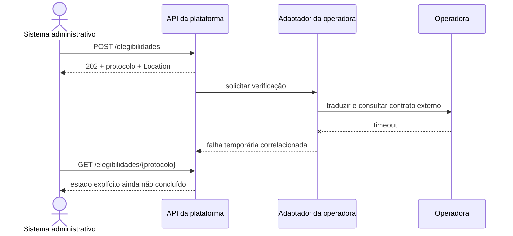

# Estudo de caso: contratos na plataforma hospitalar

## Fronteiras do incremento

O grupo hospitalar coordena cadastro, agenda, elegibilidade, autorização, exames e auditoria. Operadora e laboratório são organizações independentes, com modelos e ciclos próprios. O incremento 2 não divide toda a solução em serviços nem instala um gateway. Ele estabiliza a linguagem nas fronteiras antes de tomar essas decisões.

A primeira API trata elegibilidade como capacidade administrativa. O consumidor conhece `PedidoElegibilidade`, `ElegibilidadeAceita` e `ErroAPI`. Ele não conhece o formato externo da operadora. Um adaptador futuro poderá traduzir `codigo_operadora` e `matricula_plano` para o contrato externo. Se a operadora trocar XML por JSON, a linguagem da plataforma deve permanecer estável sempre que o significado não mudar.

## Mapa de interações

| Interação | Necessidade temporal | Contrato inicial | Risco a investigar |
| --- | --- | --- | --- |
| consultar horários | resposta imediata para escolha | leitura paginada de disponibilidades | coleção muda durante navegação |
| pedir elegibilidade | aceitação rápida, decisão pode demorar | `POST` com protocolo e consulta posterior | repetição após perda de resposta |
| solicitar autorização | processamento externo variável | recurso com estados explícitos | estados externos divergentes |
| encaminhar pedido ao laboratório | tradução entre modelos | adaptador com contrato próprio | perda semântica na transformação |
| receber resultado | chegada posterior | callback ou evento em incremento futuro | autenticidade, repetição e ordenação |

O mapa não determina que todas as interações sejam REST. Ele explicita forças. Disponibilidade de agenda se parece com coleção consultável e exige paginação consistente. Elegibilidade se beneficia de protocolo porque a aceitação local não garante resposta externa. Resultado de laboratório pode justificar notificação ou evento, tema aprofundado no módulo 5.

## Linguagem da plataforma e linguagem externa

Imagine que a operadora chama a matrícula de `beneficiaryKey` e retorna códigos numéricos não documentados. Copiar esses nomes para todos os consumidores espalha dependência externa. O adaptador converte o pedido da plataforma, chama a operadora, interpreta resposta e mapeia estados. A API gateway pode rotear e aplicar políticas, mas não deveria conter toda essa tradução semântica.

Quando um mapeamento perde informação, a decisão precisa aparecer. Um estado externo desconhecido pode virar um erro explícito ou uma situação `pendente_de_mapeamento`; não deve ser silenciosamente convertido em `negada`. O contrato protege o domínio quando torna diferenças visíveis e testáveis.

## Sequência com indisponibilidade externa

**Leitura textual da figura:** o sistema administrativo recebe aceitação local antes da chamada externa; o adaptador traduz a solicitação, encontra um timeout e registra a falha; uma consulta posterior devolve um estado não concluído em vez de confundir aceitação com decisão final.

O diagrama representa uma evolução, não a implementação do laboratório. Hoje só existe o estado `recebida`. Adicionar processamento em segundo plano exige persistência, novas transições, repetição segura e observabilidade. O contrato deverá nomear esses estados e definir quais são terminais.

## Decisões para a baseline

### Aceitação e acompanhamento

`202` com `Location` desacopla a aceitação local da decisão externa. A consequência é que o consumidor precisa acompanhar o protocolo, e a plataforma precisa preservar estado. Se medições mostrarem que a operadora sempre responde em poucos milissegundos e os consumidores exigirem resposta imediata, o gatilho pode levar a outra interação. A decisão é condicionada, não dogma.

### Identificadores

O protocolo é gerado pela plataforma e permanece estável através da jornada. Identificadores externos ficam no adaptador e em registros de correlação restritos. Um ID de correlação operacional atravessa chamadas e logs, mas não substitui o protocolo público. Essa separação permite políticas de retenção e visibilidade diferentes.

### Erros

Validação local produz `422`; protocolo desconhecido produz `404`; indisponibilidade da operadora não deveria ser disfarçada como dado inválido. O mapa completo de erros será ampliado quando a integração existir. Códigos públicos não devem revelar classes, servidores ou detalhes da rede.

### Evolução

Campos novos entram primeiro como opcionais. Valores novos de enumeração exigem confirmar que consumidores toleram desconhecidos. Mudanças incompatíveis pedem transição e versionamento explícito. A equipe registra consumidor, versão, data de depreciação e evidência de migração.

## Limites do exemplo

O dicionário em memória perde dados ao reiniciar, não coordena múltiplos processos e não oferece idempotência concorrente. A ausência de autenticação é intencional neste encontro; não significa que uma API hospitalar real possa operar assim. Dados são sintéticos e a oficina não chama operadora real. Esses limites mantêm o experimento local e deixam infraestrutura, governança e eventos para incrementos próprios.

## Evidências para o ADR-002

O ADR pode anexar: contrato validado pelo Spectral; exemplo executado no Bruno; teste que confirma `202`, `Location`, `GET` e `422`; diagrama de sequência; tabela de alternativas REST, RPC, GraphQL e gRPC; e uma lista de gatilhos. A decisão estará bem fundamentada quando outra equipe conseguir reproduzir o comportamento e explicar por que a fronteira não copia o modelo externo.
