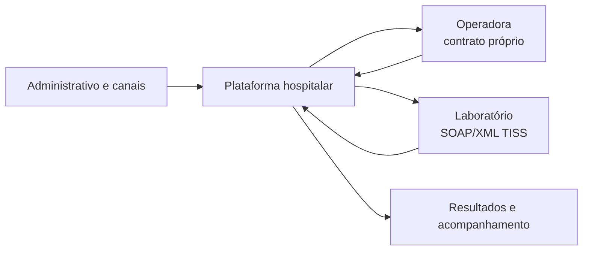
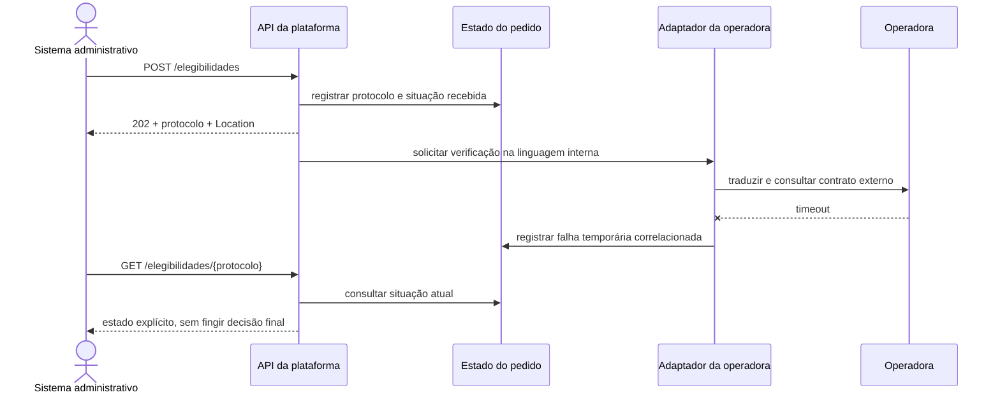

# Estudo de caso: integrar hospital, operadora e laboratório

## O problema que a arquitetura precisa resolver

Considere um hospital com agenda, elegibilidade, autorização e pedidos de exame. Operadora e laboratório são organizações independentes, com versões, disponibilidade e modelos próprios. A plataforma deve rastrear processos sem transformar a integração externa no seu modelo interno. Dados são sintéticos; o cenário representa forças de arquitetura, não informações reais.

**Texto alternativo:** canais administrativos acessam a plataforma, que troca solicitações e respostas com operadora e laboratório e produz acompanhamento.

*Figura 10 — A plataforma hospitalar como fronteira entre canais internos e parceiros com contratos próprios. Fonte: curso.*

**Leitura textual:** canais usam a plataforma, que conversa com parceiros por contratos próprios; as setas indicam solicitações e respostas em momentos distintos.

## Mapa de interações antes da escolha técnica

| Interação | Resultado que o consumidor precisa | Necessidade temporal | Risco que não pode ficar implícito |
| --- | --- | --- |
| Consultar horários | opções de agenda ordenadas | resposta rápida para escolher | páginas mudam enquanto se navega |
| Pedir elegibilidade | confirmação de recebimento e acompanhamento | aceitação rápida; decisão pode demorar | repetição após perda de resposta |
| Solicitar autorização | estado atual e histórico da solicitação | processo externo variável | estado externo diverge do interno |
| Enviar pedido ao laboratório | pedido traduzido e rastreável | entrega confiável | perda de significado na conversão |
| Receber resultado | resultado disponível ao profissional | minutos, horas ou dias | autenticidade, repetição e ordenação |

O mapa não impõe REST, mensageria ou gateway: agenda pede paginação, elegibilidade pede protocolo e resultado posterior pode exigir polling, webhook ou evento.

## Decisão 1: integrar sem acoplar ao banco do parceiro

Para solicitar exames, há três famílias de alternativa:

| Alternativa | Ganho inicial | Consequência e crítica |
| --- | --- | --- |
| Acesso direto ao banco | reduz integração inicial | acopla ao modelo externo e fragiliza evolução |
| Contrato oficial SOAP/XML | respeita interface do parceiro | mantém dependência temporal e pede tradução/observabilidade |
| Mensagem posterior | desacopla tempo e permite retomada | introduz consistência eventual, duplicidade e operação |

Neste estágio, consumir o contrato oficial por adaptador é uma baseline possível; mensageria pede necessidade demonstrada de entrega desacoplada e retomada. A escolha depende de criticidade, disponibilidade, janela temporal e operação.

## Decisão 2: REST interno e SOAP/TISS externo podem coexistir

O laboratório só oferece SOAP/XML aderente ao contexto TISS, enquanto a plataforma expõe REST/JSON aos seus próprios consumidores. Três escolhas comuns precisam ser distinguidas:

| Alternativa | O que preserva | O que prejudica |
| --- | --- | --- |
| Padronizar plataforma em SOAP | pilha uniforme aparente | transfere restrição externa sem necessidade |
| Converter no gateway | fachada REST | pode esconder perda semântica |
| Adaptador/ACL | contrato interno e tradução isolada | pede componente, testes e observabilidade |

O adaptador, ou **anti-corruption layer** (ACL), traduz resposta, erro, estado e identificadores. Ele localiza a complexidade e concentra mudanças do parceiro numa fronteira revisável.

**Texto alternativo:** o sistema envia elegibilidade; a API cria protocolo e responde `202` com `Location`. O adaptador recebe timeout da operadora e registra falha temporária; consulta posterior devolve estado conhecido.

*Figura 11 — A plataforma registra o pedido antes de consultar a operadora e preserva o estado conhecido após um timeout. Fonte: curso.*

**Leitura textual:** a plataforma cria protocolo antes da chamada externa; o adaptador encontra timeout; consulta posterior devolve estado conhecido, não decisão da operadora.

## Decisão 3: gateway é política de fronteira, ACL é proteção do domínio

Um gateway pode centralizar TLS, roteamento, autenticação técnica, limites, correlação, métricas e, em casos justificados, composição de respostas. Ele não resolve diferenças semânticas entre a plataforma e o laboratório. Colocar a conversão TISS no gateway parece reduzir componentes, mas espalha decisões de domínio onde deveriam ficar apenas políticas técnicas.

Pergunte se o mapeamento entre `matricula_plano` e identificador externo pertence à plataforma ou a uma operadora. A segunda resposta aponta para adaptador. Estado externo desconhecido deve permanecer explícito, nunca virar `negada` por conveniência de roteamento.

## Decisão 4: como avisar que um exame ficou pronto

Alguns resultados ficam prontos em minutos; outros, em horas ou dias. Há três alternativas que devem ser avaliadas contra volume, segurança e operação:

| Forma de acompanhamento | Quando ajuda | Limite que precisa ser assumido |
| --- | --- | --- |
| Polling frequente | parceiro só oferece consulta e o volume é pequeno | chamadas repetidas, custo e atraso entre consultas |
| Polling adaptativo | prazo esperado muda com o tempo | continua sendo consulta periódica; política precisa ser documentada |
| Webhook ou evento | parceiro consegue notificar conclusão | endpoint autenticado, repetição, ordenação, confirmação e recuperação precisam existir |

WebSocket não substitui webhook: é canal persistente para consumidor conectado; resultado de exame pode exigir processamento sem tela aberta. O módulo de eventos retoma entrega e reprocessamento.

## Decisão 5: confiabilidade exige identidade de processamento

Uma chamada REST síncrona com retry é simples, mas pode reenviar um pedido quando a resposta se perde. Mensageria sem idempotência desacopla temporalmente, mas pode repetir efeitos. Mensageria com idempotência pode tratar reprocessamentos com segurança, desde que exista identificador de negócio, retenção, auditoria e comportamento de duplicidade definido.

A API mínima prova somente `202`, `Location`, consulta e validação. Arquitetura futura deve registrar duplicidade, resposta externa tardia e reinício; “usar retry” ou fila sem contrato apenas desloca ambiguidade.

## Baseline recomendada e limites honestos

Baseline: uma aplicação, REST/HTTP interno, `202`, `Location`, OpenAPI e adaptador planejado. Gateway e entrega assíncrona permanecem condicionais. ADR-002 registra contrato validado, exemplos, testes, sequência, alternativas, limites e gatilhos.
