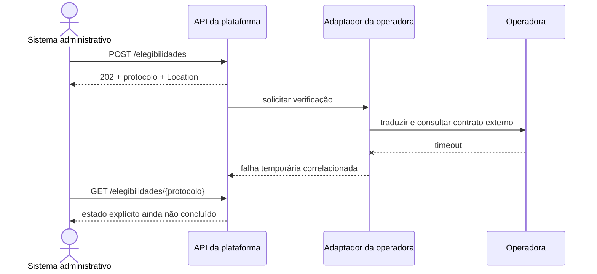

# Estudo de caso: contratos na plataforma hospitalar

## Fronteiras do incremento

Operadora e laboratório têm modelos e ciclos próprios. O incremento 2 estabiliza a linguagem antes de dividir serviços ou instalar gateway. Consumidores conhecem `PedidoElegibilidade`, `ElegibilidadeAceita` e `ErroAPI`, não o formato externo. Um adaptador traduzirá o contrato sem contaminar a plataforma.

## Mapa de interações

| Interação | Necessidade temporal | Contrato inicial | Risco a investigar |
| --- | --- | --- | --- |
| consultar horários | resposta imediata para escolha | leitura paginada de disponibilidades | coleção muda durante navegação |
| pedir elegibilidade | aceitação rápida, decisão pode demorar | `POST` com protocolo e consulta posterior | repetição após perda de resposta |
| solicitar autorização | processamento externo variável | recurso com estados explícitos | estados externos divergentes |
| encaminhar pedido ao laboratório | tradução entre modelos | adaptador com contrato próprio | perda semântica na transformação |
| receber resultado | chegada posterior | callback ou evento em incremento futuro | autenticidade, repetição e ordenação |

O mapa explicita forças, não impõe REST. Agenda exige paginação consistente; elegibilidade se beneficia de protocolo; resultado posterior pode justificar notificação ou evento.

## Linguagem da plataforma e linguagem externa

Se a operadora usa `beneficiaryKey` e códigos próprios, o adaptador converte pedido e estados. O gateway pode rotear, não assumir a tradução semântica. Estado desconhecido deve ficar explícito, jamais convertido silenciosamente em `negada`.

## Sequência com indisponibilidade externa

**Leitura textual da figura:** o sistema administrativo recebe aceitação local antes da chamada externa; o adaptador traduz a solicitação, encontra um timeout e registra a falha; uma consulta posterior devolve um estado não concluído em vez de confundir aceitação com decisão final.

O diagrama é evolução: hoje só existe `recebida`. Processamento posterior exige persistência, transições, repetição segura e observabilidade.

## Decisões para a baseline

### Aceitação e acompanhamento

`202` com `Location` separa aceitação local da decisão externa. Consumidor acompanha protocolo e plataforma preserva estado; medições podem justificar outra interação.

### Identificadores

Protocolo público acompanha a jornada; identificadores externos ficam no adaptador. Correlação atravessa logs e chamadas, mas não substitui o protocolo.

### Erros

Validação produz `422`; protocolo desconhecido, `404`; indisponibilidade externa não é dado inválido. Erros públicos não revelam detalhes internos.

### Evolução

Campos novos começam opcionais; enumerações exigem tolerância a desconhecidos; incompatibilidades pedem transição e versão explícita.

## Limites do exemplo

O dicionário perde dados, não coordena processos nem oferece idempotência concorrente. Autenticação ausente e dados sintéticos limitam o experimento local.

## Evidências para o ADR-002

Anexe contrato validado, exemplo Bruno, testes de `202`, `Location`, `GET` e `422`, sequência, alternativas e gatilhos. Outra equipe deve reproduzir o comportamento e explicar a proteção contra o modelo externo.
