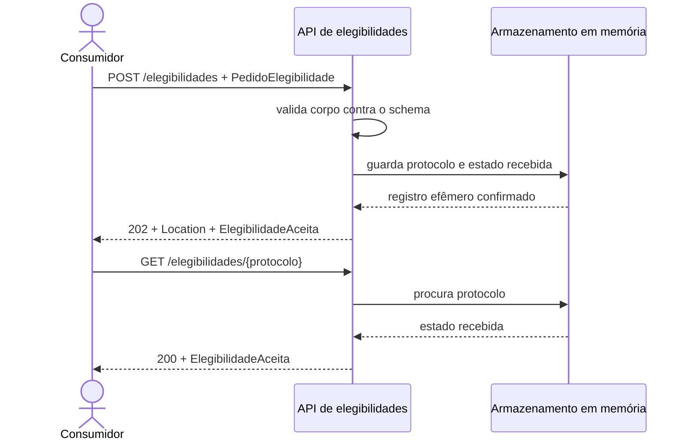

# Exemplo arquitetural: aceitar uma elegibilidade

## Da necessidade ao contrato

A equipe administrativa precisa perguntar à plataforma se uma matrícula está elegível para uma solicitação. A operadora externa pode responder com latência variável e não pertence à mesma unidade operacional. Neste incremento, a API não simula a integração completa. Ela estabelece a primeira parte do protocolo: receber dados sintéticos válidos, gerar um identificador e permitir recuperação do estado aceito.

O consumidor envia:

```json
{
  "cpf": "12345678901",
  "codigo_operadora": "OPS-001",
  "matricula_plano": "MAT-2026-001"
}
```

Os três campos formam `PedidoElegibilidade`. O CPF é apenas um identificador sintético de onze dígitos na oficina; nenhuma validação cadastral real é afirmada. `codigo_operadora` pertence à linguagem da plataforma, e `matricula_plano` representa o vínculo administrativo. O contrato não expõe XML, tabela ou código interno da operadora.

Se o corpo atende ao schema, a aplicação responde `202 Accepted`, inclui `Location` e retorna `ElegibilidadeAceita`:

```http
HTTP/1.1 202 Accepted
Content-Type: application/json
Location: /elegibilidades/550e8400-e29b-41d4-a716-446655440000
```

```json
{
  "protocolo": "550e8400-e29b-41d4-a716-446655440000",
  "situacao": "recebida",
  "criado_em": "2026-07-17T13:30:00Z"
}
```

`recebida` não significa elegível nem aprovada. Significa somente que a plataforma aceitou o pedido. Esse vocabulário evita prometer uma decisão que a implementação ainda não produz. O `GET` no valor de `Location` devolve a mesma representação enquanto o processo está em memória.

## Sequência observável



**Leitura textual da figura:** o consumidor envia um pedido, a API valida e guarda um estado efêmero, responde com `202` e o endereço de consulta; em seguida, o consumidor usa esse endereço e recebe `200` com a representação aceita.

O diagrama mostra mensagens públicas e uma dependência interna. Trocar o dicionário por persistência não deveria mudar as quatro mensagens entre consumidor e API. Já acrescentar a decisão da operadora exigirá novos estados, regras de transição e testes. O contrato deve evoluir antes que o diagrama passe a sugerir um comportamento inexistente.

## Caminho de erro

Quando `cpf` está ausente, FastAPI detecta a violação do modelo Pydantic. Um tratador transforma o erro técnico na representação pública `ErroAPI`:

```json
{
  "codigo": "dados_invalidos",
  "mensagem": "A requisição não atende ao contrato.",
  "detalhes": [
    {
      "campo": "body.cpf",
      "mensagem": "Field required",
      "tipo": "missing"
    }
  ]
}
```

O status é `422 Unprocessable Entity`. `codigo` apoia decisão automatizada; `mensagem` ajuda pessoas; `detalhes` localiza cada violação. O consumidor não deve depender da frase inglesa do validador. Uma versão posterior pode normalizar mensagens preservando `codigo`, `campo` e `tipo`.

Consultar um protocolo desconhecido produz `404` e `elegibilidade_nao_encontrada`. Após reiniciar o servidor, todos os protocolos anteriores se tornam desconhecidos porque não há persistência. A oficina destaca essa limitação para impedir que o exemplo seja confundido com arquitetura de produção.

## Contrato explícito e contrato gerado

`contratos/openapi.yaml` declara exatamente duas rotas, três schemas públicos principais, exemplos e respostas. FastAPI também expõe `/openapi.json` a partir do código. O teste automatizado confere que ambos incluem as operações e os mesmos campos obrigatórios de `PedidoElegibilidade`. Outro teste lê o exemplo do YAML e o envia à aplicação.

Essa verificação não prova equivalência total. Ela cria uma sentinela pequena e útil. Uma equipe pode ampliar a comparação com ferramentas de diff semântico, testes de consumidor ou geração do contrato a partir de uma fonte única. A evidência deve acompanhar o risco: operações públicas críticas pedem verificação mais profunda que um protótipo local.

## Estrutura do código

`models.py` contém representações públicas. `main.py` liga rotas, status, cabeçalhos, tratamento de erro e armazenamento. Essa separação é pequena, mas permite ler o contrato de dados sem percorrer o fluxo HTTP. Não há repositório, fila, serviço externo nem autenticação real. Adicioná-los agora esconderia a lição e criaria promessas não exigidas.

O teste usa `TestClient(app)`. Ele envia HTTP em processo e verifica resposta como um consumidor, sem chamar diretamente `criar_elegibilidade`. Assim, valida serialização, status, cabeçalho e roteamento. Um teste unitário da função seria mais rápido, porém não demonstraria o contrato HTTP completo.

## Equivalências em Java e .NET

Em **Spring Boot**, `@RestController` e `@PostMapping`/`@GetMapping` expõem operações; records ou classes com Jakarta Bean Validation modelam o corpo; `ResponseEntity.accepted().location(uri).body(...)` representa a resposta `202`; `@RestControllerAdvice` pode normalizar erros. Springdoc pode produzir OpenAPI, e testes com MockMvc exercitam a fronteira HTTP sem servidor externo.

Em **ASP.NET Core**, Minimal APIs com `MapPost`/`MapGet` ou controllers com atributos expõem operações; records modelam DTOs; `Results.Accepted(location, value)` produz `202`; middleware ou `IExceptionHandler` normaliza erros. Swashbuckle ou o suporte OpenAPI da plataforma descreve o contrato, enquanto `WebApplicationFactory` permite testes em processo.

As equivalências preservam a decisão: recurso, semântica HTTP, schemas, erro e evidência. Decoradores Python, anotações Java e métodos C# são mecanismos diferentes. Se uma migração exigir redesenhar o significado público, o contrato estava acoplado à tecnologia.
