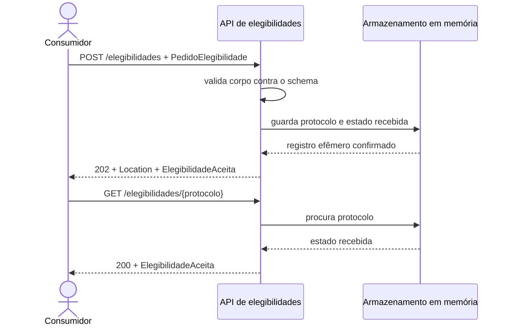
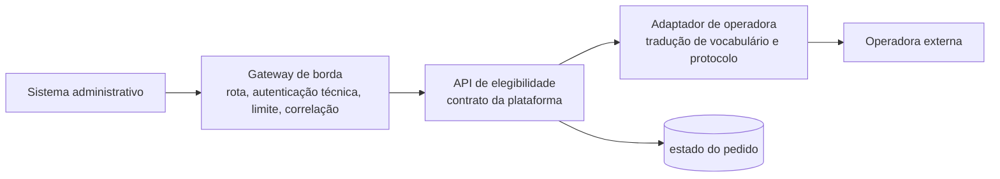

# Exemplo arquitetural: aceitar uma elegibilidade

## Da necessidade ao contrato

A equipe administrativa consulta elegibilidade; a operadora externa pode responder com latência variável. Neste incremento, a API só recebe dado sintético, gera identificador e permite recuperar o estado aceito.

O consumidor envia:

```json
{
  "cpf": "12345678901",
  "codigo_operadora": "OPS-001",
  "matricula_plano": "MAT-2026-001"
}
```

Os três campos formam `PedidoElegibilidade`. O CPF é apenas um identificador sintético de onze dígitos na oficina; nenhuma validação cadastral real é afirmada. `codigo_operadora` pertence à linguagem da plataforma, e `matricula_plano` representa o vínculo administrativo. O contrato não expõe XML, tabela ou código interno da operadora.

Se o corpo atende ao schema, a aplicação responde `202 Accepted`, inclui `Location` e retorna `ElegibilidadeAceita`:

```http
HTTP/1.1 202 Accepted
Content-Type: application/json
Location: /elegibilidades/550e8400-e29b-41d4-a716-446655440000
```

```json
{
  "protocolo": "550e8400-e29b-41d4-a716-446655440000",
  "situacao": "recebida",
  "criado_em": "2026-07-17T13:30:00Z"
}
```

`recebida` não significa elegível nem aprovada. Significa somente que a plataforma aceitou o pedido. Esse vocabulário evita prometer uma decisão que a implementação ainda não produz. O `GET` no valor de `Location` devolve a mesma representação enquanto o processo está em memória.

## Sequência observável



**Texto alternativo:** o consumidor envia `POST`; a API valida, guarda protocolo `recebida` em memória e responde `202` com `Location`. Um `GET` devolve `200` com a representação aceita.

*Figura 5 — Sequência de aceitação e consulta de uma elegibilidade armazenada em memória. Fonte: curso.*

**Leitura textual:** o consumidor envia pedido; a API valida, guarda estado efêmero e responde `202` com endereço de consulta. O uso do endereço devolve `200` e a representação aceita.

Trocar o dicionário por persistência não deveria mudar as mensagens públicas. Decisão da operadora exigirá novos estados, regras e testes.

## Onde termina o gateway e começa a tradução

O laboratório não instala gateway: uma FastAPI única atende em `http://127.0.0.1:8000`. Em evolução com várias capacidades, borda pública e integração externa têm responsabilidades diferentes.



**Texto alternativo:** o sistema administrativo chama o gateway, que encaminha à API; ela mantém o estado e usa adaptador para chamar a operadora.

*Figura 6 — Uma evolução possível: políticas técnicas na borda, tradução no adaptador e estado na plataforma. Fonte: curso.*

**Leitura textual:** gateway aplica políticas; adaptador traduz vocabulário e protocolo da operadora; o estado pertence à API. É hipótese de evolução, não componente do laboratório.

O gateway pode autenticar, limitar e rotear. Ele não deve converter `beneficiaryKey` da operadora para `matricula_plano` nem decidir que um estado desconhecido significa `negada`; isso é responsabilidade do adaptador, onde a diferença semântica pode ser testada e observada. Essa separação evita espalhar SOAP/XML ou regras externas pelos consumidores internos.

## Caminho de erro

Quando `cpf` está ausente, FastAPI detecta a violação do modelo Pydantic. Um tratador transforma o erro técnico na representação pública `ErroAPI`:

```json
{
  "codigo": "dados_invalidos",
  "mensagem": "A requisição não atende ao contrato.",
  "detalhes": [
    {
      "campo": "body.cpf",
      "mensagem": "Field required",
      "tipo": "missing"
    }
  ]
}
```

`422 Unprocessable Entity` usa `codigo` para automação e `mensagem`/`detalhes` para pessoas. Protocolo desconhecido produz `404`; reinício o perde porque não há persistência.

## Contrato explícito e contrato gerado

`contratos/openapi.yaml` declara rotas, schemas e exemplos; FastAPI expõe `/openapi.json`. Testes comparam operações, campos e exemplo. Isso é sentinela, não equivalência total.

## Estrutura do código

`models.py` contém representações; `main.py`, rota, status, erro e memória. `TestClient(app)` verifica HTTP em processo: serialização, status, cabeçalho e roteamento.

## Equivalências em Java e .NET

Em **Spring Boot**, `@RestController`, `ResponseEntity.accepted`, Springdoc e MockMvc cumprem papéis equivalentes. Em **ASP.NET Core**, `MapPost`/`MapGet`, `Results.Accepted`, OpenAPI e `WebApplicationFactory` fazem o mesmo. Python, Java e C# variam no mecanismo; a decisão preserva recurso, HTTP, schema, erro e evidência.
