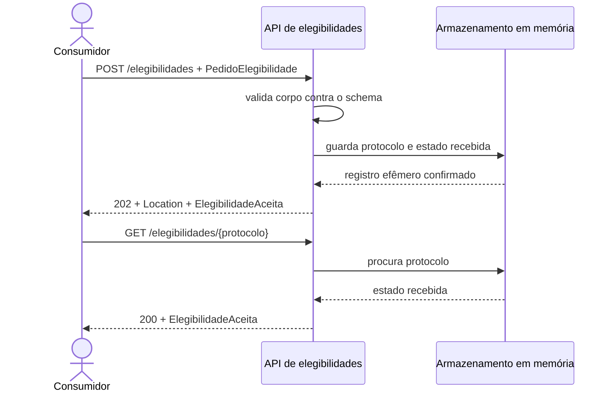
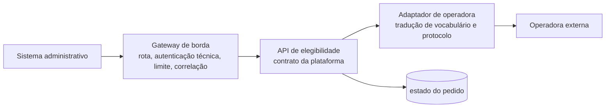

# Exemplo arquitetural: aceitar uma elegibilidade

## O que vamos construir

A equipe administrativa precisa consultar a elegibilidade de um paciente no plano de saúde. A operadora externa é lenta e nem sempre está disponível. Neste incremento ainda **não** falamos com a operadora: a API só **recebe** o pedido, guarda um protocolo e deixa consultar o estado depois. É o menor passo que já exercita um contrato HTTP de verdade.

Antes de olhar qualquer código, veja a interação inteira de uma vez.

## Primeiro, a sequência


```mermaid
sequenceDiagram
    actor Consumidor
    participant API as API de elegibilidades
    participant Memoria as Armazenamento em memória
    Consumidor->>API: POST /elegibilidades + PedidoElegibilidade
    API->>API: valida corpo contra o schema
    API->>Memoria: guarda protocolo e estado recebida
    Memoria-->>API: registro efêmero confirmado
    API-->>Consumidor: 202 + Location + ElegibilidadeAceita
    Consumidor->>API: GET /elegibilidades/{protocolo}
    API->>Memoria: procura protocolo
    Memoria-->>API: estado recebida
    API-->>Consumidor: 200 + ElegibilidadeAceita
```

**Texto alternativo:** o consumidor envia `POST`; a API valida, guarda protocolo `recebida` em memória e responde `202` com `Location`. Um `GET` devolve `200` com a representação aceita.

*Figura 5 — Sequência de aceitação e consulta de uma elegibilidade armazenada em memória. Fonte: curso.*

**Leitura textual:** o consumidor envia pedido; a API valida, guarda estado efêmero e responde `202` com endereço de consulta. O uso do endereço devolve `200` e a representação aceita.

Leia o diagrama assim: o consumidor manda um `POST`; a API valida o corpo, guarda um protocolo com estado `recebida` e responde `202` com um endereço (`Location`); depois, um `GET` nesse endereço devolve `200` com a mesma representação. `recebida` não quer dizer "aprovada" — significa apenas que a plataforma aceitou o pedido.

Agora vamos construir isso em quatro passos. O código é **FastAPI** (um framework Python para APIs HTTP) com **Pydantic** (uma biblioteca que valida dados a partir das anotações de tipo). Os trechos abaixo são esqueletos, para mostrar a forma; o código completo está no laboratório, em `src/hospital/api/`.

## Passo 1 — O contrato vira classes

O consumidor envia três campos:

```json
{
  "cpf": "12345678901",
  "codigo_operadora": "OPS-001",
  "matricula_plano": "MAT-2026-001"
}
```

Em `models.py`, esse contrato vira classes Pydantic. O tipo de cada campo **é** a regra de validação: se o corpo não bater, o FastAPI recusa antes de a sua lógica rodar.

```python
# models.py
from datetime import datetime
from pydantic import BaseModel, Field

class PedidoElegibilidade(BaseModel):         # o que o consumidor envia
    cpf: str = Field(pattern=r"^\d{11}$")     # 11 dígitos, sintético
    codigo_operadora: str
    matricula_plano: str

class ElegibilidadeAceita(BaseModel):         # o que a API devolve
    protocolo: str
    situacao: str                             # neste incremento, sempre "recebida"
    criado_em: datetime
```

O `cpf` aqui é só um identificador sintético de onze dígitos — nenhuma validação cadastral real é afirmada. O contrato não expõe XML, tabela nem código interno da operadora: `codigo_operadora` e `matricula_plano` já estão na linguagem da plataforma.

## Passo 2 — A rota que aceita e guarda

A rota `POST /elegibilidades` recebe o pedido já validado (pelo tipo `PedidoElegibilidade`), cria um protocolo, guarda em memória e responde `202 Accepted` com o cabeçalho `Location` apontando onde consultar.

```python
# main.py
from uuid import uuid4
from datetime import datetime, timezone
from fastapi import FastAPI, Response, status

app = FastAPI(title="API de elegibilidades da plataforma hospitalar")
_elegibilidades: dict[str, ElegibilidadeAceita] = {}   # memória: some ao reiniciar

@app.post("/elegibilidades", status_code=status.HTTP_202_ACCEPTED)
def criar_elegibilidade(pedido: PedidoElegibilidade, response: Response) -> ElegibilidadeAceita:
    aceita = ElegibilidadeAceita(
        protocolo=str(uuid4()),
        situacao="recebida",
        criado_em=datetime.now(timezone.utc),
    )
    _elegibilidades[aceita.protocolo] = aceita
    response.headers["Location"] = f"/elegibilidades/{aceita.protocolo}"
    return aceita
```

É isto que o consumidor observa:

```http
HTTP/1.1 202 Accepted
Location: /elegibilidades/550e8400-e29b-41d4-a716-446655440000
```

```json
{
  "protocolo": "550e8400-e29b-41d4-a716-446655440000",
  "situacao": "recebida",
  "criado_em": "2026-07-17T13:30:00Z"
}
```

O `202` (em vez de `200` ou `201`) diz "aceitei, ainda não decidi" — um vocabulário honesto para um passo que nem fala com a operadora. Guardar num dicionário em memória é uma decisão de implementação: reiniciar o processo apaga tudo. Isso é um limite a declarar, não a esconder.

## Passo 3 — A rota que recupera

`GET /elegibilidades/{protocolo}` devolve a mesma representação enquanto o processo está de pé. Protocolo desconhecido vira `404`.

```python
from fastapi.responses import JSONResponse

@app.get("/elegibilidades/{protocolo}")
def consultar_elegibilidade(protocolo: str):
    encontrada = _elegibilidades.get(protocolo)
    if encontrada is None:                                  # protocolo inexistente
        return JSONResponse(status_code=404, content={
            "codigo": "elegibilidade_nao_encontrada",
            "mensagem": "Protocolo de elegibilidade não encontrado.",
            "detalhes": [],
        })
    return encontrada
```

## Passo 4 — O caminho de erro

Quando falta `cpf`, o Pydantic detecta a violação antes de a rota rodar. Um tratador transforma o erro técnico na representação pública `ErroAPI` — `codigo` para automação, `mensagem` e `detalhes` para pessoas.

```python
from fastapi.exceptions import RequestValidationError

@app.exception_handler(RequestValidationError)
async def tratar_erro_de_validacao(_request, error) -> JSONResponse:
    detalhes = [
        {"campo": ".".join(map(str, e["loc"])), "mensagem": e["msg"], "tipo": e["type"]}
        for e in error.errors()
    ]
    return JSONResponse(status_code=422, content={
        "codigo": "dados_invalidos",
        "mensagem": "A requisição não atende ao contrato.",
        "detalhes": detalhes,
    })
```

O corpo do erro que o consumidor recebe:

```json
{
  "codigo": "dados_invalidos",
  "mensagem": "A requisição não atende ao contrato.",
  "detalhes": [
    { "campo": "body.cpf", "mensagem": "Field required", "tipo": "missing" }
  ]
}
```

`422 Unprocessable Entity` é o status para um corpo que chegou, mas não cumpre o contrato.

## O contrato explícito e o contrato gerado

Existem duas descrições da mesma API. `contratos/openapi.yaml` é o contrato **explícito**, escrito à mão; o FastAPI ainda **gera** um `/openapi.json` a partir do código. Os testes comparam operações, campos e exemplos entre os dois — uma sentinela contra divergência, não uma prova de equivalência total. Esses testes usam `TestClient(app)` para exercer o HTTP dentro do processo (status, cabeçalho, serialização, roteamento), sem precisar subir um servidor.

## Onde termina o gateway e começa a tradução

O laboratório roda uma FastAPI única em `http://127.0.0.1:8000`, sem gateway. Quando a plataforma cresce e ganha várias capacidades, a borda pública e a integração externa passam a ter responsabilidades diferentes:


```mermaid
flowchart LR
    A[Sistema administrativo] --> G[Gateway de borda\nrota, autenticação técnica, limite, correlação]
    G --> E[API de elegibilidade\ncontrato da plataforma]
    E --> T[Adaptador de operadora\ntradução de vocabulário e protocolo]
    T --> O[Operadora externa]
    E --> M[(estado do pedido)]
```

**Texto alternativo:** o sistema administrativo chama o gateway, que encaminha à API; ela mantém o estado e usa adaptador para chamar a operadora.

*Figura 6 — Uma evolução possível: políticas técnicas na borda, tradução no adaptador e estado na plataforma. Fonte: curso.*

**Leitura textual:** gateway aplica políticas; adaptador traduz vocabulário e protocolo da operadora; o estado pertence à API. É hipótese de evolução, não componente do laboratório.

O gateway pode autenticar, limitar tráfego e rotear. Ele **não** deve converter `beneficiaryKey` da operadora em `matricula_plano` nem decidir que um estado desconhecido significa `negada` — isso é responsabilidade do **adaptador**, onde a diferença semântica pode ser testada e observada. Assim, SOAP/XML e regras externas não vazam para os consumidores internos.

## Equivalências em Java e .NET

O mecanismo muda de uma linguagem para outra; a decisão de arquitetura, não. Em **Spring Boot**, `@RestController`, `ResponseEntity.accepted()`, Springdoc e MockMvc cumprem os mesmos papéis. Em **ASP.NET Core**, `MapPost`/`MapGet`, `Results.Accepted()`, OpenAPI e `WebApplicationFactory` fazem o mesmo. Python, Java e C# variam no *como*; a decisão preserva recurso, HTTP, schema, erro e evidência.
