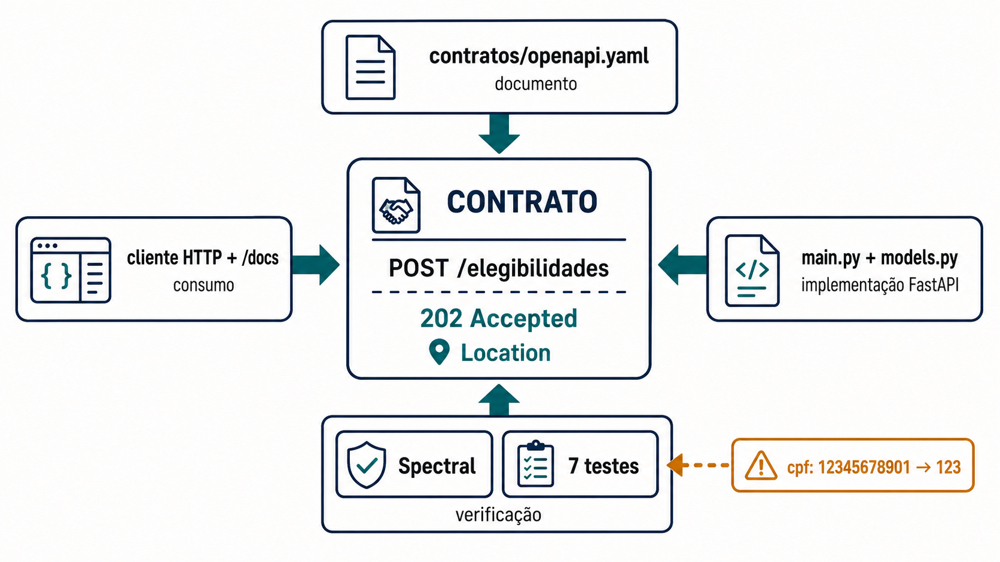
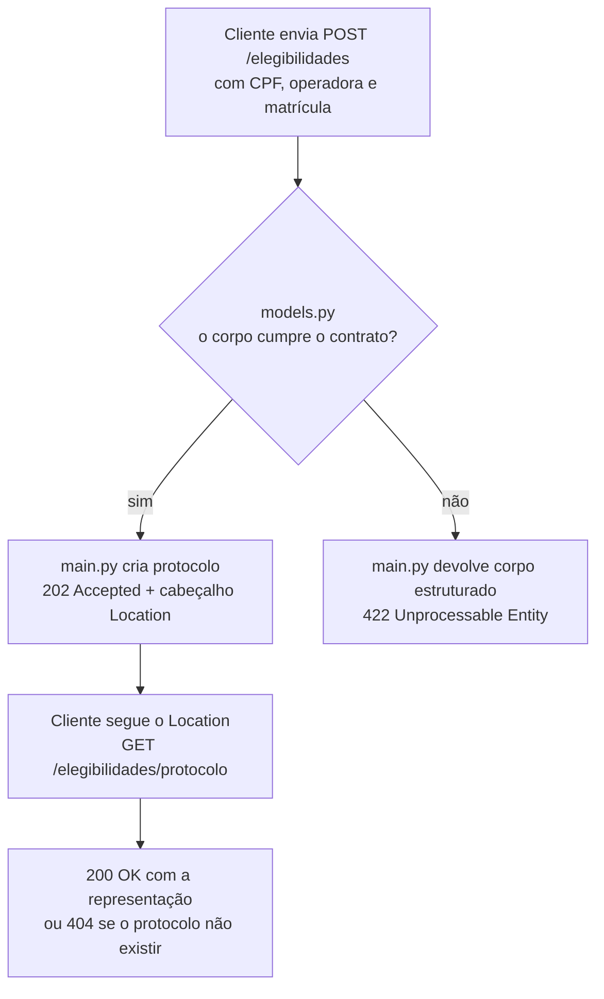

# Oficina de ferramentas: contrato, execução e comparação

Esta oficina leva cerca de noventa minutos e usa apenas dados inventados, sem chamar nenhum sistema externo. O objetivo é ver um contrato de API sob quatro ângulos diferentes: o documento que o descreve, a aplicação que o implementa, um cliente que o consome e os testes que verificam se tudo isso concorda.

Você vai colocar uma API no ar na sua própria máquina, ler a documentação que ela gera sozinha, consumi-la por um programa cliente, submeter o contrato a um verificador automático e rodar a suíte de testes. Cada ferramenta citada adiante é apresentada antes de ser usada, na seção **Ferramenta**. Ao final há uma extensão opcional em .NET que coloca um *gateway* de API na frente de dois serviços.



*Figura 10 — O mesmo contrato sob quatro ângulos: documento, implementação, consumo e verificação. Fonte: curso.*

**Leitura textual da figura:** no centro está o contrato, com a operação `POST /elegibilidades`, a resposta `202 Accepted` e o cabeçalho `Location`. Quatro ângulos apontam para ele. Acima, `contratos/openapi.yaml` como documento. À direita, `main.py` e `models.py` como implementação em FastAPI. À esquerda, o cliente HTTP e a página `/docs` como consumo. Abaixo, Spectral e sete testes como verificação, alimentados por um caso de entrada inválida em que o CPF `12345678901` é submetido como `123`.

## O que existe antes de você abrir o terminal

Você vai começar numa pasta vazia e escrever os nove arquivos que compõem a **API de elegibilidades da plataforma hospitalar**, uma aplicação didática local. Ela não consulta uma operadora real, não acessa prontuários e não envia dados para fora do seu computador. O objetivo é tornar observável um contrato HTTP pequeno, sem simular uma plataforma hospitalar completa.

Cada arquivo aparece nesta página inteiro, pronto para copiar. O título de cada bloco é um link para o mesmo arquivo no repositório do curso, byte a byte igual ao que está aqui, para quem preferir baixar em vez de copiar.

O arquivo `src/hospital/api/main.py` inicia a aplicação FastAPI e expõe apenas duas operações públicas:

| Operação | O que faz nesta oficina | Resultado observável |
| --- | --- | --- |
| `POST /elegibilidades` | recebe CPF sintético, código de operadora e matrícula; valida o contrato e aceita o pedido | `202 Accepted`, corpo com `protocolo` e cabeçalho `Location` |
| `GET /elegibilidades/{protocolo}` | recupera o pedido aceito usando o protocolo retornado no `POST` | `200 OK` com a representação; `404` se o protocolo não existir |

Os dados aceitos ficam somente na memória do processo. Isso significa que parar ou reiniciar o servidor remove todos os protocolos criados. Esse limite é deliberado: a prática permite comparar contrato, consumo e implementação sem afirmar persistência, idempotência distribuída, autenticação ou integração externa.

### Onde cada arquivo mora

Esta é a árvore que você vai montar. Os comandos daqui em diante rodam a partir de `oficina-contrato`, e cada caminho mencionado no texto é relativo a ela.

```text
oficina-contrato/                      ← execute os comandos a partir daqui
├── pyproject.toml                     declara as bibliotecas a instalar
├── .spectral.yaml                     aponta para a configuração de dentro de contratos/
├── contratos/
│   ├── openapi.yaml                   o contrato escrito à mão
│   └── .spectral.yaml                 as regras que o contrato deve cumprir
├── src/hospital/
│   ├── __init__.py                    vazio, torna hospital um pacote
│   └── api/
│       ├── __init__.py                vazio, torna api um pacote
│       ├── models.py                  os formatos de dados e suas validações
│       └── main.py                    a aplicação e as duas rotas
├── tests/
│   └── test_api_contract.py           os sete testes de contrato
└── evidencias/                        você criará esta pasta na preparação
```

A tabela abaixo diz o papel de cada arquivo. Os arquivos em si vêm logo depois, na seção seguinte.

| Arquivo | O que ele faz | Onde isso aparece na teoria |
| --- | --- | --- |
| [`contratos/openapi.yaml`](https://github.com/marco-mendes/arquitetura-software/blob/main/oficinas/modulo-2/contratos/openapi.yaml) | O contrato escrito à mão: as duas operações, os formatos de dados e os exemplos que a API promete a quem consome. | É o **contrato** de [interface, contrato e implementação](conceitos.md), publicado num documento que existe independente do código. |
| [`src/hospital/api/models.py`](https://github.com/marco-mendes/arquitetura-software/blob/main/oficinas/modulo-2/src/hospital/api/models.py) | Os modelos de dados escritos com **Pydantic**, a biblioteca que o FastAPI usa para validar. O tipo declarado em cada campo é a própria regra de validação. | Onde o contrato deixa de ser documento e passa a ser código executável. |
| [`src/hospital/api/main.py`](https://github.com/marco-mendes/arquitetura-software/blob/main/oficinas/modulo-2/src/hospital/api/main.py) | A aplicação FastAPI: as duas rotas, o `202` com `Location` e os erros estruturados. | A **implementação**, que pode mudar por dentro sem quebrar quem consome, desde que o contrato fique de pé. |
| [`tests/test_api_contract.py`](https://github.com/marco-mendes/arquitetura-software/blob/main/oficinas/modulo-2/tests/test_api_contract.py) | Sete testes: cinco exercitam a API pela porta da frente, dois comparam o contrato publicado com o que o FastAPI gera. | A verificação de que a promessa publicada e o comportamento real não divergiram. |
| [`.spectral.yaml` e `contratos/.spectral.yaml`](https://github.com/marco-mendes/arquitetura-software/blob/main/oficinas/modulo-2/contratos/.spectral.yaml) | As regras que o verificador de contrato aplica ao `openapi.yaml`. | A política de contrato que uma equipe acorda e automatiza. |

O caminho que uma requisição percorre explica por que os arquivos são estes e não outros.



**Texto alternativo:** o cliente envia a requisição, uma decisão verifica se o corpo cumpre o contrato, e daí saem dois caminhos, o de aceitação com 202 e cabeçalho Location e o de recusa com 422 estruturado, seguindo o primeiro para a consulta pelo protocolo.

*Figura 11 — Os dois desfechos de uma requisição e o que cada arquivo decide. Fonte: curso.*

**Leitura textual:** o cliente envia `POST /elegibilidades` com CPF, código de operadora e matrícula. A validação declarada em `models.py` decide o desfecho antes de qualquer código de negócio rodar. Quando o corpo cumpre o contrato, `main.py` cria o protocolo e responde `202 Accepted` com o cabeçalho `Location`. Quando não cumpre, a mesma aplicação devolve `422 Unprocessable Entity` com um corpo estruturado, listando campo, mensagem e tipo do erro. Seguindo o caminho de aceitação, o cliente usa o endereço do `Location` para fazer `GET /elegibilidades/{protocolo}`, que responde `200 OK` com a representação ou `404` quando o protocolo não existe no processo atual.

### Os nove arquivos, um a um

Crie a pasta e a estrutura antes de escrever qualquer coisa. No macOS e no Linux:

```bash
mkdir -p oficina-contrato/contratos oficina-contrato/src/hospital/api oficina-contrato/tests
cd oficina-contrato
```

No PowerShell:

```powershell
mkdir oficina-contrato\contratos, oficina-contrato\src\hospital\api, oficina-contrato\tests
cd oficina-contrato
```

O `pyproject.toml` declara as bibliotecas e torna o pacote instalável. É ele que permite o `pip install -e` mais adiante, e é por isso que nenhum comando precisa passar caminho de código.

[`pyproject.toml`](https://github.com/marco-mendes/arquitetura-software/blob/main/oficinas/modulo-2/pyproject.toml)

```toml
[build-system]
requires = ["setuptools>=68"]
build-backend = "setuptools.build_meta"

[project]
name = "api-elegibilidades"
version = "0.1.0"
description = "API de elegibilidades da plataforma hospitalar, oficina do módulo 2"
requires-python = ">=3.11"
dependencies = [
  "fastapi",
  "uvicorn",
  "pydantic",
  "httpx",
]

[project.optional-dependencies]
dev = [
  "pytest",
  "pyyaml",
]

[tool.setuptools.packages.find]
where = ["src"]

[tool.pytest.ini_options]
testpaths = ["tests"]
pythonpath = ["src"]
```

Os dois `__init__.py` ficam vazios de propósito. A presença deles é o que torna `hospital` e `hospital.api` pacotes Python importáveis, e é o que faz `hospital.api.main:app` resolver.

[`src/hospital/__init__.py`](https://github.com/marco-mendes/arquitetura-software/blob/main/oficinas/modulo-2/src/hospital/__init__.py)

```python

```

[`src/hospital/api/__init__.py`](https://github.com/marco-mendes/arquitetura-software/blob/main/oficinas/modulo-2/src/hospital/api/__init__.py)

```python

```

O `models.py` declara os formatos de dados com **Pydantic**. O tipo e as restrições de cada campo são a própria regra de validação, e o FastAPI as aplica antes de a sua função ser chamada.

[`src/hospital/api/models.py`](https://github.com/marco-mendes/arquitetura-software/blob/main/oficinas/modulo-2/src/hospital/api/models.py)

```python
from datetime import datetime

from pydantic import BaseModel, ConfigDict, Field


class PedidoElegibilidade(BaseModel):
    model_config = ConfigDict(
        extra="forbid",
        json_schema_extra={
            "examples": [
                {
                    "cpf": "12345678901",
                    "codigo_operadora": "OPS-001",
                    "matricula_plano": "MAT-2026-001",
                }
            ]
        }
    )

    cpf: str = Field(pattern=r"^\d{11}$")
    codigo_operadora: str = Field(min_length=1, max_length=40)
    matricula_plano: str = Field(min_length=1, max_length=60)


class ElegibilidadeAceita(BaseModel):
    model_config = ConfigDict(extra="forbid")

    protocolo: str
    situacao: str = Field(pattern=r"^recebida$")
    criado_em: datetime


class DetalheErro(BaseModel):
    model_config = ConfigDict(extra="forbid")

    campo: str
    mensagem: str
    tipo: str


class ErroAPI(BaseModel):
    model_config = ConfigDict(extra="forbid")

    codigo: str
    mensagem: str
    detalhes: list[DetalheErro]
```

O `main.py` monta a aplicação e as duas rotas. Repare no tratador de erro de validação: ele existe para que uma requisição fora do contrato devolva um corpo estruturado em vez do formato padrão do FastAPI.

[`src/hospital/api/main.py`](https://github.com/marco-mendes/arquitetura-software/blob/main/oficinas/modulo-2/src/hospital/api/main.py)

```python
from datetime import datetime, timezone
from uuid import uuid4

from fastapi import FastAPI, Response, status
from fastapi.exceptions import RequestValidationError
from fastapi.responses import JSONResponse

from hospital.api.models import (
    ElegibilidadeAceita,
    ErroAPI,
    PedidoElegibilidade,
)


app = FastAPI(
    title="API de elegibilidades da plataforma hospitalar",
    version="1.0.0",
)

_elegibilidades: dict[str, ElegibilidadeAceita] = {}


def limpar_elegibilidades() -> None:
    """Reinicia o armazenamento efêmero usado nos testes e na oficina."""

    _elegibilidades.clear()


@app.get("/health/live", include_in_schema=False)
def live() -> dict[str, str]:
    """Indica que o processo atende, sem consultar dependências externas."""

    return {"status": "live"}


@app.get("/health/ready", include_in_schema=False)
def ready() -> dict[str, str]:
    """Indica que esta instância pode receber tráfego do Service."""

    return {"status": "ready"}


@app.exception_handler(RequestValidationError)
async def tratar_erro_de_validacao(
    _request, error: RequestValidationError
) -> JSONResponse:
    detalhes = [
        {
            "campo": ".".join(str(part) for part in item["loc"]),
            "mensagem": item["msg"],
            "tipo": item["type"],
        }
        for item in error.errors()
    ]
    return JSONResponse(
        status_code=status.HTTP_422_UNPROCESSABLE_CONTENT,
        content={
            "codigo": "dados_invalidos",
            "mensagem": "A requisição não atende ao contrato.",
            "detalhes": detalhes,
        },
    )


@app.post(
    "/elegibilidades",
    response_model=ElegibilidadeAceita,
    status_code=status.HTTP_202_ACCEPTED,
    response_description="Pedido aceito para processamento.",
    responses={
        202: {
            "headers": {
                "Location": {
                    "description": "Caminho do recurso aceito.",
                    "required": True,
                    "schema": {"type": "string"},
                    "example": (
                        "/elegibilidades/"
                        "550e8400-e29b-41d4-a716-446655440000"
                    ),
                }
            }
        },
        422: {"model": ErroAPI},
    },
    operation_id="criarElegibilidade",
    summary="Aceita uma consulta de elegibilidade",
)
def criar_elegibilidade(
    _pedido: PedidoElegibilidade, response: Response
) -> ElegibilidadeAceita:
    aceita = ElegibilidadeAceita(
        protocolo=str(uuid4()),
        situacao="recebida",
        criado_em=datetime.now(timezone.utc),
    )
    _elegibilidades[aceita.protocolo] = aceita
    response.headers["Location"] = f"/elegibilidades/{aceita.protocolo}"
    return aceita


@app.get(
    "/elegibilidades/{protocolo}",
    response_model=ElegibilidadeAceita,
    responses={404: {"model": ErroAPI}},
    operation_id="consultarElegibilidade",
    summary="Consulta uma elegibilidade aceita",
)
def consultar_elegibilidade(protocolo: str):
    encontrada = _elegibilidades.get(protocolo)
    if encontrada is None:
        return JSONResponse(
            status_code=status.HTTP_404_NOT_FOUND,
            content={
                "codigo": "elegibilidade_nao_encontrada",
                "mensagem": "Protocolo de elegibilidade não encontrado.",
                "detalhes": [],
            },
        )
    return encontrada
```

O `contratos/openapi.yaml` é o contrato escrito à mão, independente do código. Ele é longo porque descreve tudo que a API promete, incluindo os exemplos.

[`contratos/openapi.yaml`](https://github.com/marco-mendes/arquitetura-software/blob/main/oficinas/modulo-2/contratos/openapi.yaml)

```yaml
openapi: 3.1.0
info:
  title: API de elegibilidades da plataforma hospitalar
  version: 1.0.0
  contact:
    name: Disciplina de Arquitetura de Software
  description: >-
    Contrato didático para aceitar e recuperar consultas administrativas de
    elegibilidade. O laboratório mantém dados somente em memória.
tags:
  - name: Elegibilidades
    description: Operações administrativas de elegibilidade.
servers:
  - url: http://127.0.0.1:8000
    description: Servidor local da oficina.
paths:
  /elegibilidades:
    post:
      tags: [Elegibilidades]
      operationId: criarElegibilidade
      summary: Aceita uma consulta de elegibilidade
      description: >-
        Valida o pedido, cria um protocolo efêmero e informa onde consultar o
        recurso aceito.
      requestBody:
        required: true
        content:
          application/json:
            schema:
              $ref: '#/components/schemas/PedidoElegibilidade'
            examples:
              pedidoValido:
                summary: Pedido sintético válido
                value:
                  cpf: '12345678901'
                  codigo_operadora: OPS-001
                  matricula_plano: MAT-2026-001
      responses:
        '202':
          description: Pedido aceito para processamento.
          headers:
            Location:
              description: Caminho do recurso aceito.
              required: true
              schema:
                type: string
              example: /elegibilidades/550e8400-e29b-41d4-a716-446655440000
          content:
            application/json:
              schema:
                $ref: '#/components/schemas/ElegibilidadeAceita'
              examples:
                aceita:
                  summary: Protocolo criado
                  value:
                    protocolo: 550e8400-e29b-41d4-a716-446655440000
                    situacao: recebida
                    criado_em: '2026-07-17T13:30:00Z'
        '422':
          description: Corpo ausente ou incompatível com o contrato.
          content:
            application/json:
              schema:
                $ref: '#/components/schemas/ErroAPI'
              examples:
                cpfAusente:
                  summary: CPF obrigatório ausente
                  value:
                    codigo: dados_invalidos
                    mensagem: A requisição não atende ao contrato.
                    detalhes:
                      - campo: body.cpf
                        mensagem: Field required
                        tipo: missing
  /elegibilidades/{protocolo}:
    get:
      tags: [Elegibilidades]
      operationId: consultarElegibilidade
      summary: Consulta uma elegibilidade aceita
      description: Recupera o estado efêmero associado ao protocolo informado.
      parameters:
        - name: protocolo
          in: path
          required: true
          description: Identificador retornado na aceitação do pedido.
          schema:
            type: string
      responses:
        '200':
          description: Elegibilidade localizada.
          content:
            application/json:
              schema:
                $ref: '#/components/schemas/ElegibilidadeAceita'
              examples:
                localizada:
                  summary: Estado atual
                  value:
                    protocolo: 550e8400-e29b-41d4-a716-446655440000
                    situacao: recebida
                    criado_em: '2026-07-17T13:30:00Z'
        '404':
          description: Protocolo não localizado no processo atual.
          content:
            application/json:
              schema:
                $ref: '#/components/schemas/ErroAPI'
              examples:
                ausente:
                  summary: Protocolo desconhecido
                  value:
                    codigo: elegibilidade_nao_encontrada
                    mensagem: Protocolo de elegibilidade não encontrado.
                    detalhes: []
components:
  schemas:
    PedidoElegibilidade:
      type: object
      additionalProperties: false
      required: [cpf, codigo_operadora, matricula_plano]
      properties:
        cpf:
          type: string
          pattern: '^\d{11}$'
          description: Identificador sintético com onze dígitos usado no laboratório.
        codigo_operadora:
          type: string
          minLength: 1
          maxLength: 40
          description: Código da operadora no contexto da plataforma.
        matricula_plano:
          type: string
          minLength: 1
          maxLength: 60
          description: Matrícula administrativa no plano.
      examples:
        - cpf: '12345678901'
          codigo_operadora: OPS-001
          matricula_plano: MAT-2026-001
    ElegibilidadeAceita:
      type: object
      additionalProperties: false
      required: [protocolo, situacao, criado_em]
      properties:
        protocolo:
          type: string
          description: Identificador da consulta aceita.
        situacao:
          type: string
          const: recebida
          description: Estado inicial do pedido.
        criado_em:
          type: string
          format: date-time
          description: Instante UTC em que o pedido foi aceito.
    DetalheErro:
      type: object
      additionalProperties: false
      required: [campo, mensagem, tipo]
      properties:
        campo:
          type: string
        mensagem:
          type: string
        tipo:
          type: string
    ErroAPI:
      type: object
      additionalProperties: false
      required: [codigo, mensagem, detalhes]
      properties:
        codigo:
          type: string
          description: Código estável para tratamento pelo consumidor.
        mensagem:
          type: string
          description: Explicação legível do problema.
        detalhes:
          type: array
          items:
            $ref: '#/components/schemas/DetalheErro'
```

Os dois arquivos do Spectral declaram as regras que o contrato precisa cumprir. O da raiz apenas aponta para o de dentro de `contratos`, o que permite rodar o verificador de qualquer uma das duas pastas.

[`.spectral.yaml`](https://github.com/marco-mendes/arquitetura-software/blob/main/oficinas/modulo-2/.spectral.yaml)

```yaml
# CLI verificada: @stoplight/spectral-cli@6.16.1
extends:
  - ./contratos/.spectral.yaml
```

[`contratos/.spectral.yaml`](https://github.com/marco-mendes/arquitetura-software/blob/main/oficinas/modulo-2/contratos/.spectral.yaml)

```yaml
# CLI verificada: @stoplight/spectral-cli@6.16.1
extends: spectral:oas

rules:
  operation-operationId: error
  operation-description: error
  operation-tags: error
```

O `tests/test_api_contract.py` é a verificação. Cinco testes exercitam a API pela porta da frente e dois comparam o contrato publicado com o que o FastAPI gera sozinho.

[`tests/test_api_contract.py`](https://github.com/marco-mendes/arquitetura-software/blob/main/oficinas/modulo-2/tests/test_api_contract.py)

```python
"""Testes de contrato da API de elegibilidades.

Este arquivo responde a uma pergunta: **a aplicação faz o que o contrato promete?**

Há dois contratos em jogo, e a diferença entre eles é o assunto do módulo:

- o **contrato explícito**, escrito à mão em `contratos/openapi.yaml`, é a promessa
  publicada para quem consome a API;
- o **contrato gerado**, que o FastAPI monta sozinho a partir do código e serve em
  `/openapi.json`, descreve o que a aplicação realmente faz hoje.

Os cinco primeiros testes exercitam a aplicação pela porta da frente. Os dois
últimos comparam os dois contratos entre si, que é onde uma divergência costuma
aparecer sem ninguém notar.

Para rodar apenas este arquivo:

    python -m pytest tests/test_api_contract.py -q
"""

from datetime import datetime
from pathlib import Path

from fastapi.testclient import TestClient
import yaml

from hospital.api.main import app, limpar_elegibilidades
from hospital.api.models import ElegibilidadeAceita, ErroAPI, PedidoElegibilidade


# Caminho do contrato escrito à mão, relativo à raiz do laboratório.
ROOT = Path(__file__).resolve().parents[1]
CONTRACT = ROOT / "contratos" / "openapi.yaml"

# Corpo válido reaproveitado por vários testes. CPF e matrícula são sintéticos.
PEDIDO_VALIDO = {
    "cpf": "12345678901",
    "codigo_operadora": "OPS-001",
    "matricula_plano": "MAT-2026-001",
}


def setup_function():
    """Roda antes de cada teste.

    A aplicação guarda os pedidos em memória, então um teste enxergaria os
    protocolos criados pelo anterior. Limpar aqui deixa cada teste independente
    da ordem de execução.
    """
    limpar_elegibilidades()


def carregar_contrato_explicito() -> dict:
    """Lê `contratos/openapi.yaml` como dicionário Python."""
    return yaml.safe_load(CONTRACT.read_text(encoding="utf-8"))


def exemplos_da_resposta(contrato: dict, caminho: str, metodo: str, status: str) -> list:
    """Devolve os exemplos JSON declarados para uma resposta do contrato.

    Existe para evitar a indexação encadeada longa que essa navegação exigiria
    dentro do teste. A estrutura percorrida é a do OpenAPI:
    paths → caminho → método → responses → status → content → mídia → examples.
    """
    resposta = contrato["paths"][caminho][metodo]["responses"][status]
    exemplos = resposta["content"]["application/json"]["examples"]
    return [item["value"] for item in exemplos.values()]


def test_post_aceita_pedido_e_get_recupera_pelo_location():
    """O caminho feliz: `POST` aceita e `GET` recupera pelo endereço devolvido.

    O `202 Accepted` significa "recebi e ainda vou processar", e não "pronto".
    Por isso a resposta traz um `protocolo` e o cabeçalho `Location` com o
    endereço onde consultar o andamento — o consumidor não precisa montar essa
    URL por conta própria.
    """
    client = TestClient(app)

    criado = client.post("/elegibilidades", json=PEDIDO_VALIDO)

    assert criado.status_code == 202
    corpo = criado.json()
    assert corpo["situacao"] == "recebida"
    assert corpo["protocolo"]

    # Não compara a data com um valor fixo: só exige que seja ISO 8601 válida.
    datetime.fromisoformat(corpo["criado_em"].replace("Z", "+00:00"))

    assert criado.headers["location"] == f"/elegibilidades/{corpo['protocolo']}"

    # Seguir o Location é exatamente o que um consumidor bem-comportado faz.
    recuperado = client.get(criado.headers["location"])

    assert recuperado.status_code == 200
    assert recuperado.json() == corpo


def test_pedido_sem_cpf_recebe_erro_422_estruturado():
    """Campo obrigatório ausente vira `422` com corpo previsível.

    O erro faz parte do contrato: quem consome precisa conseguir tratar a falha
    programaticamente, e para isso o corpo traz `codigo`, `mensagem` e a lista
    `detalhes` apontando o campo problemático.
    """
    client = TestClient(app)
    pedido_incompleto = {
        "codigo_operadora": "OPS-001",
        "matricula_plano": "MAT-2026-001",
    }

    resposta = client.post("/elegibilidades", json=pedido_incompleto)

    assert resposta.status_code == 422
    corpo = resposta.json()
    assert corpo["codigo"] == "dados_invalidos"
    assert corpo["mensagem"]
    assert any(detalhe["campo"] == "body.cpf" for detalhe in corpo["detalhes"])


def test_pedido_com_campo_fora_do_contrato_e_recusado():
    """Campo a mais também é violação de contrato, não cortesia.

    Aceitar um campo desconhecido em silêncio faz o consumidor acreditar que ele
    foi processado. O modelo recusa, e o campo extra aparece em `detalhes`.
    """
    client = TestClient(app)
    pedido_com_extra = PEDIDO_VALIDO | {"campo_nao_contratado": "valor"}

    resposta = client.post("/elegibilidades", json=pedido_com_extra)

    assert resposta.status_code == 422
    detalhes = resposta.json()["detalhes"]
    assert any(detalhe["campo"] == "body.campo_nao_contratado" for detalhe in detalhes)


def test_protocolo_inexistente_recebe_erro_404_estruturado():
    """Consultar protocolo que não existe devolve `404` no mesmo formato de erro.

    O corpo segue o mesmo esquema `ErroAPI` do `422`: um formato de erro por API,
    não um por operação.
    """
    client = TestClient(app)

    resposta = client.get("/elegibilidades/protocolo-inexistente")

    assert resposta.status_code == 404
    assert resposta.json() == {
        "codigo": "elegibilidade_nao_encontrada",
        "mensagem": "Protocolo de elegibilidade não encontrado.",
        "detalhes": [],
    }


def test_health_separa_processo_vivo_de_pronto_para_receber_trafego():
    """`/health/live` e `/health/ready` respondem perguntas diferentes.

    Vivo significa que o processo não travou. Pronto significa que ele pode
    receber tráfego. Um orquestrador reinicia com base no primeiro e tira do
    balanceamento com base no segundo.
    """
    client = TestClient(app)

    assert client.get("/health/live").json() == {"status": "live"}
    assert client.get("/health/ready").json() == {"status": "ready"}


def test_contrato_explicito_declara_operacoes_schemas_e_exemplos_validos():
    """O `openapi.yaml` está bem formado e seus exemplos são de verdade.

    Um exemplo desatualizado no contrato é pior que exemplo nenhum, porque quem
    consome copia e não funciona. Aqui cada exemplo declarado é validado contra o
    modelo correspondente, e o exemplo de requisição é enviado à aplicação real.
    """
    contrato = carregar_contrato_explicito()

    assert contrato["openapi"] == "3.1.0"
    assert set(contrato["paths"]) == {
        "/elegibilidades",
        "/elegibilidades/{protocolo}",
    }

    schemas = contrato["components"]["schemas"]
    for nome in ("PedidoElegibilidade", "ElegibilidadeAceita", "ErroAPI"):
        assert nome in schemas

    schema_pedido = schemas["PedidoElegibilidade"]
    assert set(schema_pedido["required"]) == set(PEDIDO_VALIDO)

    # O exemplo publicado precisa ser aceito pela aplicação de verdade.
    exemplo_pedido = schema_pedido["examples"][0]
    PedidoElegibilidade.model_validate(exemplo_pedido)
    assert TestClient(app).post("/elegibilidades", json=exemplo_pedido).status_code == 202

    # Cada exemplo de resposta precisa bater com o modelo daquela resposta.
    respostas_documentadas = (
        ("/elegibilidades", "post", "202", ElegibilidadeAceita),
        ("/elegibilidades", "post", "422", ErroAPI),
        ("/elegibilidades/{protocolo}", "get", "200", ElegibilidadeAceita),
        ("/elegibilidades/{protocolo}", "get", "404", ErroAPI),
    )
    for caminho, metodo, status, modelo in respostas_documentadas:
        for exemplo in exemplos_da_resposta(contrato, caminho, metodo, status):
            modelo.model_validate(exemplo)


def test_contrato_explicito_e_contrato_gerado_nao_divergem():
    """O contrato publicado e o que a aplicação gera dizem a mesma coisa.

    Este é o teste que pega o erro mais caro do módulo: alguém altera o código,
    o contrato gerado acompanha, e o `openapi.yaml` publicado continua prometendo
    o formato antigo para quem consome. A comparação é pontual de propósito —
    operações, campos obrigatórios e a resposta `202` —, porque comparar os dois
    documentos inteiros quebraria a cada detalhe de formatação.
    """
    explicito = carregar_contrato_explicito()
    gerado = app.openapi()

    for caminho, metodo in (
        ("/elegibilidades", "post"),
        ("/elegibilidades/{protocolo}", "get"),
    ):
        assert metodo in explicito["paths"][caminho]
        assert metodo in gerado["paths"][caminho]

    campos_obrigatorios_explicito = set(
        explicito["components"]["schemas"]["PedidoElegibilidade"]["required"]
    )
    campos_obrigatorios_gerado = set(
        gerado["components"]["schemas"]["PedidoElegibilidade"]["required"]
    )
    assert campos_obrigatorios_gerado == campos_obrigatorios_explicito

    aceito_explicito = explicito["paths"]["/elegibilidades"]["post"]["responses"]["202"]
    aceito_gerado = gerado["paths"]["/elegibilidades"]["post"]["responses"]["202"]
    assert aceito_gerado["description"] == aceito_explicito["description"]
    assert aceito_gerado["headers"]["Location"] == aceito_explicito["headers"]["Location"]
```

Há dois contratos em jogo nesta oficina, e distinguir os dois é o assunto do módulo inteiro.

```mermaid
flowchart TB
    H[contratos/openapi.yaml<br/>contrato explícito, escrito à mão<br/>a promessa publicada] --> SP[Spectral<br/>o documento cumpre as regras?]
    CD[models.py e main.py<br/>o código] --> GER[/openapi.json<br/>contrato gerado pelo FastAPI<br/>o que a aplicação faz hoje]
    H --> T[test_api_contract.py<br/>dois testes comparam os dois]
    GER --> T
    T --> D[divergência aparece aqui<br/>antes de aparecer no consumidor]
```

**Texto alternativo:** o contrato escrito à mão alimenta o verificador Spectral e também a comparação feita pelos testes, enquanto o código gera o contrato que o FastAPI publica, e a comparação entre os dois revela divergências.

*Figura 12 — Contrato explícito, contrato gerado e onde a divergência é detectada. Fonte: curso.*

**Leitura textual:** à esquerda, o contrato explícito é o arquivo escrito à mão, que representa a promessa publicada a quem consome. Ele segue por dois caminhos. Um vai ao Spectral, que verifica se o documento cumpre as regras acordadas. O outro vai aos testes. Do outro lado, o código dos dois arquivos Python produz o contrato gerado, servido pelo FastAPI, que descreve o que a aplicação realmente faz hoje. Os dois contratos chegam ao arquivo de testes, onde dois dos sete testes os comparam. A saída registra que a divergência aparece ali, antes de aparecer no consumidor, que é a razão de o teste existir.

### O contrato por dentro: lendo o `openapi.yaml`

Este é o arquivo mais citado da oficina, e vale abri-lo antes de rodar qualquer comando. **OpenAPI** é um formato padronizado para descrever uma API em texto: quais operações existem, o que se envia, o que volta e quais erros são possíveis. Como é um formato que máquinas leem, ferramentas conseguem gerar documentação, clientes e testes a partir dele. O arquivo é escrito em **YAML**, uma notação em que a hierarquia se expressa por indentação, sem chaves nem colchetes.

O documento tem quatro blocos de primeiro nível. Começa se identificando:

```yaml
openapi: 3.1.0                    # versão da especificação OpenAPI usada
info:
  title: API de elegibilidades da plataforma hospitalar
  version: 1.0.0                  # versão desta API, não da especificação
tags:
  - name: Elegibilidades          # agrupa operações na documentação
servers:
  - url: http://127.0.0.1:8000    # onde a API atende
```

Repare que há duas versões diferentes ali. O `openapi: 3.1.0` diz qual gramática o documento segue; o `version: 1.0.0` dentro de `info` é a versão da própria API, aquela que muda quando o contrato evolui.

Depois vem `paths`, que descreve cada operação. Este é o `POST`, com os trechos comentados:

```yaml
paths:
  /elegibilidades:                          # o caminho
    post:                                   # o método HTTP nesse caminho
      operationId: criarElegibilidade       # nome único, usado por geradores de cliente
      summary: Aceita uma consulta de elegibilidade
      requestBody:
        required: true                      # não dá para chamar sem corpo
        content:
          application/json:                 # o formato aceito
            schema:
              $ref: '#/components/schemas/PedidoElegibilidade'
            examples:
              pedidoValido:
                value:
                  cpf: '12345678901'        # ← este exemplo será quebrado de propósito
                  codigo_operadora: OPS-001
                  matricula_plano: MAT-2026-001
```

O `$ref` é uma referência interna: em vez de repetir a descrição dos campos aqui, o documento aponta para `components/schemas/PedidoElegibilidade`, definido mais abaixo. É o mesmo princípio de não duplicar código, aplicado ao contrato.

Ainda dentro do `POST`, cada resposta possível é declarada:

```yaml
      responses:
        '202':
          description: Pedido aceito para processamento.
          headers:
            Location:                       # o cabeçalho faz parte do contrato
              required: true
              schema:
                type: string
          content:
            application/json:
              schema:
                $ref: '#/components/schemas/ElegibilidadeAceita'
        '422':
          description: Corpo ausente ou incompatível com o contrato.
```

Declarar o `422` ao lado do `202` é o que torna o erro parte da promessa. Um consumidor lendo este documento sabe, antes de escrever a primeira linha, que precisa tratar essas duas respostas.

Por fim, `components/schemas` define os formatos de dados reaproveitados pelas operações:

```yaml
components:
  schemas:
    PedidoElegibilidade:
      type: object
      additionalProperties: false           # campo não previsto é recusado
      required: [cpf, codigo_operadora, matricula_plano]
      properties:
        cpf:
          type: string
          pattern: '^\d{11}$'               # exatamente onze dígitos
        codigo_operadora:
          type: string
          minLength: 1
          maxLength: 40
```

Três mecanismos de validação aparecem aqui. O `required` lista os campos obrigatórios, e é o que produz o `422` quando o `cpf` é omitido. O `pattern` é uma expressão regular: `^\d{11}$` significa início da cadeia, onze dígitos, fim. E `additionalProperties: false` recusa campos não previstos, em vez de ignorá-los em silêncio.

Compare esse trecho com o `models.py` do laboratório e verá as mesmas três regras escritas em Python: `Field(pattern=r"^\d{11}$")`, a lista de campos sem valor padrão e `ConfigDict(extra="forbid")`. **O mesmo contrato, em duas linguagens.** Manter os dois em acordo é o trabalho que os dois últimos testes verificam.

### Os códigos de status HTTP usados aqui

Toda resposta HTTP começa por um número de três dígitos que diz, antes de qualquer conteúdo, como a requisição terminou. O primeiro dígito define a família:

| Família | Significado | Quem errou |
| --- | --- | --- |
| `2xx` | Deu certo | ninguém |
| `4xx` | A requisição está errada | quem chamou |
| `5xx` | O servidor falhou ao processar | quem atende |

Essa divisão importa porque ela atribui responsabilidade. Devolver `500` para um pedido malformado transfere ao provedor a culpa por um erro do consumidor, e devolver `400` para um defeito interno faz o contrário.

Esta API usa quatro códigos, e cada escolha tem um motivo:

| Código | Nome | Por que este contrato o escolheu |
| --- | --- | --- |
| `200` | OK | Resposta padrão de sucesso. Aqui, o `GET` devolve `200` porque o recurso existe e está sendo entregue na hora. |
| `202` | Accepted | "Recebi e ainda vou processar." O `POST` usa `202` em vez de `200` ou `201` porque a decisão de elegibilidade depende da operadora e não sai na mesma chamada. O corpo traz um protocolo para consultar depois. |
| `404` | Not Found | O protocolo informado não existe. É `4xx` porque quem chamou pediu algo inexistente. |
| `422` | Unprocessable Content | O corpo é JSON bem formado, mas viola uma regra do contrato: falta `cpf`, ou ele não tem onze dígitos. Difere do `400`, que se usa quando a requisição sequer pôde ser interpretada. |

A diferença entre `202` e `201` costuma confundir. `201 Created` afirma que o recurso já existe em definitivo; `202 Accepted` afirma apenas que o pedido entrou na fila, e por isso não promete resultado nenhum ainda.

### As duas rotas, linha a linha

Este é o `POST` completo, como está em `src/hospital/api/main.py`:

```python
@app.post(
    "/elegibilidades",
    response_model=ElegibilidadeAceita,          # formato da resposta de sucesso
    status_code=status.HTTP_202_ACCEPTED,        # 202, e não 200: ainda vai processar
    responses={
        202: {"headers": {"Location": {...}}},   # declara o cabeçalho no contrato
        422: {"model": ErroAPI},                 # declara o formato do erro
    },
    operation_id="criarElegibilidade",           # nome usado por geradores de cliente
    summary="Aceita uma consulta de elegibilidade",
)
def criar_elegibilidade(
    _pedido: PedidoElegibilidade, response: Response
) -> ElegibilidadeAceita:
    aceita = ElegibilidadeAceita(
        protocolo=str(uuid4()),                  # identificador único do pedido
        situacao="recebida",
        criado_em=datetime.now(timezone.utc),
    )
    _elegibilidades[aceita.protocolo] = aceita   # guarda em memória
    response.headers["Location"] = f"/elegibilidades/{aceita.protocolo}"
    return aceita
```

Quatro decisões aparecem aqui. A anotação `_pedido: PedidoElegibilidade` faz o FastAPI validar o corpo recebido **antes** de a função rodar: se o CPF não tiver onze dígitos, esta linha nunca é alcançada. O `status_code` fixa o `202` para toda resposta bem-sucedida. O `Location` é escrito à mão, montando o endereço de consulta a partir do protocolo recém-gerado. E o bloco `responses` existe só para documentação: ele não muda o comportamento, mas faz o cabeçalho e o formato de erro aparecerem no contrato gerado.

E este é o `GET`:

```python
@app.get(
    "/elegibilidades/{protocolo}",               # {protocolo} vira parâmetro da função
    response_model=ElegibilidadeAceita,
    responses={404: {"model": ErroAPI}},
    operation_id="consultarElegibilidade",
)
def consultar_elegibilidade(protocolo: str):
    encontrada = _elegibilidades.get(protocolo)
    if encontrada is None:
        return JSONResponse(
            status_code=status.HTTP_404_NOT_FOUND,
            content={
                "codigo": "elegibilidade_nao_encontrada",
                "mensagem": "Protocolo de elegibilidade não encontrado.",
                "detalhes": [],
            },
        )
    return encontrada
```

O trecho `{protocolo}` no caminho é um parâmetro: o valor que vier ali na URL chega à função no argumento de mesmo nome. Quando o protocolo não existe, a função monta um `404` no **mesmo formato** de erro do `422`, com `codigo`, `mensagem` e `detalhes`. Um formato único de erro por API é o que permite ao consumidor escrever um só tratador para todas as falhas.

### O erro `422` é montado num lugar só

Nenhuma das duas rotas trata erro de validação. Isso acontece num interceptador registrado à parte:

```python
@app.exception_handler(RequestValidationError)
async def tratar_erro_de_validacao(_request, error) -> JSONResponse:
    detalhes = [
        {
            "campo": ".".join(str(part) for part in item["loc"]),  # ex.: body.cpf
            "mensagem": item["msg"],
            "tipo": item["type"],
        }
        for item in error.errors()
    ]
    return JSONResponse(
        status_code=status.HTTP_422_UNPROCESSABLE_CONTENT,
        content={
            "codigo": "dados_invalidos",
            "mensagem": "A requisição não atende ao contrato.",
            "detalhes": detalhes,
        },
    )
```

Sempre que a validação do Pydantic falha em qualquer rota, o FastAPI desvia para esta função. Ela percorre os erros encontrados e monta a lista `detalhes`, transformando a localização interna do campo no texto `body.cpf` que você verá na resposta. Centralizar isso garante que toda falha de validação da API tenha exatamente o mesmo formato, sem depender de cada rota lembrar de fazê-lo.

A preparação termina quando quatro condições valem ao mesmo tempo. Existe uma pasta `.venv` e o interpretador dela responde com a versão do Python. O comando `python -m pytest tests/test_api_contract.py -q` termina com os testes aprovados. E o servidor, ao subir, informa que está atendendo em `http://127.0.0.1:8000`. Só então vale abrir `/docs` ou o Bruno.

## Ferramenta

Seis peças aparecem nesta oficina, e vale saber o que cada uma é antes de instalá-las.

| Ferramenta | O que é | Para que serve aqui |
| --- | --- | --- |
| **Python 3.11+** | A linguagem em que a API e os testes estão escritos. | Executar a aplicação e a suíte de testes. |
| **FastAPI** | Uma biblioteca Python para construir APIs. Ela lê as anotações de tipo do código e, a partir delas, valida as requisições e gera a documentação. | Implementar as duas rotas e produzir o contrato gerado em `/openapi.json`. |
| **Uvicorn** | O servidor que atende as requisições HTTP. O FastAPI define o que responder; o Uvicorn é quem abre a porta e escuta. | Colocar a API no ar em `http://127.0.0.1:8000`. |
| **Bruno** | Um cliente HTTP com interface gráfica, parecido com Postman ou Insomnia. Permite montar e enviar requisições sem escrever código. | Agir como um consumidor externo da API. |
| **Node.js e `npx`** | Node.js é o ambiente que executa JavaScript fora do navegador. O `npx` é um utilitário que vem com ele e roda uma ferramenta sem instalá-la permanentemente, baixando-a na hora. | Executar o Spectral, que é escrito em JavaScript. |
| **Spectral CLI 6.16.1** | Um verificador de contratos OpenAPI, operado por linha de comando. Faz para o contrato o que um verificador de estilo faz para o código. | Conferir se o `openapi.yaml` cumpre as regras acordadas. |

A versão do Spectral está fixada em `6.16.1` de propósito: versões diferentes trazem regras diferentes, e fixá-la faz a turma inteira ver a mesma saída.

Essas ferramentas olham para lugares diferentes, e nenhuma substitui as outras. O Bruno mostra uma execução real, sem proteger contra regressão amanhã. O Spectral analisa o documento, sem provar que o servidor obedece a ele. O `TestClient`, usado nos testes, verifica o comportamento da aplicação, mas só nos casos que alguém escreveu. Julgar se o contrato descreve corretamente a intenção do negócio continua sendo trabalho humano.

## Pré-requisitos

**Objetivo**

Preparar um ambiente local descartável com Python, Bruno e Node.js. Reserve uma janela com acesso à internet para instalar dependências e para a primeira execução do `npx`, que baixa o Spectral.

**Pré-requisito**

Um terminal, um editor de texto e a pasta `oficina-contrato` já criada com os nove arquivos da seção anterior. Todos os comandos partem de dentro dela.

### O que é o ambiente virtual que você vai criar

Os comandos adiante criam uma pasta `.venv`. Um **ambiente virtual** é uma instalação de Python isolada, contida numa pasta do próprio projeto. Sem ele, cada biblioteca instalada iria para o Python do sistema, misturando as dependências deste laboratório com as de qualquer outro projeto da máquina — e uma versão que um exige poderia quebrar o outro.

Com o ambiente virtual, tudo o que a oficina instalar fica dentro de `.venv`, e apagar essa pasta desfaz a instalação por completo. É por isso que a limpeza no fim consiste em remover um diretório.

Uma consequência prática aparece nos comandos: eles chamam o interpretador de dentro da pasta (`.venv\Scripts\python.exe` no Windows, `python` após ativação no macOS e Linux). Chamar o `python` do sistema por engano executaria o laboratório sem as bibliotecas instaladas, e o erro seria `ModuleNotFoundError`.

O que exatamente será instalado está declarado em `pyproject.toml`, o arquivo que descreve o pacote deste laboratório:

```toml
dependencies = [          # necessárias para a aplicação rodar
  "fastapi",
  "uvicorn",
  "pydantic",
  ...
]

[project.optional-dependencies]
dev = [                   # necessárias apenas para desenvolver e testar
  "pytest",
  "pytest-asyncio",
  "pyyaml",
]
```

O comando de instalação usa `.[dev]`, e cada parte significa algo. O caractere `.` quer dizer "o pacote que está nesta pasta". O `[dev]` acrescenta o grupo opcional, trazendo também as ferramentas de teste. A opção `-e`, de *editable*, instala o pacote como um atalho para o código-fonte: alterar um arquivo em `src/` passa a valer imediatamente, sem reinstalar nada.

## Instalação

### Windows

Abra PowerShell. Instale Python, Node.js LTS e Bruno quando ainda não estiverem disponíveis:

```powershell
winget install Python.Python.3.12
winget install OpenJS.NodeJS.LTS
winget install Bruno.Bruno
```

**Resultado esperado**

Cada instalador termina com confirmação. Feche e reabra o PowerShell para atualizar o `PATH`.

**Contingência**

Se `winget` não existir, siga as [instruções oficiais de instalação do Python](https://docs.python.org/3/using/index.html) e os instaladores indicados nas [referências](sintese-e-referencias.md#ferramentas). Se um pacote já estiver instalado, continue.

Crie o ambiente e instale o laboratório. A ativação é opcional; os passos seguintes usam o interpretador explícito da `.venv`:

```powershell
cd oficina-contrato
py -m venv .venv
.venv\Scripts\python.exe -m pip install --upgrade pip
.venv\Scripts\python.exe -m pip install -e ".[dev]"
.venv\Scripts\python.exe --version
node --version
npx --version
```

Use exatamente `.venv\Scripts\python.exe -m pip install -e ".[dev]"` para garantir que o pacote entre no ambiente criado.

**Resultado esperado**

Python informa versão 3.11 ou superior, Node e npx informam versões, e a instalação editável termina sem erro.

**Contingência**

Se `py` não encontrar Python, reabra o terminal e tente o caminho fornecido pelo instalador. Se a criação parcial da `.venv` falhar, remova apenas essa pasta e repita. Não altere política permanente do PowerShell.

### macOS

Instale primeiro o [Homebrew pelo site oficial](https://brew.sh/) quando ele ainda não existir. Depois execute:

```bash
brew install python@3.12 node
brew install bruno
cd oficina-contrato
python3.12 -m venv .venv
source .venv/bin/activate
python -m pip install --upgrade pip
python -m pip install -e ".[dev]"
python --version
node --version
npx --version
```

**Resultado esperado**

O terminal mostra `(.venv)`, Python 3.11 ou superior e versões de Node e npx.

**Contingência**

Se o Homebrew expuser `python3` em vez de `python3.12`, use `python3 -m venv .venv`. Se Bruno já existir, apenas abra o aplicativo.

### Linux

Os comandos usam Debian ou Ubuntu. Instale equivalentes na sua distribuição quando necessário:

```bash
sudo apt update
sudo apt install -y python3 python3-venv python3-pip nodejs npm flatpak
flatpak remote-add --if-not-exists flathub https://flathub.org/repo/flathub.flatpakrepo
flatpak install flathub com.usebruno.Bruno
flatpak info com.usebruno.Bruno
cd oficina-contrato
python3 -m venv .venv
source .venv/bin/activate
python -m pip install --upgrade pip
python -m pip install -e ".[dev]"
python --version
node --version
npx --version
```

**Resultado esperado**

As versões aparecem; `flatpak info` mostra nome, versão e origem do Bruno.

**Contingência**

Se `remote-add` falhar, execute `flatpak remotes` e confirme se `flathub` já existe; uma origem existente permite continuar. Se a distribuição fornecer Node antigo, instale uma versão LTS pelas instruções oficiais do Node.js. Como alternativa ao Flatpak, use os [pacotes oficiais do Bruno](https://www.usebruno.com/downloads).

## Preparação do laboratório

**Execute**

Confirme que está em `oficina-contrato`. Crie uma pasta para evidências e execute todos os testes atuais.

No PowerShell:

```powershell
New-Item -ItemType Directory -Force evidencias
.venv\Scripts\python.exe -m pytest tests -q
```

Em macOS ou Linux:

```bash
mkdir -p evidencias
python -m pytest tests -q
```

**Resultado esperado**

A última linha traz a contagem. É isso que você deve ver:

```text
.......                                                                  [100%]
=============================== warnings summary ===============================
.venv/lib/python3.13/site-packages/fastapi/testclient.py:1
    from starlette.testclient import TestClient as TestClient  # noqa

-- Docs: https://docs.pytest.org/en/stable/how-to/capture-warnings.html
7 passed, 1 warning in 0.73s
```

Cada `.` na primeira linha representa um teste aprovado, e são sete. O aviso sobre `httpx` vem de dentro do FastAPI e não indica problema no laboratório. O número total pode crescer em módulos posteriores; neste encontro, procure os sete testes de `test_api_contract.py`.

**Contingência**

Se `hospital.api` não for encontrado, repita a instalação editável com o interpretador da `.venv`.

**Observe**

O mesmo contrato aparece em quatro formas nesta pasta, e vale ver como cada uma expressa a mesma regra.

Em `src/hospital/api/models.py`, a regra é o tipo. O campo `cpf` é declarado como `Field(pattern=r"^\d{11}$")`, exigindo onze dígitos. Essa linha executa a validação por si mesma, sem precisar de código adicional que a interprete. `codigo_operadora` e `matricula_plano` declaram limites de tamanho da mesma maneira. E `model_config = ConfigDict(extra="forbid")` é o que faz um campo não previsto ser recusado em vez de silenciosamente ignorado.

Em `src/hospital/api/main.py`, a rota `POST` declara `status_code=status.HTTP_202_ACCEPTED` e, mais abaixo, escreve o cabeçalho `Location` à mão com o endereço do protocolo recém-criado. O `404` da rota `GET` também aparece ali, montado no mesmo formato de erro do `422`.

Em `contratos/openapi.yaml`, essas mesmas decisões estão escritas para quem consome, sem depender de ler Python. `PedidoElegibilidade` é o que se envia, `ElegibilidadeAceita` é o que volta no `202` e `ErroAPI` é o formato único de erro da API inteira.

Em `tests/test_api_contract.py`, cada uma dessas promessas vira uma verificação executável.

**Compare**

Nenhuma dessas quatro formas torna as outras dispensáveis, e é comum tratá-las como se fossem intercambiáveis. O `openapi.yaml` é a única que quem consome consegue ler sem acesso ao código, mas ele não executa nada: pode prometer um comportamento que a aplicação abandonou meses atrás. Os testes executam, só que apenas nas amostras que alguém teve o trabalho de escrever. Já o código atende qualquer caso que apareça, sem explicar em lugar nenhum por que aquele limite de onze dígitos existe.

## O que os testes estão verificando

Esta é a parte do laboratório que costuma ser executada sem ser lida. Vale abrir [`tests/test_api_contract.py`](https://github.com/marco-mendes/arquitetura-software/blob/main/oficinas/modulo-2/tests/test_api_contract.py) antes de rodar o pytest, porque o arquivo é a descrição executável do contrato que você acabou de ler em YAML.

Três elementos aparecem no topo do arquivo e explicam o resto:

- O `TestClient` chama a aplicação FastAPI diretamente, em memória, sem abrir porta nem subir Uvicorn. Por isso os testes rodam mesmo com a porta 8000 ocupada, e por isso um erro de conexão neles indica que você executou outro cliente por engano.
- O `setup_function` roda antes de cada teste e limpa os pedidos guardados. Como a aplicação mantém tudo em memória, sem essa limpeza um teste enxergaria os protocolos criados pelo anterior e passaria a depender da ordem de execução.
- O `PEDIDO_VALIDO` é o corpo sintético reaproveitado pelos testes, com CPF e matrícula que não existem fora deste laboratório.

Os sete testes se dividem em dois grupos, e a diferença entre eles é o assunto do módulo:

| Grupo | Testes | O que provam |
| --- | --- | --- |
| Comportamento da API | os cinco primeiros | Que a aplicação responde o que promete: `202` com `Location`, recuperação pelo `GET`, `422` com corpo estruturado para campo ausente e para campo a mais, `404` no mesmo formato de erro, e a distinção entre processo vivo e pronto para receber tráfego. |
| Acordo entre os dois contratos | os dois últimos | Que o `openapi.yaml` publicado e o contrato que o FastAPI gera a partir do código dizem a mesma coisa, e que os exemplos declarados no YAML são aceitos pela aplicação de verdade. |

O segundo grupo é o que pega o erro mais caro do módulo: alguém altera o código, o contrato gerado acompanha automaticamente, e o documento publicado continua prometendo o formato antigo para quem consome. Cada teste do arquivo abre com um texto explicando o que prova e por quê.

Vale saber também o que esses testes **não** cobrem. Eles comparam operações, campos obrigatórios e a resposta `202`, e não os dois documentos inteiros — uma comparação total quebraria a cada diferença de formatação. Descrições divergentes em outras respostas, exemplos ausentes e mudanças de significado num campo que manteve o mesmo tipo passariam sem alarme.

## As regras que o Spectral aplica

O **Spectral** é um verificador de contratos: ele lê um documento OpenAPI e reclama do que estiver fora das regras. Serve para o contrato, assim como um verificador de estilo de código serve para o código. Quem define essas regras é um arquivo de configuração, e neste laboratório ele está dividido em dois.

O `.spectral.yaml` da raiz tem apenas duas linhas úteis: ele aponta para o arquivo de dentro de `contratos/`. Essa indireção existe para que os comandos possam ser executados da raiz do laboratório enquanto a configuração vive ao lado do contrato que ela governa.

O `contratos/.spectral.yaml` é onde as decisões estão:

```yaml
extends: spectral:oas

rules:
  operation-operationId: error
  operation-description: error
  operation-tags: error
```

A primeira linha herda o conjunto de regras que o próprio Spectral distribui para OpenAPI, chamado `spectral:oas`. São dezenas de verificações prontas, e é dele que vem o `oas3-valid-media-example` que aparecerá mais adiante quando quebrarmos um exemplo de propósito.

O bloco `rules` acrescenta três exigências e as marca como `error`, e não como aviso. A diferença importa: `error` faz o comando terminar com código diferente de zero, o que reprova uma esteira de integração contínua. Aviso apenas imprime texto e deixa passar.

Cada uma das três exigências atende a um interessado concreto. O `operationId` é um identificador único da operação, e geradores de cliente o usam para nomear o método que vão criar — sem ele, o método sai com nome automático e ilegível. A descrição atende quem vai ler a documentação e decidir se aquela operação serve. As tags agrupam operações, o que só faz diferença quando a API cresce e a página de documentação precisa de navegação.

O que o Spectral **não** consegue fazer é julgar significado. Ele verifica que existe uma descrição, sem ter como saber se ela descreve a operação corretamente: um `POST /elegibilidades` descrito como "remove um beneficiário" passa na verificação. Decidir se o contrato diz a verdade sobre a intenção continua sendo trabalho humano, e é por isso que revisão de contrato não se automatiza inteira.

## Execução

Os blocos a seguir sobem a API e observam o contrato de três ângulos: pela documentação que o próprio FastAPI gera, por um cliente HTTP externo e pelos testes automatizados. Cada ângulo enxerga uma coisa que os outros dois não enxergam.

**Execute**

Inicie a API em um terminal dedicado. No PowerShell:

```powershell
.venv\Scripts\python.exe -m uvicorn hospital.api.main:app --reload
```

Em macOS ou Linux:

```bash
python -m uvicorn hospital.api.main:app --reload
```

**Resultado esperado**

O terminal fica ocupado pelo servidor e mostra:

```text
INFO:     Will watch for changes in these directories: ['.../oficina-contrato']
INFO:     Uvicorn running on http://127.0.0.1:8000 (Press CTRL+C to quit)
INFO:     Started reloader process [41287] using StatReload
INFO:     Started server process [41289]
INFO:     Waiting for application startup.
INFO:     Application startup complete.
```

`Application startup complete` é a linha que confirma que a API está no ar. O terminal não volta ao prompt: ele fica preso servindo requisições, e é assim mesmo. Deixe essa janela aberta e use outra para os comandos seguintes. Cada chamada que você fizer aparecerá aqui como uma linha de log.

**Contingência**

Se a porta 8000 estiver ocupada, encerre o processo antigo. Usar outra porta exigirá também alterar a URL no Bruno; não edite o contrato principal apenas por esse conflito local.

Abra `http://127.0.0.1:8000/docs`. Expanda `POST /elegibilidades`, use **Try it out**, mantenha o exemplo e execute.

**Resultado esperado**

A documentação mostra `202`, corpo com protocolo e o cabeçalho `location`. Copie o protocolo para a evidência.

**Observe**

Essa página não foi escrita por ninguém. O FastAPI a monta em tempo de execução a partir dos modelos Pydantic e das assinaturas das rotas, e é por isso que ela nunca fica desatualizada em relação ao código. É o **contrato gerado**, e ele descreve o que a aplicação faz hoje. Note que ele coexiste com o `openapi.yaml` escrito à mão, que é a promessa publicada — os dois podem divergir, e os dois últimos testes existem exatamente para detectar isso.

**Contingência**

Se `/docs` não abrir, acesse `http://127.0.0.1:8000/openapi.json`. Se o JSON abrir, recarregue `/docs`; se não abrir, a aplicação não está atendendo.

Abra o Bruno e escolha a opção de importar uma coleção a partir de OpenAPI. Selecione `contratos/openapi.yaml`, escolha uma pasta dentro de `evidencias/bruno` e confirme a importação. Defina a URL base como `http://127.0.0.1:8000` se o importador não a definir.

**Resultado esperado**

Bruno cria requisições para `POST /elegibilidades` e `GET /elegibilidades/{protocolo}`.

**Observe**

O que acabou de acontecer é a razão de o contrato existir em formato de máquina. O Bruno nunca viu esta API nem teve acesso ao código. Ele leu o `openapi.yaml` e montou sozinho as duas requisições, com os campos certos. Um consumidor real faz o mesmo para gerar clientes em outra linguagem. É isso que se perde quando a documentação existe apenas como texto para uma pessoa ler.

**Contingência**

Se a interface não localizar o importador, consulte a opção **Import Collection** e escolha **OpenAPI**.

No Bruno, envie o `POST` com:

```json
{
  "cpf": "12345678901",
  "codigo_operadora": "OPS-001",
  "matricula_plano": "MAT-2026-001"
}
```

**Resultado esperado**

A resposta completa, com cabeçalhos e corpo:

```text
HTTP/1.1 202 Accepted
server: uvicorn
content-type: application/json
location: /elegibilidades/3d1bbeb6-92a7-4aab-a7ec-62df7296a580

{"protocolo":"3d1bbeb6-92a7-4aab-a7ec-62df7296a580","situacao":"recebida","criado_em":"2026-09-01T00:26:22.639666Z"}
```

O identificador será diferente no seu computador, porque é gerado a cada pedido. Repare que o valor depois de `location:` é o mesmo `protocolo` do corpo, montado como caminho. Copie o protocolo para o parâmetro do `GET` e envie a consulta: o resultado é `200 OK` com exatamente o mesmo corpo.

**Observe**

O `202` diz "recebi e ainda vou processar", e não "pronto". É por isso que a resposta não traz o resultado da elegibilidade: traz um protocolo e o endereço onde consultá-lo. O cabeçalho `Location` entrega esse endereço pronto, poupando o consumidor de montar a URL por convenção — e permitindo que o provedor mude o formato dela sem quebrar ninguém.

**Compare**

Compare com o que aconteceria num `200` que devolvesse a decisão na hora. O `202` compra o direito de processar depois, e cobra do consumidor uma segunda chamada. É a mesma escolha de [interface, contrato e implementação](conceitos.md) sendo exercida no nível do código de status.

**Contingência**

Se o `GET` retornar `404`, confirme que usa a mesma instância do servidor e que o protocolo não contém aspas ou espaços. Reiniciar Uvicorn limpa a memória; nesse caso, crie outro pedido.

Remova `cpf` do corpo e envie outro `POST`.

**Resultado esperado**

A resposta é `422 Unprocessable Entity`, e o corpo detalha o motivo:

```json
{
  "codigo": "dados_invalidos",
  "mensagem": "A requisição não atende ao contrato.",
  "detalhes": [
    {
      "campo": "body.cpf",
      "mensagem": "Field required",
      "tipo": "missing"
    }
  ]
}
```

O campo `detalhes` aponta exatamente onde está o problema: `body.cpf`, ausente. Um cliente consegue tratar isso programaticamente, destacando o campo no formulário do usuário.

**Observe**

O corpo do erro tem formato previsível: `codigo`, `mensagem` e a lista `detalhes` apontando o campo problemático. Isso permite que o consumidor trate a falha programaticamente, em vez de exibir texto solto ao usuário. O erro faz parte do contrato tanto quanto o caminho feliz.

**Compare**

Compare esse `422` com um `500`. O primeiro diz "seu pedido está errado, e aqui está onde"; o segundo diz "algo quebrou aqui dentro". Trocar um pelo outro transfere ao consumidor a culpa por um defeito do provedor, ou o contrário.

**Contingência**

Se receber `202`, confirme que o campo foi removido do corpo efetivamente enviado e não apenas de um exemplo exibido.

Valide o contrato. No PowerShell:

```powershell
npx @stoplight/spectral-cli@6.16.1 lint contratos/openapi.yaml 2>&1 | Tee-Object -FilePath evidencias\spectral-valido.txt
$spectralExit = $LASTEXITCODE
if ($spectralExit -ne 0) { exit $spectralExit }
```

Em macOS ou Linux:

```bash
set -o pipefail
npx @stoplight/spectral-cli@6.16.1 lint contratos/openapi.yaml 2>&1 | tee evidencias/spectral-valido.txt
```

**Resultado esperado**

Uma única linha, e é a que você quer ver:

```text
No results with a severity of 'error' found!
```

O comando também termina com código de saída zero, que é o que uma esteira de integração contínua verifica. Na primeira execução o `npx` baixa a versão `6.16.1` e demora mais.

**Contingência**

Se `npx` não for reconhecido, retorne à instalação do Node. Se houver erro de rede, repita quando a conexão estiver disponível; não interprete ausência de execução como contrato válido.

Execute somente os testes de contrato e capture o resultado. No PowerShell:

```powershell
.venv\Scripts\python.exe -m pytest tests/test_api_contract.py -q 2>&1 | Tee-Object -FilePath evidencias\testes-contrato.txt
$pytestExit = $LASTEXITCODE
if ($pytestExit -ne 0) { exit $pytestExit }
```

Em macOS ou Linux:

```bash
set -o pipefail
python -m pytest tests/test_api_contract.py -q 2>&1 | tee evidencias/testes-contrato.txt
```

**Resultado esperado**

O resumo mostra `7 passed`.

**Observe**

Os sete testes não fazem a mesma coisa. Cinco chamam a API pela porta da frente e conferem status, corpo e cabeçalho. Os dois últimos comparam o `openapi.yaml` publicado com o contrato que o FastAPI gera a partir do código, que é onde uma divergência costuma passar despercebida: o código muda, o contrato gerado acompanha, e o documento publicado continua prometendo o formato antigo.

**Compare**

Compare o alcance de cada ferramenta desta oficina. O Spectral olha o documento e não sabe se a aplicação obedece. O Bruno mostra uma execução real e não protege contra regressão. Os testes verificam o comportamento e só cobrem os casos que alguém escreveu. Nenhuma das três dispensa a revisão humana da semântica do contrato.

**Contingência**

Leia o primeiro teste que falhou. Erro de conexão indica que você executou outro cliente, pois `TestClient` não depende de Uvicorn. Erro de exemplo indica possível divergência entre YAML e aplicação.

## Uma falha deliberada no contrato

Até aqui tudo passou. Um contrato só se mostra útil quando alguém quebra e o mecanismo acusa, então este bloco introduz um erro de propósito e observa quem o detecta.

**Execute**

Copie o contrato antes de mexer nele, para preservar intacta a versão de referência. No PowerShell:

```powershell
Copy-Item contratos\openapi.yaml evidencias\openapi-experimento.yaml
```

Em macOS ou Linux:

```bash
cp contratos/openapi.yaml evidencias/openapi-experimento.yaml
```

**Resultado esperado**

O arquivo de experimento aparece em `evidencias`.

**Contingência**

Se o destino não existir, volte à preparação e crie a pasta `evidencias`.

No arquivo copiado, altere somente `cpf` de `12345678901` para `123` no exemplo de mídia da requisição. O caminho YAML completo é `paths./elegibilidades.post.requestBody.content.application/json.examples.pedidoValido.value.cpf`. Não altere a anotação `examples` do schema em `components`.

Valide a cópia no PowerShell e confirme que a falha realmente ocorreu:

```powershell
npx @stoplight/spectral-cli@6.16.1 lint evidencias\openapi-experimento.yaml
$spectralExit = $LASTEXITCODE
if ($spectralExit -eq 0) { throw "O exemplo inválido não foi detectado." }
$spectralExit
```

Em macOS ou Linux:

```bash
set +e
npx @stoplight/spectral-cli@6.16.1 lint evidencias/openapi-experimento.yaml
spectral_exit=$?
set -e
test "$spectral_exit" -ne 0
printf 'Código esperado: %s\n' "$spectral_exit"
```

**Resultado esperado**

Desta vez o Spectral acusa, e a saída aponta o lugar exato:

```text
/caminho/para/evidencias/openapi-experimento.yaml
 35:24  error  oas3-valid-media-example  "cpf" property must match pattern "^\d{11}$"  paths./elegibilidades.post.requestBody.content.application/json.examples.pedidoValido.value.cpf

✖ 1 problem (1 error, 0 warnings, 0 infos, 0 hints)
```

Vale ler essa saída por partes. O `35:24` é linha e coluna do erro. O `oas3-valid-media-example` é o nome da regra violada, herdada do conjunto `spectral:oas`. A mensagem diz qual restrição foi quebrada, e o caminho ao final localiza o campo dentro da estrutura do documento. O comando termina com código `1`, que é o que reprovaria uma esteira de integração contínua. **Essa falha é a evidência que você deve guardar.**

**Contingência**

Se não houver falha, confirme o caminho `paths./elegibilidades.post.requestBody.content.application/json.examples.pedidoValido.value.cpf`, preserve aspas em `'123'` e verifique se `.spectral.yaml` está na raiz do laboratório. Alterar `components.schemas.PedidoElegibilidade.examples` não exercita a regra de exemplo de mídia. No servidor, `cpf` igual a `123` também deve produzir `422`.

**Observe**

O erro foi detectado sem que a API fosse chamada. O Spectral leu apenas o documento e percebeu que o exemplo publicado viola o padrão declarado pelo próprio contrato. Um exemplo desatualizado é pior que exemplo nenhum, porque quem consome copia e não funciona.

**Compare**

Compare os dois momentos em que esse `cpf` inválido seria barrado. O Spectral barra na leitura do documento, antes de qualquer execução. O servidor barra na chamada, devolvendo `422`. São defesas em camadas diferentes, e a primeira é mais barata porque acontece antes de o código rodar.

Mantenha a cópia como evidência da falha deliberada e não substitua `contratos/openapi.yaml`.

## Extensão: gateway de API com Ocelot em .NET

Esta parte é independente do que veio antes: nada do que segue altera a API de elegibilidades. Ela demonstra o padrão de **gateway de API** com o [Ocelot](https://ocelot.readthedocs.io/), um gateway leve para .NET configurado por um arquivo JSON declarativo. Um processo na porta 4000 vira a única entrada para duas APIs internas nas portas 5001 e 5002, reescrevendo os caminhos públicos `/api/...` para os serviços de destino.

**Objetivo**

Observar um gateway roteando requisições por configuração declarativa, sem lógica de negócio própria: o consumidor enxerga uma única origem, e a topologia interna fica livre para mudar sem quebrar quem consome.

**Pré-requisito**

SDK do .NET 8 ou superior, verificado com `dotnet --version`. Instale com `winget install Microsoft.DotNet.SDK.8` no Windows, `brew install --cask dotnet-sdk` no macOS ou pelos [pacotes oficiais do .NET](https://dotnet.microsoft.com/download) no Linux. Reserve três terminais e as portas 4000, 5001 e 5002. Crie os projetos numa pasta de trabalho fora do clone da disciplina.

**Execute**

Crie os três projetos e adicione o pacote do Ocelot ao gateway. Os comandos do `dotnet` são idênticos no PowerShell, no macOS e no Linux; execute-os na pasta de trabalho:

```bash
dotnet new web -n ClienteService
dotnet new web -n ProdutoService
dotnet new web -n OcelotGateway
dotnet add OcelotGateway package Ocelot
```

Substitua o `Program.cs` do `ClienteService`:

```csharp
var builder = WebApplication.CreateBuilder(args);
var app = builder.Build();

app.MapGet("/clientes", () => new[] {
    new { Id = 1, Nome = "João Silva" },
    new { Id = 2, Nome = "Maria Oliveira" }
});

app.Run();
```

Substitua o `Program.cs` do `ProdutoService`:

```csharp
var builder = WebApplication.CreateBuilder(args);
var app = builder.Build();

app.MapGet("/produtos", () => new[] {
    new { Id = 1, Nome = "Produto A" },
    new { Id = 2, Nome = "Produto B" }
});

app.Run();
```

No `OcelotGateway`, substitua o `Program.cs` e crie um arquivo `ocelot.json` na raiz do projeto:

```csharp
using Ocelot.DependencyInjection;
using Ocelot.Middleware;

var builder = WebApplication.CreateBuilder(args);

builder.Configuration.AddJsonFile("ocelot.json", optional: false, reloadOnChange: true);
builder.Services.AddOcelot(builder.Configuration);

var app = builder.Build();

await app.UseOcelot();

app.Run();
```

```json
{
  "Routes": [
    {
      "DownstreamPathTemplate": "/clientes",
      "DownstreamScheme": "http",
      "DownstreamHostAndPorts": [{ "Host": "localhost", "Port": 5001 }],
      "UpstreamPathTemplate": "/api/clientes"
    },
    {
      "DownstreamPathTemplate": "/produtos",
      "DownstreamScheme": "http",
      "DownstreamHostAndPorts": [{ "Host": "localhost", "Port": 5002 }],
      "UpstreamPathTemplate": "/api/produtos"
    }
  ],
  "GlobalConfiguration": {
    "BaseUrl": "http://localhost:4000"
  }
}
```

Duas palavras do Ocelot precisam de tradução antes de o arquivo fazer sentido. **Upstream** é o lado de quem chega, ou seja, o caminho público que o consumidor enxerga. **Downstream** é o lado de quem atende, o serviço interno para onde a requisição será encaminhada. A nomenclatura vem da metáfora do rio: a requisição entra rio acima e desce até o serviço.

Cada rota, então, declara um par. O `UpstreamPathTemplate` é o endereço público (`/api/clientes`), e o `DownstreamPathTemplate` mais o host e a porta formam o destino interno (`localhost:5001/clientes`). O consumidor nunca conhece a porta 5001: para ele existe apenas a porta 4000 do gateway. É isso que permite mover o serviço para outra máquina alterando só este arquivo.

O bloco `GlobalConfiguration` define o endereço do próprio gateway. Para repassar subcaminhos inteiros, o Ocelot aceita o coringa `{everything}` nos dois modelos, como em `/api/clientes/{everything}` para `/clientes/{everything}`.

Inicie cada processo no próprio terminal, sempre a partir da pasta de trabalho:

```bash
dotnet run --project ClienteService --urls=http://localhost:5001
dotnet run --project ProdutoService --urls=http://localhost:5002
dotnet run --project OcelotGateway --urls=http://localhost:4000
```

Com os três processos ativos, consulte os serviços pelo gateway. No PowerShell:

```powershell
Invoke-RestMethod http://localhost:4000/api/clientes
Invoke-RestMethod http://localhost:4000/api/produtos
```

Em macOS ou Linux:

```bash
curl -s http://localhost:4000/api/clientes
curl -s http://localhost:4000/api/produtos
```

**Resultado esperado**

O gateway responde `200 OK` com os JSON dos serviços internos — clientes com João Silva e Maria Oliveira, produtos com Produto A e Produto B — sem que o consumidor conheça as portas 5001 e 5002. Consultar `http://localhost:5001/clientes` diretamente devolve o mesmo corpo: o gateway não transformou a resposta, apenas roteou a requisição.

**Contingência**

Se `dotnet` não for reconhecido, reabra o terminal após instalar o SDK. Se uma porta estiver ocupada, encerre o processo antigo ou ajuste a porta no `--urls` e no `ocelot.json` ao mesmo tempo. Se o gateway responder `404`, confirme que `ocelot.json` está na raiz do projeto `OcelotGateway` e que o caminho requisitado coincide com `UpstreamPathTemplate`. Se a restauração de pacotes falhar por rede, repita `dotnet add OcelotGateway package Ocelot` com a conexão disponível.

**Observe**

O gateway não tem lógica de negócio: as rotas são dados, não código. Versionar `ocelot.json` documenta a topologia da borda da mesma forma que `openapi.yaml` documenta o contrato de cada serviço.

**Compare**

A restrição REST de sistema em camadas aparece aqui na prática: o consumidor não sabe se fala com o serviço final ou com um intermediário. O contrato OpenAPI, visto antes, protege a fronteira de um serviço; o gateway organiza a fronteira do conjunto. Ao terminar, encerre os três processos com `Ctrl+C` em cada terminal.

## Resultado esperado

Ao final, você terá observado `202`, `Location`, recuperação por `GET`, erro `422`, lint aprovado, lint deliberadamente reprovado e seis testes aprovados. Mais importante: conseguirá dizer qual ferramenta examina documento, implementação ou experiência do consumidor. Quem fez a extensão terá visto ainda um gateway de API roteando duas APIs por configuração declarativa.

## Interpretação

O experimento demonstra que exemplos podem ser executáveis, que erros são parte do contrato e que semântica HTTP comunica estado temporal. Ele não demonstra persistência, segurança, escalabilidade ou integração externa. Reiniciar o servidor prova o limite do armazenamento em memória.

## Limpeza e contingência

**Execute**

No terminal do Uvicorn, pressione `Ctrl+C`. Feche o Bruno. Remova apenas artefatos descartáveis se não precisar entregá-los.

No PowerShell:

```powershell
Remove-Item -Recurse -Force .venv
```

Em macOS ou Linux:

```bash
rm -rf .venv
```

**Resultado esperado**

O servidor para e o ambiente local é removido. `contratos`, `src` e `tests` permanecem.

**Contingência**

Se algum arquivo estiver em uso no Windows, feche terminais e editor ligados à `.venv` antes de repetir. Nunca remova a pasta do laboratório inteira para limpar o ambiente.

## Evidência a entregar

Entregue `spectral-valido.txt`, `testes-contrato.txt`, a coleção Bruno importada, respostas de `POST`, `GET` e `422`, e uma nota curta comparando contrato explícito, contrato gerado e execução. Inclua a falha deliberada sem apresentá-la como defeito pendente. Se fizer a extensão do Ocelot, acrescente a saída das duas consultas feitas pelo gateway e o `ocelot.json` usado.

## Questões exploratórias

1. O que `202` permite ao provedor mudar sem quebrar o consumidor?
2. Por que `Location` é melhor que pedir ao consumidor para montar uma URL por convenção?
3. Qual divergência entre OpenAPI e aplicação os testes atuais ainda não detectam?
4. Quando uma chave de idempotência passaria a ser necessária?
5. Que parte do experimento deixaria de funcionar com duas instâncias e memória separada?
