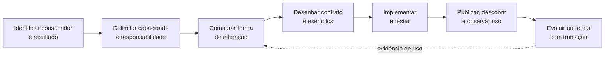
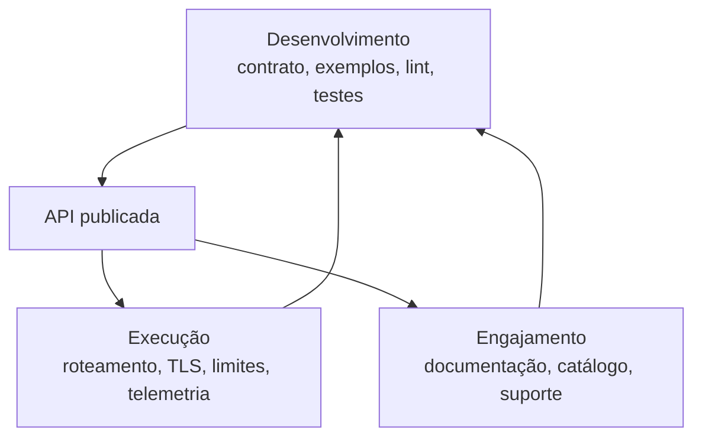
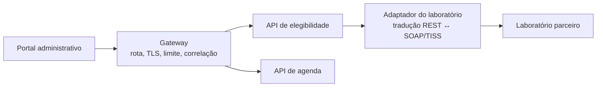

# Padrões e decisões para APIs

## Começar pelo problema do consumidor

Antes dos endpoints, identifique consumidor, resultado, tempo, dados e falhas. API é decisão de colaboração, não rotas derivadas de tabelas. Na elegibilidade, `202` com `Location` promete aceitação e acompanhamento, não aprovação nem mecanismo de processamento.

## Um processo arquitetural para construir APIs

O processo evita interface correta e inútil ao consumidor.

**Texto alternativo:** o fluxo vai de identificar consumidor a evoluir a API; evidência de uso retorna à comparação de interação.

*Figura 5 — Ciclo de decisão de uma API, da necessidade do consumidor à evolução observada. Fonte: curso.*

**Leitura textual:** a equipe identifica consumidor, delimita capacidade, compara interações e desenha contrato; depois implementa, testa, publica e observa uso. Evidências de uso revisam a comparação de alternativas.

Para cada etapa, guarde cenário, responsabilidade, contrato, teste, referência de consumo e telemetria. FastAPI, Spring Boot e ASP.NET Core implementam; OpenAPI, Spectral e Bruno tornam a promessa analisável. Nenhuma ferramenta decide se a operação pertence à API ou se uma integração deve ser assíncrona.

## Comparar formas de interação pelas mesmas forças

Uma solução pode combinar estilos por critério explícito: REST/HTTP para recursos acessíveis a múltiplos clientes, GraphQL para leituras com seleção muito variável, gRPC para colaboração interna tipada e streaming, WebSocket para canal bidirecional e SOAP/XML para o contrato de um parceiro. A escolha não é um ranking.

Compare unidade de colaboração, descoberta, evolução, cache, operação e risco. Para tela móvel variável, GraphQL é hipótese a testar por número de chamadas, autorização e cache. Para processos internos, gRPC só ajuda se a medida incluir dependências lentas. SOAP/TISS é restrição de fronteira, não ordem para a plataforma inteira falar XML.

## Contract-first, code-first e compatibilidade

**Contract-first** revisa contrato e exemplos antes do servidor; **code-first** gera documentação de rotas e tipos. Escolha fonte principal e sentinelas contra deriva. Aqui, `contratos/openapi.yaml`, `src/hospital/api/main.py` e `tests/test_api_contract.py` são perspectivas diferentes, não prova de equivalência total.

Classifique mudanças como aditiva, restritiva, semântica ou remoção. Campo opcional tende a ser aditivo; trocar o significado de `recebida` quebra mesmo mantendo a forma. Versão no caminho é visível, cabeçalho preserva URI e negociação de mídia é mais precisa; nenhuma opção substitui inventário de consumidores e observação de uso.

## Paginação e idempotência são políticas, não adornos

Lista precisa declarar ordenação: `offset/limit` pode mover itens; cursor opaco pede expiração, filtro e erro válido. Para `POST`, chave de idempotência precisa declarar retenção, concorrência e corpo divergente. A API local não demonstra idempotência distribuída.

## Plataforma de APIs: capacidades, não catálogo de produtos

Uma plataforma de APIs reúne capacidades que tornam contratos construíveis, executáveis e encontráveis. Ela não precisa começar como uma compra corporativa, e a presença de um produto não substitui uma política de arquitetura.

**Texto alternativo:** desenvolvimento publica a API; execução aplica políticas técnicas e engajamento oferece documentação e suporte; ambos retornam informações ao desenvolvimento.

*Figura 6 — Três capacidades conectadas de uma plataforma de APIs. Fonte: curso.*

**Leitura textual:** desenvolvimento prepara contratos e testes; execução atende o tráfego; engajamento permite descoberta e suporte. Telemetria e dúvidas retornam ao desenvolvimento.

Desenvolvimento responde por contrato, exemplos e testes; execução por tráfego, TLS, limites e telemetria; engajamento por descoberta e suporte. O laboratório usa uma versão mínima desse ciclo: repositório, OpenAPI, FastAPI, Bruno, Spectral e testes; não declara gateway ou catálogo empresarial.

## API gateway: borda pública, não centro do domínio

Um **API gateway** pode aplicar roteamento, TLS, autenticação técnica, limites, correlação e observabilidade. Não deve ser depósito de regras de negócio ou tradutor universal de conceitos externos.

**Texto alternativo:** o portal acessa um gateway, que encaminha às APIs de elegibilidade e agenda; a primeira usa adaptador para chamar o laboratório.

*Figura 7 — Gateway na borda e adaptador junto à diferença semântica. Fonte: curso.*

**Leitura textual:** o gateway concentra políticas técnicas; o adaptador traduz linguagem interna e SOAP/TISS perto da dependência externa. Roteamento não se confunde com domínio.

Agregação pede uma tela composta e medição de latência, falha e cache. Gateway sem fronteira adiciona salto, configuração e operação.

## ADR-002: uma decisão que pode ser revisada

O ADR registra contexto, alternativas, decisão, consequências, evidência e gatilho. Na baseline, explique REST/HTTP, `202`, `Location`, OpenAPI, limites e sinais de revisão, como streaming, paginação ou idempotência forte.
