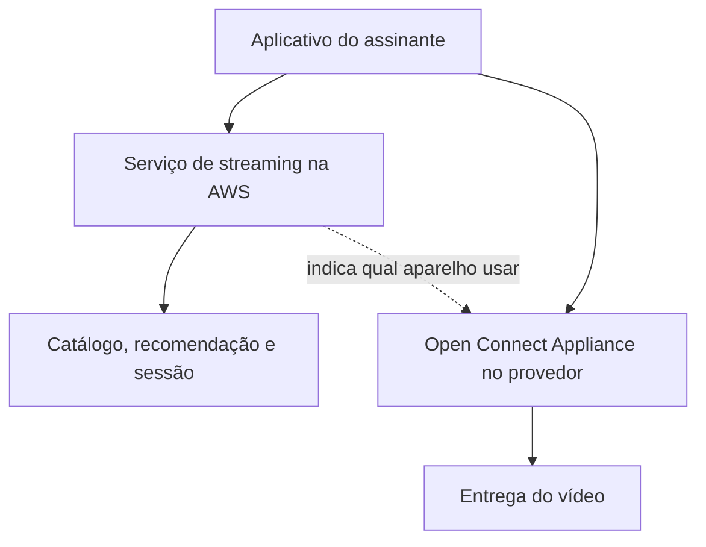

# Casos reais: Netflix e a reconstrução na nuvem

O [estudo de caso deste módulo](estudo-de-caso.md) avalia consolidação e distribuição numa plataforma hospitalar. Esta página traz a mesma decisão na empresa mais citada da literatura de microsserviços, e também a mais deformada pela repetição. Leia antes o [protocolo de leitura de caso público](../referencia/como-ler-um-caso-publico.md).

Tudo que segue vem de material publicado pela Netflix ou de artigo revisado por pares. A seção final registra o que circula sobre o caso sem origem verificável.

## A restrição

Em 2008 a Netflix sofreu uma corrupção de banco de dados. O anúncio oficial da conclusão da migração descreve o episódio assim: *"We experienced a major database corruption and for three days could not ship DVDs to our members."*

Vale reter o que a frase diz. O incidente atingiu a operação de DVDs. A restrição não era latência nem falta de funcionalidade: era uma arquitetura em que um banco relacional central concentrava risco suficiente para parar a empresa por três dias.

## A decisão

A Netflix escolheu a AWS e encerrou o último componente do serviço de streaming nos datacenters próprios no início de janeiro de 2016, sete anos depois. O anúncio é explícito quanto ao método: a empresa adotou *"a cloud-native approach, rebuilding virtually all of our technology"*, com migração para microsserviços e bancos NoSQL, em vez de transportar os sistemas existentes.

Essa distinção é a lição central do caso para este módulo. Mover máquinas virtuais para um provedor muda o dono do datacenter. O que a Netflix comprou com sete anos foi a reescrita das fronteiras internas, a substituição do banco central por armazenamentos sob propriedade de cada serviço e a aceitação de consistência eventual em fluxos que antes eram transacionais.

## As evidências que a Netflix apresenta

O mesmo anúncio declara oito vezes mais assinantes de streaming do que em 2008, crescimento de visualização de três ordens de grandeza em oito anos, aproximação de quatro noves de disponibilidade e custo de nuvem por início de reprodução equivalente a uma fração do custo em datacenter próprio. Em 6 de janeiro de 2016, apoiada em múltiplas regiões da AWS, a empresa ativou o serviço em mais de 130 países novos.

São números da empresa sobre a própria empresa, sem auditoria independente e sem metodologia divulgada. Ainda assim são úteis, porque declaram qual métrica a Netflix considerava relevante. Custo por início de reprodução é uma unidade de negócio, e escolher medir assim revela mais sobre a maturidade da decisão do que qualquer diagrama de arquitetura.

## Open Connect: a parte que não foi para a nuvem

O programa Open Connect entrega conteúdo por dois mecanismos descritos na documentação oficial: aparelhos chamados *Open Connect Appliances* instalados dentro da rede de provedores de acesso, e interconexão direta sem remuneração recíproca nos locais de troca de tráfego conhecidos como IXP. A Netflix declara parceria com mais de mil provedores e fornece os aparelhos embarcados sem custo para eles.

O resultado é uma arquitetura de duas camadas. O serviço de streaming roda na nuvem pública, conforme o anúncio de 2016. A entrega de vídeo acontece em infraestrutura física posicionada dentro da rede do provedor, onde o custo dominante é transporte de bytes e a nuvem pública não oferece vantagem.

**Texto alternativo:** o aplicativo do assinante conversa com o serviço de streaming hospedado na AWS, responsável por catálogo, recomendação e sessão, e recebe o vídeo de um aparelho Open Connect instalado no provedor de acesso, indicado pelo serviço de streaming.

*Figura 1 — Duas camadas de entrega no caso Netflix. Fonte: curso, a partir do anúncio de migração e da documentação do programa Open Connect.*

**Leitura textual da figura:** duas rotas partem do aplicativo. A primeira busca decisão e metadados no serviço hospedado na nuvem pública. A segunda busca os bytes do vídeo em um aparelho instalado dentro do provedor de acesso do assinante. O serviço na nuvem não entrega vídeo; ele informa de qual aparelho o vídeo deve ser buscado.

## Chaos Monkey e a falha como estado esperado

O Chaos Monkey encerra instâncias em ambiente de produção de forma aleatória. A justificativa está no repositório oficial, em uma frase: *"Exposing engineers to failures more frequently incentivizes them to build resilient services."*

O mesmo repositório traz uma restrição que raramente aparece nos resumos: *"You must be managing your apps with Spinnaker to use Chaos Monkey to terminate instances."* A ferramenta pressupõe a plataforma de entrega contínua da Netflix. Não é um utilitário que se instala num sistema qualquer.

Convém registrar o que envelheceu. O Hystrix, biblioteca de disjuntor de circuito que a Netflix abriu e que se tornou padrão de fato no ecossistema Java, está em modo de manutenção desde novembro de 2018. O próprio aviso do repositório indica projetos ativos como o Resilience4j para novos desenvolvimentos. Copiar a lista de ferramentas de 2012 é o modo mais rápido de errar este caso.

## Recomendação como decisão de arquitetura de dados

No artigo publicado por Carlos Gomez-Uribe e Neil Hunt na *ACM Transactions on Management Information Systems* em dezembro de 2015, os autores afirmam que a recomendação influencia cerca de 80% das horas assistidas, cabendo à busca os 20% restantes, e estimam que o efeito combinado de personalização e recomendação economiza mais de um bilhão de dólares por ano.

O que interessa ao arquiteto é a estrutura implícita nesse número. Se 80% do consumo depende de um subsistema, ele deixa de ser acessório e passa a ter requisito de disponibilidade equivalente ao da reprodução de vídeo. A consequência é uma separação entre o caminho de leitura, que responde em milissegundos com modelo pré-calculado, e o caminho de treinamento, que roda fora da linha de resposta ao usuário. É a assimetria discutida como CQRS em [padrões e decisões](padroes-e-decisoes.md#cqrs).

## O que circula sem fonte verificável

Este caso acumulou uma camada de invenção que vale identificar, porque o mesmo fenômeno afeta qualquer relato popular. Os itens abaixo aparecem em resumos amplamente compartilhados e não foram localizados em publicação da Netflix.

O incidente de 2008 descrito como queda do serviço de streaming afetando milhões de espectadores. O anúncio oficial descreve interrupção no despacho de DVDs.

Citações atribuídas a Reed Hastings sobre castelos de cartas e sobre controlar o próprio destino, sem indicação de onde teriam sido ditas.

O nome *AlgoX* como sistema de recomendação da empresa. Ele não aparece no artigo de 2015 nem em material técnico publicado pela Netflix.

Cifras precisas como "500 microsserviços em 2012" e "95% do tráfego em 2015", apresentadas sem data de apuração e sem fonte.

A lição arquitetural do caso sobrevive a essas correções. O que elas mudam é o que você consegue sustentar em uma reunião quando alguém pedir a fonte.

## O que o caso não prova

A Netflix não tinha, no fluxo de assistir a um episódio, requisito de consistência transacional imediata. Uma recomendação desatualizada é um defeito tolerável. Uma autorização de exame emitida sobre elegibilidade desatualizada não é, e essa diferença determina quanta consistência eventual o hospital pode aceitar.

A empresa também dispunha de sete anos e de uma equipe de engenharia dimensionada para reescrever a plataforma enquanto o negócio crescia. A decisão de reescrever em vez de transportar só é responsável quando existe esse fôlego. Para a maioria das organizações, o estrangulamento incremental descrito em [padrões e decisões](padroes-e-decisoes.md#chassi-e-estrangulador-evoluir-sem-reescrever-no-escuro) é mais realista.

## Leitura guiada

**1. Risco concentrado.** Descreva o mecanismo pelo qual um banco de dados central converte um defeito local em parada total do negócio, e identifique qual componente da plataforma hospitalar ocupa hoje posição equivalente.

**2. Nuvem e arquitetura.** A Netflix afirma ter reconstruído a tecnologia em vez de transportá-la. Explique quais resultados declarados no anúncio de 2016 seriam inatingíveis por uma migração de máquinas virtuais sem reescrita.

**3. Híbrido deliberado.** Formule o critério econômico e técnico que separa o que ficou na AWS do que foi instalado dentro dos provedores, e aplique esse critério a um sistema que você conheça.

**4. Ferramenta datada.** O Chaos Monkey exige Spinnaker e o Hystrix está em manutenção desde 2018. Discuta o que isso revela sobre adotar a plataforma de ferramentas de uma empresa de referência como se fosse arquitetura.

**5. Limite de transferência.** Escolha uma das decisões descritas aqui e argumente por que ela seria inadequada à plataforma hospitalar, nomeando a restrição hospitalar ausente no contexto da Netflix.

## Fontes

- Netflix, [Completing the Netflix Cloud Migration](https://about.netflix.com/en/news/completing-the-netflix-cloud-migration) — anúncio oficial de fevereiro de 2016. Fonte do incidente de 2008, da duração de sete anos e de todas as métricas de resultado.
- Netflix, [Open Connect](https://openconnect.netflix.com/en/) — descrição oficial dos aparelhos embarcados, da interconexão sem remuneração recíproca e da quantidade de provedores parceiros.
- Netflix, [Chaos Monkey](https://github.com/Netflix/chaosmonkey) — repositório oficial, origem da justificativa da ferramenta e da dependência de Spinnaker.
- Netflix, [Hystrix](https://github.com/Netflix/Hystrix) — repositório oficial, com o aviso de modo de manutenção.
- Carlos A. Gomez-Uribe e Neil Hunt, [The Netflix Recommender System: Algorithms, Business Value, and Innovation](https://dl.acm.org/doi/10.1145/2843948) — *ACM Transactions on Management Information Systems*, v. 6, n. 4, artigo 13, dezembro de 2015.
- Netflix Technology Blog, [The Netflix Simian Army](https://netflixtechblog.com/the-netflix-simian-army-16e57fbab116) — publicação de 2011 que apresenta a família de ferramentas de injeção de falha.
