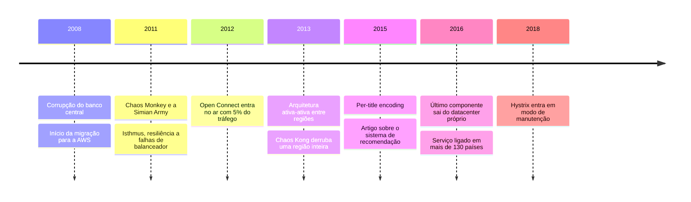
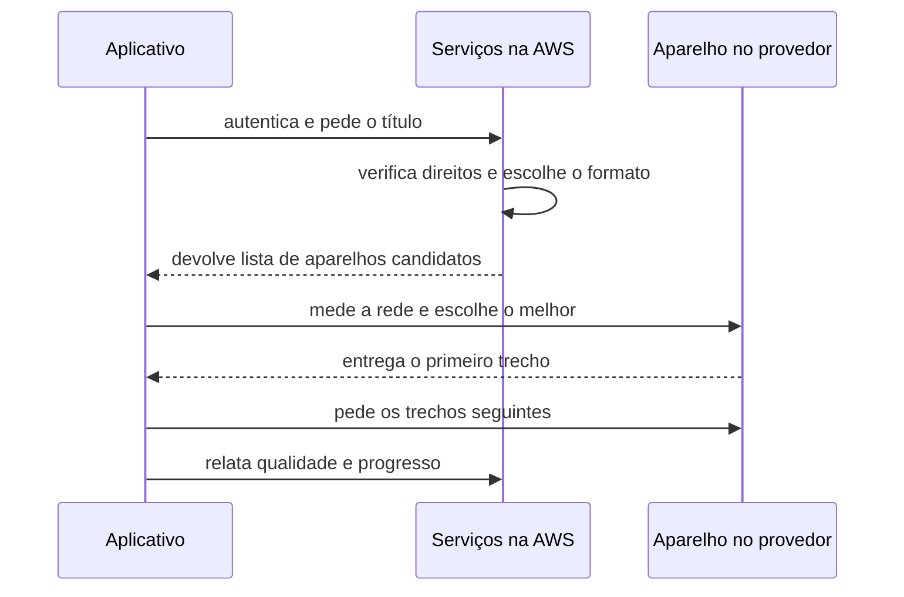

# Netflix: sete anos para reconstruir, dois segundos para começar o filme

Entre o toque no play e o primeiro quadro na tela passam cerca de dois segundos. Nesse intervalo, o aplicativo conversa com serviços hospedados em três regiões da Amazon, recebe uma lista de servidores candidatos, mede a rede até eles, escolhe um, pede o primeiro trecho do vídeo e começa a decodificar. O servidor que entrega esse trecho quase nunca está na Amazon. Costuma estar dentro do prédio do seu provedor de internet, num equipamento que a Netflix montou, encaixotou e enviou de graça.

Nada disso existia em 2008. A história de como passou a existir é uma sequência de decisões que deram errado antes de darem certo, e é isso que a torna útil.

## Agosto de 2008: três dias sem enviar DVDs

A Netflix ainda era, em boa medida, uma locadora pelo correio. O anúncio oficial que a empresa publicaria oito anos depois descreve o que aconteceu em uma frase seca: *"We experienced a major database corruption and for three days could not ship DVDs to our members."*

Três dias. Um banco de dados relacional, vertical, no datacenter da própria empresa, corrompeu-se e parou a operação inteira. Não houve degradação parcial, nem uma região afetada, nem um subconjunto de clientes. Parou.

A conclusão que a empresa tirou tem duas metades, e a segunda é a que costuma ser esquecida. A primeira: escalar verticalmente um banco único era uma aposta perdida. A segunda: comprar e instalar servidores num ritmo compatível com o crescimento do streaming era um problema que a Netflix não queria resolver.

## A decisão que levou sete anos

A migração para a AWS começou em 2008 e terminou em janeiro de 2016, quando os últimos componentes do serviço de streaming foram desligados nos datacenters próprios.

Sete anos é muito tempo para uma migração, e o motivo está declarado no anúncio: a Netflix adotou *"a cloud-native approach, rebuilding virtually all of our technology"*. A empresa não moveu o que tinha. Reescreveu quase tudo, trocando o banco relacional central por armazenamentos NoSQL sob propriedade de cada serviço e quebrando o monólito em serviços independentes.

A diferença entre as duas abordagens é a lição central deste caso. Mover máquinas virtuais para um provedor troca o dono do datacenter e preserva a arquitetura. Foi a reescrita que produziu os resultados que a Netflix declara: oito vezes mais assinantes de streaming do que em 2008, visualização crescendo três ordens de grandeza em oito anos, disponibilidade se aproximando de quatro noves e custo de nuvem por início de reprodução equivalente a uma fração do custo em datacenter próprio.

Em 6 de janeiro de 2016, apoiada em múltiplas regiões da AWS, a empresa ligou o serviço em mais de 130 países de uma vez.

**Texto alternativo:** linha do tempo da Netflix de 2008 a 2018, marcando a corrupção do banco e o início da migração, o Chaos Monkey e o Isthmus, a entrada do Open Connect, a arquitetura ativa-ativa e o Chaos Kong, o per-title encoding e o artigo de recomendação, a conclusão da migração com a expansão internacional, e o Hystrix em modo de manutenção.

*Figura 1 — Dez anos de decisões arquiteturais na Netflix. Fonte: curso, a partir das publicações oficiais citadas ao final.*

**Leitura textual da figura:** a sequência mostra que a migração para a nuvem não foi um evento, e sim o pano de fundo de uma década. Resiliência a falhas veio antes da conclusão da migração, a rede própria de entrega começou no meio do caminho, e a expansão internacional só foi possível depois que o serviço passou a rodar em várias regiões ao mesmo tempo.

## A primeira rede de entrega foi alugada, e deixou de servir

Streaming não é feito de chamadas de API. É feito de bytes de vídeo, e em volume absurdo. Nos primeiros anos a Netflix contratou o que o mercado oferecia: Akamai, Level 3 e Limelight, três das maiores redes de distribuição de conteúdo do mundo.

Funcionou enquanto o volume coube. Deixou de funcionar por duas razões que a imprensa especializada da época registrou. Os fornecedores tinham dificuldade de expandir a infraestrutura no ritmo em que a demanda da Netflix crescia. E o custo de terceirizar entrega de vídeo, num negócio cuja atividade principal é entregar vídeo, subia mais rápido do que a receita.

Há uma pergunta arquitetural embutida aí, e ela reaparece em qualquer empresa: o que você compra e o que você constrói? A resposta que a Netflix deu foi construir, porque distribuição de conteúdo tinha deixado de ser custo de operação e virado vantagem competitiva.

## 2012: a Netflix vira uma fabricante de hardware

O Open Connect entrou no ar em 2012, servindo cerca de 5% do tráfego. O desenho é heterodoxo para uma empresa de software.

A Netflix projeta e monta servidores. São duas famílias. O aparelho de armazenamento é um equipamento de duas unidades de rack que a documentação oficial descreve com até 120 TB de capacidade, cerca de 200 Gbps de vazão, consumo aproximado de 400 W e conectividade de seis interfaces de 10 Gbps agregadas ou até duas de 100 Gbps. O aparelho global é menor e mais barato, com até 60 TB, cerca de 80 Gbps e 250 W, projetado explicitamente para provedores menores e mercados emergentes, com meta de *"4-6 year no touch reliability"*.

Esses equipamentos vão para dois lugares. Alguns ficam em instalações da própria Netflix e em locais de interconexão (IXP), que a empresa declara somarem mais de 60 datacenters globais. Outros são embarcados dentro da rede dos provedores de acesso, e aí está a parte incomum: a Netflix entrega o aparelho sem cobrar nada por ele.

A troca é econômica dos dois lados. O provedor economiza tráfego caro nos enlaces de trânsito, porque o vídeo passa a sair de dentro da própria rede. A Netflix ganha latência baixa e deixa de pagar pela entrega. A empresa declara parceria com mais de mil provedores.

## O catálogo viaja de madrugada

O detalhe que transforma o Open Connect de "servidor de cache" em decisão arquitetural é quando o conteúdo chega.

Um cache convencional é reativo: o primeiro usuário que pede um arquivo paga a conta de buscá-lo na origem, e os seguintes aproveitam. O Open Connect é proativo. A documentação oficial descreve preenchimento noturno dos aparelhos, e informa que a Netflix faz a configuração inicial dos equipamentos embarcados e os pré-carrega com o conteúdo apropriado para a região geográfica de destino, num processo que leva de uma a duas semanas conforme o tamanho do catálogo.

Ou seja: na madrugada anterior, a Netflix já decidiu o que provavelmente será assistido na sua cidade amanhã, e colocou esses arquivos a poucos quilômetros de você. Quando você aperta o play, o vídeo não está sendo buscado. Ele já estava lá.

Isso só é possível porque o catálogo é conhecido e a demanda é previsível o bastante para ser antecipada. É uma decisão que se apoia em uma propriedade do negócio, e não em uma propriedade da tecnologia.

## Cada título vira muitos arquivos

Entre o arquivo que o estúdio entrega e o que chega ao aparelho existe uma etapa de transcodificação que multiplica o conteúdo. Cada título precisa existir em várias resoluções, várias taxas de bits, vários formatos de áudio, várias legendas e vários envelopes compatíveis com aparelhos que vão de um televisor recente a um celular de entrada.

Em 2015 a Netflix publicou que trocou a escada fixa de taxas de bits por uma análise feita título a título. O raciocínio é simples de enunciar e caro de executar: uma animação com áreas planas de cor e um filme de ação com granulação e movimento rápido não precisam da mesma taxa de bits para atingir a mesma qualidade percebida. Tratar os dois igual desperdiça banda num caso e entrega qualidade ruim no outro.

## 2011 a 2016: aprender a perder uma região inteira

A resiliência da Netflix costuma ser resumida a "eles têm o Chaos Monkey", o que achata uma evolução de cinco anos em uma ferramenta.

A sequência real tem etapas. O **Isthmus**, publicado em 2013, atacou um caso específico: sobreviver à falha do balanceador de carga de uma região inteira, roteando o tráfego de entrada por outra. Era resiliência parcial, para um modo de falha conhecido.

Em dezembro de 2013 veio a **arquitetura ativa-ativa**, com o serviço rodando simultaneamente em mais de uma região da AWS e cada região capaz de atender os membros da outra. Isso obriga a resolver problemas que não existem em uma região só: replicação do Cassandra entre regiões, invalidação de cache remoto no EVCache quando uma escrita acontece do outro lado, e roteamento no Zuul capaz de mudar em tempo de execução.

Com duas regiões atendendo de verdade, virou possível ensaiar a perda de uma delas. O **Chaos Kong** faz exatamente isso: evacua uma região inteira da AWS com tráfego real rodando, e observa se a outra absorve.

O ensaio revelou o problema seguinte. Evacuar uma região levava cerca de 50 minutos, tempo demais para um incidente real. O **Project Nimble** reduziu isso para 8 minutos. O dado que mais interessa a quem vai propor algo parecido está na descrição do esforço: uma equipe de duas pessoas, cerca de seis meses.

## O macaco derruba servidores porque alguém precisa estar acordado

O Chaos Monkey encerra máquinas em produção de forma aleatória. A justificativa oficial cabe numa frase do repositório: *"Exposing engineers to failures more frequently incentivizes them to build resilient services."*

O mesmo repositório traz uma restrição que quase nunca aparece nos resumos: *"You must be managing your apps with Spinnaker to use Chaos Monkey to terminate instances."* A ferramenta pressupõe a plataforma de entrega contínua da Netflix. Ela não se instala num sistema qualquer, e quem tenta copiar o Chaos Monkey sem o resto da fundação está copiando o efeito visível de uma engenharia que não tem.

## Oito de cada dez horas assistidas vêm de recomendação

Em dezembro de 2015, Carlos Gomez-Uribe e Neil Hunt publicaram na *ACM Transactions on Management Information Systems* o artigo que descreve o sistema de recomendação da empresa. Dois números do artigo mudam a leitura arquitetural do sistema.

A recomendação influencia cerca de 80% das horas assistidas; a busca responde pelos 20% restantes. E os autores estimam que o efeito combinado de personalização e recomendação economiza mais de um bilhão de dólares por ano.

Se 80% do consumo depende de um subsistema, ele deixa de ser um recurso acessório. Passa a ter requisito de disponibilidade equivalente ao da reprodução de vídeo, e isso força a separação entre o caminho de leitura, que precisa responder em milissegundos com um modelo já calculado, e o caminho de treinamento, que roda longe da requisição do usuário.

## Então, o que acontece quando você aperta o play

Com as peças na mesa, a sequência fica legível.

**Texto alternativo:** diagrama de sequência em que o aplicativo autentica e pede o título aos serviços na AWS, que verificam direitos, escolhem o formato e devolvem uma lista de aparelhos candidatos. O aplicativo mede a rede até eles, escolhe um, recebe o primeiro trecho e segue pedindo os seguintes, enquanto relata qualidade e progresso aos serviços na nuvem.

*Figura 2 — O caminho de uma reprodução entre as duas nuvens da Netflix. Fonte: curso, a partir do anúncio de migração e da documentação do programa Open Connect.*

**Leitura textual da figura:** a decisão e os metadados vêm da nuvem pública; os bytes do vídeo vêm de um equipamento dentro do provedor de acesso. A nuvem não entrega vídeo. Ela diz de onde buscá-lo, e o aplicativo tem autonomia para medir e escolher entre as opções recebidas. Se um aparelho degrada, o próprio aplicativo troca sem consultar a nuvem de novo.

O detalhe final é que o cliente decide. A Netflix escreve o aplicativo para os mais de dois mil modelos de aparelho que suporta, e isso permite empurrar inteligência para a ponta: medir a banda disponível, trocar de servidor, baixar a resolução em vez de travar. Uma empresa que não controla o cliente não tem essa opção.

## O que envelheceu

Um caso de referência é um retrato datado, e vale registrar o que já não vale copiar.

O Hystrix, biblioteca de disjuntor de circuito que a Netflix abriu e que virou padrão de fato no ecossistema Java, está em modo de manutenção desde novembro de 2018, com o próprio repositório indicando projetos ativos como o Resilience4j para novos desenvolvimentos. A plataforma de ferramentas de 2012 continua sendo citada em apresentações como se fosse o estado atual da engenharia da Netflix.

## Questões para discussão

Releia o caso com a lente do arquiteto. As questões abaixo pedem recuperar os fatos, explicar os mecanismos e comparar as escolhas descritas no próprio caso.

**1.** Segundo o anúncio oficial, o que aconteceu em 2008 e qual operação da empresa ficou parada por três dias?

**2.** A Netflix declara ter reconstruído a tecnologia em vez de transportá-la. Explique a diferença entre as duas coisas e o que cada uma muda na arquitetura resultante.

**3.** O Open Connect inverte a lógica de cache: o conteúdo chega antes do pedido. Que propriedade do negócio da Netflix torna isso possível, e que tipo de serviço jamais conseguiria fazer o mesmo?

**4.** Compare Isthmus, arquitetura ativa-ativa e Chaos Kong quanto ao modo de falha que cada um endereça.

**5.** O Chaos Monkey exige a plataforma Spinnaker e o Hystrix está em modo de manutenção desde 2018. Explique o que cada um desses fatos diz sobre reaproveitar a plataforma de ferramentas de outra empresa.

## Fontes

- Netflix, [Completing the Netflix Cloud Migration](https://about.netflix.com/en/news/completing-the-netflix-cloud-migration) — anúncio oficial de fevereiro de 2016. Origem do incidente de 2008, dos sete anos, da abordagem *cloud-native* e das métricas de resultado.
- Netflix, [Open Connect](https://openconnect.netflix.com/en/) — programa oficial: preenchimento noturno, pré-carga por região, mais de mil provedores parceiros e mais de 60 datacenters.
- Netflix, [Open Connect Appliances](https://openconnect.netflix.com/en/appliances/) — especificações oficiais de capacidade, vazão e consumo dos dois modelos de aparelho.
- Netflix Technology Blog, [Isthmus — Resiliency against ELB outages](https://netflixtechblog.com/isthmus-resiliency-against-elb-outages-d9e0623484f3) e [Active-Active for Multi-Regional Resiliency](https://netflixtechblog.com/active-active-for-multi-regional-resiliency-c47719f6685b) — as duas etapas da resiliência entre regiões.
- Netflix Technology Blog, [Project Nimble: Region Evacuation Reimagined](https://netflixtechblog.com/project-nimble-region-evacuation-reimagined-d0d0568254d4) — a redução do tempo de evacuação e o tamanho da equipe envolvida.
- Netflix Technology Blog, [Per-Title Encode Optimization](https://netflixtechblog.com/per-title-encode-optimization-7e99442b62a2) — dezembro de 2015, a substituição da escada fixa de taxas de bits.
- Netflix, [Chaos Monkey](https://github.com/Netflix/chaosmonkey) e [Hystrix](https://github.com/Netflix/Hystrix) — repositórios oficiais, origem das duas citações e do aviso de modo de manutenção.
- Carlos A. Gomez-Uribe e Neil Hunt, [The Netflix Recommender System: Algorithms, Business Value, and Innovation](https://dl.acm.org/doi/10.1145/2843948) — *ACM Transactions on Management Information Systems*, v. 6, n. 4, artigo 13, dezembro de 2015.
- Fonte secundária, identificada como tal: a cobertura de imprensa de junho de 2012 sobre a entrada do Open Connect e a saída dos fornecedores contratados, registrada por [TechCrunch](https://techcrunch.com/2012/06/04/netflix-open-connect/) e [Forbes](https://www.forbes.com/sites/ericsavitz/2012/06/05/netflix-shifts-traffic-to-its-own-cdn-akamai-limelight-shrs-hit/). Os nomes Akamai, Level 3 e Limelight e a fatia de 5% vêm daí.
- Todd Hoff, [Netflix: What Happens When You Press Play?](https://highscalability.com/netflix-what-happens-when-you-press-play/) — síntese jornalística extensa, útil como panorama e como exemplo de reconstrução narrativa a partir de apresentações públicas.
