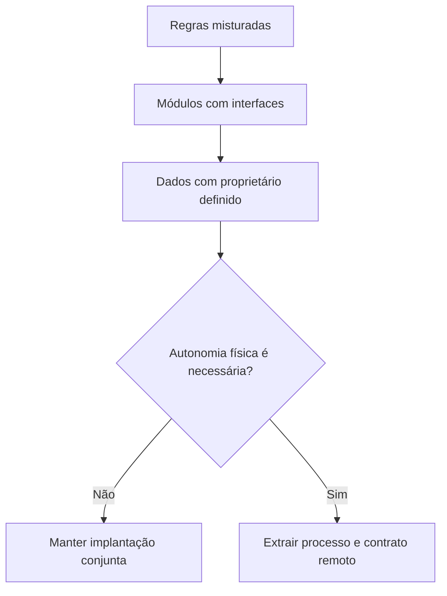
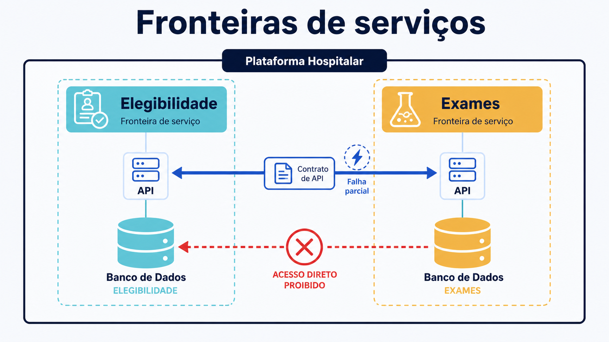

# Conceitos: do negócio à fronteira

Dividir um sistema é escolher o que deve permanecer junto e o que pode evoluir separadamente. Pastas, classes e contêineres são mecanismos; a justificativa vem do domínio e dos atributos de qualidade.

## Capacidade de negócio

Uma **capacidade de negócio** descreve algo que a organização sabe fazer para produzir um resultado, independentemente da tela ou tecnologia atual. “Verificar elegibilidade”, “agendar atendimento” e “solicitar exame” são capacidades. “Salvar no PostgreSQL” e “enviar JSON” são mecanismos técnicos.

Capacidades ajudam a evitar serviços recortados por camadas como “serviço de controladores” ou “serviço de banco”. Um recorte útil reúne comportamento, regras e informação necessários a um resultado. O nome costuma ser estável mesmo quando o processo muda. Ainda assim, um mapa de capacidades é uma lente estratégica, não um gerador automático de executáveis. Uma capacidade ampla pode conter vários contextos; várias capacidades pequenas podem coexistir no mesmo contexto.

No caso hospitalar, elegibilidade interpreta vínculo, vigência e regras da operadora. Exames conhece códigos, solicitações e estados do fluxo clínico. O segundo precisa da resposta do primeiro, mas não precisa conhecer tabelas, algoritmos ou documentos internos usados para produzi-la.

## Bounded context

Em Domain-Driven Design, um **bounded context** delimita onde um modelo e sua linguagem possuem significado consistente. A palavra “situação” pode significar vigência cadastral em Elegibilidade e etapa operacional em Exames. Dentro de cada contexto, termos, invariantes e responsáveis devem ser claros. Entre contextos, existe tradução explícita.

Bounded context não é sinônimo de microsserviço. Ele é primeiro uma fronteira semântica. Pode ser implementado como módulo em um monólito, como parte coesa de um macrosserviço ou como serviço implantável. Confundir modelo lógico com topologia física leva a centenas de processos antes de existir necessidade operacional.

Um bom limite permite responder:

- qual resultado é produzido e para quem;
- quais regras devem permanecer verdadeiras;
- quem pode alterar os dados autoritativos;
- qual contrato é oferecido a consumidores;
- quais mudanças deveriam ocorrer sem coordenação externa.

## Coesão

**Coesão** é o grau em que elementos de uma unidade contribuem para uma responsabilidade relacionada. Regras que mudam pelo mesmo motivo tendem a ficar juntas. Em Elegibilidade, calcular vigência e interpretar categoria do plano possuem alta coesão. Colocar ali o preparo de uma amostra laboratorial mistura razões de mudança.

Alta coesão reduz a quantidade de contexto mental para alterar uma regra e favorece testes significativos. Ela não significa unidade minúscula. Fragmentar cada função em um processo pode reduzir a coesão do fluxo de negócio: uma alteração simples passa a exigir contratos, implantações e diagnósticos coordenados.

Heurísticas úteis incluem observar vocabulário compartilhado, invariantes transacionais, histórico de mudanças, propriedade da equipe e necessidade de escalar. Nenhuma heurística decide sozinha. O histórico pode refletir uma organização antiga; uma transação pode ser redesenhada; uma equipe pode mudar.

## Acoplamento

**Acoplamento** é a dependência entre unidades. Ele não desaparece quando trocamos uma chamada de função por HTTP. Apenas muda de forma. Alguns tipos importantes são:

- **de contrato:** consumidor depende de campos, semântica e códigos de resposta;
- **temporal:** consumidor precisa que o provedor esteja disponível agora;
- **de dados:** duas unidades dependem da mesma estrutura ou alteram a mesma informação;
- **de implantação:** uma mudança exige publicar várias unidades em conjunto;
- **organizacional:** equipes precisam negociar continuamente para entregar uma capacidade.

Uma dependência explícita e estável pode ser saudável. O problema é o acoplamento que impede evolução ou torna falhas imprevisíveis. No laboratório, Exames aceita acoplamento temporal com Elegibilidade: a solicitação espera uma resposta síncrona. Em compensação, evita acoplamento de dados: Exames não lê a tabela do outro serviço.

## Fronteira lógica e fronteira física

Uma fronteira lógica controla referências, linguagem e propriedade. Uma fronteira física acrescenta processo, rede, implantação e falha independentes. A progressão mais segura costuma ser:

**Texto alternativo:** sequência de decisão que separa regras em módulos e dados com proprietário antes de decidir se a autonomia física justifica um contrato remoto.

*Figura 1 — Da fronteira lógica à fronteira física.*

**Leitura textual da figura:** primeiro separam-se módulos e proprietários dos dados; só quando existe necessidade comprovada de autonomia física um limite vira processo remoto, caso contrário a implantação permanece conjunta.

Extrair cedo demais adiciona latência, serialização, autenticação entre serviços, descoberta, telemetria e recuperação. Extrair tarde demais pode manter equipes e ciclos de entrega presos. A arquitetura evolutiva mantém opções: módulos com APIs internas e testes de fronteira tornam uma futura extração menos traumática.

## Serviço e microsserviço

“Serviço” é uma unidade que oferece capacidades por um contrato. Pode viver no mesmo processo ou em outro. Um **microsserviço** é uma unidade implantável de maneira independente, alinhada a uma responsabilidade de negócio e dona de seu estado. “Micro” não fornece um limite de linhas ou pessoas. O sinal relevante é autonomia com coesão, não tamanho arbitrário.

Independência é uma propriedade exigente. Se toda alteração requer publicação coordenada, se vários serviços escrevem o mesmo banco ou se um fluxo só funciona quando dez respostas chegam, a topologia é distribuída, mas a autonomia é baixa. Equipes podem acabar com um monólito distribuído: custos remotos sem benefícios de isolamento.

## Propriedade dos dados

Propriedade responde quem é autoridade para interpretar e alterar uma informação. **Banco por serviço** significa que somente o serviço proprietário acessa diretamente seu armazenamento. Consumidores usam contratos, eventos ou réplicas explicitamente projetadas. Não significa obrigatoriamente um servidor físico para cada processo. Bancos, schemas ou credenciais podem oferecer graus diferentes de isolamento.

*Figura 4 — Fronteiras lógicas, contratos e dados de serviços.*

**Leitura textual da figura:** Elegibilidade e Exames são capacidades distintas da plataforma hospitalar. Cada uma oferece um contrato de API e mantém seu próprio armazenamento. A interação permitida passa pelo contrato; a seta de acesso direto de um serviço ao banco do outro aparece bloqueada porque violaria a propriedade dos dados e criaria acoplamento oculto.

No laboratório, dois PostgreSQL deixam a regra visível: a credencial de Exames conhece apenas o banco `exames`; Elegibilidade conhece apenas `elegibilidade`. Cada banco fica em uma rede interna própria; ambos os processos compartilham somente a rede de aplicação necessária ao HTTP. Portanto, mesmo que Exames descubra o alias `elegibilidade-db`, ele não consegue resolvê-lo pela sua rede. Em ambientes maiores, isolamento lógico no mesmo cluster pode equilibrar custo e proteção, desde que permissões e responsabilidade sejam reais.

Compartilhar uma tabela parece conveniente para relatórios e transações, porém cria contrato implícito. Uma alteração de coluna pode quebrar consumidores desconhecidos; uma escrita externa pode violar invariantes; o proprietário deixa de controlar evolução. Para leitura integrada, avalie composição por API, eventos, réplica analítica ou modelo de leitura, sempre deixando defasagem e origem explícitas.

## Persistência como decisão de fronteira

**Persistência poliglota** significa escolher mecanismos de armazenamento diferentes quando a forma do dado e seus acessos justificam isso: por exemplo, uma base relacional para regras transacionais, uma busca para documentos e uma série temporal para medições. Não significa dar um banco novo a cada serviço nem trocar de tecnologia por prestígio. Cada mecanismo acrescenta backup, segurança, observabilidade, migração e competência operacional.

Comece pela autoridade e pelo contrato: quem escreve, quais invariantes precisam de transação e quais leituras podem ser projetadas. No exemplo, os dois PostgreSQL não demonstram poliglotismo; demonstram propriedade de dados. A decisão de persistência só muda quando as forças do domínio e da operação pagam o seu custo.

## Chamadas síncronas e falhas parciais

Em uma chamada síncrona, o consumidor espera a resposta. É simples para fluxos que precisam de decisão imediata e oferece um caminho de erro direto. O custo é acoplamento temporal: a disponibilidade percebida por Exames depende de sua própria aplicação, seu banco, a rede, Elegibilidade e o banco de Elegibilidade.

Uma **falha parcial** ocorre quando uma parte distribuída funciona e outra não. Exames pode estar saudável para consultar seu banco enquanto não consegue aceitar nova solicitação porque Elegibilidade parou. Retornar `503 Service Unavailable` com `dependencia_indisponivel` torna essa condição observável. Devolver `500` genérico ou registrar como se a solicitação tivesse sido concluída esconderia a semântica.

Timeouts limitam espera; repetição pode ajudar falhas transitórias, mas amplia carga e exige idempotência; circuit breaker interrompe tentativas quando a dependência está instável; fallback precisa ser válido para o negócio, não apenas tecnicamente conveniente. No exemplo clínico, presumir elegibilidade positiva seria perigoso. Falhar de forma explícita é a decisão didática.

## Equivalências em Java e .NET

Os conceitos não dependem de FastAPI. Em Java, um processo equivalente pode usar Spring Boot, Spring Web e o driver PostgreSQL; módulos podem ser reforçados com Java Platform Module System, pacotes e testes ArchUnit. Em .NET, ASP.NET Core Minimal APIs ou controllers oferecem HTTP, Npgsql acessa PostgreSQL e projetos separados reforçam referências permitidas. `HttpClient` em .NET e `WebClient` ou clientes declarativos no ecossistema Spring cumprem o papel do `httpx`.

Docker Compose executa os mesmos contêineres independentemente da linguagem. O contrato de fronteira deve verificar requisições, respostas e proibições arquiteturais sem depender da implementação interna do provedor. Essa equivalência é essencial: arquitetura de serviços trata decisões de responsabilidade, estado e falha; frameworks apenas concretizam essas decisões.
