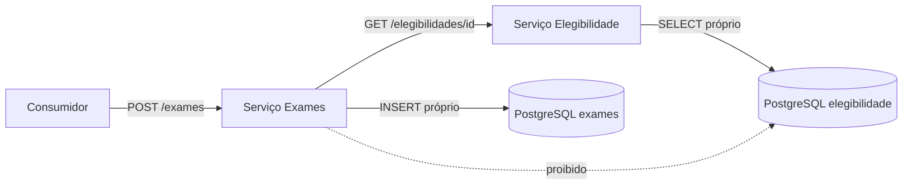

# Exemplo arquitetural: elegibilidade e exames

O laboratório concretiza dois bounded contexts em processos FastAPI independentes. Cada processo possui um PostgreSQL e uma credencial própria. O objetivo não é simular toda uma plataforma hospitalar, mas expor um limite verificável: Exames conhece o contrato HTTP de Elegibilidade e não conhece sua tabela.

## Componentes

O serviço **Elegibilidade** oferece `GET /elegibilidades/{beneficiario_id}`. Seu schema contém beneficiários sintéticos e a decisão booleana. O serviço **Exames** oferece `POST /exames`, consulta o primeiro serviço e, se a resposta for positiva, registra uma solicitação no próprio schema.

Ambos oferecem `GET /health`. O health check comprova conexão com seu banco local; ele não declara toda dependência remota saudável. Essa escolha permite ver uma falha parcial: Exames continua com processo e banco ativos, embora uma operação que depende de Elegibilidade retorne `503`.



**Texto alternativo:** o consumidor solicita exames; Exames consulta Elegibilidade por HTTP e cada serviço acessa exclusivamente seu próprio banco PostgreSQL.

*Figura 1 — Contrato entre serviços e propriedade de dados. Fonte: curso.*

**Leitura textual da figura:** o consumidor chama Exames; Exames consulta Elegibilidade por HTTP; cada serviço acessa apenas seu PostgreSQL, e o caminho direto entre Exames e o banco de Elegibilidade é explicitamente proibido.

## Fluxo nominal

O consumidor envia:

```json
{
  "beneficiario_id": "paciente-001",
  "codigo_exame": "HEM-001"
}
```

Exames valida a forma do pedido. Em seguida chama `GET /elegibilidades/paciente-001`. Elegibilidade executa uma consulta parametrizada em `elegibilidade.beneficiarios` e responde:

```json
{
  "beneficiario_id": "paciente-001",
  "elegivel": true
}
```

Exames valida status e estrutura, grava em `exames.solicitacoes` e retorna `201 Created`:

```json
{
  "solicitacao_id": 1,
  "beneficiario_id": "paciente-001",
  "codigo_exame": "HEM-001",
  "situacao": "solicitado"
}
```

O identificador pode aumentar em nova execução. Depois de `down -v`, o volume é removido e a primeira solicitação da próxima execução volta a usar o identificador `1`.

## Fluxos alternativos

Se `paciente-002` for consultado, Elegibilidade responde `200` com `elegivel: false`; Exames traduz a decisão para `422` e `beneficiario_inelegivel`. Se o identificador não existir, a resposta do provedor é `404` e Exames usa `beneficiario_desconhecido`. Se o provedor devolver estrutura incompatível, Exames retorna `502` e `contrato_invalido`.

Se a conexão falhar ou o provedor responder erro de servidor, Exames retorna `503`:

```json
{
  "detail": {
    "codigo": "dependencia_indisponivel"
  }
}
```

Essa resposta não afirma que o processo de Exames parou. Ela comunica que a capacidade solicitada não pode ser concluída enquanto uma dependência necessária está indisponível.

## Fronteira de dados executável

O arquivo Compose cria dois servidores PostgreSQL. No primeiro existe somente o schema `elegibilidade`; no segundo, somente `exames`. Cada banco usa rede interna e alias próprio; cada aplicação recebe apenas sua URL e só participa da rede do banco que possui. A rede de aplicação é separada e serve ao HTTP entre serviços. Não há porta de banco publicada para a máquina durante a oficina, reduzindo caminhos acidentais.

O teste `test_exames_source_cannot_access_eligibility_table_directly` funciona como uma guarda simples. Ele rejeita referências SQL conhecidas à tabela alheia e ao host do banco vizinho. Guardas textuais não substituem permissões: a separação física e as credenciais oferecem a proteção efetiva. O teste documenta a intenção e detecta regressões óbvias.

O teste de contrato usa um transporte HTTP controlado para responder como Elegibilidade, mas importa somente `hospital.servicos.exames`. Assim ele avalia o que o consumidor espera do contrato, sem chamar função interna nem instanciar repositório do provedor. Se a implementação de Elegibilidade mudar mantendo status e corpo, o teste do consumidor permanece válido.

## O que o exemplo deliberadamente não inclui

Não há autenticação, dados pessoais reais, descoberta dinâmica, TLS, migrações versionadas ou telemetria distribuída. Também não há SAGA, CQRS ou mensageria. O fluxo faz uma consulta síncrona antes de uma única transação local; adicionar padrões avançados esconderia a lição principal.

Em produção, a equipe precisaria definir SLOs, propagação de correlação, limites de recursos, política de logs, proteção de dados e restauração. O código também adotaria migrações em vez de um script de inicialização descartável. O Compose é ambiente didático reproduzível, não uma plataforma de produção.

## Alternativa: monólito modular

Os mesmos limites poderiam existir em uma aplicação: `Elegibilidade` exporia uma interface interna e seria o único módulo autorizado a acessar suas tabelas; `Exames` dependeria dessa interface. A chamada não sofreria falha de rede e uma implantação seria suficiente. Se as equipes e os requisitos de escala fossem iguais, essa alternativa provavelmente teria menor custo.

A versão distribuída é escolhida aqui para observar propriedades que só aparecem com rede e processos independentes. Não transforma a alternativa modular em desenho inferior.

## Equivalências em Java e .NET

Em Java, seriam duas aplicações Spring Boot, com controllers, `DataSource` próprio e cliente HTTP. Um teste do consumidor poderia usar `MockWebServer` ou WireMock sem importar o serviço provedor. Em .NET, seriam duas aplicações ASP.NET Core, cada uma com Npgsql e `HttpClient`; um `HttpMessageHandler` controlado produziria respostas de contrato.

Dockerfile e Compose mudariam apenas os comandos e artefatos da aplicação. A regra central permaneceria: configuração de Exames recebe a URL HTTP de Elegibilidade e a URL de seu próprio banco, nunca a URL do banco alheio.
