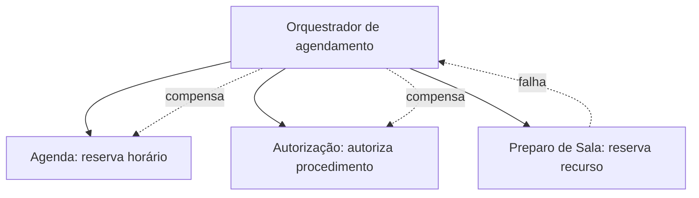

# Padrões e decisões: escolher o grau de distribuição

Arquitetura de serviços não oferece uma escada em que microsserviços ocupam o último degrau. Existem formas diferentes de empacotar limites lógicos. A escolha deve ligar forças do contexto a consequências verificáveis.

## Monólito modular, macrosserviços e microsserviços

Um **monólito modular** possui uma unidade de implantação, mas separa o código em módulos com interfaces e dependências controladas. Uma transação local pode atravessar módulos sob regras explícitas. Ele simplifica operação e depuração; exige disciplina para impedir referências arbitrárias e um banco sem proprietário.

Um **macrosserviço** é uma unidade implantável maior que reúne capacidades fortemente relacionadas. O termo é útil para sair da falsa dicotomia entre um sistema inteiro e dezenas de serviços minúsculos. Pode corresponder a uma área de negócio mantida por uma equipe, com módulos internos fortes. Reduz viagens de rede e coordenação operacional, mas uma implantação afeta uma superfície maior.

Um **microsserviço** busca autonomia de implantação, operação e dados em uma responsabilidade coesa. Favorece escalabilidade seletiva, isolamento de mudanças e ownership quando esses benefícios existem. Cobra automação de entrega, contratos, observabilidade, segurança de rede, capacidade de resposta a incidentes e tratamento de falhas parciais.

| Aspecto | Monólito modular | Macrosserviço | Microsserviço |
| --- | --- | --- | --- |
| Implantação | uma para o sistema | uma por conjunto amplo | uma por limite menor |
| Chamada dominante | local | local e remota | remota entre limites |
| Transação | local com maior alcance | local dentro do conjunto | local por proprietário |
| Operação | menor variedade | intermediária | maior variedade |
| Autonomia | lógica | por área ampla | física e organizacional |
| Risco típico | erosão dos módulos | unidade crescer sem revisão | monólito distribuído |

Comece perguntando se há necessidade de implantação independente, escalabilidade diferente, isolamento regulatório, tecnologias especializadas ou equipes com ownership real. Sem essas forças, a fronteira interna costuma preservar mais simplicidade.

## Banco por serviço como proteção da autoridade

O padrão banco por serviço protege invariantes e evolução. Cada serviço decide schema, migrações e regras de escrita. Outro serviço não faz `SELECT`, `JOIN` ou `UPDATE` direto. A proteção deve ser concreta: credenciais distintas, permissões mínimas e testes arquiteturais.

“Por serviço” descreve propriedade, não necessariamente uma máquina. Opções incluem schemas separados no mesmo PostgreSQL, bancos separados no mesmo servidor ou instâncias separadas. O isolamento cresce junto com custo operacional. O laboratório escolhe dois contêineres PostgreSQL e dois schemas homônimos para que a violação seja evidente.

Consultas que atravessam limites podem ser resolvidas por composição síncrona, cópias orientadas a eventos, plataforma analítica ou modelo materializado. Cada alternativa troca frescor, disponibilidade, complexidade e custo. Não use acesso compartilhado como atalho silencioso.

Quando necessidades de acesso diferem de modo comprovado, a persistência poliglota pode usar tecnologias distintas por proprietário. A questão não é “qual banco é moderno?”, mas qual mecanismo mantém os invariantes e a operação compreensíveis. Começar com uma tecnologia conhecida e registrar o sinal de revisão costuma ser mais reversível que multiplicar bancos sem uma necessidade mensurável.

## Consistência local e consistência entre serviços

Dentro de um serviço, uma transação ACID pode preservar invariantes locais. Entre serviços, não existe rollback automático de todas as decisões. É preciso definir quando o usuário considera o fluxo aceito, quais estados intermediários são legítimos e como detectar ou reparar divergências.

Consistência forte é útil quando uma leitura precisa refletir a escrita mais recente. A consistência eventual permite uma janela de defasagem aceita pelo domínio, observável e convergente. **Consistência eventual não significa** ausência de regras; exige identidade, ordem quando necessária, idempotência, repetição e reconciliação.

## CAP sem o triângulo simplista

O teorema CAP, formulado por Eric Brewer, trata um armazenamento distribuído quando existe partição de comunicação. Consistência, nesse modelo, aproxima-se de uma visão única e atual; disponibilidade exige resposta de cada nó não falho; tolerância à partição reconhece mensagens perdidas ou atrasadas entre grupos. Em uma rede sujeita a partições, o sistema precisa decidir entre recusar ou atrasar operações para preservar consistência, ou responder aceitando possível divergência.

Portanto, **CAP se torna uma decisão durante uma partição**, não uma classificação cotidiana em que um produto escolhe livremente duas letras. Fora da partição, latência e consistência ainda geram decisões descritas por outros modelos. Também não devemos usar CAP para justificar qualquer dado desatualizado em uma integração: é necessário especificar mecanismo e promessa.

A leitura "escolha duas das três letras" falha justamente onde mais se confia nela. Num sistema distribuído real, a partição não é uma opção que a equipe descarta — ela é propriedade da rede, e vai acontecer. Por isso a combinação "consistência mais disponibilidade" não descreve um sistema distribuído que resolveu o problema: descreve um sistema que não é distribuído, ou que simplesmente deixa de responder quando o enlace cai. O que a equipe escolhe, de fato, é o comportamento durante a partição.

### O que os armazenamentos conhecidos fazem durante uma partição

A pergunta útil sobre um armazenamento não é "que duas letras ele tem", e sim "o que ele faz quando os nós param de se falar":

| Armazenamento | Comportamento durante a partição | O que isso custa |
| --- | --- | --- |
| Google Spanner | Recusa ou atrasa operações do lado que não consegue formar quórum, para preservar uma visão única e ordenada; usa relógios sincronizados globalmente (TrueTime) para ordenar transações com garantia temporal | Parte da disponibilidade: durante a partição, algumas requisições falham em vez de responder com dado incerto |
| Amazon DynamoDB | Aceita escritas e reconcilia depois; consistência eventual é o comportamento padrão, com leitura fortemente consistente disponível como opção explícita | Divergência temporária, e a necessidade de resolver conflitos entre versões concorrentes |
| Apache Cassandra | Continua atendendo, com o nível de consistência ajustável por operação (quórum configurável na chamada) | A promessa muda de chamada para chamada, e a equipe precisa saber qual delas pediu |
| MongoDB | Permite configurar a garantia, da escrita confirmada por maioria à leitura em réplica secundária possivelmente atrasada | A garantia efetiva depende da configuração escolhida, não do nome do produto |

Nenhuma dessas linhas é recomendação. Elas mostram que a mesma decisão — o que fazer quando a rede falha — foi resolvida de formas diferentes, e que a resposta escolhida pelo fornecedor passa a ser uma restrição do seu desenho. Vale notar que o padrão de banco por serviço, visto acima, coloca essa decisão na mesa mesmo sem nenhum banco replicado globalmente: dados relacionados que vivem em serviços diferentes já levam tempo para se alinhar.

### Quando a escolha foi continuar respondendo

Se o sistema segue aceitando escritas durante a partição, ele admite que duas réplicas recebam alterações concorrentes sobre a mesma informação. Alguém precisa decidir qual delas vale. As três estratégias usuais são:

- **última escrita vence** (*last write wins*): escolhe a atualização com o carimbo de tempo mais recente. É a mais simples de implementar e a mais fácil de errar, porque descarta a outra alteração em silêncio — e carimbos de tempo de máquinas diferentes não são confiáveis;
- **tipos de dados que convergem por construção** (*CRDTs*): estruturas definidas de modo que a ordem de aplicação das operações não altere o resultado final. Servem bem para contadores, conjuntos e listas; não resolvem uma regra de negócio que precise julgar qual versão está correta;
- **função de mesclagem do domínio**: a própria aplicação decide, com regra explícita — por exemplo, preferir a alteração registrada na unidade onde o paciente foi atendido. É a mais trabalhosa e a única capaz de acertar quando o critério é clínico ou contratual.

Daí a frase que vale guardar: consistência eventual não é bagunça eventual. Ela é uma promessa com prazo e com regras — identidade, ordem quando necessária, idempotência, repetição e reconciliação, como visto acima —, não uma licença para réplicas divergirem sem plano.

No estudo de caso deste módulo, a equipe não precisou de nenhuma dessas estratégias para decidir elegibilidade: ao reunir as regras fortemente relacionadas num único macrosserviço, recuperou uma transação local e, com ela, consistência forte dentro do processo. A consistência eventual ficou onde a defasagem era aceitável e observável — na projeção do painel gerencial.

## SAGA

Uma **SAGA** coordena uma sequência de transações locais. Cada etapa confirma seu próprio estado; se uma etapa posterior falha, ações compensatórias semanticamente adequadas tentam neutralizar efeitos anteriores. Coordenação pode ser coreografada por eventos ou orquestrada por um componente que conhece a sequência.

**SAGA não é uma transação ACID distribuída**. Uma compensação não apaga o passado e pode falhar. Cancelar uma solicitação não equivale a ela nunca ter existido; mensagens podem duplicar; outros participantes podem ter observado estados intermediários. O desenho precisa declarar estados, comandos idempotentes, políticas de repetição, intervenção operacional e trilha de auditoria.

### Os três elementos que toda SAGA declara

Uma SAGA se descreve por três elementos, e a ausência de qualquer um deles é o defeito mais comum das primeiras tentativas:

| Elemento | O que é | Erro frequente |
| --- | --- | --- |
| Passos | Cada transação local, executada e confirmada por um serviço no próprio banco | Tratar o passo como parte de uma transação maior que alguém ainda poderia abortar |
| Operações compensatórias | A ação de negócio que neutraliza o efeito de um passo já confirmado | Escrever "desfazer" sem definir o que desfazer significa naquele domínio |
| Coordenação | O mecanismo que decide qual passo vem depois e o que fazer na falha: eventos ou um orquestrador | Deixar a sequência implícita no código de cada serviço, sem lugar único que a descreva |

### Coreografia e orquestração

Na **coreografia**, cada serviço executa seu passo, publica um evento, e os seguintes reagem a ele. Não existe componente central: a sequência emerge das assinaturas.

Na **orquestração**, um componente conhece toda a sequência, chama cada serviço e, na falha, aciona as compensações em ordem inversa.

A escolha entre as duas não é de estilo. A coreografia distribui a lógica e dispensa um componente central, mas ninguém sabe, olhando um lugar só, em que estado está um agendamento — e um ciclo de eventos entre serviços é fácil de criar sem perceber. A orquestração concentra a sequência num lugar auditável, ao custo de um componente que precisa ser mantido, implantado e que se torna dependência de todos os passos. Fluxos curtos e estáveis toleram coreografia; fluxos com muitas ramificações e necessidade de suporte operacional costumam pedir orquestração.

### O que a SAGA cobra

| Ganho | Custo correspondente |
| --- | --- |
| Cada serviço mantém o próprio banco e a própria autoridade, sem transação distribuída | É preciso escrever e testar uma compensação de negócio para cada passo — e ela também pode falhar |
| O fluxo continua avançando mesmo com um participante lento | Existe uma janela em que o estado é legítimo, mas intermediário, e alguém pode observá-lo |
| Passos evoluem e escalam de forma independente | Diagnosticar um fluxo travado exige correlação entre serviços: sem identificador propagado e trilha de auditoria, a investigação vira arqueologia |

No caso hospitalar, uma SAGA poderia coordenar reservar agenda, autorizar procedimento e preparar recurso. Ela não é necessária para o laboratório de dois passos: Exames consulta Elegibilidade antes de gravar localmente. Introduzir um orquestrador ali aumentaria componentes sem demonstrar benefício. O critério é o mesmo do resto do módulo: a SAGA se justifica quando a mudança atravessa mais de um dono de dados e não há como reuni-los. Se a alternativa for consolidar os passos num único serviço com transação local — como fez o estudo de caso —, ela é mais barata e deve ser avaliada primeiro.

## CQRS

**CQRS** separa modelos de comando e consulta quando eles possuem necessidades realmente diferentes. Comandos expressam intenção e preservam invariantes; consultas oferecem projeções adequadas a leitura. **CQRS não exige dois bancos**, mensageria ou Event Sourcing. A separação pode começar em objetos e interfaces dentro do mesmo processo.

Um modelo de leitura materializado pode reduzir composições remotas e atender consultas de alto volume, mas cria atualização, defasagem, reconstrução e monitoramento. Por isso, **não aplique CQRS por padrão**. Use quando a assimetria entre leitura e escrita, a complexidade dos modelos ou a escala justificarem a duplicação e sua governança.

CQRS e SAGA resolvem problemas diferentes. SAGA coordena mudança distribuída; CQRS separa responsabilidades de ler e escrever. Eles podem coexistir, mas nenhum depende automaticamente do outro.

## Event sourcing: quando os fatos são o registro necessário

Em **event sourcing**, o estado atual é reconstruído a partir de fatos imutáveis do domínio, como “solicitação recebida” e “autorização concedida”. Isso é útil quando a história, a auditoria, a reprodução e a evolução de projeções são requisitos centrais. Não é sinônimo de publicar eventos para integração: um serviço pode emitir eventos sem guardar seu estado como sequência de eventos.

O custo inclui versões de eventos, reconstrução, projeções, privacidade e correções que não apagam fatos já publicados. Para a solicitação de exame didática, uma tabela transacional é mais direta. Event sourcing só entraria se o histórico de decisões fosse parte essencial do produto e a equipe pudesse operar as consequências.

## Chassi e estrangulador: evoluir sem reescrever no escuro

Um **chassi arquitetural** reúne capacidades transversais repetidas — configuração, logs, métricas, autenticação, tratamento de erro e entrega — de modo que equipes possam iniciar serviços com guardas coerentes. Ele deve oferecer padrões e bibliotecas, não um núcleo que concentre toda regra de negócio; quando cada mudança precisa passar pelo chassi, ele vira um gargalo.

O padrão **estrangulador** (strangler) encaminha gradualmente partes de uma interface antiga para uma implementação nova, preservando o contrato enquanto consumidores migram. Use-o para reduzir risco de substituição; mantenha uma única fonte de verdade por etapa e defina data e evidência para remover o caminho antigo. Sem esses cuidados, o roteador apenas prolonga dois sistemas divergentes.

## Chamadas síncronas: orçamento de falha

Antes de adicionar uma chamada, documente timeout, política de repetição, idempotência, propagação de identidade, códigos de erro e telemetria. Uma cadeia de cinco serviços pode produzir latência acumulada e disponibilidade inferior à de cada participante. Paralelismo reduz tempo em alguns casos, porém não elimina dependências.

No laboratório, Exames usa timeout de dois segundos e converte indisponibilidade de Elegibilidade em `503`. Não repete automaticamente porque a consulta é rápida, mas uma tempestade de repetições durante queda poderia piorar recuperação. O contrato diferencia beneficiário desconhecido, inelegível, resposta inválida e dependência fora do ar.

## Registro de decisão

Uma decisão defensável registra contexto, alternativas, forças, consequência e sinal de revisão. Exemplo: “Manter Elegibilidade e Exames em processos distintos porque possuem propriedade de dados e ritmos de mudança diferentes; aceitar chamada síncrona porque a decisão é necessária antes da escrita; revisar se indisponibilidade conjunta ou volume ultrapassarem metas”. Essa formulação é superior a “usar microsserviços porque escala”.

## Equivalências em Java e .NET

SAGA pode ser implementada com máquinas de estado e mensageria em qualquer ecossistema, mas bibliotecas não removem a necessidade de compensações de domínio. Java oferece Spring Transaction para transações locais, Resilience4j para timeout e circuit breaker e Spring Modulith para reforçar módulos. .NET oferece transações locais, `IHttpClientFactory`, políticas de resiliência e soluções de mensageria compatíveis.

CQRS pode ser apenas a separação entre handlers de comando e serviços de consulta. MediatR é comum em .NET; padrões equivalentes podem ser construídos com interfaces Spring em Java. Em ambos, banco por serviço deve ser protegido por usuários e permissões PostgreSQL, não apenas por convenção de código.
