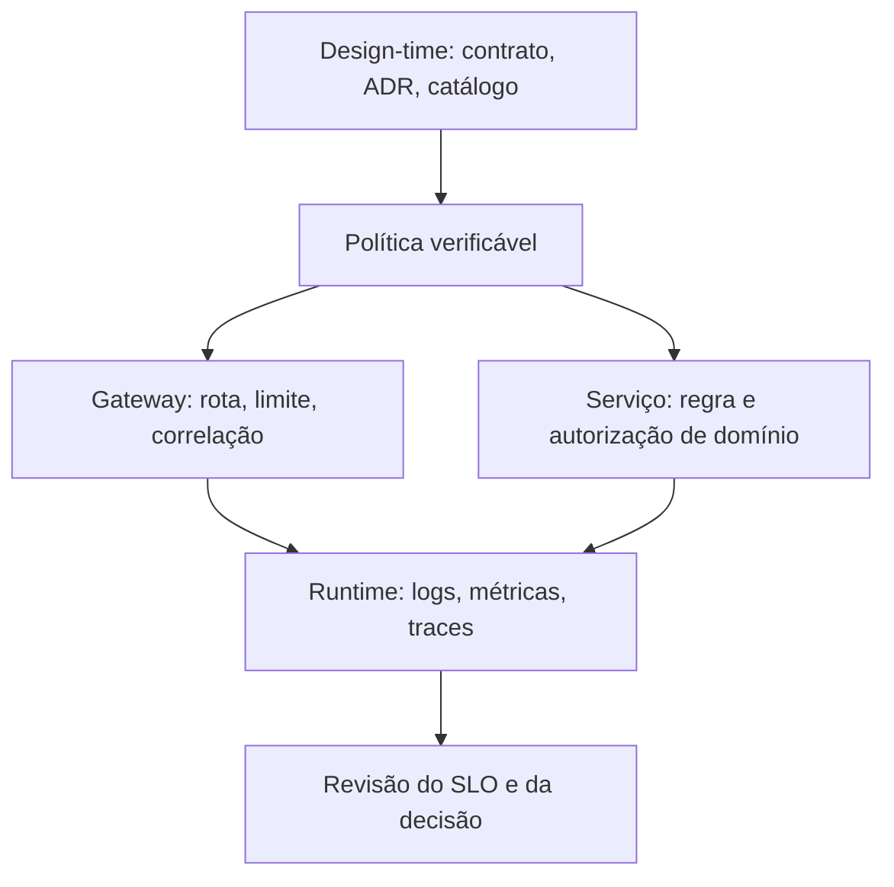
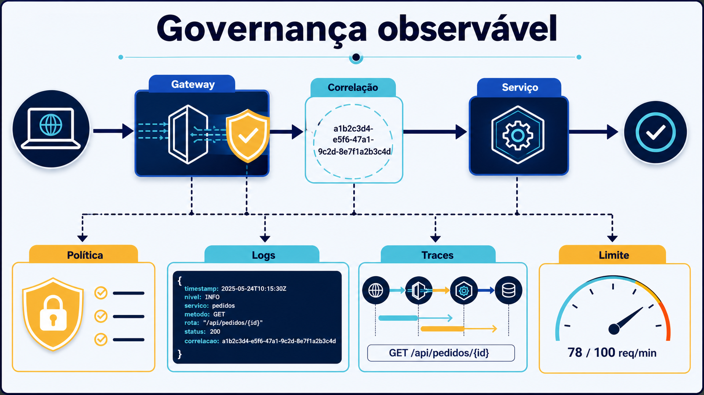

# Conceitos: decisões que podem ser conferidas

## Governança, não burocracia

Uma arquitetura distribuída cria decisões repetidas: quem publica uma API, quem pode alterá-la, quanto tráfego ela tolera, onde guardar evidência de erro e qual indisponibilidade é aceitável. **Governança** organiza essas decisões para que não dependam de memória individual. A forma mínima não é um comitê grande; é um acordo curto, acessível e verificável. Uma política de rota, por exemplo, deve ter escopo, motivação, proprietário, mecanismo e evidência. Se só existe em uma apresentação, ela não governa o comportamento em execução.

Há dois tempos complementares. Em **design-time**, equipes criam e revisam contratos, ADRs, convenções de versão, catálogo e ameaças. A pergunta é “o que será permitido e por quê?”. Em **runtime**, infraestrutura e código aplicam controles e emitem sinais. A pergunta é “o sistema fez o que foi decidido?”. Uma revisão de OpenAPI ou uma convenção de nomes pertence ao primeiro tempo; um `429` reproduzível e um trace consultável pertencem ao segundo. Um não substitui o outro: a observação sem intenção vira ruído, e a intenção sem evidência vira desejo. O **versionamento** liga os dois tempos: contrato publicado, consumidores avisados, período de depreciação e evidência de uso antes da retirada.

O catálogo de serviços evita que uma equipe descubra uma API por tentativa. Para cada capacidade, registre nome orientado ao negócio, dono, consumidores conhecidos, contrato publicado, versão, dados sob responsabilidade, canal de suporte, dependências e SLO. **Ownership** não significa que um time recebe culpa automática; significa que há alguém com autoridade e contexto para priorizar correção, evolução e retirada. Também informa quem aprova uma mudança incompatível e quem responde pelo dado.

## Política como hipótese executável

Uma política pode ser preventiva, detectiva ou corretiva. Um lint de contrato preventivo recusa uma forma proibida antes da entrega. Uma métrica detectiva mede respostas `5xx`. Um alerta corretivo inicia investigação, mas não “conserta” uma regra de domínio sem decisão explícita. O importante é declarar a ligação: política “limitar entrada pública” → configuração do Kong → teste que recebe `429` → métrica de recusas → revisão se consumidores legítimos forem afetados.

Versionamento é parte dessa ligação. Uma alteração compatível amplia um contrato sem invalidar clientes; uma incompatível exige versão, migração ou janela acordada. Registrar a versão não basta: o catálogo aponta consumidores, a política define depreciação e os logs mostram uso da versão antiga. Para dados de saúde, segurança também não se reduz a uma lista de tecnologia. Classifique o dado, aplique autenticação e autorização onde a fronteira exige, minimize dados nos logs e mantenha os segredos fora de arquivos públicos. O laboratório usa apenas nomes e senhas locais didáticas; não é modelo de credencial de produção.

**Mediação** é a aplicação de uma política comum entre consumidor e capacidade sem tomar a decisão de domínio. Um gateway pode mediar rota, identidade técnica, limite, cabeçalhos e propagação de contexto; um broker pode mediar entrega de mensagens. Nenhum deles decide, por si, se um plano está vencido ou se uma autorização clínica é válida. **Rastreabilidade** é a capacidade de reconstituir uma operação a partir de contrato, configuração, `correlation_id`, logs e trace, preservando a distinção entre uma prova observada e uma hipótese de causa.

**Texto alternativo:** contratos e ADRs definem política aplicada por gateway e serviço, com sinais usados para revisar o SLO.

*Figura 2 — Contrato, política e evidência em dois tempos. Fonte: curso.*

**Leitura textual:** contratos e catálogo orientam a política; gateway e serviço aplicam partes distintas e geram sinais para revisão.

## Quatro sinais, quatro perguntas

*Figura 5 — Política aplicada e evidência observável em execução. Fonte: curso.*

**Leitura textual da figura:** a requisição entra pelo gateway, onde uma política de rota ou limite é aplicada. O gateway acrescenta um identificador de correlação antes de encaminhar ao serviço. A execução produz logs estruturados e traces relacionados; a métrica de limite revela quantas requisições foram recusadas ou aceitas. Nenhum desses sinais deve conter nome de paciente ou outro dado clínico identificável.

**Logs** respondem “o que aconteceu neste evento?”. Eles precisam de tempo, severidade, serviço, operação, correlation ID e campos seguros. Um log estruturado permite filtrar falhas sem depender da frase humana. Não registre credenciais, documentos clínicos ou corpo integral por conveniência.

**Métricas** respondem “com que frequência e em que distribuição?”. Contadores de `429`, taxa de `5xx`, duração e saturação permitem ver tendência e calcular indicadores. Métrica com rótulos de cardinalidade ilimitada, como identificador de paciente, pode custar mais e dificultar consulta; use categorias estáveis.

**Traces** respondem “por onde esta operação passou e onde esperou?”. Um trace contém spans relacionados por contexto. O cabeçalho W3C `traceparent` carrega essa relação; o correlation ID é um identificador de busca compreensível entre logs e resposta. Eles são complementares: um pode existir sem o outro, mas, juntos, reduzem a ambiguidade da investigação.

Um **SLO** declara uma meta operacional baseada num indicador, como proporção de consultas de Elegibilidade concluídas abaixo de 300 ms em uma janela. Ele não é promessa de perfeição nem apenas uma linha de dashboard. Sua utilidade aparece quando orienta capacidade, alerta e decisão: se o orçamento de erro está sendo gasto, priorize confiabilidade antes de acrescentar tráfego ou novas dependências. Evite SLO que mede somente saúde de processo e ignora o resultado que o consumidor percebe.

## Equivalências em Java e .NET

Em Java, Spring Boot Actuator expõe sinais de aplicação e Micrometer pode produzir métricas e traces com OpenTelemetry; políticas de borda podem usar Kong, Spring Cloud Gateway ou um proxy escolhido pela organização. Em .NET, ASP.NET Core e `System.Diagnostics.Activity` integram contexto distribuído; OpenTelemetry .NET exporta para Collector e YARP pode ser uma opção de gateway programável. A equivalência é conceitual: mantenha o contrato, o ownership e as evidências, em vez de traduzir automaticamente cada biblioteca Python para outra plataforma.
