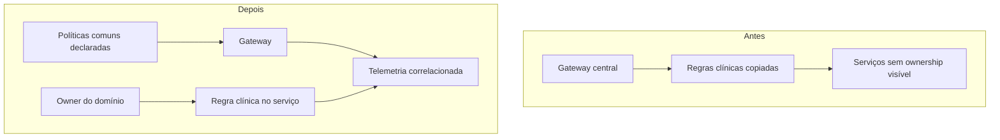

# Estudo de caso: governar sem criar uma central de bloqueio

A rede hospitalar Aurora cresceu de uma API única para oito serviços. Para “padronizar”, criou uma equipe de gateway que exigia abertura de solicitação para qualquer rota, cabeçalho e mudança de limite. O catálogo era uma planilha sem dono; a equipe de gateway passou a copiar regras de negócio como “exame de alto risco precisa de autorização” para scripts de proxy. Em incidentes, cada serviço registrava um identificador diferente e o dashboard só mostrava média de latência. A intenção era previsibilidade, mas o resultado foi fila, duplicação e investigação lenta.

O problema não é existir gateway. Roteamento, TLS, proteção de volume, autenticação técnica e correlação são candidatas fortes a uma política comum. O problema é confundir centralização de plataforma com centralização de conhecimento. A regra de exame depende do estado de autorização, de exceções clínicas e de evolução do vocabulário; deve ser propriedade de uma capacidade de domínio. Quando está no proxy, a equipe responsável pelo domínio precisa negociar uma alteração de código que não controla, enquanto o proxy passa a conhecer informações que não deveria interpretar.

O primeiro diagnóstico separou decisões. Cada serviço ganhou entrada de catálogo com proprietário, contrato, consumidores, classificação de dados, dependências e SLO candidato. A plataforma publicou um modelo declarativo de gateway, revisado por pull request, com rota, autenticação técnica, correlação, limite e exportação OTLP. A capacidade Autorização recebeu uma política explícita de domínio e testes no próprio repositório. O objetivo não era apagar todas as aprovações, mas tornar clara a autoridade: plataforma aprova compatibilidade e segurança de borda; dono do serviço aprova semântica do recurso; consumidores são avisados de mudança incompatível.

## Da presunção à evidência

O incidente mais recorrente dizia “a API está lenta”. O novo painel separou duração no gateway, duração no serviço e respostas por classe. Logs estruturados receberam `correlation.id`, serviço e operação, sem registrar prontuário. Traces passaram a conter gateway, Autorização e o adaptador externo. O SLO de Autorização foi definido como sucesso de decisões válidas em uma janela, com indicador e orçamento de erro visíveis. A média de latência deixou de ocultar a cauda: poucas chamadas muito lentas importavam porque bloqueavam atendimento.

**Leitura textual da figura:** antes, um gateway central acumulava regras clínicas e os serviços não mostravam ownership. Depois, políticas comuns ficam declaradas no gateway, regras clínicas ficam com o responsável pelo domínio e ambos enviam telemetria correlacionada.

## Decisões avaliadas

A Aurora considerou limitar por IP, usuário autenticado ou aplicação cliente. IP é simples para uma oficina, mas pode agrupar muitos usuários atrás de um proxy. Usuário pode ser mais justo, mas exige autenticação confiável; aplicação cliente exige credencial e rotação. A política inicial adotou uma chave por aplicação em rotas autenticadas e IP para entrada anônima, documentando consequências. Também separou limite de proteção de quota contratual: quota exige contexto de produto e ciclo de cobrança; não deve ser fingida por uma configuração de segundos.

Para versionamento, o catálogo passou a marcar a versão ativa e a fase de retirada. Uma mudança que remove campo não era liberada apenas porque o gateway conseguia rotear. A equipe observava uso da versão anterior, comunicava data e mantinha uma janela. A telemetria não decide quando remover sozinha, mas produz evidência para conversa com consumidores.

## Aprendizados transferíveis

Governança leve consegue acelerar quando transforma ambiguidades em padrões fáceis de usar. Um template de serviço, uma rota declarativa e um teste de trace reduzem trabalho repetido. Ela se torna pesada quando pede uma aprovação para detalhes sem risco ou quando substitui dono do domínio. A revisão periódica deve perguntar: a política ainda protege um risco real? quem sofre com uma falsa recusa? o sinal mede a experiência que importa? há dados pessoais em logs? quem pode alterar e como a mudança é revertida?

O laboratório é deliberadamente pequeno. Não demonstra gestão de identidades corporativa, alta disponibilidade do Collector, retenção legal, multi-região nem limite distribuído. Ele demonstra uma cadeia curta onde a decisão, a configuração e a evidência podem ser lidas juntas. Esse é um alicerce honesto para discutir as escolhas mais complexas.

## Equivalências em Java e .NET

Uma organização Java pode registrar metadados no catálogo e testar políticas com Spring Boot Test, Testcontainers e chamadas HTTP reais. Uma organização .NET pode combinar ASP.NET Core, OpenTelemetry e testes de integração com `WebApplicationFactory`; YARP pode ler rotas de arquivo ou configuração versionada. Em ambas, o controle de entrada não deve absorver regras que exigem o modelo clínico. A evidência precisa continuar sendo reproduzível por código e por API, não por memória de uma pessoa.
