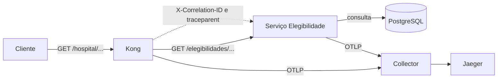

# Exemplo arquitetural: uma consulta que deixa evidências

Considere a consulta `GET /hospital/elegibilidades/{beneficiario_id}`. O endereço público contém `/hospital` para identificar a entrada governada; o serviço mantém o contrato interno `/elegibilidades/{beneficiario_id}`. A separação evita fazer o consumidor depender do nome de rede de um contêiner. Ela não transforma o Kong em dono de Elegibilidade. O catálogo registra que o serviço é responsável por regra, banco, contrato e SLO da capacidade; a plataforma é responsável pela política comum de entrada.

Antes da requisição, a configuração declarativa fixa quatro componentes. PostgreSQL contém dado sintético de Elegibilidade numa rede interna. O processo FastAPI acessa só essa rede de banco e expõe saúde e consulta na rede de aplicação. Kong alcança o serviço pela rede de aplicação, mas não alcança PostgreSQL. Collector e Jaeger também ficam na rede de aplicação, pois recebem telemetria dos dois processos. Essa topologia preserva a fronteira física introduzida no módulo anterior: acrescentar observabilidade não dá ao gateway permissão para ler dados diretamente.

Quando chega a chamada, Kong avalia a rota e as políticas. A política de correlação usa `X-Correlation-ID` já fornecido ou cria UUID. A política de limite conta a origem durante uma janela de um segundo e aceita as três primeiras chamadas; a seguinte recebe `429`. A política OpenTelemetry extrai `traceparent`, cria span `kong-gateway` e encaminha o contexto. Elegibilidade extrai o mesmo contexto, registra span filho, inclui o correlation ID como atributo seguro e responde. O cabeçalho de correlação volta ao consumidor mesmo que ele não tenha enviado um.

O Collector não é um banco de observabilidade. Ele recebe OTLP, aplica processamento em lote e exporta ao Jaeger. Essa separação permite alterar destino ou filtros sem reescrever serviço. Jaeger agrupa spans pelo trace ID. Na oficina, o teste cria um trace ID conhecido, chama o gateway e consulta `/api/traces/{traceId}` até encontrar o trace. Depois confirma que há processos `kong-gateway` e `elegibilidade`; assim a evidência inclui a borda e o serviço, não apenas um log de proxy.

**Leitura textual da figura:** o cliente chama Kong; Kong remove o prefixo público e encaminha ao serviço. Apenas Elegibilidade consulta PostgreSQL. Kong e serviço enviam telemetria ao Collector, que exporta ao Jaeger; correlation ID e traceparent acompanham a chamada entre Kong e serviço.

## O que cada evidência permite afirmar

Uma resposta `200` direta em `http://localhost:18001/elegibilidades/{beneficiario_id}` demonstra que o serviço e dado didático estão disponíveis. A mesma consulta em `http://localhost:18000/hospital/elegibilidades/{beneficiario_id}` demonstra roteamento pelo gateway. Um cabeçalho `X-Correlation-ID` demonstra a política de correlação naquela resposta, não que o registro futuro está bem estruturado. Um `429` controlado demonstra proteção de tráfego para aquela chave e janela, não capacidade global em muitas réplicas. O trace com dois processos demonstra propagação nesta rota, não que cada dependência futura já esteja instrumentada.

Essa precisão é essencial para SLO. Suponha meta de 99,5% de consultas válidas concluídas em menos de 300 ms por 28 dias. Defina “válida”, fonte dos tempos, exclusões e dono antes de publicar o número. Um `429` pode ser sucesso da proteção, mas falha da experiência de um consumidor que foi mal configurado; métricas precisam separar essa classe. Uma chamada que passou pelo gateway e falhou no banco pode ter trace completo e, mesmo assim, não satisfazer o objetivo do usuário.

## Mudança segura de política

Para elevar o limite local de três para cinco, altere somente `second: 3` para `second: 5` em `infra/kong/kong.yml`, revise o diff e reinicie `kong`. O modo DB-less lê a configuração na inicialização. Em seguida, repita a chamada nominal, envie seis chamadas no mesmo segundo e guarde a resposta que contém `429`. Não edite configuração dentro do contêiner: ela seria efêmera e não revisável. Também não use o painel do Jaeger como única confirmação; a API de trace dá um artefato repetível.

## Falhas e decisões pendentes

Se Kong estiver saudável e o serviço responder `503`, a política de borda funcionou, mas a capacidade não. Se Collector estiver ausente, a rota pode continuar respondendo; traces ficam indisponíveis e essa perda deve ser detectada por monitoramento do pipeline. Se Jaeger receber apenas o span do gateway, a propagação no serviço precisa ser investigada: cabeçalho, inicialização do SDK ou exportador podem estar ausentes. A reação não é acrescentar regra clínica no proxy; é localizar o componente que violou a política declarada.

## Equivalências em Java e .NET

Num serviço Java, um filtro Spring ou a instrumentação OpenTelemetry cria spans HTTP e propaga W3C Trace Context; o Collector e Jaeger permanecem os mesmos. Em ASP.NET Core, middleware e `ActivitySource` oferecem uma integração equivalente, e um `DelegatingHandler` propaga contexto em chamadas de saída. Kong continua sendo uma escolha de borda independente da linguagem. Se a organização escolher Spring Cloud Gateway ou YARP, deve manter a mesma pergunta: qual política é comum de borda e qual é regra de serviço?
