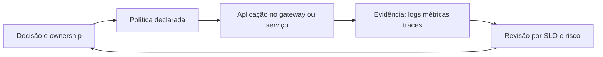

# Governança de Serviços

**Encontro:** 4 de 6

Governança é o conjunto de decisões, responsabilidades e **políticas verificáveis** que torna uma arquitetura repetível sem congelá-la. Não é uma reunião, uma ferramenta ou uma camada que alguém aprova de vez em quando. Ela transforma contrato, ownership, fronteira e evidência em mecanismos que podem ser revisados. Uma política útil informa a intenção, o responsável, o local de aplicação, a evidência e a condição de revisão. Por exemplo: “toda chamada pública recebe um `X-Correlation-ID`; o gateway limita três chamadas por segundo por origem; o trace chega ao Jaeger”. Cada parte pode ser conferida por configuração, chamada HTTP ou consulta de telemetria.

No caso hospitalar, Elegibilidade já é um serviço com dado próprio. Agora ele precisa oferecer uma entrada pública previsível e uma trilha de operação. O [Kong](https://docs.konghq.com/gateway/latest/) encaminhará a rota `/hospital/elegibilidades`, atribuirá correlation ID quando necessário e aplicará rate limiting. O [OpenTelemetry](https://opentelemetry.io/docs/) transportará o contexto do trace ao Collector, e o [Jaeger](https://www.jaegertracing.io/docs/) permitirá consultar a evidência. São implementações locais da política no laboratório, e não sinônimos de governança: a mesma política pode sobreviver a outra tecnologia de mediação. O desenho não desloca decisão clínica para infraestrutura: uma regra como “beneficiário está elegível” continua pertencendo ao serviço e ao domínio.

## Pergunta orientadora

Como fazer uma decisão arquitetural permanecer compreensível, observável e revisável quando mais de uma equipe a utiliza?

Ao final, você será capaz de distinguir governança em design-time de governança em runtime, manter catálogo, ownership e versionamento, posicionar políticas de segurança e limite, e relacionar logs, métricas, traces e SLO a perguntas operacionais. Também executará uma configuração DB-less: sem console proprietário e sem estado configurado manualmente.

## Percurso de aprendizagem

1. Em [Conceitos](conceitos.md), definimos política, catálogo, ownership e sinais de operação.
2. Em [Padrões e decisões](padroes-e-decisoes.md), separamos controles de gateway de regras de serviço e domínio.
3. Em [Exemplo arquitetural](exemplo-arquitetural.md), seguimos uma consulta por correlação e trace.
4. Em [Estudo de caso](estudo-de-caso.md), corrigimos governança que criou centralização improdutiva.
5. Na [Oficina de ferramentas](oficina-de-ferramentas.md), usamos Kong, Collector e Jaeger localmente.
6. Em [Exercícios](exercicios.md), aplicamos os níveis da Taxonomia de Bloom a decisões auditáveis.
7. Em [Síntese e referências](sintese-e-referencias.md), consolidamos perguntas de revisão e fontes públicas.

**Texto alternativo:** ciclo de governança que transforma decisão com owner em política, aplicação e evidência para revisão.

*Figura 1 — Ciclo de uma política governável.*

**Leitura textual:** uma decisão com responsável vira política declarada, aplicada no lugar adequado; os sinais permitem revisar a decisão.

## Limite deliberado

O gateway é uma entrada técnica: roteia, autentica tecnicamente, limita tráfego, propaga contexto e padroniza observabilidade. Ele não conhece exceções clínicas, não decide elegibilidade, não transforma modelos de parceiros em segredo nem substitui ownership. Uma regra de domínio escondida no gateway fica difícil de testar junto do seu vocabulário e tende a ser alterada por quem não é responsável pela capacidade. Governança madura torna esta fronteira explícita em vez de concentrar toda decisão na borda.
