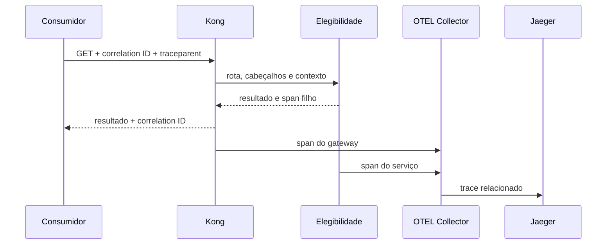

# Padrões e decisões: onde a política deve morar

## Gateway como borda técnica

O API gateway concentra controles que são iguais para várias entradas: roteamento, terminação TLS, autenticação técnica, cabeçalhos de segurança, correlation ID, rate limiting e telemetria. Essa mediação diminui duplicação e oferece uma superfície observável. Ela não elimina o serviço como autoridade. O serviço ainda valida dados, autoriza ações no contexto do domínio, aplica invariantes, escolhe persistência e comunica estados de negócio. “Limitar três chamadas por segundo por IP” é política de proteção de entrada; “um beneficiário não pode usar um plano vencido” é política de domínio.

Uma heurística ajuda: se a regra precisa do vocabulário, do estado ou da exceção de uma capacidade, ela pertence ao serviço que possui essa capacidade. Se a regra é independente do recurso e protege uma borda comum, o gateway é candidato. Algumas decisões atravessam os dois: autenticação técnica pode ocorrer no gateway, enquanto autorização para visualizar um resultado específico precisa do serviço. Documente ambas as partes e o comportamento de falha para não criar uma lacuna entre elas.

No laboratório, `kong.yml` é a fonte de verdade. Kong inicia em modo DB-less com `KONG_DATABASE=off`, recebe o arquivo copiado na imagem didática e não depende de painel. A rota remove o prefixo `/hospital` antes de encaminhar para Elegibilidade. O plugin `correlation-id` preserva ou gera `X-Correlation-ID` e o devolve ao consumidor. O plugin `rate-limiting`, com política local e limite de três por segundo, responde `429 Too Many Requests` antes de sobrecarregar o serviço. Em produção, escolha chave de limite, armazenamento e janela com base em consumidores, topologia e ataque esperado; local não coordena múltiplas réplicas.

## Correlação, rastreabilidade e rastreamento distribuído

Correlation ID é um identificador estável da operação para pessoas e sistemas de log. O consumidor pode enviá-lo; se não enviar, a borda gera um UUID. A resposta o ecoa e o gateway o propaga a montante. Não use identificador de paciente como correlation ID: ele revela dado e gera cardinalidade inadequada. Um UUID sem semântica é suficiente.

O `traceparent` não substitui essa correlação. Ele descreve a árvore de execução: versão, trace ID, span pai e sinalizadores. Kong extrai esse contexto, cria um span de gateway e encaminha o cabeçalho. A aplicação cria um span filho e envia ambos por OTLP HTTP ao OpenTelemetry Collector. O Collector recebe, processa em lote e exporta ao Jaeger. A consulta `GET /api/traces/{traceId}` é uma evidência automatizável, preferível a afirmar que “apareceu na tela”. A interface do Jaeger serve para explorar; a API documentada sustenta teste. Essa cadeia produz rastreabilidade: alguém consegue relacionar uma decisão publicada, a configuração que a media e os sinais de uma execução sem inferir que qualquer ferramenta é a decisão em si.

**Texto alternativo:** sequência de uma requisição em que Kong propaga correlação e trace ao serviço, e ambos enviam spans ao Collector e Jaeger.

*Figura 3 — Correlação e rastreabilidade por trace distribuído. Fonte: curso.*

**Leitura textual:** consumidor, gateway e serviço compartilham contexto; os spans chegam ao Collector e são consultáveis no Jaeger.

## Limites, segurança e custo operacional

Rate limiting é uma proteção, não uma autorização. Ele reduz abuso e impede que uma origem consuma toda capacidade, mas não decide se uma pessoa tem direito a um recurso. Devolva `429` de forma explícita, com cabeçalhos de limite quando apropriado, para que cliente possa reduzir ritmo. Não esconda o erro como `500`, nem configure um limite tão baixo que o fluxo normal se torne aleatório. Um teste controlado precisa declarar a janela e enviar mais chamadas que o limiar.

Logs, métricas e traces também têm custo e risco. Defina retenção, amostragem, acesso e campos permitidos. Uma investigação pode começar pelo correlation ID no log, verificar aumento de `429` na métrica e abrir o trace com a mesma operação. Esse encadeamento deve ser ensinado junto de SLO: se a rota atende a latência mas recusa consumidores legítimos, o indicador isolado não descreve qualidade. Escolha indicadores de sucesso, disponibilidade e proteção de acordo com o objetivo do recurso.

## Registro de decisão enxuto

Para cada política, registre contexto, alternativa, decisão, consequência e gatilho de revisão. A decisão do laboratório é “usar Kong DB-less para políticas públicas locais”. A alternativa de configurar por API administrativa foi rejeitada para a oficina porque esconderia estado fora do repositório. A consequência é reiniciar Kong após editar arquivo; o gatilho de revisão é necessidade de mudança coordenada em múltiplas instâncias. Esse texto torna explícito o que o Compose faz e, principalmente, o que ele ainda não prova.
