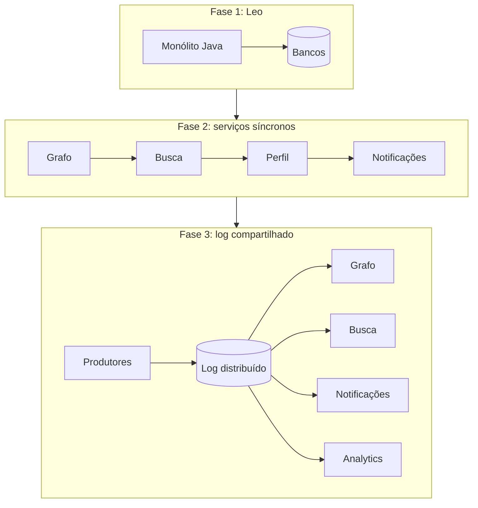

# LinkedIn: matar o Leo, congelar o produto e inventar o Kafka

O LinkedIn é a rede social profissional fundada em 2003, hoje usada por profissionais do mundo inteiro para networking, vagas e conteúdo de carreira. Este caso acompanha a infraestrutura de eventos que a empresa precisou inventar para sobreviver ao próprio crescimento: o Apache Kafka, hoje uma das peças mais usadas em arquitetura orientada a eventos do mercado, e o assunto deste módulo.

Em 2011, a engenharia do LinkedIn tomou uma decisão que quase nenhuma empresa consegue tomar: parou de construir funcionalidades. A pausa valeu para a organização de engenharia inteira, e durou o tempo necessário para arrumar a casa.

A iniciativa se chamou **Inversion**. Para entender por que foi necessária, é preciso voltar oito anos e conhecer o Leo.

## 2003: 2.700 pessoas na primeira semana

O LinkedIn entrou no ar em 2003 e reuniu 2.700 membros nos primeiros sete dias. O sistema que sustentava isso era uma aplicação Java monolítica com nome próprio: **Leo**. Ele servia as páginas, executava as regras de negócio e falava diretamente com um punhado de bancos de dados.

Funcionou por anos. Depois deixou de funcionar, e o relato de engenharia da empresa é direto sobre os sintomas: Leo caía com frequência em produção, era difícil de diagnosticar e difícil de liberar.

Existe uma pressão de fundo nesse crescimento que interessa especificamente a este módulo, e ela não é sobre volume de acessos. É sobre **formato do trabalho**. Uma ação simples de um membro precisa ser reagida por vários subsistemas independentes: o grafo social recalcula caminhos, a busca reindexa o perfil, as notificações são geradas, a telemetria é coletada. Cada consumidor novo de um evento que já existia exigia mais uma integração amarrada diretamente à origem.

## "Kill Leo"

A iniciativa de decomposição recebeu esse nome dentro da empresa, e ele diz muito sobre o clima.

O primeiro serviço extraído foi o de grafo de conexões, comunicando-se por RPC em Java. Depois vieram busca, perfil, comunicações e grupos. Em 2010 já existiam mais de 150 serviços. O mesmo relato registra mais de 750 posteriormente.

E aí o LinkedIn descobriu o que muita gente descobriria na década seguinte. O acoplamento não tinha sido eliminado. Tinha mudado de natureza.

Uma requisição de página passou a depender de uma cadeia de chamadas síncronas atravessando muitos serviços. Cada elo somava latência ao total. Cada elo podia falhar e derrubar a resposta inteira. A empresa trocou um monólito que caía por um conjunto de serviços cuja disponibilidade combinada era pior que a de qualquer um deles isolado.

## Fim de 2011: o Inversion

Foi nesse contexto que veio a decisão mais difícil de vender internamente.

O LinkedIn suspendeu o desenvolvimento de funcionalidades e dedicou a organização de engenharia a ferramental, implantação e produtividade de desenvolvimento. Uma empresa de capital aberto, em crescimento acelerado e sob concorrência, parou de entregar produto para consertar a fundação.

Vale registrar o que esse tipo de decisão exige de quem a propõe. Não existe métrica de produto que a justifique no trimestre. O argumento é que a velocidade de entrega já estava próxima de zero e ninguém tinha percebido, porque o custo estava distribuído em atrito diário em vez de concentrado numa parada visível.

Na mesma fase, o RPC Java inconsistente foi substituído pelo **Rest.li**, um contrato JSON sobre HTTP. O relato descreve mais de 975 recursos e cerca de 100 bilhões de chamadas por dia sobre esse padrão.

## Rest.li não resolveu a cadeia síncrona

O Rest.li deixou as chamadas consistentes e não mudou o fato de que eram chamadas. A cadeia síncrona continuava sendo cadeia síncrona, e o padrão de trabalho continuava sendo um fato de negócio que muitos subsistemas precisavam conhecer.

Enquanto isso, a empresa acumulava tubulações de dados construídas caso a caso. Cada par de sistemas que precisava trocar informação ganhava a própria integração, com o próprio formato, a própria semântica de falha e o próprio dono.

**Texto alternativo:** três fases da arquitetura do LinkedIn. Na primeira, o monólito Leo fala com bancos de dados. Na segunda, serviços encadeados chamam uns aos outros em sequência. Na terceira, produtores escrevem em um log distribuído e quatro consumidores independentes leem dele.

*Figura 1 — Da cadeia síncrona ao log compartilhado. Fonte: curso, a partir do relato de engenharia do LinkedIn.*

**Leitura textual:** a primeira fase concentra tudo em um processo com acesso direto aos bancos. A segunda separa responsabilidades e mantém a dependência de tempo, porque cada serviço espera a resposta do seguinte para concluir a requisição. A terceira interrompe essa espera: o produtor escreve o fato uma vez no log e cada consumidor lê no próprio ritmo, sem que o produtor conheça a existência dele.

## 2011: o Kafka

Jay Kreps, Neha Narkhede e Jun Rao apresentaram no workshop NetDB, em 2011, o desenho de um sistema construído dentro do LinkedIn para resolver isso. Foi aberto para a comunidade e virou o Apache Kafka.

A escolha de projeto que importa não é "adotar mensageria". É a natureza do artefato. Kafka é um registro sequencial imutável, particionado e replicado, com retenção configurável, em que **ler não consome a mensagem**.

Essa última propriedade muda três coisas de uma vez.

O produtor deixa de conhecer os consumidores. Ele escreve o fato e termina o trabalho, sem saber quantos sistemas vão reagir nem quando.

Um consumidor novo pode ser plugado meses depois e reprocessar o histórico retido, sem pedir nada a ninguém. A integração que antes exigia mexer na origem passa a exigir apenas uma inscrição.

E um consumidor lento deixa de pressionar o produtor, porque a espera vira armazenamento em disco em vez de fila na origem.

A unidade de paralelismo é a partição, e a ordem é garantida dentro dela. Essa é a restrição trabalhada em [ordem e chave de particionamento](padroes-e-decisoes.md#ordem-qual-ordem-para-qual-chave): escolher a chave errada destrói a ordem que o negócio precisava, e nenhuma configuração posterior recupera isso.

## As três escolhas técnicas que tornaram o disco rápido o bastante

O próprio paper de 2011 registra a escala que já preocupava a equipe: *"hundreds of gigabytes of data and close to a billion messages per day"*, quase um bilhão de mensagens por dia. É uma fração pequena do que a mesma equipe reportaria menos de uma década depois, mas o volume já bastava para expor os limites de uma fila que não fosse desenhada em torno do disco sequencial.

Vale uma pausa para quem não vem de sistemas operacionais. Em 2011, o padrão de armazenamento ainda era o disco rígido mecânico, com um braço físico que se move para ler ou escrever cada dado. Pedir posições espalhadas pelo disco, numa ordem aleatória, faz esse braço saltar de um lado para o outro sem parar. Pedir posições vizinhas, em sequência, deixa o braço andar sempre no mesmo sentido. A diferença de velocidade entre as duas formas de acesso pode passar de cem vezes no mesmo disco físico. As três escolhas abaixo existem para manter Kafka do lado sequencial dessa conta, o tempo inteiro.

1. **Armazenamento sequencial.** Cada partição é um log físico: um conjunto de arquivos de segmento de tamanho fixo, cerca de 1 GB cada segundo o paper. O broker só escreve no final do último segmento, nunca no meio de um arquivo, o que já garante escrita sequencial. Na leitura, a mensagem não carrega um identificador próprio que precise ser procurado num índice: ela é localizada pelo seu deslocamento em bytes dentro do arquivo, chamado *offset*. Sem índice para consultar, não há salto aleatório à procura de uma mensagem específica; o consumidor apenas continua lendo de onde parou.

2. **Delegar o cache ao sistema operacional.** Qualquer sistema operacional reserva parte da memória RAM livre para guardar cópias recentes de dados lidos ou escritos em disco, de forma automática; essa área chama-se *page cache*, e nenhum programa precisa pedir por ela. Kafka decidiu não manter as próprias mensagens em memória dentro do processo Java (a JVM): delega isso inteiramente ao page cache do sistema operacional. A razão é dupla. Guardar uma cópia própria além da que o sistema operacional já guarda seria desperdiçar memória com duas cópias do mesmo dado. E o coletor de lixo da JVM (a rotina que a linguagem Java usa para liberar memória não utilizada) não precisaria vasculhar gigabytes de mensagens à procura do que pode descartar, o que pausaria o programa por instantes a cada execução. Um efeito colateral favorável: quando um broker reinicia, o page cache continua quente, porque pertence ao sistema operacional, não ao processo que caiu.

3. **Zero-copy.** Enviar um dado do disco para a rede, do jeito ingênuo, custa quatro cópias de memória e duas *chamadas de sistema* (uma chamada de sistema, ou *syscall*, é um pedido que um programa faz ao núcleo do sistema operacional para executar algo que só ele pode fazer, como ler um arquivo ou falar com a placa de rede; cada uma consome tempo de processamento). O caminho ingênuo é: ler do disco para o page cache, copiar do page cache para um buffer do programa, copiar de volta para um buffer do núcleo, e daí para a placa de rede — quatro cópias, duas travessias entre o programa e o núcleo. A chamada `sendfile`, disponível em Linux, pede ao núcleo para mandar os bytes direto de um arquivo para um canal de rede, sem passar pelo programa no meio do caminho, eliminando duas dessas cópias e uma dessas chamadas. Kafka usa exatamente essa chamada para entregar um segmento de log a um consumidor.

Uma quarta decisão, menos técnica e mais organizacional, também aparece no paper: o modelo de consumo é por *pull*. Em vez do broker empurrar mensagens no ritmo que escolhe, cada consumidor pede o que consegue processar, no próprio ritmo. Isso evita que um consumidor lento seja inundado. Como efeito colateral, o consumidor pode rebobinar e reler uma faixa antiga do log sempre que precisar, algo que um modelo de broker empurrando dados dificulta.

O paper documenta o resultado dessas escolhas contra sistemas concorrentes da época. Publicando 10 milhões de mensagens de 200 bytes cada, um produtor Kafka com lotes de 50 mensagens sustentou entre 50 mil e 400 mil mensagens por segundo, contra a faixa de 5 mil a 6 mil de ActiveMQ 5.4 e RabbitMQ 2.4 — pelo menos duas ordens de grandeza de distância. Do lado do consumo, Kafka sustentou 22.000 mensagens por segundo, mais de quatro vezes o observado nos outros dois sistemas. Parte da diferença veio do overhead de mensagem: 9 bytes por mensagem em Kafka contra 144 bytes em ActiveMQ, boa parte do cabeçalho exigido pela especificação JMS.

Uma peça está ausente dessa primeira versão: replicação. O paper de 2011 lista, como trabalho futuro, adicionar redundância entre múltiplos brokers. Sem ela, perder o disco de um broker perdia para sempre qualquer mensagem não consumida daquela partição. O mecanismo que resolve isso chegou nas versões seguintes: um líder por partição escreve primeiro, e um conjunto de réplicas em sincronia (ISR, *in-sync replica set*) confirma a cópia antes que o líder reconheça a escrita ao produtor. É essa peça, ausente em 2011, que sustenta hoje a tolerância a falha dos mais de 4.000 brokers citados na escala do LinkedIn.

## Clusters locais e agregadores

A publicação oficial de engenharia sobre a customização do Kafka afirma: *"We maintain over 100 Kafka clusters with more than 4,000 brokers, which serve more than 100,000 topics and 7 million partitions"*, processando mais de 7 trilhões de mensagens por dia. Em números redondos: mais de cem *clusters*, quatro mil *brokers*, cem mil tópicos e sete milhões de partições.

Ler esse número como troféu desperdiça o caso. O que ele revela é uma decisão de topologia que quase nunca aparece nos resumos.

O texto "Running Kafka At Scale", também publicado pela engenharia do LinkedIn, descreve o desenho em duas camadas. Para cada categoria de mensagem existe um *cluster* **local**, um conjunto de servidores Kafka que contém o que foi produzido naquele datacenter, e um *cluster* **agregador**, que combina as mensagens de todos os *clusters* locais daquela categoria. A cópia de um para o outro é feita por espelhamento.

A razão é contenção de domínio de falha e controle do tráfego entre datacenters. Um *cluster* único dessa dimensão transformaria qualquer incidente local em incidente global.

## Cruise Control, Brooklin e Bean Counter: o ferramental que a operação exigiu

Operar Kafka nessa escala exigiu construir ferramental que não existia. A publicação oficial cita três peças abertas depois: o **Cruise Control**, para manutenção e recuperação automática do *cluster*; o **Brooklin**, para espelhamento entre *clusters*; e o **Bean Counter**, para auditoria de completude dos fluxos.

Essa é a parte que uma equipe pequena precisa levar a sério. A adoção do Kafka **move** trabalho. Sai a coordenação de chamadas síncronas e entra a operação de um sistema de armazenamento distribuído, com particionamento, replicação, atraso de consumo e evolução de esquema. Este módulo trata a contraparte disso em [esquema, compatibilidade e evolução](padroes-e-decisoes.md#esquema-compatibilidade-e-evolucao) e em [dead-letter queue](padroes-e-decisoes.md#dead-letter-queue-como-evidencia-nao-deposito).

Kafka resolveu disseminação de um mesmo fato para muitos consumidores independentes. Se um sistema tem dois consumidores e uma integração direta que funciona, este caso não é argumento a favor de trocar. A [matriz de perguntas](padroes-e-decisoes.md#rabbitmq-kafka-ou-activemq-matriz-de-perguntas) existe para essa comparação.

## Questões para discussão

Releia o caso com a lente do arquiteto. As questões abaixo pedem recuperar os fatos, explicar os mecanismos e comparar as escolhas descritas no próprio caso.

**1.** A página descreve três fases da arquitetura do LinkedIn. Nomeie cada fase e diga o que caracterizava a comunicação entre as partes em cada uma.

**2.** Explique por que uma cadeia de chamadas síncronas entre muitos serviços produz disponibilidade combinada pior que a de qualquer serviço isolado.

**3.** A propriedade central do Kafka é que ler não consome a mensagem. Explique as três consequências que o caso deriva dessa propriedade.

**4.** Compare um agrupamento local e um agregador quanto à origem das mensagens que cada um recebe e quanto ao domínio de falha que cada um delimita.

**5.** Compare o trabalho operacional da equipe antes e depois da adoção do Kafka, citando o ferramental que a empresa precisou construir.

**6.** O paper de 2011 lista replicação como trabalho futuro, não como recurso já entregue. Explique por que essa lacuna era aceitável para o caso de uso original do LinkedIn e o que o mecanismo de ISR, criado depois, muda para quem opera um cluster hoje.

## Fontes

- Jay Kreps, Neha Narkhede e Jun Rao, [Kafka: a Distributed Messaging System for Log Processing](https://notes.stephenholiday.com/Kafka.pdf) — artigo apresentado no NetDB Workshop em 2011, com a motivação e o desenho do log distribuído.
- LinkedIn Engineering, [How LinkedIn customizes Apache Kafka for 7 trillion messages per day](https://www.linkedin.com/blog/engineering/open-source/apache-kafka-trillion-messages) — origem dos números de *clusters*, *brokers*, tópicos e partições, e do ferramental aberto.
- LinkedIn Engineering, [Running Kafka At Scale](https://engineering.linkedin.com/kafka/running-kafka-scale) — descrição oficial dos agrupamentos locais e agregadores.
- Josh Clemm, **A Brief History of Scaling LinkedIn** — relato oficial de engenharia sobre Leo, a iniciativa "Kill Leo", o Rest.li e o Inversion. O LinkedIn retirou a página do ar; use a [cópia arquivada](https://web.archive.org/web/20260516082245/https://engineering.linkedin.com/architecture/brief-history-scaling-linkedin) ou a [versão mantida pelo autor](https://joshclemm.com/writing/a-brief-history-of-scaling-linkedin/).
- Jay Kreps, [The Log: What every software engineer should know about real-time data's unifying abstraction](https://engineering.linkedin.com/distributed-systems/log-what-every-software-engineer-should-know-about-real-time-datas-unifying) — o argumento conceitual do log como abstração de integração.
- Apache Kafka, [documentação oficial](https://kafka.apache.org/documentation/) — semântica de entrega, partições, grupos de consumo e retenção; a seção de design documenta o líder por partição e o conjunto de réplicas em sincronia (ISR) que substituiu, nas versões seguintes, a ausência de replicação relatada no paper original.
- LinkedIn, [Cruise Control](https://github.com/linkedin/cruise-control) e [Brooklin](https://github.com/linkedin/brooklin) — repositórios do ferramental de operação citado.
