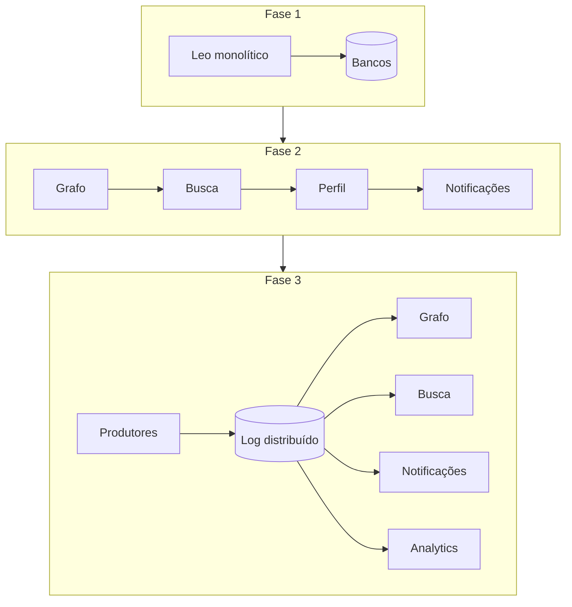

# Casos reais: LinkedIn e o log distribuído

O [estudo de caso deste módulo](estudo-de-caso.md) trabalha colaboração assíncrona no laboratório hospitalar, com volumes que uma equipe pequena consegue observar. Esta página traz a origem do Apache Kafka. Leia antes o [protocolo de leitura de caso público](../referencia/como-ler-um-caso-publico.md).

O LinkedIn é o caso mais útil da disciplina por uma razão específica: a empresa documentou não apenas a arquitetura final, mas as duas arquiteturas intermediárias que não bastaram. A maioria dos relatos públicos apaga o caminho e apresenta só o destino.

## A restrição

O LinkedIn nasceu em 2003 e reuniu 2.700 membros na primeira semana. O sistema era uma aplicação monolítica Java conhecida internamente como Leo, que servia as páginas, executava as regras de negócio e falava com um punhado de bancos de dados.

O relato de engenharia registra que Leo caía com frequência em produção, era difícil de diagnosticar e difícil de liberar.

A pressão de fundo tem uma forma que interessa a este módulo. Uma ação simples de um membro precisa ser reagida por vários subsistemas independentes: o grafo social recalcula caminhos, a busca reindexa o perfil, as notificações são geradas, a telemetria é coletada. Cada novo consumidor de um evento existente exigia mais uma integração ligada diretamente à origem.

## A primeira resposta, que não bastou

O LinkedIn decompôs o monólito. A iniciativa recebeu o nome de "Kill Leo". O primeiro serviço extraído foi o de grafo de conexões, comunicando-se por RPC em Java, seguido de busca, perfil, comunicações e grupos. Em 2010 já existiam mais de 150 serviços, e o mesmo relato registra mais de 750 posteriormente.

O acoplamento estrutural desapareceu e reapareceu como acoplamento temporal. Uma requisição de página passou a depender de uma cadeia de chamadas síncronas entre muitos serviços, com latência final acumulada e propagação de falha ao longo da cadeia.

Duas correções dessa fase raramente aparecem nos resumos e merecem registro. Em fins de 2011 a empresa suspendeu o desenvolvimento de funcionalidades numa iniciativa chamada Inversion, dedicada a ferramental, implantação e produtividade de desenvolvimento. E o RPC Java inconsistente foi substituído pelo Rest.li, contrato JSON sobre HTTP que o relato descreve com mais de 975 recursos e cerca de 100 bilhões de chamadas diárias.

**Texto alternativo:** três fases da arquitetura do LinkedIn. Na primeira, o monólito Leo fala com bancos de dados. Na segunda, serviços encadeados chamam uns aos outros em sequência. Na terceira, produtores escrevem em um log distribuído e quatro consumidores independentes leem dele.

*Figura 1 — Da cadeia síncrona ao log compartilhado. Fonte: curso, a partir do relato de engenharia do LinkedIn.*

**Leitura textual:** a primeira fase concentra tudo em um processo com acesso direto aos bancos. A segunda separa responsabilidades e mantém a dependência de tempo, porque cada serviço espera a resposta do seguinte para concluir a requisição. A terceira interrompe essa espera: o produtor escreve o fato uma vez no log e cada consumidor lê no próprio ritmo, sem que o produtor conheça a existência dele.

## A decisão

O LinkedIn construiu o Apache Kafka e o abriu para a comunidade. A descrição original está no artigo de Jay Kreps, Neha Narkhede e Jun Rao apresentado no workshop NetDB em 2011.

A escolha de projeto que importa aqui não é adotar mensageria. É a natureza do artefato. Kafka é um registro sequencial imutável, particionado e replicado, com retenção configurável, em que ler não consome a mensagem. Isso muda três coisas de uma vez. O produtor deixa de conhecer os consumidores. Um consumidor novo pode ser adicionado meses depois e reprocessar o histórico retido. E um consumidor lento deixa de pressionar o produtor, porque a espera vira armazenamento em disco.

A unidade de paralelismo é a partição, e a ordem é garantida dentro dela. Essa é a restrição trabalhada em [ordem e chave de particionamento](padroes-e-decisoes.md#ordem-qual-ordem-para-qual-chave): escolher a chave errada destrói a ordem que o negócio precisava, e nenhuma configuração posterior recupera isso.

## A escala e a topologia

A publicação oficial de engenharia sobre a customização do Kafka afirma: *"We maintain over 100 Kafka clusters with more than 4,000 brokers, which serve more than 100,000 topics and 7 million partitions"*, processando mais de 7 trilhões de mensagens por dia.

Ler esse número como troféu desperdiça o caso. O que ele revela é uma decisão de topologia. O texto "Running Kafka At Scale", também publicado pela engenharia do LinkedIn, descreve o desenho em duas camadas: para cada categoria de mensagem existe um agrupamento local, contendo o que foi produzido naquele datacenter, e um agrupamento agregador, que combina as mensagens de todos os agrupamentos locais daquela categoria. A cópia de um para o outro é feita por espelhamento.

A razão é contenção de domínio de falha e controle do tráfego entre datacenters. Um agrupamento único dessa dimensão transformaria qualquer incidente local em incidente global.

## O custo que a empresa assumiu

Operar Kafka nessa escala exigiu construir ferramental que não existia. A publicação oficial cita o Cruise Control, para manutenção e recuperação automática do agrupamento, o Brooklin, para espelhamento entre agrupamentos, e o Bean Counter, para auditoria de completude dos fluxos e de uso.

Essa é a parte que uma equipe de cinco pessoas precisa levar a sério. A adoção do Kafka move trabalho, sem eliminá-lo. Sai a coordenação de chamadas síncronas e entra a operação de um sistema de armazenamento distribuído com particionamento, replicação, atraso de consumo e evolução de esquema. Este módulo trata a contraparte disso em [esquema, compatibilidade e evolução](padroes-e-decisoes.md#esquema-compatibilidade-e-evolucao) e em [dead-letter queue](padroes-e-decisoes.md#dead-letter-queue-como-evidencia-nao-deposito).

## O que o caso não prova

O LinkedIn tinha eventos de alto volume e baixo valor unitário. Perder a reindexação de um perfil por alguns segundos não gera dano. A plataforma hospitalar tem eventos de baixo volume e alto valor unitário, em que atraso numa autorização afeta atendimento e duplicidade tem consequência clínica e contratual.

O relato descreve uma organização com centenas de engenheiros e times dedicados a infraestrutura de dados. A pergunta de transferência é direta: quem opera o agrupamento no seu contexto, em qual regime de plantão, e o que acontece na madrugada em que o consumo atrasa três horas?

Kafka resolveu disseminação de um mesmo fato para muitos consumidores independentes. Se o seu sistema tem dois consumidores e uma integração direta que funciona, este caso não é argumento a favor de trocar. A [matriz de perguntas](padroes-e-decisoes.md#rabbitmq-kafka-ou-activemq-matriz-de-perguntas) existe para essa comparação.

## Leitura guiada

**1. Acoplamento deslocado.** Descreva o mecanismo pelo qual uma arquitetura de serviços com chamadas síncronas encadeadas reproduz limitações do monólito que substituiu. Use latência acumulada e propagação de falha.

**2. Natureza do log.** Compare o Kafka com uma fila em que a leitura remove a mensagem, e identifique quais das três mudanças descritas nesta página desaparecem se a leitura for destrutiva.

**3. Particionamento.** Explique por que a partição é a unidade de escala e de ordem ao mesmo tempo, e descreva um cenário hospitalar em que a chave de partição errada produziria defeito difícil de diagnosticar.

**4. Topologia em duas camadas.** Formule os dois argumentos que sustentam agrupamentos locais e agregadores, e diga qual deles se aplica a uma empresa com um único datacenter.

**5. Custo de operação.** Liste o que uma equipe precisa saber operar depois de adotar Kafka e que não precisava antes, e estime com justificativa se uma equipe de cinco pessoas sustenta isso.

## Fontes

- Jay Kreps, Neha Narkhede e Jun Rao, [Kafka: a Distributed Messaging System for Log Processing](https://notes.stephenholiday.com/Kafka.pdf) — artigo apresentado no NetDB Workshop em 2011, com a motivação e o desenho do log distribuído.
- LinkedIn Engineering, [How LinkedIn customizes Apache Kafka for 7 trillion messages per day](https://www.linkedin.com/blog/engineering/open-source/apache-kafka-trillion-messages) — origem dos números de agrupamentos, corretores, tópicos e partições, e do ferramental aberto.
- LinkedIn Engineering, [Running Kafka At Scale](https://engineering.linkedin.com/kafka/running-kafka-scale) — descrição oficial dos agrupamentos locais e agregadores.
- Josh Clemm, [A Brief History of Scaling LinkedIn](https://engineering.linkedin.com/architecture/brief-history-scaling-linkedin) — relato oficial de engenharia sobre Leo, a iniciativa "Kill Leo", o Rest.li e a iniciativa Inversion.
- Jay Kreps, [The Log: What every software engineer should know about real-time data's unifying abstraction](https://engineering.linkedin.com/distributed-systems/log-what-every-software-engineer-should-know-about-real-time-datas-unifying) — o argumento conceitual do log como abstração de integração.
- Apache Kafka, [documentação oficial](https://kafka.apache.org/documentation/) — semântica de entrega, partições, grupos de consumo e retenção.
