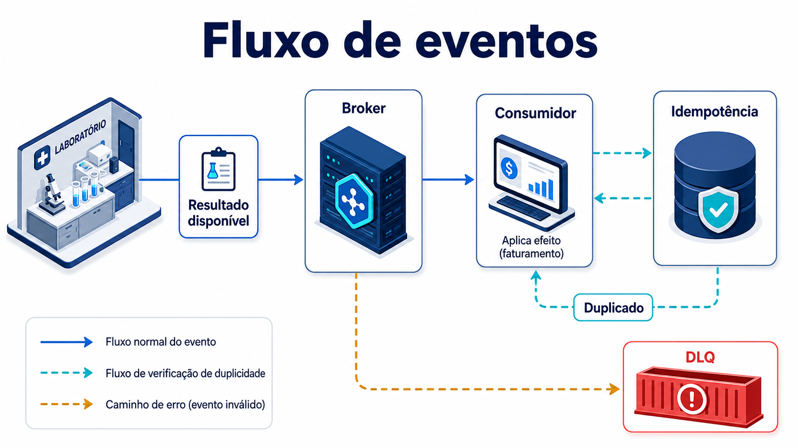
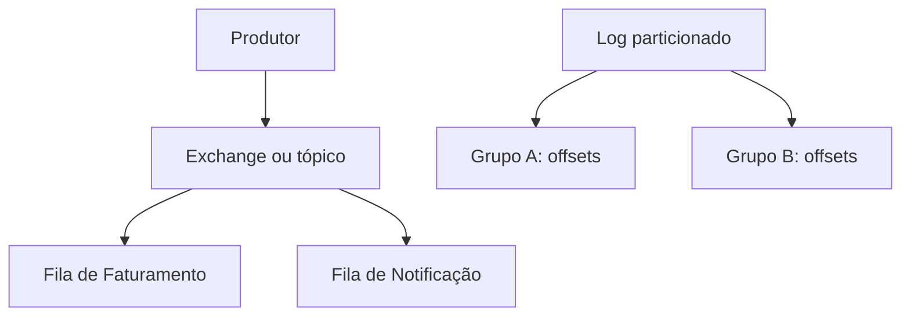

# Conceitos: fatos, canais e responsabilidade

## Evento, comando e mensagem

Um **evento** descreve um fato de domínio no passado. “Resultado laboratorial disponibilizado” é uma afirmação: pode ter ocorrido às 10h, tem uma identidade e não pede autorização a cada interessado para ter acontecido. Um bom nome tende a usar verbo no particípio e linguagem do domínio. O publicador é responsável por afirmar apenas o que sabe; quem recebe é responsável pela sua própria reação. Se Faturamento estiver indisponível, o fato não deixa de ser verdadeiro.

Um **comando** expressa intenção dirigida. “Gerar cobrança do exame” solicita uma ação a um destinatário que pode aceitar, rejeitar ou devolver uma falha. Ele carrega autoridade, pré-condições e, frequentemente, uma resposta. Publicar `GerarCobranca` em um tópico pode ser apropriado em alguns fluxos, mas a semântica não muda: não é um fato aberto a qualquer interpretação. Confundir comando e evento cria consumidores que tomam uma ordem como informação histórica ou publicadores que passam a conhecer regras dos destinatários.

**Mensagem** é o termo de transporte: bytes, cabeçalhos, chave de roteamento, content type e confirmação. Ela pode carregar evento, comando, documento ou sinal técnico. Ao depurar uma entrega, a equipe olha para a mensagem; ao decidir ownership, olha para evento ou comando. Esta separação impede que a escolha de AMQP, HTTP ou um cliente Kafka determine o vocabulário do domínio.

No hospital, `ResultadoLaboratorialDisponibilizado.v1` tem `event_id`, `occurred_at`, `exam_id`, `patient_id` e `result_reference`. O contrato afirma que uma referência foi disponibilizada; não inclui laudo inteiro, diagnóstico nem uma instrução de cobrança. `event_id` identifica a ocorrência, enquanto `exam_id` identifica o exame: duas tentativas de transportar a mesma ocorrência preservam o primeiro e podem compartilhar o segundo. `occurred_at` é o tempo do fato, não o horário em que um consumidor recebeu uma cópia.

## Broker e mediator

Um **broker** recebe mensagens, aplica regras de roteamento, mantém filas ou retenção conforme a tecnologia e entrega para consumidores. Ele reduz o conhecimento direto entre produtor e consumidor, mas não deveria decidir regra clínica ou sequência de domínio. No RabbitMQ, uma exchange recebe a publicação e encaminha a filas segundo bindings. No Kafka, brokers mantêm registros particionados; consumidores avançam sua posição de leitura. Ambos são infraestrutura que precisa de ownership, observabilidade e limites de retenção.

Um **mediator** coordena participantes. Ele conhece uma conversa: pode mandar validar elegibilidade, aguardar resposta, decidir compensação e ordenar próximos passos. Isso é útil quando o processo é uma política explícita, mas introduz acoplamento ao coordenador. Um mediator pode usar um broker como canal e um broker pode transportar mensagens de um mediator. A pergunta decisiva é: alguém precisa tomar uma decisão central sobre o fluxo, ou as equipes apenas precisam reagir de forma independente ao mesmo fato?

Um exemplo contrastante ajuda. Depois do evento de resultado, Faturamento pode criar um lançamento administrativo e Notificação pode preparar um aviso; nenhuma reação precisa comandar a outra. Um processo de cancelamento de internação, porém, talvez tenha que ordenar liberação de leito, encerramento de dieta e registro administrativo com regras de compensação. Um mediator torna essa coreografia visível. Chamar cada tópico de “orquestração” esconderia a diferença.

## Fila, tópico e log distribuído

*Figura 6 — Publicação, consumo, idempotência e dead-letter queue.*

**Leitura textual da figura:** o laboratório publica o fato “resultado disponível” no broker. O broker entrega uma cópia ao consumidor de Faturamento. Antes de produzir efeito, o consumidor consulta o registro de idempotência para impedir uma cobrança duplicada. Uma mensagem inválida ou que não possa ser processada segue para a DLQ, onde fica visível para diagnóstico e reprocessamento controlado, sem desaparecer silenciosamente.

Uma **fila** representa trabalho pendente para uma capacidade. Mensagens ficam disponíveis até um consumidor confirmar; várias réplicas podem repartir trabalho. A fila `billing.resultados.v1` é uma fila de Faturamento: uma cópia de cada evento roteado para ela é tratada pelo grupo de trabalho desse domínio. A confirmação ocorre depois da validação e do efeito local. Se o processo cair antes da confirmação, a mensagem pode voltar e a duplicação deve ser esperada.

Um **tópico** é um canal de publicação com critérios de assinatura. Uma mesma publicação pode alcançar filas distintas: Faturamento recebe uma cópia, Notificação outra e Auditoria, se existir, uma terceira. Em AMQP, a exchange do tipo topic e as chaves de roteamento realizam isso; o tópico não torna todos os consumidores uma única equipe nem lhes dá o mesmo banco. Ele é uma relação de distribuição.

Um **log distribuído** é um registro ordenado por partição, retido por política. Consumidores guardam offsets e podem ler a mesma sequência em ritmos diferentes ou voltar a uma posição permitida pela retenção. Kafka é conhecido por esse modelo. O log favorece replay e múltiplas leituras independentes, mas não torna a ordem global: a garantia comum é por partição, sob uma chave e configuração específicas. Retenção também é uma decisão de custo, privacidade e recuperação, não “histórico infinito”.

**Leitura textual da figura:** um produtor publica no canal. Um tópico pode encaminhar cópias para filas com responsabilidades distintas. Em um log distribuído, grupos independentes mantêm posições próprias de leitura sobre o registro retido.

## RabbitMQ e Kafka sem atalhos

RabbitMQ é um broker de mensageria com exchanges, filas, bindings, confirmações e recursos como TTL e dead-lettering. Ele é uma escolha frequente quando a necessidade central é roteamento flexível e trabalho assíncrono por fila. Kafka é uma plataforma de log distribuído, organizada em tópicos e partições, com retenção e offsets controlados por consumidores. Ele costuma ser considerado quando leitura independente, replay e fluxo contínuo são requisitos relevantes.

Essas descrições não são uma tabela de vencedores. RabbitMQ também suporta padrões pub/sub e persistência; Kafka também exige planejamento de consumidores, chaves, capacidade e operação. Throughput observado depende de mensagem, confirmação, disco, replicação, rede, clientes e desenho. Nem “Kafka sempre escala mais” nem “RabbitMQ é apenas uma fila” são critérios arquiteturais suficientes. Uma equipe começa pela semântica, volume esperado, isolamento, recuperação, domínio de retenção e capacidade operacional, então mede o caso real.

## Tempo e consistência eventual

Com integração assíncrona, uma mudança pode estar visível em uma capacidade antes de outra. Após Resultados publicar, a tela clínica pode mostrar disponibilidade enquanto Faturamento ainda não criou a cobrança. Isso é **consistência eventual**: se as entregas e reações completarem sem novas mudanças conflitantes, as projeções convergem para o estado esperado. Não é licença para ignorar erro. A equipe precisa decidir como informar estado pendente, quanto tempo é aceitável, como reprocessar e quem investiga uma fila atrasada.

O tempo também aparece no contrato. `occurred_at` permite ordenar fatos de uma mesma origem para análise, mas relógios distribuídos têm desvio e entregas podem chegar fora de ordem. Uma projeção pode usar versão do agregado, sequência por exame ou regra de precedência, conforme o domínio. Usar hora de recebimento como verdade histórica costuma gerar decisões erradas quando há atraso ou replay.

## Vocabulário mínimo para revisão

Ao revisar uma integração, pergunte: qual fato ou intenção estamos nomeando? Quem é owner do contrato? Qual consumidor tem efeito de negócio? Qual chave preserva a ordem necessária? Que duplicação é possível entre escrita e confirmação? Qual dado é referência, qual é cópia e qual não pode circular? Onde aparece atraso, rejeição e dead-letter queue? Essas perguntas tornam a arquitetura legível antes de ela se tornar uma coleção de filas.
