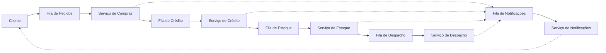
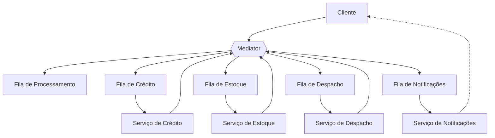
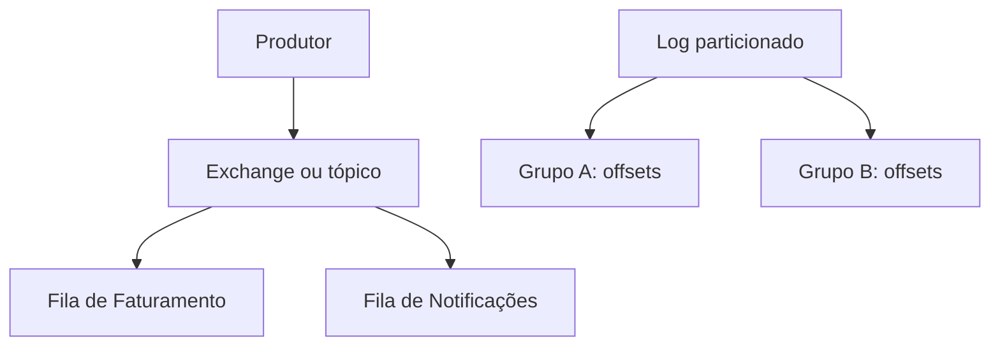

# Conceitos: fatos, canais e responsabilidade

## Evento, comando e mensagem

Um **evento** descreve um fato de domínio no passado. “Pedido realizado” é uma afirmação: pode ter ocorrido às 10h, tem uma identidade e não pede autorização a cada interessado para ter acontecido. Um bom nome tende a usar verbo no particípio e linguagem do domínio. O publicador é responsável por afirmar apenas o que sabe; quem recebe é responsável pela sua própria reação. Se Crédito estiver indisponível, o fato não deixa de ser verdadeiro.

Um **comando** expressa intenção dirigida. “Gerar cobrança do pedido” solicita uma ação a um destinatário que pode aceitar, rejeitar ou devolver uma falha. Ele carrega autoridade, pré-condições e, frequentemente, uma resposta. Publicar `GerarCobranca` em um tópico pode ser apropriado em alguns fluxos, mas a semântica não muda: não é um fato aberto a qualquer interpretação. Confundir comando e evento cria consumidores que tomam uma ordem como informação histórica ou publicadores que passam a conhecer regras dos destinatários.

**Mensagem** é o termo de transporte: bytes, cabeçalhos, chave de roteamento, content type e confirmação. Ela pode carregar evento, comando, documento ou sinal técnico. Ao depurar uma entrega, a equipe olha para a mensagem; ao decidir ownership, olha para evento ou comando. Esta separação impede que a escolha de AMQP, HTTP ou um cliente Kafka determine o vocabulário do domínio.

Numa loja on-line, `PedidoRealizado.v1` tem `event_id`, `occurred_at`, `pedido_id`, `cliente_id` e `pedido_reference`. O contrato afirma que um pedido foi registrado; não inclui os itens do carrinho nem uma instrução de cobrança completa. `event_id` identifica a ocorrência, enquanto `pedido_id` identifica o pedido: duas tentativas de transportar a mesma ocorrência preservam o primeiro e podem compartilhar o segundo. `occurred_at` é o tempo do fato, não o horário em que um consumidor recebeu uma cópia.

## Broker e mediator

Um **broker** recebe mensagens, aplica regras de roteamento, mantém filas ou retenção conforme a tecnologia e entrega para consumidores. Ele reduz o conhecimento direto entre produtor e consumidor, mas não deveria decidir regra de negócio ou sequência de domínio. No RabbitMQ, uma exchange recebe a publicação e encaminha a filas segundo bindings. No Kafka, brokers mantêm registros particionados; consumidores avançam sua posição de leitura. No ActiveMQ, filas e tópicos atendem mensageria com confirmações e integrações de protocolo, inclusive em ambientes que já usam JMS. Fora desse trio, o mesmo papel aparece em Apache Pulsar (multi-tenancy e replicação geográfica), RabbitMQ Streams e Redis Streams (log de eventos sobre uma base já conhecida da equipe), NATS (baixa latência para IoT e microsserviços), e nos serviços gerenciados AWS SQS/EventBridge, Google Pub/Sub e Azure Service Bus. São infraestruturas que precisam de ownership, observabilidade e limites de retenção; a escolha depende de topologia, modelo de consumo e operação, não de uma lista de funcionalidades.

No fluxo de um pedido, o padrão broker aparece como uma cadeia: cada serviço termina seu trabalho publicando um fato na fila do próximo, sem chamar ninguém diretamente e sem saber quem vai consumir.

```mermaid
flowchart LR
    CL[Cliente] --> FP[Fila de Pedidos]
    FP --> SC[Serviço de Compras]
    SC --> FCr[Fila de Crédito]
    FCr --> SCr[Serviço de Crédito]
    SCr --> FE[Fila de Estoque]
    FE --> SE[Serviço de Estoque]
    SE --> FD[Fila de Despacho]
    FD --> SD[Serviço de Despacho]
    SC -.-> FN[Fila de Notificações]
    SCr -.-> FN
    SE -.-> FN
    SD -.-> FN
    FN --> SN[Serviço de Notificações]
    SN -.-> CL
```

**Texto alternativo:** Cadeia de filas em que o Cliente inicia um pedido e cada serviço, ao concluir sua etapa, publica na fila do próximo serviço; em paralelo, todos publicam também na fila de Notificações, que avisa o Cliente ao final.

*Figura 7 — Padrão broker: cada serviço publica na fila do próximo. Fonte: curso, adaptado de material do curso sobre o padrão broker.*

**Leitura textual:** O Cliente publica o pedido na Fila de Pedidos. O Serviço de Compras lê essa fila e, ao aprovar o pedido, publica na Fila de Crédito. O Serviço de Crédito lê essa fila e, se aprovar, publica na Fila de Estoque. O Serviço de Estoque lê essa fila e publica na Fila de Despacho, que o Serviço de Despacho consome para organizar a entrega. Em paralelo, cada um desses quatro serviços também publica um evento na Fila de Notificações, que o Serviço de Notificações lê para manter o Cliente informado ao longo do processo inteiro. Nenhum serviço chama outro diretamente; cada um só conhece a fila para a qual publica.

Um **mediator** coordena participantes. Ele conhece uma conversa: pode mandar avaliar crédito, aguardar resposta, decidir compensação e ordenar próximos passos. Isso é útil quando o processo é uma política explícita, mas introduz acoplamento ao coordenador. Um mediator pode usar um broker como canal e um broker pode transportar mensagens de um mediator. A pergunta decisiva é: alguém precisa tomar uma decisão central sobre o fluxo, ou as equipes apenas precisam reagir de forma independente ao mesmo fato? Ferramentas como Apache Camel, NServiceBus, Spring Integration, AWS Step Functions, Google Workflows e Azure Logic Apps assumem esse papel central, cada uma com o próprio modelo de estado, retentativa e compensação.

O mesmo pedido, sob um mediator, muda de forma: nenhum serviço fala com o próximo, todos falam só com o coordenador, que decide a sequência e aguarda cada resposta antes do próximo passo.

```mermaid
flowchart TB
    CL[Cliente] --> M{{Mediator}}
    M --> FP[Fila de Processamento]
    M --> FCr[Fila de Crédito]
    FCr --> SCr[Serviço de Crédito] --> M
    M --> FE[Fila de Estoque]
    FE --> SE[Serviço de Estoque] --> M
    M --> FD[Fila de Despacho]
    FD --> SD[Serviço de Despacho] --> M
    M --> FN[Fila de Notificações]
    FN --> SN[Serviço de Notificações]
    SN -.-> CL
```

**Texto alternativo:** O Cliente fala apenas com o Mediator, que publica em cada fila (processamento, crédito, estoque, despacho, notificações) e recebe de volta a resposta de cada serviço antes de decidir o próximo passo.

*Figura 8 — Padrão mediator: o coordenador publica, aguarda e decide a sequência. Fonte: curso, adaptado de material do curso sobre o padrão mediator.*

**Leitura textual:** O Cliente envia o pedido ao Mediator, sem publicar diretamente numa fila de domínio. O Mediator publica na Fila de Processamento e, na sequência, na Fila de Crédito, recebendo de volta a resposta do Serviço de Crédito antes de decidir o próximo passo. Ele publica então na Fila de Estoque e recebe a resposta do Serviço de Estoque, publica na Fila de Despacho e recebe a resposta do Serviço de Despacho, e por fim publica na Fila de Notificações para o Serviço de Notificações avisar o Cliente. Cada serviço só conhece o Mediator; a ordem entre crédito, estoque e despacho é uma decisão da lógica de coordenação central, não uma consequência de qual fila cada serviço escolheu ligar.

Comparar as duas figuras revela a diferença que a definição sozinha esconde. Na Figura 7, tirar o Serviço de Estoque do ar interrompe a fila de Despacho sem que ninguém precise saber por quê: o problema aparece como uma fila parada. Na Figura 8, o mesmo problema aparece no Mediator, que fica esperando uma resposta que não chega, e é ele quem decide se cancela o pedido, tenta de novo ou segue sem estoque confirmado. Um exemplo real reforça a escolha: depois do evento de pedido, Crédito pode aprovar um limite e Notificação pode preparar um aviso, como na Figura 7, porque nenhuma reação precisa comandar a outra. Um processo de cancelamento de pedido, que precisa ordenar estorno de crédito, reposição de estoque e registro administrativo com regras de compensação, pede a coreografia visível da Figura 8. Chamar as duas figuras de “orquestração” esconderia a diferença que elas mostram.

## Fila, tópico e log distribuído

A figura a seguir muda de domínio de propósito: é o mesmo padrão broker das duas figuras anteriores, agora aplicado ao caso hospitalar que as páginas de exemplo arquitetural, estudo de caso e oficina detalham na sequência do módulo, com um resultado de exame no lugar de um pedido. Ela também introduz a **dead-letter queue** (DLQ): a fila que recebe uma mensagem que o consumidor rejeitou, por exemplo por falhar na validação de schema, mantendo-a visível para inspeção em vez de descartá-la ou reentregá-la em loop.

*Figura 6 — Publicação, consumo, idempotência e dead-letter queue. Fonte: curso.*

**Leitura textual da figura:** o laboratório publica o fato “resultado disponível” no broker. O broker entrega uma cópia ao consumidor de Faturamento. Antes de produzir efeito, o consumidor consulta o registro de idempotência para impedir uma cobrança duplicada. Uma mensagem inválida ou que não possa ser processada segue para a DLQ, onde fica visível para diagnóstico e reprocessamento controlado, sem desaparecer silenciosamente.

Uma **fila** representa trabalho pendente para uma capacidade. Mensagens ficam disponíveis até um consumidor confirmar; várias réplicas podem repartir trabalho. A fila `billing.pedidos.v1` é uma fila de Faturamento: uma cópia de cada evento roteado para ela é tratada pelo grupo de trabalho desse domínio. A confirmação ocorre depois da validação e do efeito local. Se o processo cair antes da confirmação, a mensagem pode voltar e a duplicação deve ser esperada.

Um **tópico** é um canal de publicação com critérios de assinatura. Uma mesma publicação pode alcançar filas distintas: Faturamento recebe uma cópia, Notificações outra e Auditoria uma terceira. Em AMQP, a exchange do tipo topic e as chaves de roteamento realizam isso; o tópico não torna todos os consumidores uma única equipe nem lhes dá o mesmo banco. Ele é uma relação de distribuição.

Um **log distribuído** é um registro ordenado por partição, retido por política. Consumidores guardam offsets e podem ler a mesma sequência em ritmos diferentes ou voltar a uma posição permitida pela retenção. Kafka é conhecido por esse modelo. O log favorece replay e múltiplas leituras independentes, mas não torna a ordem global: a garantia comum é por partição, sob uma chave e configuração específicas. Retenção também é uma decisão de custo, privacidade e recuperação, não “histórico infinito”.

```mermaid
flowchart TB
    P[Produtor] --> X[Exchange ou tópico]
    X --> Q1[Fila de Faturamento]
    X --> Q2[Fila de Notificações]
    L[Log particionado] --> G1[Grupo A: offsets]
    L --> G2[Grupo B: offsets]
```

**Texto alternativo:** Comparação entre um produtor que publica em exchange ou tópico para filas independentes e grupos que leem posições próprias em um log particionado.

*Figura 9 — Topologias de distribuição por fila, tópico e log. Fonte: curso.*

**Leitura textual:** Um produtor publica no canal. Um tópico pode encaminhar cópias para filas com responsabilidades distintas. Em um log distribuído, grupos independentes mantêm posições próprias de leitura sobre o registro retido.

## RabbitMQ, Kafka e ActiveMQ sem atalhos

RabbitMQ é um broker de mensageria com exchanges, filas, bindings, confirmações e recursos como TTL e dead-lettering. Ele atende quando a necessidade comprovada é roteamento flexível e trabalho assíncrono por fila; não oferece, por si, um histórico de replay governado como um log. Kafka é uma plataforma de log distribuído, organizada em tópicos e partições, com retenção e offsets controlados por consumidores. Ele atende quando leitura independente, replay e fluxo contínuo são requisitos relevantes; retenção, partições e a proteção dos dados retidos são limites que a equipe precisa operar.

ActiveMQ é um broker de mensageria para filas e tópicos, com confirmações e opções de interoperabilidade de protocolo. Ele pode ser adequado quando sistemas existentes dependem de JMS ou quando essa interoperabilidade reduz o acoplamento de uma integração. A escolha depende da variante e da topologia: ela não elimina a necessidade de idempotência do consumidor, nem transforma a mensageria em replay histórico ilimitado. Persistência, disponibilidade, atualização e monitoramento compõem um custo operacional a ser assumido pela equipe.

Essas descrições não são uma tabela de vencedores. RabbitMQ também suporta padrões pub/sub e persistência; Kafka também exige planejamento de consumidores, chaves, capacidade e operação; ActiveMQ não dispensa a decisão de topologia, recuperação e compatibilidade. Throughput observado depende de mensagem, confirmação, disco, replicação, rede, clientes e desenho. Nem “Kafka sempre escala mais”, nem “RabbitMQ é apenas uma fila”, nem “ActiveMQ resolve integração legada automaticamente” são critérios arquiteturais suficientes. Uma equipe começa pela semântica, volume esperado, isolamento, recuperação, domínio de retenção e capacidade operacional, então mede o caso real.

## Tempo e consistência eventual

Com integração assíncrona, uma mudança pode estar visível em uma capacidade antes de outra. Após Pedidos publicar, a tela de status pode mostrar confirmação enquanto Faturamento ainda não criou a cobrança. Isso é **consistência eventual**: se as entregas e reações completarem sem novas mudanças conflitantes, as projeções convergem para o estado esperado. Não é licença para ignorar erro. A equipe precisa decidir como informar estado pendente, quanto tempo é aceitável, como reprocessar e quem investiga uma fila atrasada.

O tempo também aparece no contrato. `occurred_at` permite ordenar fatos de uma mesma origem para análise, mas relógios distribuídos têm desvio e entregas podem chegar fora de ordem. Uma projeção pode usar versão do agregado, sequência por pedido ou regra de precedência, conforme o domínio. Usar hora de recebimento como verdade histórica costuma gerar decisões erradas quando há atraso ou replay.

## Vocabulário mínimo para revisão

Ao revisar uma integração, pergunte: qual fato ou intenção estamos nomeando? Quem é owner do contrato? Qual consumidor tem efeito de negócio? Qual chave preserva a ordem necessária? Que duplicação é possível entre escrita e confirmação? Qual dado é referência, qual é cópia e qual não pode circular? Onde aparece atraso, rejeição e dead-letter queue? Essas perguntas tornam a arquitetura legível antes de ela se tornar uma coleção de filas.
