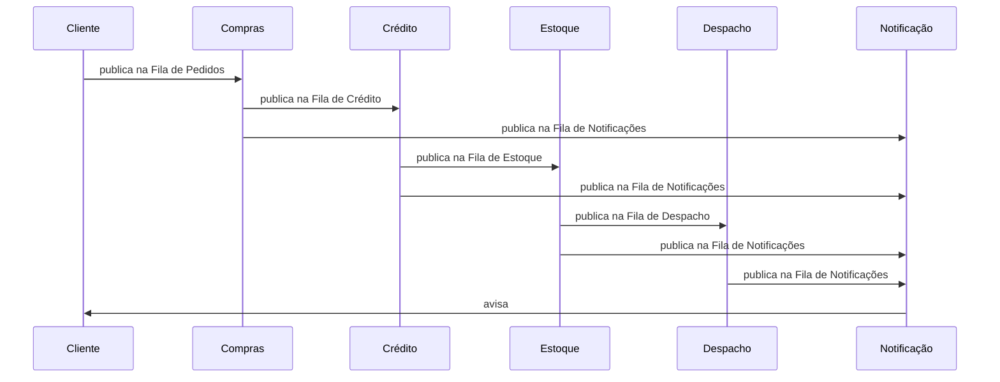
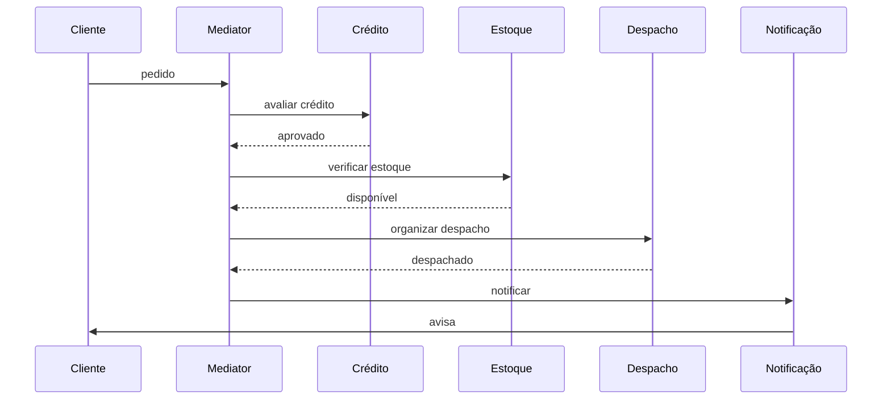
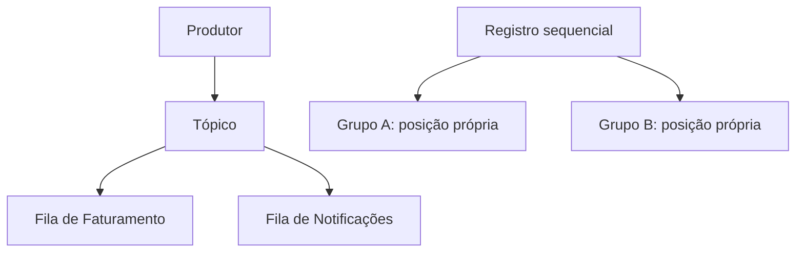

# Conceitos: fatos, canais e responsabilidade

*Figura 6 — Um pedido, várias reações independentes. Fonte: curso.*

**Leitura textual da figura:** o Cliente faz um pedido na loja virtual. O Serviço de Pedidos, no papel de produtor, registra o pedido nos seus próprios dados e publica o evento “Pedido realizado”, que carrega o identificador do pedido. A central de eventos recebe essa publicação e entrega uma cópia para a fila de cada assinante. Estoque reserva os produtos, Pagamentos inicia o faturamento e Notificações avisa o cliente, cada consumidor com sua fila própria e seu banco de dados próprio, sem que o Serviço de Pedidos conheça qualquer um deles. Três propriedades sustentam o desenho: o evento informa um fato já ocorrido; o processamento é assíncrono, então Pedidos não espera as reações terminarem; e a consistência é eventual, porque as atualizações de cada consumidor podem ocorrer em momentos diferentes.

Qualquer sistema distribuído precisa decidir como suas partes colaboram, e essa decisão é arquitetural antes de ser tecnológica. Numa integração síncrona, quem chama espera a resposta de quem foi chamado, e essa espera cria uma dependência de tempo entre os dois: o desempenho e a disponibilidade de quem responde passam a limitar quem chamou. A arquitetura orientada por eventos parte de outra premissa. Um componente publica o que aconteceu no seu domínio e encerra o próprio trabalho ali; quem tiver interesse reage depois, no ritmo que conseguir sustentar.

A figura acima mostra esse estilo em uma loja virtual. Ao longo desta página o elenco de serviços varia conforme o que cada exemplo precisa ilustrar, e essa variação é proposital: quem publica não decide quantos consumidores existem nem quais são.

## O estilo: arquitetura orientada por eventos

A **arquitetura orientada por eventos** (*event-driven architecture*, EDA) formaliza essa premissa como estilo arquitetural: componentes desacoplados colaboram reagindo a fatos publicados, em vez de chamarem uns aos outros diretamente. Ela aparece em microsserviços, em plataformas de IoT e em processamento de dados em tempo real, contextos em que muitos participantes precisam reagir ao mesmo acontecimento sem que a origem os conheça.

Três papéis compõem o estilo, e o vocabulário deste módulo inteiro se organiza em torno deles:

- O **produtor** gera e publica um evento quando algo acontece no seu domínio. Ele afirma o fato e encerra seu trabalho.
- O **consumidor** recebe o evento e decide o que fazer com ele. Pode haver nenhum, um ou vários, e o produtor não precisa saber quantos são.
- O **intermediário** fica entre os dois, recebendo a publicação e fazendo-a chegar a quem interessa. Broker e mediator, definidos adiante, são as duas formas que esse papel assume.

Trocar chamadas diretas por essa tríade compra quatro propriedades, e cada uma cobra um preço que as demais seções tratam:

- **Desacoplamento** — o produtor não conhece os consumidores. *Custo:* perde-se a resposta imediata que uma chamada direta daria.
- **Escalabilidade** — picos de carga podem ser absorvidos pelo canal em vez de derrubarem a origem. *Custo:* operar esse canal.
- **Flexibilidade** — um consumidor novo se inscreve sem exigir mudança no produtor. *Custo:* o contrato do evento precisa ter sido pensado para isso.
- **Resiliência** — a falha de um consumidor não impede que o fato tenha ocorrido nem que os outros reajam. *Custo:* alguém precisa perceber que aquele consumidor parou.

O restante desta página constrói o vocabulário necessário para projetar sob esse estilo sem tratar suas promessas como garantias automáticas, na ordem em que as perguntas aparecem durante um projeto: o que se publica, quem entrega, como o canal se comporta depois da entrega, e o que fazer com o tempo que passa entre publicar e reagir. Começa pelo que se publica.

## Evento, comando e mensagem

Um **evento** descreve um fato de domínio no passado. “Pedido realizado” é uma afirmação: pode ter ocorrido às 10h, tem uma identidade e não pede autorização a cada interessado para ter acontecido. Um bom nome tende a usar verbo no particípio e linguagem do domínio. O publicador é responsável por afirmar apenas o que sabe; quem recebe é responsável pela sua própria reação. Se Crédito estiver indisponível, o fato não deixa de ser verdadeiro.

Um **comando** expressa intenção dirigida. “Gerar cobrança do pedido” solicita uma ação a um destinatário que pode aceitar, rejeitar ou devolver uma falha. Ele carrega autoridade, pré-condições e, frequentemente, uma resposta. Publicar `GerarCobranca` em um tópico pode ser apropriado em alguns fluxos, mas a semântica não muda: não é um fato aberto a qualquer interpretação. Confundir comando e evento cria consumidores que tomam uma ordem como informação histórica ou publicadores que passam a conhecer regras dos destinatários.

**Mensagem** é o termo de transporte: os bytes que trafegam, os cabeçalhos que os acompanham, a chave usada para roteamento, o tipo de conteúdo declarado e a confirmação de entrega. Ela pode carregar evento, comando, documento ou sinal técnico. Ao investigar por que uma entrega falhou, a equipe olha para a mensagem; ao decidir quem é responsável por um contrato, olha para evento ou comando. Esta separação impede que a escolha de AMQP, HTTP ou um cliente Kafka determine o vocabulário do domínio.

Numa loja on-line, `PedidoRealizado.v1` tem `event_id`, `occurred_at`, `pedido_id`, `cliente_id` e `pedido_reference`. O contrato afirma que um pedido foi registrado; não inclui os itens do carrinho nem uma instrução de cobrança completa. `event_id` identifica a ocorrência, enquanto `pedido_id` identifica o pedido: duas tentativas de transportar a mesma ocorrência preservam o primeiro e podem compartilhar o segundo. `occurred_at` é o tempo do fato, não o horário em que um consumidor recebeu uma cópia.

Decidido que `PedidoRealizado.v1` é um evento, falta responder quem entrega essa notícia aos interessados. É aqui que broker e mediator se separam.

## Broker e mediator

### Broker

Um **broker** é um intermediário que recebe uma mensagem de quem publica e a faz chegar a quem deve recebê-la. Ele resolve um problema de conhecimento: sem broker, quem publica precisa saber quem são os destinatários, quantos são e onde estão. Com broker, quem publica conhece apenas o canal.

O que define o papel é tão importante quanto o que ele recusa. Um broker roteia, guarda a mensagem até a entrega e confirma o que foi entregue. Um broker não decide regra de negócio nem a ordem em que as etapas de um processo devem acontecer. Se a decisão de aprovar um pedido migrar para dentro da configuração do broker, a regra passa a viver na infraestrutura, longe do domínio a que pertence e de quem responde por ela.

No fluxo de um pedido, o broker produz uma cadeia descentralizada: cada serviço termina seu trabalho publicando um fato, e o serviço seguinte reage a esse fato. Ninguém chama ninguém diretamente, e ninguém espera resposta. Um diagrama de sequência torna essa característica visível de um jeito que um fluxograma de caixas não consegue: repare que nenhuma seta abaixo volta para quem a enviou. A última seta chega ao Cliente, mas como um aviso novo emitido por Notificação.

```mermaid
sequenceDiagram
    participant CL as Cliente
    participant SC as Compras
    participant SCr as Crédito
    participant SE as Estoque
    participant SD as Despacho
    participant SN as Notificação

    CL->>SC: publica na Fila de Pedidos
    SC->>SCr: publica na Fila de Crédito
    SC->>SN: publica na Fila de Notificações
    SCr->>SE: publica na Fila de Estoque
    SCr->>SN: publica na Fila de Notificações
    SE->>SD: publica na Fila de Despacho
    SE->>SN: publica na Fila de Notificações
    SD->>SN: publica na Fila de Notificações
    SN->>CL: avisa
```

**Texto alternativo:** Diagrama de sequência em que o Cliente publica um pedido e cada serviço, ao concluir sua etapa, publica um evento para o próximo e também para Notificação; todas as setas seguem adiante, nenhuma delas é uma resposta de volta para quem a originou.

*Figura 7 — Padrão broker: cada serviço publica adiante, sem esperar resposta. Fonte: curso, adaptado de material do curso sobre o padrão broker.*

**Leitura textual:** O Cliente publica o pedido, que chega a Compras. Compras publica para Crédito e, em paralelo, para Notificação. Crédito, ao aprovar, publica para Estoque e também para Notificação. Estoque publica para Despacho e para Notificação. Despacho publica para Notificação. Por fim, Notificação avisa o Cliente. Repare que cada seta é de mão única: nenhum serviço aguarda confirmação de quem recebeu antes de seguir em frente, e nenhum deles sabe se alguém está do outro lado lendo a fila.

Um broker faz mais do que encaminhar. Ele também precisa responder o que fazer quando a entrega não pode ser concluída: a mensagem chega corrompida, o consumidor a rejeita, o formato não corresponde ao contrato esperado. A figura a seguir mostra esse caminho completo, já no caso hospitalar que as páginas seguintes do módulo detalham. Ela introduz a **fila de erros**, conhecida no jargão da área como *dead-letter queue* (DLQ): a fila que recebe uma mensagem rejeitada e a mantém visível para inspeção, em vez de descartá-la em silêncio ou reentregá-la indefinidamente.

*Figura 8 — Publicação, consumo, idempotência e fila de erros. Fonte: curso.*

**Leitura textual da figura:** o laboratório publica o fato “resultado disponível” no broker. O broker entrega uma cópia ao consumidor de Faturamento. Antes de produzir efeito, o consumidor consulta o registro de idempotência para impedir uma cobrança duplicada. Uma mensagem inválida ou que não possa ser processada segue para a DLQ, onde fica visível para diagnóstico e reprocessamento controlado, sem desaparecer silenciosamente.

**Ferramentas que exercem o papel de broker.** As diferenças entre elas aparecem em [Padrões e decisões](padroes-e-decisoes.md#escolher-entre-rabbitmq-kafka-activemq-e-servicos-gerenciados); por ora, basta reconhecer que o mesmo papel arquitetural tem muitas implementações.

- [RabbitMQ](https://www.rabbitmq.com/) — roteamento flexível por regras de assinatura, com confirmação de entrega.
- [Apache Kafka](https://kafka.apache.org/) — registro sequencial retido, que permite reler o histórico.
- [Apache ActiveMQ](https://activemq.apache.org/) — mensageria interoperável, comum onde já existe Java corporativo.
- [Apache Pulsar](https://pulsar.apache.org/) — separa armazenamento de processamento e replica entre regiões geográficas.
- [NATS](https://nats.io/) — leve e de baixa latência, frequente em IoT.
- [Redis Streams](https://redis.io/docs/latest/develop/data-types/streams/) — registro de eventos sobre uma base Redis que a equipe já opera.
- [Amazon SQS](https://aws.amazon.com/sqs/), [Amazon EventBridge](https://aws.amazon.com/eventbridge/), [Google Pub/Sub](https://cloud.google.com/pubsub) e [Azure Service Bus](https://learn.microsoft.com/azure/service-bus-messaging/) — serviços gerenciados, em que o provedor assume a operação.

### Mediator

Um **mediator** também fica entre os participantes, mas assume o que o broker recusa: ele conhece o processo e decide a ordem das etapas. Enquanto o broker entrega e sai de cena, o mediator solicita uma etapa, espera a resposta, avalia o resultado e decide qual é o próximo passo, inclusive o que fazer quando uma etapa falha.

Essa concentração é uma escolha, com ganho e preço declarados. O ganho: o processo fica escrito num lugar só, legível e auditável, em vez de emergir da soma de quem reage a quê. O preço: todos os participantes passam a depender do coordenador, e a lógica do fluxo vira responsabilidade dele.

A pergunta que separa os dois padrões é direta. Alguém precisa tomar uma decisão central sobre a ordem do fluxo, ou as equipes apenas precisam reagir de forma independente ao mesmo fato? Vale notar que os dois papéis convivem: um mediator costuma usar um broker como canal para conversar com os participantes.

O mesmo pedido, sob um mediator, muda de forma: nenhum serviço fala com o próximo, todos falam só com o coordenador, que decide a sequência e aguarda cada resposta antes do próximo passo.

```mermaid
sequenceDiagram
    participant CL as Cliente
    participant M as Mediator
    participant SCr as Crédito
    participant SE as Estoque
    participant SD as Despacho
    participant SN as Notificação

    CL->>M: pedido
    M->>SCr: avaliar crédito
    SCr-->>M: aprovado
    M->>SE: verificar estoque
    SE-->>M: disponível
    M->>SD: organizar despacho
    SD-->>M: despachado
    M->>SN: notificar
    SN->>CL: avisa
```

**Texto alternativo:** Diagrama de sequência em que o Cliente fala só com o Mediator; para cada etapa (crédito, estoque, despacho), o Mediator envia uma solicitação e recebe uma resposta de volta antes de seguir para a próxima, até publicar a notificação final.

*Figura 9 — Padrão mediator: o coordenador solicita, aguarda a resposta e decide o próximo passo. Fonte: curso, adaptado de material do curso sobre o padrão mediator.*

**Leitura textual:** O Cliente envia o pedido ao Mediator, que é seu único interlocutor no fluxo inteiro. O Mediator pede a avaliação de crédito e espera a resposta “aprovado” antes de prosseguir. Só então pede a verificação de estoque e espera a resposta “disponível”. Só então pede a organização do despacho e espera a confirmação. Ao final, o Mediator manda notificar o Cliente. Cada seta de ida tem uma seta de volta tracejada: o Mediator não passa para a etapa seguinte sem primeiro receber a resposta da etapa atual.

**Ferramentas que exercem o papel de mediator.** Cada uma traz o próprio modelo de estado, retentativa e compensação, decisões que pesam quando o processo é longo ou precisa desfazer etapas já concluídas.

- [Apache Camel](https://camel.apache.org/) — rotas de integração que encadeiam e transformam mensagens entre sistemas.
- [Spring Integration](https://spring.io/projects/spring-integration) — canais e handlers para compor fluxos dentro do ecossistema Spring.
- [NServiceBus](https://particular.net/nservicebus) — coordenação de processos longos com estado, no ecossistema .NET.
- [AWS Step Functions](https://aws.amazon.com/step-functions/), [Google Workflows](https://cloud.google.com/workflows/docs) e [Azure Logic Apps](https://learn.microsoft.com/azure/logic-apps/) — orquestradores gerenciados que declaram estados, condições e transições.

### Comparando os dois padrões

Comparar as duas figuras revela a diferença que a definição sozinha esconde: na Figura 7 nenhuma seta intermediária volta para quem a enviou, e na Figura 9 cada uma volta. Se o Serviço de Estoque cair, a Figura 7 mostra a Fila de Despacho simplesmente parada, sem que ninguém saiba por quê; a Figura 9 mostra o Mediator esperando uma resposta que não chega, e é ele quem decide se cancela o pedido, tenta de novo ou segue sem estoque confirmado. Um exemplo real reforça a escolha: depois do evento de pedido, Crédito pode aprovar um limite e Notificação pode preparar um aviso, como na Figura 7, porque nenhuma reação precisa comandar a outra. Um processo de cancelamento de pedido, que precisa ordenar estorno de crédito, reposição de estoque e registro administrativo com regras de compensação, pede a coreografia visível da Figura 9. Chamar as duas figuras de “orquestração” esconderia a diferença que elas mostram.

## Fila, tópico e registro sequencial

Broker e mediator respondem quem entrega a mensagem. Fila, tópico e log respondem uma pergunta diferente: o que acontece com ela depois de entregue, e é aí que a escolha de tecnologia começa a pesar. Os três distribuem mensagens de formas diferentes o bastante para merecer nomes diferentes, mesmo quando a tecnologia por baixo é a mesma exchange ou o mesmo cluster.

Uma **fila** representa trabalho pendente para uma capacidade. Mensagens ficam disponíveis até um consumidor confirmar; várias réplicas podem repartir trabalho. A fila `billing.pedidos.v1` é uma fila de Faturamento: uma cópia de cada evento roteado para ela é tratada pelo grupo de trabalho desse domínio. A confirmação ocorre depois da validação e do efeito local. Se o processo cair antes da confirmação, a mensagem pode voltar e a duplicação deve ser esperada.

Já um **tópico** muda o critério de distribuição: em vez de repartir trabalho entre réplicas de uma fila, ele copia a mesma publicação para filas distintas com critérios de assinatura próprios. Faturamento recebe uma cópia, Notificações outra e Auditoria uma terceira. Em AMQP, a exchange do tipo topic e as chaves de roteamento realizam isso; o tópico não torna todos os consumidores uma única equipe nem lhes dá o mesmo banco.

Um terceiro formato, o **registro sequencial distribuído** (*log*), muda de novo o critério: em vez de repartir trabalho ou copiar para várias filas, ele guarda as mensagens numa sequência ordenada, por um prazo definido em tempo ou em tamanho. Cada consumidor mantém a própria **posição de leitura** (*offset*), um marcador que indica até onde já leu. Isso permite que dois grupos leiam a mesma sequência em ritmos diferentes, e que um deles recue o marcador para reprocessar um trecho já lido, desde que a mensagem ainda esteja dentro do prazo de guarda. Kafka é a tecnologia mais conhecida desse modelo. O formato favorece a releitura e as leituras independentes, mas não impõe uma ordem única para tudo: a ordem é garantida dentro de cada parte em que a sequência foi dividida, conforme a chave escolhida. O prazo de guarda é uma decisão de custo, privacidade e recuperação, e não um “histórico infinito”.

```mermaid
flowchart TB
    P[Produtor] --> X[Tópico]
    X --> Q1[Fila de Faturamento]
    X --> Q2[Fila de Notificações]
    L[Registro sequencial] --> G1[Grupo A: posição própria]
    L --> G2[Grupo B: posição própria]
```

**Texto alternativo:** Comparação entre um produtor que publica em um tópico, que encaminha cópias para filas independentes, e um registro sequencial em que dois grupos mantêm posições próprias de leitura.

*Figura 10 — Formas de distribuição por fila, tópico e registro sequencial. Fonte: curso.*

**Leitura textual:** Um produtor publica no canal. Um tópico encaminha cópias da mesma publicação para filas com responsabilidades distintas, cada uma com seu consumidor. Já num registro sequencial, a mensagem não é copiada para filas: ela fica guardada em um só lugar, e cada grupo de consumidores mantém o próprio marcador indicando até onde leu.

Cada uma dessas três formas de canal tem tecnologias associadas, e escolher entre elas é a próxima decisão a tomar.

## As tecnologias, sem atalhos

Cada tecnologia a seguir implementa o papel de intermediário, mas resolve bem problemas diferentes. Vale ler esta seção procurando o que cada uma assume como caso principal, e não uma lista de funcionalidades.

**RabbitMQ** organiza a entrega em torno de filas de trabalho. Uma publicação chega a um distribuidor, chamado *exchange*, que decide para quais filas encaminhar cópias segundo regras de assinatura. Cada consumidor confirma o que processou, e a mensagem confirmada sai da fila. Ele traz recursos úteis para operação, como um prazo de validade para a mensagem e o redirecionamento automático de mensagens rejeitadas para uma fila de erros. Cabe bem quando o problema central é repartir trabalho entre consumidores e rotear mensagens por critérios variados. O que ele não oferece por si: guardar o histórico das mensagens já consumidas para alguém relê-las depois.

**Apache Kafka** parte de outra ideia. Em vez de uma fila da qual a mensagem sai ao ser consumida, ele mantém um registro sequencial que preserva as mensagens por um prazo configurado, e ler não apaga nada. Cada consumidor guarda a própria posição de leitura nesse registro, o que permite que grupos diferentes leiam a mesma sequência em ritmos diferentes, e que um consumidor volte atrás para reprocessar um trecho já lido. Cabe bem quando releitura do histórico, leitura simultânea por vários grupos independentes e fluxo contínuo de dados são requisitos reais. O preço: a equipe passa a operar retenção, divisão do registro em partes paralelas e a proteção dos dados que ficam guardados.

**Apache ActiveMQ** é mensageria de filas e tópicos com forte interoperabilidade de protocolos. O caso típico é integrar sistemas corporativos já existentes, especialmente os que falam JMS, o padrão de mensageria do ecossistema Java. Cabe bem quando essa compatibilidade reduz o esforço de integração. Ele também não transforma a mensageria em histórico ilimitado, e a equipe assume persistência, disponibilidade, atualização e monitoramento.

**Serviços gerenciados** mudam a natureza da decisão: em vez de instalar e operar um servidor, contrata-se o serviço de um provedor de nuvem. **Amazon SQS** oferece filas de trabalho simples, sem servidor próprio para administrar. **Amazon SNS** faz a distribuição para múltiplos assinantes, e é comum combiná-lo com SQS: o SNS publica para vários destinos, e cada destino tem sua própria fila SQS. **Amazon EventBridge** roteia eventos por regras entre serviços da AWS. **Google Pub/Sub** e **Azure Service Bus** cobrem papéis equivalentes em suas nuvens. O ganho é não precisar operar servidores, escalar capacidade nem aplicar atualizações. O preço é a dependência daquele provedor e menos controle fino sobre a configuração.

Nada disso é uma tabela de vencedores. RabbitMQ também distribui para múltiplos assinantes e também persiste mensagens; Kafka também exige planejamento de consumidores, chaves de distribuição e capacidade; ActiveMQ não dispensa decisões de topologia e recuperação; serviços gerenciados não eliminam a necessidade de tratar mensagens repetidas. A vazão que cada um alcança depende do tamanho da mensagem, da política de confirmação, do disco, da replicação, da rede e do próprio desenho da solução, e por isso números de comparação isolados dizem pouco. Nem “Kafka sempre escala mais”, nem “RabbitMQ é apenas uma fila”, nem “ActiveMQ resolve integração legada automaticamente” são critérios arquiteturais suficientes. Uma equipe começa pela semântica do que precisa trafegar, pelo volume esperado, pelo isolamento entre consumidores, pela forma de recuperação, pelo prazo de guarda dos dados e pela própria capacidade de operar aquilo, e então mede o caso real.

Nenhuma dessas tecnologias resolve, por si, o efeito colateral mais incômodo de desacoplar produtor e consumidor: o tempo que passa entre publicar e reagir.

## Tempo e consistência eventual

Com integração assíncrona, uma mudança pode estar visível em uma capacidade antes de outra. Após Pedidos publicar, a tela de status pode mostrar confirmação enquanto Faturamento ainda não criou a cobrança. Isso é **consistência eventual**: se as entregas e reações completarem sem novas mudanças conflitantes, as projeções convergem para o estado esperado. Não é licença para ignorar erro. A equipe precisa decidir como informar estado pendente, quanto tempo é aceitável, como reprocessar e quem investiga uma fila atrasada.

O tempo também aparece no contrato. `occurred_at` permite ordenar fatos de uma mesma origem para análise, mas relógios distribuídos têm desvio e entregas podem chegar fora de ordem. Uma projeção pode usar versão do agregado, sequência por pedido ou regra de precedência, conforme o domínio. Usar hora de recebimento como verdade histórica costuma gerar decisões erradas quando há atraso ou releitura do histórico.

## Vocabulário mínimo para revisão

Ao revisar uma integração, pergunte: qual fato ou intenção estamos nomeando? Quem é o responsável pelo contrato? Qual consumidor tem efeito de negócio? Qual chave preserva a ordem necessária? Que duplicação é possível entre escrita e confirmação? Qual dado é referência, qual é cópia e qual não pode circular? Onde aparece atraso, rejeição e fila de erros? Essas perguntas tornam a arquitetura legível antes de ela se tornar uma coleção de filas.
