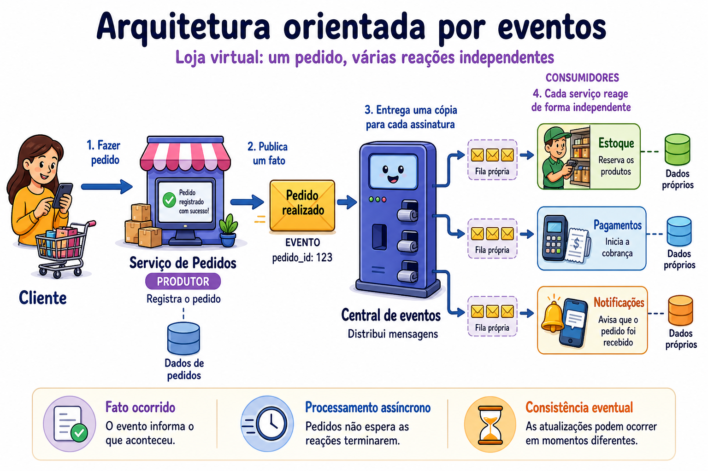
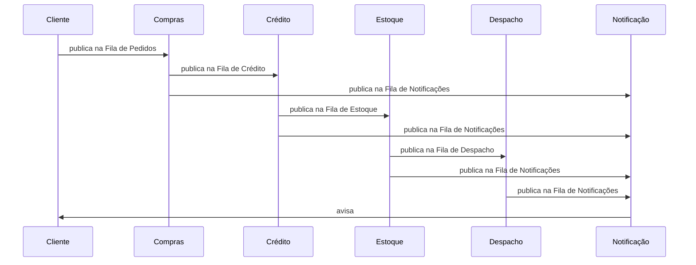
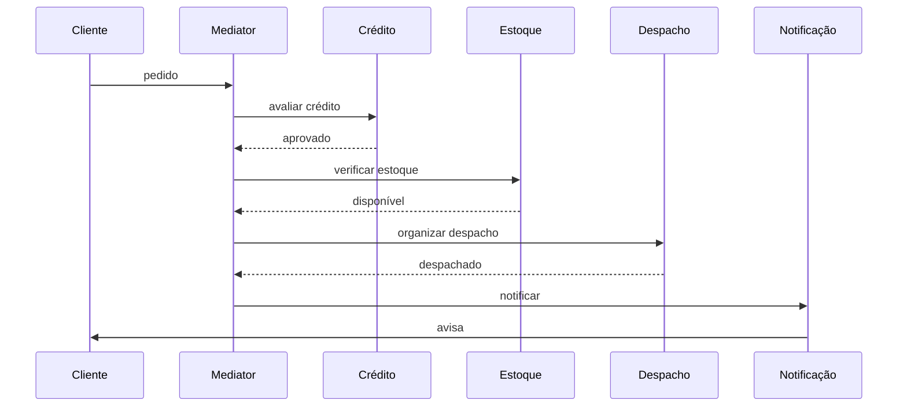
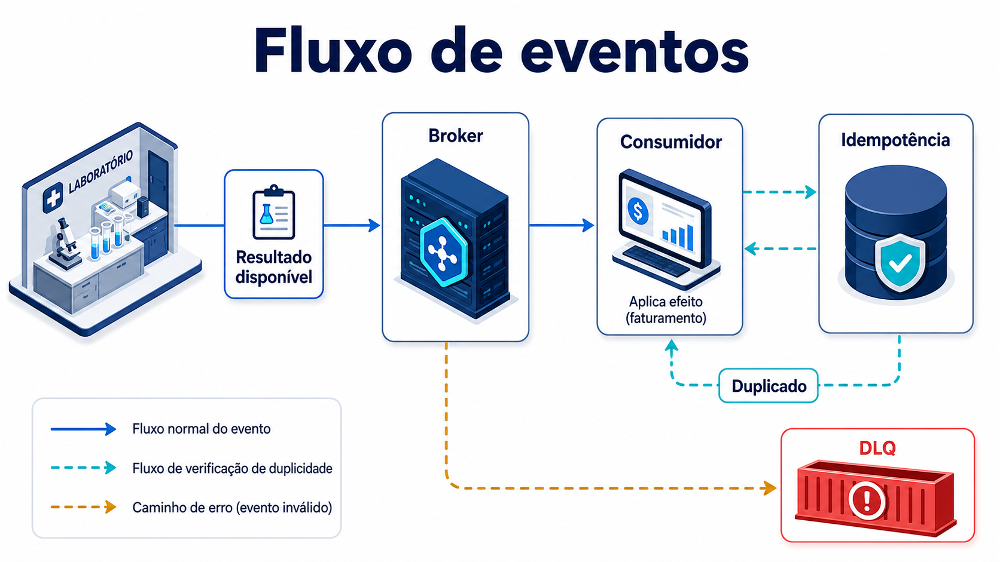
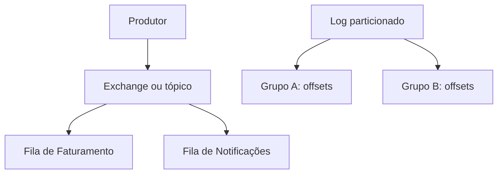

# Conceitos: fatos, canais e responsabilidade

*Figura 5 — Um pedido, várias reações independentes. Fonte: curso.*

**Leitura textual da figura:** o Cliente faz um pedido na loja virtual. O Serviço de Pedidos, no papel de produtor, registra o pedido nos seus próprios dados e publica o evento “Pedido realizado”, que carrega o identificador do pedido. A central de eventos recebe essa publicação e entrega uma cópia para a fila de cada assinante. Estoque reserva os produtos, Pagamentos inicia o faturamento e Notificações avisa o cliente, cada consumidor com sua fila própria e seu banco de dados próprio, sem que o Serviço de Pedidos conheça qualquer um deles. Três propriedades sustentam o desenho: o evento informa um fato já ocorrido; o processamento é assíncrono, então Pedidos não espera as reações terminarem; e a consistência é eventual, porque as atualizações de cada consumidor podem ocorrer em momentos diferentes.

Qualquer sistema distribuído precisa decidir como suas partes colaboram, e essa decisão é arquitetural antes de ser tecnológica. Numa integração síncrona, quem chama espera a resposta de quem foi chamado, e essa espera cria uma dependência de tempo entre os dois: o desempenho e a disponibilidade de quem responde passam a limitar quem chamou. A arquitetura orientada por eventos parte de outra premissa. Um componente publica o que aconteceu no seu domínio e encerra o próprio trabalho ali; quem tiver interesse reage depois, no ritmo que conseguir sustentar.

A figura acima mostra esse estilo em uma loja virtual. Ao longo desta página o elenco de serviços varia conforme o que cada exemplo precisa ilustrar, e essa variação é proposital: quem publica não decide quantos consumidores existem nem quais são.

## O estilo: arquitetura orientada por eventos

A **arquitetura orientada por eventos** (*event-driven architecture*, EDA) formaliza essa premissa como estilo arquitetural: componentes desacoplados colaboram reagindo a fatos publicados, em vez de chamarem uns aos outros diretamente. Ela aparece em microsserviços, em plataformas de IoT e em processamento de dados em tempo real, contextos em que muitos participantes precisam reagir ao mesmo acontecimento sem que a origem os conheça.

Três papéis compõem o estilo, e o vocabulário deste módulo inteiro se organiza em torno deles:

- O **produtor** gera e publica um evento quando algo acontece no seu domínio. Ele afirma o fato e encerra seu trabalho.
- O **consumidor** recebe o evento e decide o que fazer com ele. Pode haver nenhum, um ou vários, e o produtor não precisa saber quantos são.
- O **intermediário** fica entre os dois, recebendo a publicação e fazendo-a chegar a quem interessa. Broker e mediator, definidos adiante, são as duas formas que esse papel assume.

Trocar chamadas diretas por essa tríade compra quatro propriedades, e cada uma cobra um preço que as demais seções tratam. **Desacoplamento**: o produtor não conhece os consumidores, o que custa perder a resposta imediata que uma chamada direta daria. **Escalabilidade**: picos de carga podem ser absorvidos pelo canal em vez de derrubarem a origem, ao custo de operar esse canal. **Flexibilidade**: um consumidor novo se inscreve sem exigir mudança no produtor, desde que o contrato do evento tenha sido pensado para isso. **Resiliência**: a falha de um consumidor não impede que o fato tenha ocorrido nem que os outros reajam, mas alguém precisa perceber que aquele consumidor parou.

O restante desta página constrói o vocabulário necessário para projetar sob esse estilo sem tratar suas promessas como garantias automáticas, na ordem em que as perguntas aparecem durante um projeto: o que se publica, quem entrega, como o canal se comporta depois da entrega, e o que fazer com o tempo que passa entre publicar e reagir. Começa pelo que se publica.

## Evento, comando e mensagem

Um **evento** descreve um fato de domínio no passado. “Pedido realizado” é uma afirmação: pode ter ocorrido às 10h, tem uma identidade e não pede autorização a cada interessado para ter acontecido. Um bom nome tende a usar verbo no particípio e linguagem do domínio. O publicador é responsável por afirmar apenas o que sabe; quem recebe é responsável pela sua própria reação. Se Crédito estiver indisponível, o fato não deixa de ser verdadeiro.

Um **comando** expressa intenção dirigida. “Gerar cobrança do pedido” solicita uma ação a um destinatário que pode aceitar, rejeitar ou devolver uma falha. Ele carrega autoridade, pré-condições e, frequentemente, uma resposta. Publicar `GerarCobranca` em um tópico pode ser apropriado em alguns fluxos, mas a semântica não muda: não é um fato aberto a qualquer interpretação. Confundir comando e evento cria consumidores que tomam uma ordem como informação histórica ou publicadores que passam a conhecer regras dos destinatários.

**Mensagem** é o termo de transporte: bytes, cabeçalhos, chave de roteamento, content type e confirmação. Ela pode carregar evento, comando, documento ou sinal técnico. Ao depurar uma entrega, a equipe olha para a mensagem; ao decidir ownership, olha para evento ou comando. Esta separação impede que a escolha de AMQP, HTTP ou um cliente Kafka determine o vocabulário do domínio.

Numa loja on-line, `PedidoRealizado.v1` tem `event_id`, `occurred_at`, `pedido_id`, `cliente_id` e `pedido_reference`. O contrato afirma que um pedido foi registrado; não inclui os itens do carrinho nem uma instrução de cobrança completa. `event_id` identifica a ocorrência, enquanto `pedido_id` identifica o pedido: duas tentativas de transportar a mesma ocorrência preservam o primeiro e podem compartilhar o segundo. `occurred_at` é o tempo do fato, não o horário em que um consumidor recebeu uma cópia.

Decidido que `PedidoRealizado.v1` é um evento, falta responder quem entrega essa notícia aos interessados. É aqui que broker e mediator se separam.

## Broker e mediator

Um **broker** recebe mensagens, aplica regras de roteamento, mantém filas ou retenção conforme a tecnologia e entrega para consumidores. Ele reduz o conhecimento direto entre produtor e consumidor, mas não deveria decidir regra de negócio ou sequência de domínio. No RabbitMQ, uma exchange recebe a publicação e encaminha a filas segundo bindings. No Kafka, brokers mantêm registros particionados; consumidores avançam sua posição de leitura. No ActiveMQ, filas e tópicos atendem mensageria com confirmações e integrações de protocolo, inclusive em ambientes que já usam JMS. Fora desse trio, o mesmo papel aparece em Apache Pulsar (multi-tenancy e replicação geográfica), RabbitMQ Streams e Redis Streams (log de eventos sobre uma base já conhecida da equipe), NATS (baixa latência para IoT e microsserviços), e nos serviços gerenciados AWS SQS/EventBridge, Google Pub/Sub e Azure Service Bus. São infraestruturas que precisam de ownership, observabilidade e limites de retenção; a escolha depende de topologia, modelo de consumo e operação, não de uma lista de funcionalidades.

No fluxo de um pedido, o padrão broker aparece como uma cadeia: cada serviço termina seu trabalho publicando um fato na fila do próximo, sem chamar ninguém diretamente e sem esperar resposta de ninguém. Um diagrama de sequência torna essa característica visível de um jeito que um fluxograma de caixas não consegue: repare que nenhuma seta abaixo volta para quem a enviou. A última seta chega ao Cliente, mas como um aviso novo emitido por Notificação.

```mermaid
sequenceDiagram
    participant CL as Cliente
    participant SC as Compras
    participant SCr as Crédito
    participant SE as Estoque
    participant SD as Despacho
    participant SN as Notificação

    CL->>SC: publica na Fila de Pedidos
    SC->>SCr: publica na Fila de Crédito
    SC->>SN: publica na Fila de Notificações
    SCr->>SE: publica na Fila de Estoque
    SCr->>SN: publica na Fila de Notificações
    SE->>SD: publica na Fila de Despacho
    SE->>SN: publica na Fila de Notificações
    SD->>SN: publica na Fila de Notificações
    SN->>CL: avisa
```

**Texto alternativo:** Diagrama de sequência em que o Cliente publica um pedido e cada serviço, ao concluir sua etapa, publica um evento para o próximo e também para Notificação; todas as setas seguem adiante, nenhuma delas é uma resposta de volta para quem a originou.

*Figura 6 — Padrão broker: cada serviço publica adiante, sem esperar resposta. Fonte: curso, adaptado de material do curso sobre o padrão broker.*

**Leitura textual:** O Cliente publica o pedido, que chega a Compras. Compras publica para Crédito e, em paralelo, para Notificação. Crédito, ao aprovar, publica para Estoque e também para Notificação. Estoque publica para Despacho e para Notificação. Despacho publica para Notificação. Por fim, Notificação avisa o Cliente. Repare que cada seta é de mão única: nenhum serviço aguarda confirmação de quem recebeu antes de seguir em frente, e nenhum deles sabe se alguém está do outro lado lendo a fila.

Um **mediator** coordena participantes. Ele conhece uma conversa: pode mandar avaliar crédito, aguardar resposta, decidir compensação e ordenar próximos passos. Isso é útil quando o processo é uma política explícita, mas introduz acoplamento ao coordenador. Um mediator pode usar um broker como canal e um broker pode transportar mensagens de um mediator. A pergunta decisiva é: alguém precisa tomar uma decisão central sobre o fluxo, ou as equipes apenas precisam reagir de forma independente ao mesmo fato? Ferramentas como Apache Camel, NServiceBus, Spring Integration, AWS Step Functions, Google Workflows e Azure Logic Apps assumem esse papel central, cada uma com o próprio modelo de estado, retentativa e compensação.

O mesmo pedido, sob um mediator, muda de forma: nenhum serviço fala com o próximo, todos falam só com o coordenador, que decide a sequência e aguarda cada resposta antes do próximo passo.

```mermaid
sequenceDiagram
    participant CL as Cliente
    participant M as Mediator
    participant SCr as Crédito
    participant SE as Estoque
    participant SD as Despacho
    participant SN as Notificação

    CL->>M: pedido
    M->>SCr: avaliar crédito
    SCr-->>M: aprovado
    M->>SE: verificar estoque
    SE-->>M: disponível
    M->>SD: organizar despacho
    SD-->>M: despachado
    M->>SN: notificar
    SN->>CL: avisa
```

**Texto alternativo:** Diagrama de sequência em que o Cliente fala só com o Mediator; para cada etapa (crédito, estoque, despacho), o Mediator envia uma solicitação e recebe uma resposta de volta antes de seguir para a próxima, até publicar a notificação final.

*Figura 7 — Padrão mediator: o coordenador solicita, aguarda a resposta e decide o próximo passo. Fonte: curso, adaptado de material do curso sobre o padrão mediator.*

**Leitura textual:** O Cliente envia o pedido ao Mediator, que é seu único interlocutor no fluxo inteiro. O Mediator pede a avaliação de crédito e espera a resposta “aprovado” antes de prosseguir. Só então pede a verificação de estoque e espera a resposta “disponível”. Só então pede a organização do despacho e espera a confirmação. Ao final, o Mediator manda notificar o Cliente. Cada seta de ida tem uma seta de volta tracejada: o Mediator não passa para a etapa seguinte sem primeiro receber a resposta da etapa atual.

Comparar as duas figuras revela a diferença que a definição sozinha esconde: na Figura 6 nenhuma seta intermediária volta para quem a enviou, e na Figura 7 cada uma volta. Se o Serviço de Estoque cair, a Figura 6 mostra a Fila de Despacho simplesmente parada, sem que ninguém saiba por quê; a Figura 7 mostra o Mediator esperando uma resposta que não chega, e é ele quem decide se cancela o pedido, tenta de novo ou segue sem estoque confirmado. Um exemplo real reforça a escolha: depois do evento de pedido, Crédito pode aprovar um limite e Notificação pode preparar um aviso, como na Figura 6, porque nenhuma reação precisa comandar a outra. Um processo de cancelamento de pedido, que precisa ordenar estorno de crédito, reposição de estoque e registro administrativo com regras de compensação, pede a coreografia visível da Figura 7. Chamar as duas figuras de “orquestração” esconderia a diferença que elas mostram.

## Fila, tópico e log distribuído

Broker e mediator respondem quem entrega a mensagem. Fila, tópico e log respondem uma pergunta diferente: o que acontece com ela depois de entregue, e é aí que a escolha de tecnologia começa a pesar.

A figura a seguir muda de domínio de propósito: é o mesmo padrão broker da Figura 6, agora aplicado ao caso hospitalar que as páginas de exemplo arquitetural, estudo de caso e oficina detalham na sequência do módulo, com um resultado de exame no lugar de um pedido. Ela também introduz a **dead-letter queue** (DLQ): a fila que recebe uma mensagem que o consumidor rejeitou, por exemplo por falhar na validação de schema, mantendo-a visível para inspeção em vez de descartá-la ou reentregá-la em loop.

*Figura 8 — Publicação, consumo, idempotência e dead-letter queue. Fonte: curso.*

**Leitura textual da figura:** o laboratório publica o fato “resultado disponível” no broker. O broker entrega uma cópia ao consumidor de Faturamento. Antes de produzir efeito, o consumidor consulta o registro de idempotência para impedir uma cobrança duplicada. Uma mensagem inválida ou que não possa ser processada segue para a DLQ, onde fica visível para diagnóstico e reprocessamento controlado, sem desaparecer silenciosamente.

Fila, tópico e log distribuem mensagens de formas diferentes o bastante para merecer nomes diferentes, mesmo quando a tecnologia por baixo é a mesma exchange ou o mesmo cluster.

Uma **fila** representa trabalho pendente para uma capacidade. Mensagens ficam disponíveis até um consumidor confirmar; várias réplicas podem repartir trabalho. A fila `billing.pedidos.v1` é uma fila de Faturamento: uma cópia de cada evento roteado para ela é tratada pelo grupo de trabalho desse domínio. A confirmação ocorre depois da validação e do efeito local. Se o processo cair antes da confirmação, a mensagem pode voltar e a duplicação deve ser esperada.

Já um **tópico** muda o critério de distribuição: em vez de repartir trabalho entre réplicas de uma fila, ele copia a mesma publicação para filas distintas com critérios de assinatura próprios. Faturamento recebe uma cópia, Notificações outra e Auditoria uma terceira. Em AMQP, a exchange do tipo topic e as chaves de roteamento realizam isso; o tópico não torna todos os consumidores uma única equipe nem lhes dá o mesmo banco.

Um terceiro formato, o **log distribuído**, muda de novo o critério: em vez de fila ou cópia, ele retém um registro ordenado por partição, sob uma política de tempo ou tamanho. Consumidores guardam offsets e podem ler a mesma sequência em ritmos diferentes ou voltar a uma posição permitida pela retenção. Kafka é conhecido por esse modelo. O log favorece replay e múltiplas leituras independentes, mas não torna a ordem global: a garantia comum é por partição, sob uma chave e configuração específicas. Retenção também é uma decisão de custo, privacidade e recuperação, não “histórico infinito”.

```mermaid
flowchart TB
    P[Produtor] --> X[Exchange ou tópico]
    X --> Q1[Fila de Faturamento]
    X --> Q2[Fila de Notificações]
    L[Log particionado] --> G1[Grupo A: offsets]
    L --> G2[Grupo B: offsets]
```

**Texto alternativo:** Comparação entre um produtor que publica em exchange ou tópico para filas independentes e grupos que leem posições próprias em um log particionado.

*Figura 9 — Topologias de distribuição por fila, tópico e log. Fonte: curso.*

**Leitura textual:** Um produtor publica no canal. Um tópico pode encaminhar cópias para filas com responsabilidades distintas. Em um log distribuído, grupos independentes mantêm posições próprias de leitura sobre o registro retido.

Cada uma dessas três formas de canal tem uma tecnologia de referência associada, e escolher entre elas é a próxima decisão a tomar.

## RabbitMQ, Kafka e ActiveMQ sem atalhos

RabbitMQ é um broker de mensageria com exchanges, filas, bindings, confirmações e recursos como TTL e dead-lettering. Ele atende quando a necessidade comprovada é roteamento flexível e trabalho assíncrono por fila; não oferece, por si, um histórico de replay governado como um log. Kafka é uma plataforma de log distribuído, organizada em tópicos e partições, com retenção e offsets controlados por consumidores. Ele atende quando leitura independente, replay e fluxo contínuo são requisitos relevantes; retenção, partições e a proteção dos dados retidos são limites que a equipe precisa operar.

ActiveMQ é um broker de mensageria para filas e tópicos, com confirmações e opções de interoperabilidade de protocolo. Ele pode ser adequado quando sistemas existentes dependem de JMS ou quando essa interoperabilidade reduz o acoplamento de uma integração. A escolha depende da variante e da topologia: ela não elimina a necessidade de idempotência do consumidor, nem transforma a mensageria em replay histórico ilimitado. Persistência, disponibilidade, atualização e monitoramento compõem um custo operacional a ser assumido pela equipe.

Essas descrições não são uma tabela de vencedores. RabbitMQ também suporta padrões pub/sub e persistência; Kafka também exige planejamento de consumidores, chaves, capacidade e operação; ActiveMQ não dispensa a decisão de topologia, recuperação e compatibilidade. Throughput observado depende de mensagem, confirmação, disco, replicação, rede, clientes e desenho. Nem “Kafka sempre escala mais”, nem “RabbitMQ é apenas uma fila”, nem “ActiveMQ resolve integração legada automaticamente” são critérios arquiteturais suficientes. Uma equipe começa pela semântica, volume esperado, isolamento, recuperação, domínio de retenção e capacidade operacional, então mede o caso real.

Nenhuma dessas tecnologias resolve, por si, o efeito colateral mais incômodo de desacoplar produtor e consumidor: o tempo que passa entre publicar e reagir.

## Tempo e consistência eventual

Com integração assíncrona, uma mudança pode estar visível em uma capacidade antes de outra. Após Pedidos publicar, a tela de status pode mostrar confirmação enquanto Faturamento ainda não criou a cobrança. Isso é **consistência eventual**: se as entregas e reações completarem sem novas mudanças conflitantes, as projeções convergem para o estado esperado. Não é licença para ignorar erro. A equipe precisa decidir como informar estado pendente, quanto tempo é aceitável, como reprocessar e quem investiga uma fila atrasada.

O tempo também aparece no contrato. `occurred_at` permite ordenar fatos de uma mesma origem para análise, mas relógios distribuídos têm desvio e entregas podem chegar fora de ordem. Uma projeção pode usar versão do agregado, sequência por pedido ou regra de precedência, conforme o domínio. Usar hora de recebimento como verdade histórica costuma gerar decisões erradas quando há atraso ou replay.

## Vocabulário mínimo para revisão

Ao revisar uma integração, pergunte: qual fato ou intenção estamos nomeando? Quem é owner do contrato? Qual consumidor tem efeito de negócio? Qual chave preserva a ordem necessária? Que duplicação é possível entre escrita e confirmação? Qual dado é referência, qual é cópia e qual não pode circular? Onde aparece atraso, rejeição e dead-letter queue? Essas perguntas tornam a arquitetura legível antes de ela se tornar uma coleção de filas.
